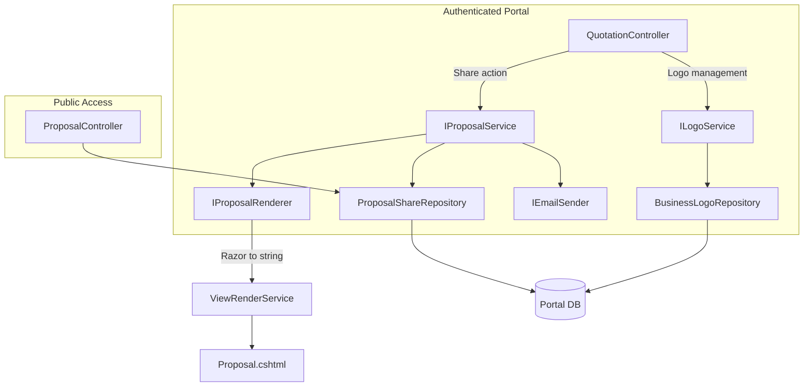

# Design Document: Quotation Proposal Sharing

## Overview

This feature extends the Portal quotation module to generate branded, self-contained HTML proposals from existing quotations and share them with customers via secure, time-limited public links. The system captures a point-in-time snapshot of quotation data (including business profile, customer details, line items grouped by section, and selected logos), stores it as HTML in the database, and exposes it through an unauthenticated public endpoint. Customers can view and print/download the proposal without an account.

The design introduces:
- A **ProposalShare** table storing the HTML snapshot, share token, and expiration metadata
- A **ProposalSection** table for grouping quotation lines into named sections with column configuration
- A **BusinessLogo** table for managing a library of uploaded logo images per business
- A **ReferenceUrl** column on QuotationLine for linking line items to external documentation
- An **IProposalService** orchestrating the share workflow (snapshot generation, token creation, email dispatch)
- An **IProposalRenderer** responsible for rendering the Razor view to an HTML string
- An **ILogoService** managing logo uploads and retrieval
- A public **ProposalController** serving the unauthenticated proposal view

The HTML snapshot is rendered server-side using a Razor view compiled to string (via `IRazorViewEngine` + `ViewRenderService`), then stored as `NVARCHAR(MAX)`. This ensures the proposal is frozen at share time and immune to subsequent quotation edits.

## Architecture



### Request Flow — Share Proposal

1. Business user clicks "Share Proposal" on quotation detail page
2. `QuotationController.Share` (POST) validates access, customer email, and expiration date
3. Calls `IProposalService.ShareAsync(quotationId, expiresAt, selectedLogoIds, sectionConfig)`
4. `IProposalService` loads quotation + lines + customer + business profile + logos
5. `IProposalRenderer.RenderAsync(model)` renders the Razor view to an HTML string
6. A 32-byte cryptographically random token is generated
7. `ProposalShare` record is inserted (HTML, token, expiration, metadata)
8. `IEmailSender.SendEmailAsync(...)` sends the branded notification email
9. Returns the share URL to the controller for display

### Request Flow — View Proposal (Public)

1. Customer clicks link: `/proposal/{token}`
2. `ProposalController.View(token)` looks up `ProposalShare` by token
3. If not found → 404
4. If expired → branded expiry page with business contact info
5. If valid → returns stored HTML directly as `Content-Type: text/html`

## Components and Interfaces

### New Entities

#### ProposalShare
```csharp
namespace Portal.Infrastructure.Entities;

/// <summary>
/// A point-in-time HTML snapshot of a quotation shared with a customer via a secure link.
/// Schema: [quotation].ProposalShare
/// </summary>
public class ProposalShare
{
    public int Id { get; set; }
    public int QuotationId { get; set; }
    public int BusinessId { get; set; }
    public string ShareToken { get; set; } = null!;
    public string SnapshotHtml { get; set; } = null!;
    public string CustomerEmail { get; set; } = null!;
    public DateTimeOffset ExpiresAtUtc { get; set; }
    public DateTimeOffset CreatedAtUtc { get; set; }
    public string CreatedByUserId { get; set; } = null!;
    public bool IsActive { get; set; }

    // Navigation properties
    public Quotation Quotation { get; set; } = null!;
    public Business Business { get; set; } = null!;
}
```

#### ProposalSection
```csharp
namespace Portal.Infrastructure.Entities;

/// <summary>
/// A named grouping of quotation lines within a proposal with configurable column display.
/// Schema: [quotation].ProposalSection
/// </summary>
public class ProposalSection
{
    public int Id { get; set; }
    public int QuotationId { get; set; }
    public string Name { get; set; } = null!;
    public int SortOrder { get; set; }
    public string ColumnConfiguration { get; set; } = null!; // JSON: e.g. "OneTime" or "Subscription"

    // Navigation properties
    public Quotation Quotation { get; set; } = null!;
    public ICollection<QuotationLine> QuotationLines { get; set; } = new List<QuotationLine>();
}
```

#### BusinessLogo
```csharp
namespace Portal.Infrastructure.Entities;

/// <summary>
/// A logo image uploaded to a business's logo library for use in proposals.
/// Schema: [portal].BusinessLogo
/// </summary>
public class BusinessLogo
{
    public int Id { get; set; }
    public int BusinessId { get; set; }
    public string DisplayName { get; set; } = null!;
    public string FileName { get; set; } = null!;
    public string ContentType { get; set; } = null!;
    public long FileSizeBytes { get; set; }
    public string PublicUrl { get; set; } = null!;
    public DateTime CreatedAtUtc { get; set; }

    // Navigation properties
    public Business Business { get; set; } = null!;
}
```

#### QuotationLine (modified)
Add to existing entity:
```csharp
public string? ReferenceUrl { get; set; }
public int? ProposalSectionId { get; set; }

// Navigation property
public ProposalSection? ProposalSection { get; set; }
```

### Service Interfaces

#### IProposalService
```csharp
namespace Portal.Infrastructure.Services;

public interface IProposalService
{
    Task<ProposalShare> ShareAsync(int quotationId, DateTimeOffset expiresAtUtc, 
        List<int> heroLogoIds, int? metaLogoId, string userId);
    Task<ProposalShare?> GetByTokenAsync(string token);
    Task<ProposalShare?> GetActiveShareByQuotationIdAsync(int quotationId);
    Task<List<ProposalShare>> GetSharesByQuotationIdAsync(int quotationId);
}
```

#### IProposalRenderer
```csharp
namespace Portal.Infrastructure.Services;

public interface IProposalRenderer
{
    Task<string> RenderAsync(ProposalRenderModel model);
}
```

#### ILogoService
```csharp
namespace Portal.Infrastructure.Services;

public interface ILogoService
{
    Task<BusinessLogo> UploadAsync(int businessId, IFormFile file, string displayName);
    Task<List<BusinessLogo>> GetByBusinessIdAsync(int businessId);
    Task DeleteAsync(int logoId, int businessId);
}
```

#### IViewRenderService
```csharp
namespace Portal.Web.Services;

public interface IViewRenderService
{
    Task<string> RenderViewToStringAsync(string viewName, object model);
}
```

### Repositories

#### ProposalShareRepository
```csharp
public class ProposalShareRepository : GenericStoredProcedureRepository<ProposalShare>
{
    public ProposalShareRepository(DbContext context) : base(context) { }

    public async Task<ProposalShare?> GetByTokenAsync(string token);
    public async Task<ProposalShare?> GetActiveByQuotationIdAsync(int quotationId);
    public async Task<List<ProposalShare>> GetByQuotationIdAsync(int quotationId);
    public async Task InsertAsync(ProposalShare entity);
    public async Task DeactivateByQuotationIdAsync(int quotationId);
}
```

#### BusinessLogoRepository
```csharp
public class BusinessLogoRepository : GenericStoredProcedureRepository<BusinessLogo>
{
    public BusinessLogoRepository(DbContext context) : base(context) { }

    public async Task<List<BusinessLogo>> GetByBusinessIdAsync(int businessId);
    public async Task<BusinessLogo?> GetByIdAsync(int id);
    public async Task InsertAsync(BusinessLogo entity);
    public async Task DeleteAsync(int id);
    public async Task<int> GetCountByBusinessIdAsync(int businessId);
}
```

#### ProposalSectionRepository
```csharp
public class ProposalSectionRepository : GenericStoredProcedureRepository<ProposalSection>
{
    public ProposalSectionRepository(DbContext context) : base(context) { }

    public async Task<List<ProposalSection>> GetByQuotationIdAsync(int quotationId);
    public async Task InsertAsync(ProposalSection entity);
    public async Task UpdateAsync(ProposalSection entity);
    public async Task DeleteAsync(int id);
}
```

### Controllers

#### QuotationController (extended)
New actions added to the existing controller:
- `[HttpPost] Share(int id, ProposalShareViewModel model)` — triggers proposal generation and sharing
- `[HttpGet] ShareDialog(int id)` — returns the share configuration partial (logo selection, expiration)
- `[HttpPost] CopyShareLink(int id)` — returns the active share URL for clipboard copy

#### ProposalController (new, public)
```csharp
[AllowAnonymous]
public class ProposalController : Controller
{
    [HttpGet("/proposal/{token}")]
    public async Task<IActionResult> View(string token);
}
```
No `[ModuleAccess]` attribute — this is the unauthenticated public endpoint.

#### LogoController (new, authenticated)
```csharp
[Authorize]
[ModuleAccess(PortalModules.Quotation, AccessLevels.Full)]
public class LogoController : Controller
{
    [HttpPost] Upload(IFormFile file, string displayName);
    [HttpPost] Delete(int id);
    [HttpGet] Index(); // Logo library management page
}
```

### Rendering Approach

The `ProposalRenderer` implementation uses ASP.NET Core's `IRazorViewEngine` to render a strongly-typed Razor view (`Views/Proposal/Snapshot.cshtml`) to a string. The view:
- Uses inline CSS only (no external stylesheets or CDN references)
- Embeds Google Fonts via `@import` in a `<style>` block (Manrope + Inter)
- Renders section cards dynamically based on `ProposalSection` configuration
- Conditionally renders line descriptions as hyperlinks when `ReferenceUrl` is present
- Includes `@media print` rules for A4 PDF output
- Includes the download button (hidden in print)
- Renders selected logos at specified max heights

The `ViewRenderService` creates a temporary `ActionContext`, resolves the view, and renders it to a `StringWriter`. This is a well-established pattern in ASP.NET Core for generating HTML outside of the normal request pipeline.

## Data Models

### Database Schema Changes

#### New Table: [quotation].[ProposalShare]
```sql
CREATE TABLE [quotation].[ProposalShare] (
    [Id]              INT IDENTITY(1,1) NOT NULL,
    [QuotationId]     INT NOT NULL,
    [BusinessId]      INT NOT NULL,
    [ShareToken]      NVARCHAR(128) NOT NULL,
    [SnapshotHtml]    NVARCHAR(MAX) NOT NULL,
    [CustomerEmail]   NVARCHAR(200) NOT NULL,
    [ExpiresAtUtc]    DATETIMEOFFSET NOT NULL,
    [CreatedAtUtc]    DATETIMEOFFSET NOT NULL DEFAULT SYSDATETIMEOFFSET(),
    [CreatedByUserId] NVARCHAR(450) NOT NULL,
    [IsActive]        BIT NOT NULL DEFAULT 1,
    CONSTRAINT [PK_ProposalShare] PRIMARY KEY CLUSTERED ([Id]),
    CONSTRAINT [FK_ProposalShare_Quotation] FOREIGN KEY ([QuotationId]) REFERENCES [quotation].[Quotation]([Id]),
    CONSTRAINT [FK_ProposalShare_Business] FOREIGN KEY ([BusinessId]) REFERENCES [portal].[Business]([Id]),
    CONSTRAINT [UX_ProposalShare_ShareToken] UNIQUE NONCLUSTERED ([ShareToken])
);

CREATE NONCLUSTERED INDEX [IX_ProposalShare_QuotationId] ON [quotation].[ProposalShare]([QuotationId]);
CREATE NONCLUSTERED INDEX [IX_ProposalShare_BusinessId] ON [quotation].[ProposalShare]([BusinessId]);
```

#### New Table: [quotation].[ProposalSection]
```sql
CREATE TABLE [quotation].[ProposalSection] (
    [Id]                  INT IDENTITY(1,1) NOT NULL,
    [QuotationId]         INT NOT NULL,
    [Name]                NVARCHAR(200) NOT NULL,
    [SortOrder]           INT NOT NULL DEFAULT 0,
    [ColumnConfiguration] NVARCHAR(50) NOT NULL DEFAULT 'OneTime',
    CONSTRAINT [PK_ProposalSection] PRIMARY KEY CLUSTERED ([Id]),
    CONSTRAINT [FK_ProposalSection_Quotation] FOREIGN KEY ([QuotationId]) REFERENCES [quotation].[Quotation]([Id]) ON DELETE CASCADE
);

CREATE NONCLUSTERED INDEX [IX_ProposalSection_QuotationId] ON [quotation].[ProposalSection]([QuotationId]);
```

#### New Table: [portal].[BusinessLogo]
```sql
CREATE TABLE [portal].[BusinessLogo] (
    [Id]            INT IDENTITY(1,1) NOT NULL,
    [BusinessId]    INT NOT NULL,
    [DisplayName]   NVARCHAR(200) NOT NULL,
    [FileName]      NVARCHAR(500) NOT NULL,
    [ContentType]   NVARCHAR(100) NOT NULL,
    [FileSizeBytes] BIGINT NOT NULL,
    [PublicUrl]     NVARCHAR(1000) NOT NULL,
    [CreatedAtUtc]  DATETIME2 NOT NULL DEFAULT GETUTCDATE(),
    CONSTRAINT [PK_BusinessLogo] PRIMARY KEY CLUSTERED ([Id]),
    CONSTRAINT [FK_BusinessLogo_Business] FOREIGN KEY ([BusinessId]) REFERENCES [portal].[Business]([Id])
);

CREATE NONCLUSTERED INDEX [IX_BusinessLogo_BusinessId] ON [portal].[BusinessLogo]([BusinessId]);
```

#### New Table: [quotation].[ProposalShareLogo]
Junction table linking selected logos to a proposal share:
```sql
CREATE TABLE [quotation].[ProposalShareLogo] (
    [Id]              INT IDENTITY(1,1) NOT NULL,
    [ProposalShareId] INT NOT NULL,
    [BusinessLogoId]  INT NOT NULL,
    [Placement]       NVARCHAR(20) NOT NULL, -- 'Hero' or 'Meta'
    [SortOrder]       INT NOT NULL DEFAULT 0,
    CONSTRAINT [PK_ProposalShareLogo] PRIMARY KEY CLUSTERED ([Id]),
    CONSTRAINT [FK_ProposalShareLogo_ProposalShare] FOREIGN KEY ([ProposalShareId]) REFERENCES [quotation].[ProposalShare]([Id]) ON DELETE CASCADE,
    CONSTRAINT [FK_ProposalShareLogo_BusinessLogo] FOREIGN KEY ([BusinessLogoId]) REFERENCES [portal].[BusinessLogo]([Id]),
    CONSTRAINT [CK_ProposalShareLogo_Placement] CHECK ([Placement] IN ('Hero', 'Meta'))
);
```

#### Alter Table: [quotation].[QuotationLine]
```sql
ALTER TABLE [quotation].[QuotationLine]
    ADD [ReferenceUrl] NVARCHAR(2048) NULL;

ALTER TABLE [quotation].[QuotationLine]
    ADD [ProposalSectionId] INT NULL;

ALTER TABLE [quotation].[QuotationLine]
    ADD CONSTRAINT [FK_QuotationLine_ProposalSection] 
    FOREIGN KEY ([ProposalSectionId]) REFERENCES [quotation].[ProposalSection]([Id])
    ON DELETE SET NULL;
```

### EF Core Configuration (additions to PortalDbContext)

```csharp
// New DbSets
public DbSet<ProposalShare> ProposalShares { get; set; } = null!;
public DbSet<ProposalSection> ProposalSections { get; set; } = null!;
public DbSet<BusinessLogo> BusinessLogos { get; set; } = null!;

// Configuration methods added to OnModelCreating
private static void ConfigureProposalShare(ModelBuilder modelBuilder) { ... }
private static void ConfigureProposalSection(ModelBuilder modelBuilder) { ... }
private static void ConfigureBusinessLogo(ModelBuilder modelBuilder) { ... }

// Global query filters
modelBuilder.Entity<ProposalShare>()
    .HasQueryFilter(e => e.BusinessId == _currentTenantService.CurrentBusinessId);
modelBuilder.Entity<BusinessLogo>()
    .HasQueryFilter(e => e.BusinessId == _currentTenantService.CurrentBusinessId);
```

### Render Model (DTO for the Razor view)

```csharp
namespace Portal.Infrastructure.Models;

public class ProposalRenderModel
{
    // Business
    public string BusinessName { get; set; } = null!;
    public string CompanyRegistrationNumber { get; set; } = null!;
    public string VatRegistrationNumber { get; set; } = null!;
    public string BusinessAddress { get; set; } = null!;
    public string BusinessEmail { get; set; } = null!;
    public string? BusinessPhone { get; set; }
    public string? BusinessMobile { get; set; }

    // Customer
    public string CustomerName { get; set; } = null!;
    public string? CustomerContactPerson { get; set; }
    public string? CustomerEmail { get; set; }
    public string? CustomerAddress { get; set; }

    // Quotation header
    public string Reference { get; set; } = null!;
    public DateOnly? ValidUntil { get; set; }
    public decimal Subtotal { get; set; }
    public decimal TaxAmount { get; set; }
    public decimal TotalAmount { get; set; }
    public string? Notes { get; set; }

    // Sections with lines
    public List<ProposalSectionRenderModel> Sections { get; set; } = new();

    // Logos
    public List<ProposalLogoRenderModel> HeroLogos { get; set; } = new();
    public ProposalLogoRenderModel? MetaLogo { get; set; }
}

public class ProposalSectionRenderModel
{
    public string Name { get; set; } = null!;
    public string ColumnConfiguration { get; set; } = null!;
    public int SortOrder { get; set; }
    public List<ProposalLineRenderModel> Lines { get; set; } = new();
}

public class ProposalLineRenderModel
{
    public string Description { get; set; } = null!;
    public decimal Quantity { get; set; }
    public decimal UnitPrice { get; set; }
    public decimal VatRate { get; set; }
    public decimal LineTotal { get; set; }
    public int SortOrder { get; set; }
    public string? ReferenceUrl { get; set; }
}

public class ProposalLogoRenderModel
{
    public string DisplayName { get; set; } = null!;
    public string PublicUrl { get; set; } = null!;
}
```


## Correctness Properties

*A property is a characteristic or behavior that should hold true across all valid executions of a system — essentially, a formal statement about what the system should do. Properties serve as the bridge between human-readable specifications and machine-verifiable correctness guarantees.*

### Property 1: Rendered snapshot contains all input data

*For any* valid `ProposalRenderModel` containing business profile fields, customer fields, quotation header fields (Reference, Subtotal, TaxAmount, TotalAmount), and line item descriptions, the HTML string produced by `IProposalRenderer.RenderAsync` should contain each of those data values in the output.

**Validates: Requirements 1.2, 1.3, 1.4, 1.5**

### Property 2: Rendered snapshot is self-contained (no external dependencies)

*For any* valid `ProposalRenderModel`, the HTML string produced by `IProposalRenderer.RenderAsync` should contain no `<link rel="stylesheet" href="...">` tags pointing to external domains and no `<script src="...">` tags referencing external resources.

**Validates: Requirements 1.1**

### Property 3: ReferenceUrl renders as hyperlink

*For any* `ProposalLineRenderModel` with a non-null `ReferenceUrl`, the rendered HTML should contain an `<a>` tag whose `href` attribute equals the ReferenceUrl and whose `target` attribute is `_blank`.

**Validates: Requirements 1.6, 9.4**

### Property 4: Snapshot immutability

*For any* `ProposalShare` record, the `SnapshotHtml` value stored at creation time should remain byte-for-byte identical regardless of subsequent modifications to the source Quotation, QuotationLine, Customer, or BusinessProfile records.

**Validates: Requirements 1.8**

### Property 5: Print CSS inclusion

*For any* rendered proposal HTML, the output should contain both an `@page` rule and an `@media print` rule block.

**Validates: Requirements 1.10**

### Property 6: Section column configuration rendering

*For any* `ProposalSectionRenderModel` with `ColumnConfiguration = "Subscription"`, the rendered section should contain subscription-appropriate column headers (e.g., "Monthly Price"). *For any* section with `ColumnConfiguration = "OneTime"`, the rendered section should contain one-time column headers (e.g., "Qty", "Unit Price", "Final Price").

**Validates: Requirements 2.2, 2.3**

### Property 7: One section card per ProposalSection

*For any* `ProposalRenderModel` with N sections (N ≥ 1), the rendered HTML should contain exactly N section card elements, each with its section name as a heading.

**Validates: Requirements 2.4**

### Property 8: Share token minimum length

*For any* generated share token, the raw byte length should be at least 32 bytes (base64-encoded string length ≥ 43 characters).

**Validates: Requirements 3.1**

### Property 9: Share token uniqueness

*For any* batch of N generated share tokens (N ≥ 100), all tokens in the batch should be distinct.

**Validates: Requirements 3.6**

### Property 10: Expiration date validation

*For any* `DateTimeOffset` value that is less than 1 calendar day in the future from the current UTC time, the share service should reject it with a validation error. *For any* value that is at least 1 day in the future, it should be accepted.

**Validates: Requirements 3.4**

### Property 11: Proposal share record round-trip persistence

*For any* proposal share operation, the resulting `ProposalShare` record should contain: the generated ShareToken, the specified ExpiresAtUtc, the SnapshotHtml, the customer email, the CreatedByUserId, and a CreatedAtUtc timestamp. Querying by the token should return an equivalent record.

**Validates: Requirements 3.5, 8.1**

### Property 12: Valid non-expired token returns stored HTML

*For any* `ProposalShare` with `ExpiresAtUtc` in the future and `IsActive = true`, accessing the public endpoint with its `ShareToken` should return an HTTP 200 response with `Content-Type: text/html` containing the stored `SnapshotHtml`.

**Validates: Requirements 4.1**

### Property 13: Expired token returns expiry page

*For any* `ProposalShare` with `ExpiresAtUtc` in the past, accessing the public endpoint with its `ShareToken` should return a response containing the text "expired" and the business contact information, not the stored snapshot HTML.

**Validates: Requirements 4.2**

### Property 14: Invalid token returns 404

*For any* string that does not match any stored `ShareToken`, accessing the public endpoint should return an HTTP 404 status code.

**Validates: Requirements 4.3**

### Property 15: No internal IDs exposed in public HTML

*For any* rendered `ProposalShare`, the `SnapshotHtml` should not contain the numeric values of `QuotationId`, `CustomerId`, or `BusinessId` as standalone tokens (e.g., in data attributes, hidden fields, or comments).

**Validates: Requirements 4.4**

### Property 16: Customer email required for sharing

*For any* quotation whose associated Customer has a null or empty `Email` field, the share service should reject the operation with a validation error indicating that a customer email is required.

**Validates: Requirements 6.4**

### Property 17: Email contains required fields

*For any* proposal share email sent, the HTML body should contain: the proposal URL, the quotation reference string, the business name, and the formatted expiration date.

**Validates: Requirements 6.2**

### Property 18: Authorization enforcement

*For any* user without quotation module access (AccessLevel = "none") for the relevant business, attempting the share action should result in an HTTP 403 response. *For any* user with at least "full" access, the action should proceed.

**Validates: Requirements 7.1, 7.2**

### Property 19: Tenant isolation on share

*For any* quotation whose `BusinessId` does not match the authenticated user's current business, the share action should be rejected (the global query filter ensures the quotation is not found).

**Validates: Requirements 7.3**

### Property 20: Reshare deactivates previous token

*For any* quotation that has been previously shared (has an active `ProposalShare`), resharing should set `IsActive = false` on the previous record and create a new `ProposalShare` with a new token.

**Validates: Requirements 8.3**

### Property 21: Share status determination

*For any* `ProposalShare` record, its display status should be "Active" when `IsActive = true` AND `ExpiresAtUtc > DateTimeOffset.UtcNow`, and "Expired" otherwise.

**Validates: Requirements 8.2**

### Property 22: ReferenceUrl validation

*For any* string that is not a well-formed absolute URL with http or https scheme, the system should reject it when provided as a ReferenceUrl. *For any* valid http/https URL of length ≤ 2048, the system should accept it.

**Validates: Requirements 9.1, 9.3**

### Property 23: Logo upload validation

*For any* file with a content type not in {image/png, image/jpeg, image/svg+xml, image/webp} OR with a size exceeding 2MB, the upload should be rejected. *For any* business that already has 20 logos, an additional upload should be rejected. *For any* valid file within limits, the upload should succeed and return a record with a DisplayName and PublicUrl.

**Validates: Requirements 10.1, 10.2, 10.3**

### Property 24: Logo deletion removes from library

*For any* existing `BusinessLogo`, after deletion, querying by its ID should return null and it should not appear in the business's logo list.

**Validates: Requirements 10.4**

### Property 25: Logo rendering dimensions

*For any* rendered proposal with hero logos, each hero logo `` tag should have a `max-height: 68px` style. *For any* rendered proposal with a metadata card logo, the `` tag should have a `max-height: 40px` style.

**Validates: Requirements 11.3, 11.4**

## Error Handling

| Scenario | Handling |
|----------|----------|
| Customer has no email | Return validation error before share attempt; do not call renderer or email service |
| Expiration date < 1 day in future | Return validation error with message |
| Logo upload exceeds 2MB | Return validation error; do not save file |
| Logo upload invalid format | Return validation error; do not save file |
| Logo library at 20 limit | Return validation error |
| ReferenceUrl invalid format | Return validation error on line save |
| Quotation not found (tenant filter) | Return 404 from controller |
| Share token not found | Return 404 from ProposalController |
| Razor view rendering failure | Log error, rethrow; controller returns 500 |
| Email send failure | Log error, rethrow; share record is still created (email failure doesn't roll back the share) |
| File system write failure (logo) | Log error, rethrow; do not insert DB record |
| Concurrent reshare race condition | Database unique constraint on ShareToken prevents duplicates; retry with new token |

### Error Propagation Pattern

Following existing codebase conventions:
- Repositories: `try/catch { throw; }` — rethrow to preserve stack trace
- Services: validate inputs, throw `ArgumentException` for validation failures, `InvalidOperationException` for business rule violations
- Controllers: catch specific exceptions, add to `ModelState` or `TempData`, redirect back to form

## Testing Strategy

### Property-Based Testing

**Library**: [FsCheck.Xunit](https://github.com/fscheck/FsCheck) (FsCheck 3.x with xUnit integration)

FsCheck is the standard property-based testing library for .NET. Each property test will run a minimum of 100 iterations with randomly generated inputs.

**Tag format**: `Feature: quotation-proposal-sharing, Property {number}: {title}`

Each correctness property above maps to exactly one property-based test. The test generates random valid inputs (using FsCheck `Arbitrary<T>` generators for `ProposalRenderModel`, share tokens, URLs, file metadata, etc.) and asserts the property holds.

Key generators needed:
- `Arbitrary<ProposalRenderModel>` — random business/customer/quotation/line data
- `Arbitrary<string>` constrained to valid/invalid URLs
- `Arbitrary<DateTimeOffset>` for expiration dates (past and future)
- `Arbitrary<byte[]>` for file content with size constraints

### Unit Testing

**Library**: xUnit + Moq

Unit tests complement property tests by covering:
- Specific examples (e.g., exact HTML structure of a known proposal)
- Edge cases (no sections → default section, no logos → omitted logo area, empty notes)
- Integration points (email service called with correct department, file saved to correct path)
- Controller action results (redirect after share, 404 for missing quotation)
- Default expiration date = 3 days from now

### Test Organization

```
Portal.Tests/
├── Properties/
│   ├── ProposalRendererProperties.cs    (Properties 1-7, 25)
│   ├── ShareTokenProperties.cs          (Properties 8, 9)
│   ├── ProposalShareProperties.cs       (Properties 10-15, 20, 21)
│   ├── EmailNotificationProperties.cs   (Properties 16, 17)
│   ├── AccessControlProperties.cs       (Properties 18, 19)
│   ├── ReferenceUrlProperties.cs        (Property 22)
│   └── LogoServiceProperties.cs         (Properties 23, 24)
├── Unit/
│   ├── ProposalRendererTests.cs
│   ├── ProposalServiceTests.cs
│   ├── LogoServiceTests.cs
│   ├── ProposalControllerTests.cs
│   └── QuotationControllerShareTests.cs
└── Generators/
    ├── ProposalRenderModelGenerator.cs
    ├── UrlGenerator.cs
    └── FileUploadGenerator.cs
```
