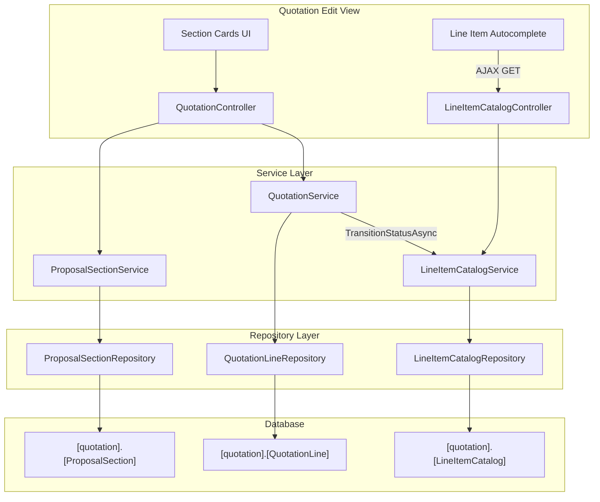

# Design Document: Quotation Sections & Line Item Catalog

## Overview

This feature adds two complementary capabilities to the Portal quotation module:

1. **Line Item Catalog** — A per-business library of reusable line item templates, automatically populated when quotations transition to "Sent" or "Accepted" status. Users can search the catalog via an autocomplete API when creating new quotation lines, and manage entries through a dedicated view.

2. **Enhanced Quotation Sections** — Extends the existing `ProposalSection` table with `Description` and `Notes` columns, restructures the Edit view to render sections as distinct cards, and updates the proposal snapshot renderer to display section descriptions and notes.

The catalog hooks into the existing `QuotationService.TransitionStatusAsync` method. The search is exposed as a JSON API endpoint consumed by client-side autocomplete. Section management uses the existing MVC pattern with server-rendered views.

## Architecture



### Key Architectural Decisions

| Decision | Rationale |
|----------|-----------|
| Catalog population inside `TransitionStatusAsync` | Single responsibility — the status transition already validates lines exist; adding catalog upsert here keeps the workflow atomic without a separate event/message bus step. |
| Upsert by Description + BusinessId | Keeps the catalog deduplicated per business. Latest values always win, matching the "most recent usage" mental model. |
| Separate `LineItemCatalogController` | The catalog API is a distinct concern from quotation CRUD. A dedicated controller keeps endpoints focused and testable. |
| JSON API for search (not page reload) | Autocomplete requires low-latency partial-match queries; a JSON endpoint supports the typeahead UX pattern. |
| `ProposalSectionService` for section orchestration | Section reordering, deletion with line reassignment, and move operations need business logic beyond simple CRUD. |

## Components and Interfaces

### New Components

#### 1. `LineItemCatalog` Entity
Maps to `[quotation].[LineItemCatalog]` table. Represents a single reusable line item template.

#### 2. `LineItemCatalogRepository`
Table repository following the `GenericStoredProcedureRepository<T>` pattern. Provides:
- `SearchByDescriptionAsync(int businessId, string query)` — `LIKE`-based search, ordered by `UpdatedAtUtc DESC`
- `UpsertAsync(LineItemCatalog entity)` — Insert or update by `BusinessId + Description`
- `GetAllByBusinessIdAsync(int businessId)` — Full list for management view
- `GetByIdAsync(int id)` — Single entry lookup
- `DeleteAsync(int id)` — Remove entry
- `UpdateAsync(LineItemCatalog entity)` — Edit entry fields

#### 3. `LineItemCatalogService` (implements `ILineItemCatalogService`)
Business logic layer:
- `SearchAsync(int businessId, string query)` — Validates minimum query length (2 chars), delegates to repository
- `PopulateFromQuotationAsync(int quotationId, int businessId)` — Fetches quotation lines, upserts each into catalog
- `GetAllAsync(int businessId)` — Returns all entries for management
- `DeleteAsync(int id, int businessId)` — Validates ownership, deletes
- `UpdateAsync(LineItemCatalog entry, int businessId)` — Validates ownership, updates

#### 4. `LineItemCatalogController`
JSON API controller:
- `GET /api/catalog/search?q={query}` — Returns matching catalog entries as JSON
- Management actions (List, Edit, Delete) via standard MVC views

#### 5. `ProposalSectionService` (implements `IProposalSectionService`)
Orchestrates section management:
- `AddSectionAsync(int quotationId, string name, string? description)` — Creates section with next SortOrder
- `RemoveSectionAsync(int sectionId, int quotationId)` — Deletes section, reassigns lines to Default (NULL)
- `ReorderSectionsAsync(int quotationId, List<int> orderedSectionIds)` — Bulk SortOrder update
- `MoveLineToSectionAsync(int lineId, int? targetSectionId)` — Updates `ProposalSectionId` on QuotationLine
- `UpdateSectionAsync(int sectionId, string name, string? description, string? notes)` — Updates section fields

### Modified Components

#### `QuotationService.TransitionStatusAsync`
After successful status update to Sent (2) or Accepted (3), calls `ILineItemCatalogService.PopulateFromQuotationAsync`.

#### `ProposalSectionRepository`
- SELECT queries updated to include `[Description]` and `[Notes]` columns
- INSERT/UPDATE queries updated to include `[Description]` and `[Notes]` parameters

#### `ProposalSection` Entity
- Add `public string? Description { get; set; }`
- Add `public string? Notes { get; set; }`

#### `ProposalSectionRenderModel`
- Add `public string? Description { get; set; }`
- Add `public string? Notes { get; set; }`

#### `PortalDbContext.ConfigureProposalSection`
- Add `.Property(e => e.Description).HasMaxLength(2000)`
- Add `.Property(e => e.Notes).HasMaxLength(4000)`

#### Proposal Snapshot View
- Render `Description` below section heading when present
- Render `Notes` below line items table when present

## Data Models

### New Table: `[quotation].[LineItemCatalog]`

```sql
CREATE TABLE [quotation].[LineItemCatalog]
(
    [Id]            INT             IDENTITY(1,1) NOT NULL,
    [BusinessId]    INT             NOT NULL,
    [Description]   NVARCHAR(500)   NOT NULL,
    [UnitPrice]     DECIMAL(18,2)   NOT NULL,
    [VatRate]       DECIMAL(5,2)    NOT NULL,
    [ReferenceUrl]  NVARCHAR(2048)  NULL,
    [Discount]      DECIMAL(18,2)   NOT NULL DEFAULT 0,
    [DiscountType]  NVARCHAR(20)    NOT NULL DEFAULT 'Percentage',
    [UpdatedAtUtc]  DATETIME2       NOT NULL DEFAULT SYSUTCDATETIME(),
    CONSTRAINT [PK_LineItemCatalog] PRIMARY KEY CLUSTERED ([Id]),
    CONSTRAINT [FK_LineItemCatalog_Business] FOREIGN KEY ([BusinessId]) REFERENCES [portal].[Business]([Id]),
    CONSTRAINT [UQ_LineItemCatalog_Business_Description] UNIQUE ([BusinessId], [Description])
);

CREATE NONCLUSTERED INDEX [IX_LineItemCatalog_BusinessId]
    ON [quotation].[LineItemCatalog] ([BusinessId]);

CREATE NONCLUSTERED INDEX [IX_LineItemCatalog_BusinessId_Description]
    ON [quotation].[LineItemCatalog] ([BusinessId], [Description]);
```

### Schema Extension: `[quotation].[ProposalSection]`

```sql
ALTER TABLE [quotation].[ProposalSection]
    ADD [Description] NVARCHAR(2000) NULL;

ALTER TABLE [quotation].[ProposalSection]
    ADD [Notes] NVARCHAR(4000) NULL;
```

### Entity: `LineItemCatalog`

```csharp
namespace Portal.Infrastructure.Entities;

public class LineItemCatalog
{
    public int Id { get; set; }
    public int BusinessId { get; set; }
    public string Description { get; set; } = null!;
    public decimal UnitPrice { get; set; }
    public decimal VatRate { get; set; }
    public string? ReferenceUrl { get; set; }
    public decimal Discount { get; set; }
    public string DiscountType { get; set; } = "Percentage";
    public DateTime UpdatedAtUtc { get; set; }

    // Navigation
    public Business Business { get; set; } = null!;
}
```

### Updated Entity: `ProposalSection`

```csharp
public class ProposalSection
{
    public int Id { get; set; }
    public int QuotationId { get; set; }
    public string Name { get; set; } = null!;
    public int SortOrder { get; set; }
    public string ColumnConfiguration { get; set; } = null!;
    public string? Description { get; set; }
    public string? Notes { get; set; }

    // Navigation
    public Quotation Quotation { get; set; } = null!;
    public ICollection<QuotationLine> QuotationLines { get; set; } = new List<QuotationLine>();
}
```

### EF Core Configuration: `LineItemCatalog`

```csharp
private static void ConfigureLineItemCatalog(ModelBuilder modelBuilder)
{
    modelBuilder.Entity<LineItemCatalog>(entity =>
    {
        entity.ToTable("LineItemCatalog", "quotation");
        entity.HasKey(e => e.Id);

        entity.HasOne(e => e.Business)
            .WithMany()
            .HasForeignKey(e => e.BusinessId)
            .OnDelete(DeleteBehavior.Cascade);

        entity.HasIndex(e => e.BusinessId)
            .HasDatabaseName("IX_LineItemCatalog_BusinessId");

        entity.HasIndex(e => new { e.BusinessId, e.Description })
            .IsUnique()
            .HasDatabaseName("UQ_LineItemCatalog_Business_Description");

        entity.Property(e => e.Description)
            .IsRequired()
            .HasMaxLength(500);

        entity.Property(e => e.UnitPrice)
            .HasColumnType("decimal(18,2)");

        entity.Property(e => e.VatRate)
            .HasColumnType("decimal(5,2)");

        entity.Property(e => e.ReferenceUrl)
            .HasMaxLength(2048);

        entity.Property(e => e.Discount)
            .HasColumnType("decimal(18,2)")
            .HasDefaultValue(0m);

        entity.Property(e => e.DiscountType)
            .IsRequired()
            .HasMaxLength(20)
            .HasDefaultValue("Percentage");

        entity.Property(e => e.UpdatedAtUtc)
            .HasDefaultValueSql("SYSUTCDATETIME()");
    });
}
```

### Global Query Filter

The `LineItemCatalog` entity will have a global query filter on `BusinessId` matching the pattern used by other tenant-scoped entities:

```csharp
modelBuilder.Entity<LineItemCatalog>().HasQueryFilter(e => e.BusinessId == _currentTenantService.CurrentBusinessId);
```


## Correctness Properties

*A property is a characteristic or behavior that should hold true across all valid executions of a system — essentially, a formal statement about what the system should do. Properties serve as the bridge between human-readable specifications and machine-verifiable correctness guarantees.*

### Property 1: Catalog population on status transition

*For any* quotation with N line items transitioning to status "Sent" (2) or "Accepted" (3), after the transition completes, the Line_Item_Catalog for that business should contain an entry for each unique description among those N lines.

**Validates: Requirements 1.1, 1.2**

### Property 2: Catalog field preservation round-trip

*For any* quotation line that is populated into the catalog, reading back the catalog entry by its description and business should yield the same UnitPrice, VatRate, ReferenceUrl, Discount, DiscountType, and a non-null UpdatedAtUtc timestamp.

**Validates: Requirements 1.3, 1.5, 1.6**

### Property 3: Catalog upsert deduplication

*For any* business and any two quotation lines with the same Description, after both are populated into the catalog (in sequence), the catalog should contain exactly one entry for that description, and its field values should match the most recently populated line.

**Validates: Requirements 1.4**

### Property 4: Catalog tenant isolation

*For any* search query executed in the context of business B, all returned catalog entries should have BusinessId equal to B, regardless of what other businesses' entries exist in the table.

**Validates: Requirements 2.4, 8.1, 8.3**

### Property 5: Catalog search minimum query length

*For any* search string of length 0 or 1, the catalog search service should return an empty result set without executing a database query.

**Validates: Requirements 2.5**

### Property 6: Catalog search result ordering

*For any* set of catalog entries matching a search query, the returned results should be ordered by UpdatedAtUtc descending (most recently updated first).

**Validates: Requirements 2.6**

### Property 7: Catalog entry edit round-trip

*For any* catalog entry, updating its fields (Description, UnitPrice, VatRate, ReferenceUrl, Discount, DiscountType) and reading it back should yield the updated values.

**Validates: Requirements 3.3**

### Property 8: Catalog deletion does not affect quotation lines

*For any* quotation line that was previously populated from a catalog entry, deleting that catalog entry should leave the quotation line's field values unchanged.

**Validates: Requirements 3.4**

### Property 9: Section name uniqueness per quotation

*For any* quotation, attempting to add two sections with the same Name should be rejected (either by constraint violation or service validation), ensuring no duplicate section names exist within a single quotation.

**Validates: Requirements 4.1**

### Property 10: Section field round-trip

*For any* proposal section, updating its Name, Description, and Notes fields and reading it back should yield the updated values, with Description and Notes correctly storing NULL when not provided.

**Validates: Requirements 4.3, 4.4, 5.7**

### Property 11: Default section grouping

*For any* quotation line with ProposalSectionId = NULL, the rendering/grouping logic should place that line into the default (unnamed) section group.

**Validates: Requirements 4.6**

### Property 12: Section deletion reassigns lines to default

*For any* proposal section containing N quotation lines, after that section is deleted, all N lines should have ProposalSectionId = NULL (belonging to the default section) and their other field values should remain unchanged.

**Validates: Requirements 5.4**

### Property 13: Section reordering preserves all sections

*For any* quotation with K sections and any permutation of those K section IDs, after reordering, the SortOrder values should reflect the new permutation order, and no sections should be lost or duplicated.

**Validates: Requirements 5.5**

### Property 14: Line move between sections

*For any* quotation line and any valid target section (or NULL for default), after moving the line, its ProposalSectionId should equal the target, and all other line fields should remain unchanged.

**Validates: Requirements 5.6**

### Property 15: Proposal render model includes section metadata

*For any* proposal section with a non-null Description and non-null Notes, the constructed ProposalSectionRenderModel should contain both the Description and Notes values matching the source entity.

**Validates: Requirements 7.1**

### Property 16: Proposal sections rendered in SortOrder

*For any* quotation with multiple sections, the list of ProposalSectionRenderModels should be ordered by SortOrder ascending.

**Validates: Requirements 4.2, 7.2**

### Property 17: ColumnConfiguration applied per section

*For any* proposal section with a given ColumnConfiguration value, the rendered table for that section should only display columns specified by that configuration, independent of other sections' configurations.

**Validates: Requirements 7.4**

## Error Handling

| Scenario | Handling |
|----------|----------|
| Catalog population fails mid-batch | Wrap all upserts in a single transaction. If any upsert fails, roll back the catalog inserts but do NOT roll back the status transition (catalog is supplementary). Log the error. |
| Duplicate description constraint violation during upsert | Use MERGE or conditional INSERT/UPDATE pattern to handle race conditions. The UNIQUE constraint on (BusinessId, Description) is the safety net. |
| Search query with SQL injection characters | Parameterized queries via `SqlParameter` — no string concatenation. The `LIKE` pattern uses `@Query` parameter with server-side `%` wrapping. |
| Section deletion with orphaned lines | Service layer explicitly sets `ProposalSectionId = NULL` on all affected lines BEFORE deleting the section, avoiding FK constraint violations. |
| Concurrent section reordering | Last-write-wins. SortOrder updates are simple integer assignments. No optimistic concurrency needed for this low-contention operation. |
| Invalid section name (empty/whitespace) | Service validates Name is non-empty and trimmed before persisting. Returns validation error to controller. |
| Catalog entry deletion for non-existent ID | Repository DELETE is idempotent — deleting a non-existent row affects 0 rows. Service returns success. |
| Business context mismatch on catalog operations | Service validates that the entity's BusinessId matches the current tenant before any mutation. Throws `UnauthorizedAccessException` on mismatch. |

## Testing Strategy

### Property-Based Testing

**Library**: [FsCheck.Xunit](https://github.com/fscheck/FsCheck) (integrates with xUnit, the standard .NET PBT library)

**Configuration**: Minimum 100 iterations per property test.

**Tag format**: Each test method is annotated with a comment:
```
// Feature: quotation-sections-catalog, Property {number}: {property_text}
```

Each correctness property (1–17) maps to a single property-based test that generates random inputs and verifies the universal quantification holds.

**Key generators needed**:
- `QuotationLine` generator — random Description (non-empty string), UnitPrice (positive decimal), VatRate (0–100), optional ReferenceUrl, Discount (non-negative), DiscountType ("Percentage" or "Fixed")
- `ProposalSection` generator — random Name (non-empty, unique within quotation), optional Description (up to 2000 chars), optional Notes (up to 4000 chars), SortOrder (positive int)
- `BusinessId` generator — random positive int for tenant isolation tests
- `SearchQuery` generator — random strings of varying lengths for search behavior tests

### Unit Testing

**Framework**: xUnit with Moq for service-layer mocking.

**Focus areas**:
- `TransitionStatusAsync` integration: verify `PopulateFromQuotationAsync` is called for status 2 and 3, not called for other transitions
- `SearchAsync` with empty results — returns empty list, not null
- `RemoveSectionAsync` with a section that has 0 lines — succeeds without error
- `UpsertAsync` with all nullable fields as NULL — correctly stores DBNull
- Migration script: existing ProposalSection rows retain data (Description and Notes are NULL)
- Proposal render model construction with mixed sections (some with description/notes, some without)
- Edge case: quotation with 0 lines transitioning to Sent — no catalog entries created (but this is blocked by existing validation)

### Integration Testing

- End-to-end catalog population: create quotation → add lines → transition to Sent → verify catalog entries via search API
- Tenant isolation: create entries for Business A, search as Business B → empty results
- Section CRUD lifecycle: add section → add lines to section → reorder → delete section → verify lines reassigned
