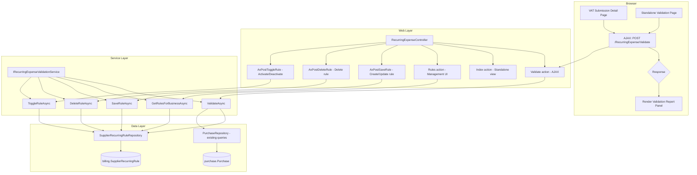
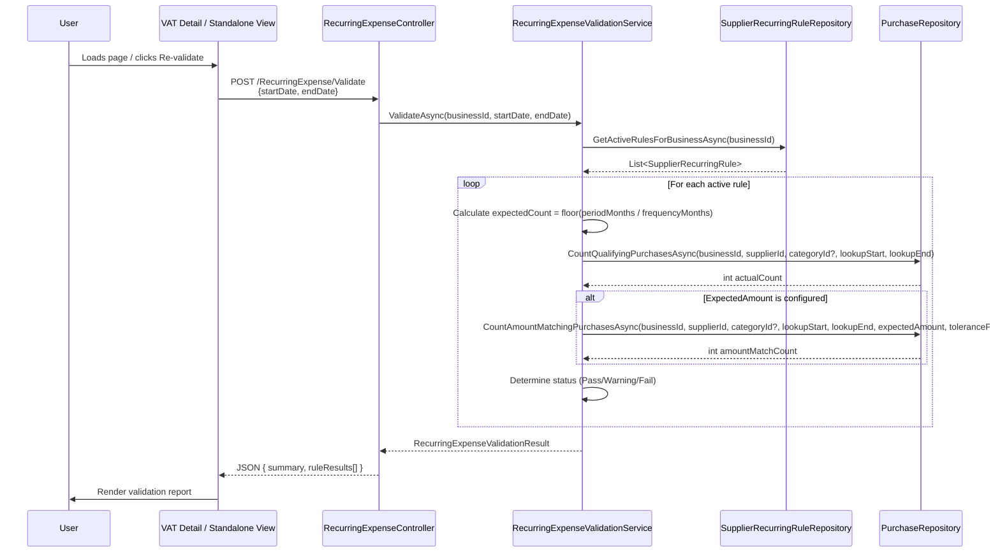

# Design Document: Recurring Expense Validation

## Overview

This feature enables business users to define recurring expense expectations per supplier (optionally scoped to an expense category). The system validates recorded purchases against these rules for a given date range — either during VAT submission or via a standalone view — and produces an advisory report indicating which expected expenses are present, partially present, or missing.

The design follows the existing Controller → Service → Repository layering, uses raw SQL for data access, and integrates with the VAT submission detail page via an AJAX-loaded panel. A standalone validation page provides the same capability independent of VAT submission.

### Key Design Decisions

1. **Advisory only** — Validation results never block VAT submission or any other action. The report is informational.
2. **Supplier + optional Category scope** — Rules are tied to a supplier. When a category is also specified, only purchases matching both supplier AND category count. When category is null, any purchase from the supplier satisfies the rule.
3. **Grace period widens lookup, not expectation** — The grace period extends the date window for finding qualifying purchases but does not change the expected count formula.
4. **Two validation levels** — Level 1 (frequency) is always evaluated. Level 2 (amount) is evaluated only when ExpectedAmount is configured on the rule.
5. **Single AJAX endpoint** — One `Validate` endpoint serves both the VAT submission panel and the standalone view, accepting a date range.
6. **Schema: `[billing]`** — The table lives in the existing `[billing]` schema as it relates to billing/expense expectations rather than the purchase transaction itself.
7. **Fail-safe design** — If the validation endpoint encounters errors, it returns an empty report rather than blocking the user.

## Architecture



### Data Flow: Validation Request



## Components and Interfaces

### 1. RecurringExpenseController

New controller under `Portal.Web.Controllers`. Handles the rule management UI, standalone validation view, and the AJAX validation endpoint.

```csharp
[Authorize]
[ModuleAccess(PortalModules.Purchase)]
public class RecurringExpenseController : Controller
{
    // GET /RecurringExpense — Standalone validation view
    Task<IActionResult> Index();

    // GET /RecurringExpense/Rules — Rule management UI
    Task<IActionResult> Rules();

    // POST /RecurringExpense/Validate — AJAX validation endpoint (used by both VAT panel and standalone)
    [HttpPost]
    Task<IActionResult> Validate([FromBody] RecurringExpenseValidateRequest request);

    // POST /RecurringExpense/AxPostSaveRule — Create or update a rule (AJAX)
    [HttpPost]
    [ValidateAntiForgeryToken]
    Task<IActionResult> AxPostSaveRule([FromBody] SaveRecurringRuleRequest request);

    // POST /RecurringExpense/AxPostDeleteRule — Delete a rule (AJAX)
    [HttpPost]
    [ValidateAntiForgeryToken]
    Task<IActionResult> AxPostDeleteRule([FromBody] DeleteRecurringRuleRequest request);

    // POST /RecurringExpense/AxPostToggleRule — Activate/Deactivate a rule (AJAX)
    [HttpPost]
    [ValidateAntiForgeryToken]
    Task<IActionResult> AxPostToggleRule([FromBody] ToggleRecurringRuleRequest request);
}
```

### 2. IRecurringExpenseValidationService / RecurringExpenseValidationService

Service interface and implementation in `Portal.Infrastructure.Services`.

```csharp
public interface IRecurringExpenseValidationService
{
    /// Validates all active rules for the business against the given date range.
    Task<RecurringExpenseValidationResult> ValidateAsync(int businessId, DateOnly startDate, DateOnly endDate);

    /// Returns all rules for the business (active and inactive) for the management UI.
    Task<List<RecurringRuleViewModel>> GetRulesForBusinessAsync(int businessId);

    /// Creates or updates a recurring rule.
    Task<ServiceResult> SaveRuleAsync(int businessId, SaveRecurringRuleRequest request);

    /// Soft-deletes a rule (sets IsDeleted = 1).
    Task<ServiceResult> DeleteRuleAsync(int businessId, int ruleId);

    /// Toggles the IsActive flag on a rule.
    Task<ServiceResult> ToggleRuleAsync(int businessId, int ruleId);
}
```

### 3. SupplierRecurringRuleRepository

New repository in `Portal.Infrastructure.Repositories`, extending `GenericStoredProcedureRepository<SupplierRecurringRule>`.

```csharp
public class SupplierRecurringRuleRepository : GenericStoredProcedureRepository<SupplierRecurringRule>
{
    Task<List<SupplierRecurringRule>> GetActiveByBusinessIdAsync(int businessId);
    Task<List<SupplierRecurringRule>> GetAllByBusinessIdAsync(int businessId);
    Task<SupplierRecurringRule?> GetByIdAsync(int id, int businessId);
    Task InsertAsync(SupplierRecurringRule entity);
    Task UpdateAsync(SupplierRecurringRule entity);
    Task SoftDeleteAsync(int id, int businessId);
    Task ToggleIsActiveAsync(int id, int businessId, bool isActive);
}
```

### 4. Purchase Lookup Methods (added to PurchaseRepository)

New query methods for recurring expense validation:

```csharp
/// Count non-cancelled purchases for a supplier (optionally filtered by category) within a date range.
Task<int> CountQualifyingPurchasesAsync(int businessId, int supplierId, int? expenseCategoryId, DateOnly startDate, DateOnly endDate);

/// Count non-cancelled purchases matching both supplier/category AND an expected amount within tolerance.
Task<int> CountAmountMatchingPurchasesAsync(int businessId, int supplierId, int? expenseCategoryId, DateOnly startDate, DateOnly endDate, decimal expectedAmount, decimal tolerancePercent);
```

### 5. VAT Submission Integration

Client-side JavaScript addition to `Portal.Web/Views/Vat/Detail.cshtml`:
- A collapsible `<section>` panel titled "Recurring Expense Check"
- On page load, triggers AJAX POST to `/RecurringExpense/Validate` with the period's start and end dates
- Renders the validation report (pass/warn/fail per rule)
- "Re-validate" button to refresh
- Message when no rules are configured, with link to `/RecurringExpense/Rules`

### 6. Standalone Validation View

New Razor view at `Views/RecurringExpense/Index.cshtml`:
- Topbar with eyebrow, heading, subtitle
- Filter section: dropdown to select a VAT period OR custom date range (from/to date pickers)
- "Validate" button triggers AJAX POST
- Results rendered in same report format as VAT panel
- Defaults to current open VAT period if one exists

### 7. Rule Management View

New Razor view at `Views/RecurringExpense/Rules.cshtml`:
- Topbar with heading "Recurring Expense Rules"
- List of existing rules displayed as cards or table rows, grouped by supplier
- "Add Rule" button opens a form (modal or inline)
- Form fields: Supplier (autocomplete), Category (autocomplete, optional), Frequency (dropdown), Expected Amount (optional), Tolerance % (shown when amount set), Grace Period Days (0-15), Description
- Edit/Delete/Toggle actions per rule
- SweetAlert2 confirmations, BlockUI during AJAX

### 8. Navigation Integration

Add "Recurring Expenses" as a navigation sub-item under the Purchases module section (via the ModuleNavigation ViewComponent or directly in the layout).

## Data Models

### Database Table: `[billing].[SupplierRecurringRule]`

| Column | Type | Nullable | Default | Description |
|--------|------|----------|---------|-------------|
| Id | INT IDENTITY(1,1) | NOT NULL | — | Primary key |
| BusinessId | INT | NOT NULL | — | FK → [portal].[Business].[Id] |
| SupplierId | INT | NOT NULL | — | FK → [purchase].[Supplier].[Id] |
| ExpenseCategoryId | INT | NULL | — | FK → [purchase].[ExpenseCategory].[Id] (optional) |
| FrequencyMonths | INT | NOT NULL | — | Expected billing frequency (1=monthly, 2=bimonthly, etc.) |
| ExpectedAmount | DECIMAL(18,2) | NULL | — | Expected purchase amount (optional) |
| AmountTolerancePercent | DECIMAL(5,2) | NULL | 5.00 | Acceptable variance percentage |
| GracePeriodDays | INT | NOT NULL | 0 | Days to extend lookup window |
| Description | NVARCHAR(200) | NOT NULL | — | User-facing label |
| IsActive | BIT | NOT NULL | 1 | Whether rule is active for validation |
| IsDeleted | BIT | NOT NULL | 0 | Soft-delete flag (1 = hidden from all queries) |
| CreatedAtUtc | DATETIME | NOT NULL | GETUTCDATE() | Record creation timestamp |

**Constraints:**
- `PK_SupplierRecurringRule` — PRIMARY KEY CLUSTERED on `[Id]`
- `FK_SupplierRecurringRule_Business` → `[portal].[Business].[Id]`
- `FK_SupplierRecurringRule_Supplier` → `[purchase].[Supplier].[Id]`
- `FK_SupplierRecurringRule_ExpenseCategory` → `[purchase].[ExpenseCategory].[Id]`
- `IX_SupplierRecurringRule_BusinessId_SupplierId` — Non-clustered index on (BusinessId, SupplierId)
- `IX_SupplierRecurringRule_BusinessId` — Non-clustered index on BusinessId

### Entity Class: `SupplierRecurringRule`

```csharp
namespace Portal.Infrastructure.Entities;

public class SupplierRecurringRule
{
    public int Id { get; set; }
    public int BusinessId { get; set; }
    public int SupplierId { get; set; }
    public int? ExpenseCategoryId { get; set; }
    public int FrequencyMonths { get; set; }
    public decimal? ExpectedAmount { get; set; }
    public decimal? AmountTolerancePercent { get; set; }
    public int GracePeriodDays { get; set; }
    public string Description { get; set; } = null!;
    public bool IsActive { get; set; }
    public bool IsDeleted { get; set; }
    public DateTime CreatedAtUtc { get; set; }

    // Navigation properties
    public Business Business { get; set; } = null!;
    public Supplier Supplier { get; set; } = null!;
    public ExpenseCategory? ExpenseCategory { get; set; }
}
```

### Request/Response Models

```csharp
// Request model for the Validate endpoint
public class RecurringExpenseValidateRequest
{
    public DateOnly StartDate { get; set; }
    public DateOnly EndDate { get; set; }
}

// Response model for the Validate endpoint
public class RecurringExpenseValidationResult
{
    public ValidationSummary Summary { get; set; } = new();
    public List<RuleValidationResult> RuleResults { get; set; } = new();
}

public class ValidationSummary
{
    public int TotalRules { get; set; }
    public int PassCount { get; set; }
    public int WarningCount { get; set; }
    public int FailCount { get; set; }
}

public class RuleValidationResult
{
    public int RuleId { get; set; }
    public string SupplierName { get; set; } = null!;
    public string? CategoryName { get; set; }
    public string Description { get; set; } = null!;
    public int FrequencyMonths { get; set; }
    public int ExpectedCount { get; set; }
    public int ActualCount { get; set; }
    public string Status { get; set; } = null!; // "pass", "warning", "fail"
    public decimal? ExpectedAmount { get; set; }
    public bool? IsAmountMatched { get; set; } // null if no amount rule, true/false otherwise
    public int? AmountMatchCount { get; set; }
}

// Request model for saving a rule
public class SaveRecurringRuleRequest
{
    public int? Id { get; set; } // null for create, set for update
    public int SupplierId { get; set; }
    public int? ExpenseCategoryId { get; set; }
    public int FrequencyMonths { get; set; }
    public decimal? ExpectedAmount { get; set; }
    public decimal? AmountTolerancePercent { get; set; }
    public int GracePeriodDays { get; set; }
    public string Description { get; set; } = null!;
}

// Request model for deleting a rule
public class DeleteRecurringRuleRequest
{
    public int Id { get; set; }
}

// Request model for toggling a rule
public class ToggleRecurringRuleRequest
{
    public int Id { get; set; }
}

// View model for rule management
public class RecurringRuleViewModel
{
    public int Id { get; set; }
    public int SupplierId { get; set; }
    public string SupplierName { get; set; } = null!;
    public int? ExpenseCategoryId { get; set; }
    public string? CategoryName { get; set; }
    public int FrequencyMonths { get; set; }
    public string FrequencyLabel { get; set; } = null!; // "Monthly", "Bimonthly", etc.
    public decimal? ExpectedAmount { get; set; }
    public decimal? AmountTolerancePercent { get; set; }
    public int GracePeriodDays { get; set; }
    public string Description { get; set; } = null!;
    public bool IsActive { get; set; }
}
```

### SQL Migration Script (113_CreateSupplierRecurringRuleTable.sql)

```sql
-- ============================================================
-- Migration: 113_CreateSupplierRecurringRuleTable
-- Description: Creates the SupplierRecurringRule table for 
--              recurring expense validation feature.
-- ============================================================

USE [Guardian]
GO

IF NOT EXISTS (
    SELECT 1
    FROM INFORMATION_SCHEMA.TABLES
    WHERE TABLE_SCHEMA = 'billing'
      AND TABLE_NAME = 'SupplierRecurringRule'
)
BEGIN
    CREATE TABLE [billing].[SupplierRecurringRule]
    (
        [Id]                      INT            IDENTITY(1,1)  NOT NULL,
        [BusinessId]              INT                           NOT NULL,
        [SupplierId]              INT                           NOT NULL,
        [ExpenseCategoryId]       INT                           NULL,
        [FrequencyMonths]         INT                           NOT NULL,
        [ExpectedAmount]          DECIMAL(18,2)                 NULL,
        [AmountTolerancePercent]  DECIMAL(5,2)                  NULL     CONSTRAINT [DF_SupplierRecurringRule_Tolerance] DEFAULT (5.00),
        [GracePeriodDays]         INT                           NOT NULL CONSTRAINT [DF_SupplierRecurringRule_GracePeriod] DEFAULT (0),
        [Description]             NVARCHAR(200)                 NOT NULL,
        [IsActive]                BIT                           NOT NULL CONSTRAINT [DF_SupplierRecurringRule_IsActive] DEFAULT (1),
        [IsDeleted]               BIT                           NOT NULL CONSTRAINT [DF_SupplierRecurringRule_IsDeleted] DEFAULT (0),
        [CreatedAtUtc]            DATETIME                      NOT NULL CONSTRAINT [DF_SupplierRecurringRule_CreatedAtUtc] DEFAULT (GETUTCDATE()),

        CONSTRAINT [PK_SupplierRecurringRule] PRIMARY KEY CLUSTERED ([Id]),
        CONSTRAINT [FK_SupplierRecurringRule_Business] FOREIGN KEY ([BusinessId]) REFERENCES [portal].[Business] ([Id]),
        CONSTRAINT [FK_SupplierRecurringRule_Supplier] FOREIGN KEY ([SupplierId]) REFERENCES [purchase].[Supplier] ([Id]),
        CONSTRAINT [FK_SupplierRecurringRule_ExpenseCategory] FOREIGN KEY ([ExpenseCategoryId]) REFERENCES [purchase].[ExpenseCategory] ([Id])
    );
END
GO

-- Index: BusinessId + SupplierId for scoped rule lookups
IF NOT EXISTS (
    SELECT 1
    FROM sys.indexes
    WHERE [name] = 'IX_SupplierRecurringRule_BusinessId_SupplierId'
      AND [object_id] = OBJECT_ID('[billing].[SupplierRecurringRule]')
)
BEGIN
    CREATE NONCLUSTERED INDEX [IX_SupplierRecurringRule_BusinessId_SupplierId]
        ON [billing].[SupplierRecurringRule] ([BusinessId], [SupplierId]);
END
GO

-- Index: BusinessId for tenant-filtered listing
IF NOT EXISTS (
    SELECT 1
    FROM sys.indexes
    WHERE [name] = 'IX_SupplierRecurringRule_BusinessId'
      AND [object_id] = OBJECT_ID('[billing].[SupplierRecurringRule]')
)
BEGIN
    CREATE NONCLUSTERED INDEX [IX_SupplierRecurringRule_BusinessId]
        ON [billing].[SupplierRecurringRule] ([BusinessId]);
END
GO
```

## Validation Logic: Expected Count Calculation

The core formula for determining how many purchases should exist within a period:

```
periodMonths = monthDiff(startDate, endDate)
expectedCount = floor(periodMonths / frequencyMonths)
if expectedCount == 0 and periodMonths >= frequencyMonths:
    expectedCount = 1
```

Where `monthDiff` calculates the number of complete months between start and end dates.

**Examples:**

| Period | Frequency | Period Months | Expected Count |
|--------|-----------|--------------|----------------|
| Mar–May (3 months) | Monthly (1) | 3 | 3 |
| Mar–May (3 months) | Bimonthly (2) | 3 | 1 |
| Mar–Aug (6 months) | Bimonthly (2) | 6 | 3 |
| Mar–May (3 months) | Quarterly (3) | 3 | 1 |
| Mar–Apr (2 months) | Quarterly (3) | 2 | 0 → skip (period shorter than frequency) |

When `expectedCount` is 0 (period is shorter than the frequency), the rule is skipped for that period and not reported as a failure.

## Qualifying Purchase Lookup

A purchase qualifies for a rule when:
1. `Purchase.BusinessId` matches the rule's BusinessId
2. `Purchase.SupplierId` matches the rule's SupplierId
3. If rule has `ExpenseCategoryId` set: `Purchase.ExpenseCategoryId` matches
4. `Purchase.IsCancelled = 0`
5. `Purchase.InvoiceDate` falls within the lookup window (period dates ± grace period)

Note: All rule queries filter by `IsDeleted = 0`. Active rule queries additionally filter by `IsActive = 1`.

SQL pattern:

```sql
SELECT COUNT(*)
FROM [purchase].[Purchase]
WHERE [purchase].[Purchase].[BusinessId] = @BusinessId
  AND [purchase].[Purchase].[SupplierId] = @SupplierId
  AND (@ExpenseCategoryId IS NULL OR [purchase].[Purchase].[ExpenseCategoryId] = @ExpenseCategoryId)
  AND [purchase].[Purchase].[IsCancelled] = 0
  AND [purchase].[Purchase].[InvoiceDate] >= @LookupStartDate
  AND [purchase].[Purchase].[InvoiceDate] <= @LookupEndDate
```

For amount matching:

```sql
SELECT COUNT(*)
FROM [purchase].[Purchase]
WHERE [purchase].[Purchase].[BusinessId] = @BusinessId
  AND [purchase].[Purchase].[SupplierId] = @SupplierId
  AND (@ExpenseCategoryId IS NULL OR [purchase].[Purchase].[ExpenseCategoryId] = @ExpenseCategoryId)
  AND [purchase].[Purchase].[IsCancelled] = 0
  AND [purchase].[Purchase].[InvoiceDate] >= @LookupStartDate
  AND [purchase].[Purchase].[InvoiceDate] <= @LookupEndDate
  AND [purchase].[Purchase].[AmountExcludingVat] >= @LowerBound
  AND [purchase].[Purchase].[AmountExcludingVat] <= @UpperBound
```

## Status Determination Logic

```
if actualCount >= expectedCount:
    frequencyStatus = PASS
elif actualCount > 0:
    frequencyStatus = WARNING
else:
    frequencyStatus = FAIL

if expectedAmount is configured:
    if amountMatchCount >= expectedCount:
        amountStatus = PASS
    elif amountMatchCount > 0:
        amountStatus = WARNING
    else:
        amountStatus = FAIL
    
    overallStatus = worst(frequencyStatus, amountStatus)
else:
    overallStatus = frequencyStatus
```

Where `worst()` returns FAIL > WARNING > PASS.

## Correctness Properties

### Property 1: Expected count calculation is deterministic

*For any* valid date range and frequency, the expected count SHALL equal `floor(periodMonths / frequencyMonths)` where periodMonths is the number of complete months between start and end dates. When the result is 0 and periodMonths < frequencyMonths, the rule is skipped.

**Validates: Requirements 3.1**

### Property 2: Qualifying purchase count excludes cancelled purchases

*For any* set of purchases containing cancelled and non-cancelled records, the qualifying count SHALL include only purchases where `IsCancelled = 0`.

**Validates: Requirements 14.1, 14.2**

### Property 3: Category-scoped rules only count category-matched purchases

*For any* rule with `ExpenseCategoryId` set to value C, only purchases with `ExpenseCategoryId = C` from the specified supplier SHALL be counted. Purchases from the same supplier with different categories SHALL NOT qualify.

**Validates: Requirements 2.3**

### Property 4: Category-null rules count all purchases from supplier

*For any* rule with `ExpenseCategoryId = NULL`, all non-cancelled purchases from the specified supplier within the date range SHALL qualify regardless of their expense category.

**Validates: Requirements 2.2**

### Property 5: Grace period widens lookup but not expectation

*For any* rule with `GracePeriodDays = G`, the lookup window SHALL be `[startDate - G days, endDate + G days]` but the expected count SHALL remain `floor(periodMonths / frequencyMonths)` (unaffected by grace period).

**Validates: Requirements 5.1, 5.2, 5.3**

### Property 6: Amount tolerance range is symmetric

*For any* rule with `ExpectedAmount = A` and `AmountTolerancePercent = T`, a purchase amount X qualifies as amount-matched if and only if `A * (1 - T/100) <= X <= A * (1 + T/100)`.

**Validates: Requirements 4.2**

### Property 7: Status determination is consistent with counts

*For any* rule evaluation: status is PASS iff `actualCount >= expectedCount`, WARNING iff `0 < actualCount < expectedCount`, FAIL iff `actualCount == 0`.

**Validates: Requirements 3.3, 3.4, 3.5**

### Property 8: Tenant isolation on all queries

*For any* set of rules and purchases across multiple businesses, all queries for a given businessId SHALL return only data where `BusinessId` matches. No cross-tenant data SHALL appear in validation results.

**Validates: Requirements 11.1, 11.2**

### Property 9: Deactivated rules are excluded from validation

*For any* rule with `IsActive = 0`, the Validation_Service SHALL NOT include it in validation results, regardless of whether qualifying purchases exist.

**Validates: Requirements 13.1**

### Property 10: Validation report sorting order

*For any* set of rule results, the output SHALL be ordered: FAIL first, then WARNING, then PASS.

**Validates: Requirements 6.5**

## Error Handling

| Scenario | Behaviour | Rationale |
|----------|-----------|-----------|
| AJAX Validate call fails (network/server) | Client shows "Unable to load validation" message | Fail-safe: validation is advisory |
| No active rules for business | Return empty result with summary showing 0 rules | Clear feedback: nothing configured |
| Invalid date range (endDate < startDate) | Return empty result | Defensive: don't error on bad input |
| Supplier or category deleted after rule created | Rule still evaluates but produces 0 qualifying purchases → FAIL | Natural degradation; user should update rules |
| Grace period results in negative start date | Clamp to minimum valid date | Prevent SQL errors |
| Database timeout on purchase count query | Catch exception, mark rule as "unable to evaluate", log error | Individual rule failure doesn't block others |

### Exception Strategy

- **Repository layer**: `try/catch (Exception ex) { throw; }` (per project convention)
- **Service layer**: `ValidateAsync` wraps each rule evaluation in try/catch — if one rule fails, others still evaluate. Returns partial results with error noted. CRUD operations propagate exceptions to controller.
- **Controller layer**: `Validate` wraps service call in try/catch, always returns valid JSON. Rule management actions return `Json(new { success, message })`.

## Testing Strategy

### Unit Tests

- Expected count formula across various period/frequency combinations
- Grace period date extension calculation
- Amount tolerance bound calculation
- Status determination logic for all combinations
- Category-null vs category-scoped filtering
- Deactivated rule exclusion

### Property-Based Tests

Property-based testing is appropriate because the validation logic is a deterministic function of inputs (rules, purchases, dates). FsCheck with xUnit, minimum 100 iterations per property.

### Integration Tests

- Full validation flow: create rules → create purchases → validate → verify report
- Tenant isolation: multi-business scenario
- VAT panel AJAX round-trip
- Standalone view with custom date range and VAT period selection
