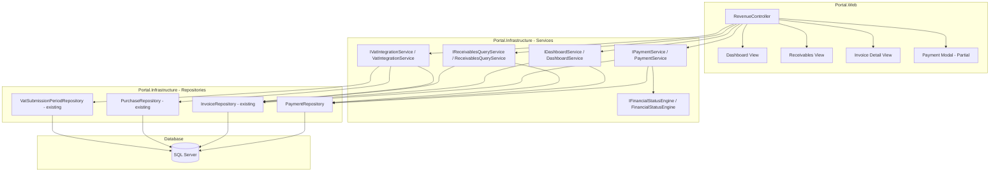
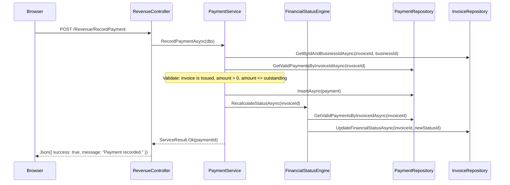

# Design Document: Revenue Control

## Overview

The Revenue Control module provides an operational financial control layer for the Portal platform. It enables businesses to record payments against issued invoices, automatically compute financial statuses, track outstanding receivables, detect overdue invoices, and visualize revenue through a dashboard with KPI cards, charts, and data tables.

This module operates on the existing database schema (`Invoice`, `Payment`, `InvoiceLine`, `PaymentMethodType`, `InvoiceFinancialStatusType`, `VatSubmissionPeriod`) and implements the application services, controllers, and Razor views that deliver the revenue control experience.

### Key Design Decisions

1. **Financial Status Engine as pure function** — Status computation is deterministic and side-effect-free, making it testable and predictable.
2. **Soft-void pattern for payments** — Payments are never deleted; voiding sets `IsVoided = 1` preserving full audit trail.
3. **Existing repository pattern** — All data access follows the established `GenericStoredProcedureRepository<T>` base with raw SQL and `SqlParameter`.
4. **Tenant isolation via BusinessId** — Every query and mutation is scoped to the authenticated user's `BusinessId` via `ICurrentTenantService`.
5. **AJAX-first interactions** — Payment recording and voiding use fetch + BlockUI + SweetAlert2 pattern per project standards.

## Architecture

### Component Diagram



### Request Flow



## Components and Interfaces

### IPaymentService

Handles payment recording and voiding with validation.

```csharp
namespace Portal.Infrastructure.Services;

public interface IPaymentService
{
    /// <summary>
    /// Records a payment against an issued invoice after validation.
    /// Triggers financial status recalculation on success.
    /// </summary>
    Task<ServiceResult> RecordPaymentAsync(RecordPaymentDto dto, int businessId, string userId);

    /// <summary>
    /// Voids a payment by setting IsVoided = 1.
    /// Triggers financial status recalculation on the parent invoice.
    /// </summary>
    Task<ServiceResult> VoidPaymentAsync(int paymentId, int businessId);

    /// <summary>
    /// Gets all payments for an invoice (including voided) for display in payment history.
    /// </summary>
    Task<List<PaymentHistoryDto>> GetPaymentHistoryAsync(int invoiceId, int businessId);

    /// <summary>
    /// Gets active (non-voided) payment method types for dropdown population.
    /// </summary>
    Task<List<PaymentMethodType>> GetPaymentMethodTypesAsync();
}
```

### IFinancialStatusEngine

Pure computation engine for invoice financial status determination.

```csharp
namespace Portal.Infrastructure.Services;

public interface IFinancialStatusEngine
{
    /// <summary>
    /// Computes the outstanding balance for an invoice: TotalAmount - sum(valid payments).
    /// </summary>
    decimal ComputeOutstandingBalance(decimal totalAmount, IEnumerable<Payment> payments);

    /// <summary>
    /// Determines the correct InvoiceFinancialStatusTypeId based on outstanding balance,
    /// payment existence, due date, and current status.
    /// Preserves WrittenOff (5) status unchanged.
    /// </summary>
    int DetermineFinancialStatus(decimal totalAmount, decimal outstandingBalance,
        bool hasValidPayments, DateOnly dueDate, int currentStatusId);

    /// <summary>
    /// Recalculates and persists the financial status for an invoice.
    /// Fetches payments, computes balance, determines status, updates invoice.
    /// </summary>
    Task RecalculateStatusAsync(int invoiceId, int businessId);
}
```

### IDashboardService

Computes KPI aggregates, chart data, and summary tables for the revenue dashboard.

```csharp
namespace Portal.Infrastructure.Services;

public interface IDashboardService
{
    /// <summary>
    /// Computes all four KPI card values for the dashboard.
    /// </summary>
    Task<DashboardKpiDto> GetKpiDataAsync(int businessId);

    /// <summary>
    /// Returns monthly revenue collected totals for the last 12 months.
    /// </summary>
    Task<List<MonthlyRevenueDto>> GetRevenueCollectedAsync(int businessId);

    /// <summary>
    /// Returns paired monthly totals of invoiced vs collected for the last 12 months.
    /// </summary>
    Task<List<InvoicedVsCollectedDto>> GetInvoicedVsCollectedAsync(int businessId);

    /// <summary>
    /// Computes the collection rate percentage (collected within 30 days / total invoiced).
    /// </summary>
    Task<decimal> GetCollectionRateAsync(int businessId);

    /// <summary>
    /// Returns overdue invoices with search and pagination support.
    /// </summary>
    Task<PagedResult<OverdueInvoiceDto>> GetOverdueInvoicesAsync(
        int businessId, string? searchTerm, int page, int pageSize);

    /// <summary>
    /// Returns recent non-voided payments with search and pagination support.
    /// </summary>
    Task<PagedResult<RecentPaymentDto>> GetRecentPaymentsAsync(
        int businessId, string? searchTerm, int page, int pageSize);
}
```

### IReceivablesQueryService

Provides filtered, paginated lists of issued invoices with their financial state.

```csharp
namespace Portal.Infrastructure.Services;

public interface IReceivablesQueryService
{
    /// <summary>
    /// Returns paginated receivables list with multi-criteria filtering.
    /// Only returns non-deleted invoices with InvoiceStatusTypeId = 2 (Issued).
    /// </summary>
    Task<PagedResult<ReceivableDto>> GetReceivablesAsync(
        int businessId,
        string? searchTerm = null,
        int? financialStatusFilter = null,
        int? customerFilter = null,
        DateOnly? dueFrom = null,
        DateOnly? dueTo = null,
        int page = 1,
        int pageSize = 15);
}
```

### IVatIntegrationService

Computes VAT-related KPIs for the revenue dashboard.

```csharp
namespace Portal.Infrastructure.Services;

public interface IVatIntegrationService
{
    /// <summary>
    /// Computes Output VAT, Input VAT, Net VAT Payable, and Output/Input ratio
    /// for the current VAT period.
    /// </summary>
    Task<VatSummaryDto> GetCurrentPeriodSummaryAsync(int businessId);

    /// <summary>
    /// Returns Net VAT Payable values for the last 6 VAT periods.
    /// </summary>
    Task<List<VatPeriodLiabilityDto>> GetVatLiabilityByPeriodAsync(int businessId);
}
```

### PaymentRepository

New repository for payment CRUD operations.

```csharp
namespace Portal.Infrastructure.Repositories;

public class PaymentRepository : GenericStoredProcedureRepository<Payment>
{
    public PaymentRepository(DbContext context) : base(context) { }

    /// <summary>
    /// Inserts a new payment record. Returns the new Payment.Id.
    /// </summary>
    public async Task<int> InsertAsync(Payment entity);

    /// <summary>
    /// Gets all non-voided payments for an invoice (for balance calculation).
    /// </summary>
    public async Task<List<Payment>> GetValidPaymentsByInvoiceIdAsync(int invoiceId, int businessId);

    /// <summary>
    /// Gets all payments for an invoice including voided (for payment history display).
    /// </summary>
    public async Task<List<Payment>> GetAllPaymentsByInvoiceIdAsync(int invoiceId, int businessId);

    /// <summary>
    /// Gets a single payment by Id and BusinessId.
    /// </summary>
    public async Task<Payment?> GetByIdAndBusinessIdAsync(int id, int businessId);

    /// <summary>
    /// Sets IsVoided = 1 on a payment record.
    /// </summary>
    public async Task VoidAsync(int paymentId);

    /// <summary>
    /// Gets sum of valid payment amounts for an invoice.
    /// </summary>
    public async Task<decimal> GetTotalPaidAsync(int invoiceId, int businessId);

    /// <summary>
    /// Gets recent non-voided payments for dashboard with pagination.
    /// </summary>
    public async Task<(List<RecentPaymentDto> Items, int TotalCount)> GetRecentPaymentsPagedAsync(
        int businessId, string? searchTerm, int offset, int pageSize);

    /// <summary>
    /// Gets sum of valid payment amounts within a date range for a business.
    /// </summary>
    public async Task<decimal> GetPaidInPeriodAsync(int businessId, DateTime fromUtc, DateTime toUtc);

    /// <summary>
    /// Gets monthly payment totals for the last 12 months.
    /// </summary>
    public async Task<List<MonthlyRevenueDto>> GetMonthlyTotalsAsync(int businessId, DateTime fromUtc);
}
```

### RevenueController

MVC controller handling all Revenue Control HTTP endpoints.

```csharp
namespace Portal.Web.Controllers;

[Authorize]
[ModuleAccess(PortalModules.Revenue)]
public class RevenueController : Controller
{
    // Dependencies: IPaymentService, IDashboardService, IReceivablesQueryService,
    //              IVatIntegrationService, ICurrentTenantService, ICustomerService

    // === Page Actions (return Views) ===

    [HttpGet] // GET /Revenue/Dashboard
    Task<IActionResult> Dashboard();

    [HttpGet] // GET /Revenue/Receivables
    Task<IActionResult> Receivables(string? search, int? financialStatus,
        int? customer, string? dueFrom, string? dueTo, int page = 1);

    [HttpGet] // GET /Revenue/InvoiceDetail/{id}
    Task<IActionResult> InvoiceDetail(int id);

    // === AJAX Actions (return Json) ===

    [HttpPost] // POST /Revenue/RecordPayment
    [ValidateAntiForgeryToken]
    Task<IActionResult> RecordPayment(DateTime paymentDate, decimal amount,
        int paymentMethodTypeId, int invoiceId, string? reference, string? notes);

    [HttpPost] // POST /Revenue/VoidPayment
    [ValidateAntiForgeryToken]
    Task<IActionResult> VoidPayment(int paymentId);

    // === AJAX Data Endpoints (for table refresh) ===

    [HttpGet] // GET /Revenue/GetOverdueInvoices
    Task<IActionResult> GetOverdueInvoices(string? search, int page = 1, int pageSize = 10);

    [HttpGet] // GET /Revenue/GetRecentPayments
    Task<IActionResult> GetRecentPayments(string? search, int page = 1, int pageSize = 10);
}
```

### View Structure

```
Views/Revenue/
├── Dashboard.cshtml          — KPI cards, charts, overdue table, recent payments table
├── Receivables.cshtml        — Filter panel + paginated receivables table
├── InvoiceDetail.cshtml      — Financial summary, line items, payment history, progress bar
└── _PaymentModal.cshtml      — Partial view for the Add Payment modal
```

Each view follows the MyChair Design System with `.glass.card-pad` sections, `margin-bottom:22px` between cards, and the standard pagination pattern.

## Data Models

### New DTOs (Portal.Infrastructure.Models)

```csharp
// Input DTO for recording a payment
public class RecordPaymentDto
{
    public int InvoiceId { get; set; }
    public int PaymentMethodTypeId { get; set; }
    public DateTime PaymentDateUtc { get; set; }
    public decimal Amount { get; set; }
    public string? Reference { get; set; }
    public string? Notes { get; set; }
}

// Dashboard KPI card values
public class DashboardKpiDto
{
    public decimal OutstandingReceivables { get; set; }
    public int OutstandingInvoiceCount { get; set; }
    public decimal OverdueAmount { get; set; }
    public int OverdueInvoiceCount { get; set; }
    public decimal PaidThisMonth { get; set; }
    public int PaidThisMonthCount { get; set; }
    public decimal PartiallyPaidAmount { get; set; }
    public int PartiallyPaidCount { get; set; }
}

// Monthly revenue data point for charts
public class MonthlyRevenueDto
{
    public int Year { get; set; }
    public int Month { get; set; }
    public string Label { get; set; } = null!; // e.g. "Jan", "Feb"
    public decimal Amount { get; set; }
}

// Paired monthly data for Invoiced vs Collected chart
public class InvoicedVsCollectedDto
{
    public int Year { get; set; }
    public int Month { get; set; }
    public string Label { get; set; } = null!;
    public decimal InvoicedAmount { get; set; }
    public decimal CollectedAmount { get; set; }
}

// Overdue invoice row for dashboard table
public class OverdueInvoiceDto
{
    public int Id { get; set; }
    public string InvoiceNumber { get; set; } = null!;
    public string CustomerName { get; set; } = null!;
    public DateOnly DueDate { get; set; }
    public int DaysOverdue { get; set; }
    public decimal OutstandingBalance { get; set; }
}

// Recent payment row for dashboard table
public class RecentPaymentDto
{
    public int Id { get; set; }
    public DateTime PaymentDateUtc { get; set; }
    public string InvoiceNumber { get; set; } = null!;
    public string CustomerName { get; set; } = null!;
    public string PaymentMethodName { get; set; } = null!;
    public decimal Amount { get; set; }
    public bool IsFullPayment { get; set; } // true if invoice became Paid after this payment
}

// Receivables list row
public class ReceivableDto
{
    public int Id { get; set; }
    public string InvoiceNumber { get; set; } = null!;
    public string CustomerName { get; set; } = null!;
    public DateOnly InvoiceDate { get; set; }
    public DateOnly DueDate { get; set; }
    public decimal TotalAmount { get; set; }
    public decimal TotalPaid { get; set; }
    public decimal OutstandingBalance { get; set; }
    public int InvoiceFinancialStatusTypeId { get; set; }
    public string FinancialStatusName { get; set; } = null!;
    public bool HasOutstandingBalance { get; set; } // drives "Pay" action link visibility
}

// Payment history row for invoice detail
public class PaymentHistoryDto
{
    public int Id { get; set; }
    public DateTime PaymentDateUtc { get; set; }
    public decimal Amount { get; set; }
    public string PaymentMethodName { get; set; } = null!;
    public string? Reference { get; set; }
    public string? Notes { get; set; }
    public bool IsVoided { get; set; }
}

// VAT summary for current period
public class VatSummaryDto
{
    public decimal OutputVatCollected { get; set; }
    public decimal InputVat { get; set; }
    public decimal NetVatPayable { get; set; }
    public decimal OutputInputRatio { get; set; }
    public string PeriodLabel { get; set; } = null!;
}

// VAT liability per period for chart
public class VatPeriodLiabilityDto
{
    public string PeriodLabel { get; set; } = null!;
    public decimal OutputVat { get; set; }
    public decimal InputVat { get; set; }
    public decimal NetPayable { get; set; }
}
```

### Existing Entities (No Changes Required)

The following entities already exist and require no schema modifications:

| Entity | Schema | Key Fields |
|--------|--------|------------|
| `Invoice` | `[invoice]` | Id, BusinessId, CustomerId, InvoiceStatusTypeId, InvoiceFinancialStatusTypeId, TotalAmount, TaxAmount, DueDate, IsDeleted |
| `Payment` | `[revenue]` | Id, BusinessId, InvoiceId, PaymentMethodTypeId, PaymentDateUtc, Amount, IsVoided, CreatedByUserId |
| `InvoiceLine` | `[invoice]` | Id, InvoiceId, Description, Quantity, UnitPrice, LineTotal, SortOrder |
| `PaymentMethodType` | `[revenue]` | Id, Name, IsActive — Seed: Cash(1), BankTransfer(2), Card(3), Cheque(4), Other(5) |
| `InvoiceFinancialStatusType` | `[invoice]` | Id, Name — Seed: Unpaid(1), PartiallyPaid(2), Paid(3), Overdue(4), WrittenOff(5) |
| `Purchase` | `[purchase]` | Id, BusinessId, InvoiceDate, VatAmount, VatSubmissionPeriodId, IsCancelled |
| `VatSubmissionPeriod` | `[vat]` | Id, BusinessId, PeriodStartDate, PeriodEndDate, PeriodLabel |

### Financial Status Determination Logic

```
function DetermineFinancialStatus(totalAmount, outstandingBalance, hasValidPayments, dueDate, currentStatusId):
    if currentStatusId == 5 (WrittenOff):
        return 5  // preserve WrittenOff

    if outstandingBalance == 0 AND hasValidPayments:
        return 3  // Paid

    if outstandingBalance > 0 AND dueDate < today:
        return 4  // Overdue

    if outstandingBalance > 0 AND hasValidPayments AND dueDate >= today:
        return 2  // PartiallyPaid

    if outstandingBalance == totalAmount AND dueDate >= today:
        return 1  // Unpaid

    return 1  // default: Unpaid
```

## Correctness Properties

*A property is a characteristic or behavior that should hold true across all valid executions of a system — essentially, a formal statement about what the system should do. Properties serve as the bridge between human-readable specifications and machine-verifiable correctness guarantees.*

### Property 1: Payment validation rejects non-Issued invoices

*For any* invoice with `InvoiceStatusTypeId` ≠ 2 (Issued), attempting to record a payment SHALL be rejected with an error, and no Payment record SHALL be created.

**Validates: Requirements 1.1, 1.2**

### Property 2: Payment amount boundary validation

*For any* payment amount that is less than or equal to zero OR exceeds the invoice's Outstanding_Balance, the Payment_Service SHALL reject the payment and no Payment record SHALL be created.

**Validates: Requirements 1.3, 1.4**

### Property 3: Payment data round-trip persistence

*For any* valid payment submission (Issued invoice, amount > 0, amount ≤ Outstanding_Balance), the created Payment record SHALL contain the exact BusinessId, InvoiceId, PaymentMethodTypeId, PaymentDateUtc, Amount, Reference, Notes, and CreatedByUserId that were provided.

**Validates: Requirements 1.5**

### Property 4: Deterministic financial status computation

*For any* invoice with any set of payments (some voided, some valid), the Financial_Status_Engine SHALL compute the correct status deterministically:
- If current status is WrittenOff (5) → status remains 5
- If Outstanding_Balance = 0 AND valid payments exist → Paid (3)
- If Outstanding_Balance > 0 AND DueDate < today → Overdue (4)
- If Outstanding_Balance > 0 AND valid payments exist AND DueDate ≥ today → PartiallyPaid (2)
- If Outstanding_Balance = TotalAmount AND DueDate ≥ today → Unpaid (1)

**Validates: Requirements 2.1, 2.2, 2.3, 2.4, 2.5, 2.6**

### Property 5: Outstanding balance computation correctness

*For any* invoice with TotalAmount T and any set of payments where valid (non-voided) payments sum to S, the Outstanding_Balance SHALL equal T - S.

**Validates: Requirements 2.1**

### Property 6: Status recalculation idempotence

*For any* invoice, computing Outstanding_Balance then recalculating status then computing Outstanding_Balance again SHALL produce the same Outstanding_Balance value. The status engine is idempotent.

**Validates: Requirements 2.7**

### Property 7: Void preserves payment record and sets flag

*For any* non-voided payment, voiding SHALL set IsVoided = 1 and the payment record SHALL continue to exist in the database. The total count of Payment records for the invoice SHALL not decrease.

**Validates: Requirements 3.1, 3.2**

### Property 8: Dashboard KPI Outstanding Receivables correctness

*For any* set of invoices belonging to a business, Outstanding Receivables SHALL equal the sum of Outstanding_Balance across all non-deleted invoices with InvoiceStatusTypeId = 2 AND InvoiceFinancialStatusTypeId in (1, 2, 4).

**Validates: Requirements 4.1**

### Property 9: Dashboard KPI Overdue Amount correctness

*For any* set of invoices belonging to a business, Overdue Amount SHALL equal the sum of Outstanding_Balance across all invoices where DueDate < today AND Outstanding_Balance > 0.

**Validates: Requirements 4.2**

### Property 10: Dashboard KPI Paid This Month correctness

*For any* set of payments belonging to a business, Paid This Month SHALL equal the sum of Amount for all payments where IsVoided = 0 AND PaymentDateUtc falls within the current calendar month.

**Validates: Requirements 4.3**

### Property 11: Overdue invoices sorted and complete

*For any* set of overdue invoices returned by the Dashboard_Service, the results SHALL be sorted by days overdue in descending order, and each result SHALL contain InvoiceNumber, CustomerName, DueDate, DaysOverdue, and OutstandingBalance.

**Validates: Requirements 7.1, 7.2**

### Property 12: Recent payments sorted, complete, and void-excluded

*For any* set of payments returned by the Dashboard_Service recent payments query, the results SHALL be sorted by PaymentDateUtc descending, SHALL contain all required fields (PaymentDateUtc, InvoiceNumber, CustomerName, PaymentMethodName, Amount, IsFullPayment label), and SHALL NOT include any payment where IsVoided = 1.

**Validates: Requirements 8.1, 8.2, 8.5**

### Property 13: Receivables base query correctness

*For any* set of invoices belonging to a business, the Receivables_Query_Service SHALL return only non-deleted invoices with InvoiceStatusTypeId = 2 (Issued), and each result SHALL contain InvoiceNumber, CustomerName, InvoiceDate, DueDate, TotalAmount, TotalPaid, OutstandingBalance, and FinancialStatusName.

**Validates: Requirements 9.1, 9.2**

### Property 14: Receivables filter correctness

*For any* combination of active filters (search term, financial status, customer, date range), all results returned by the Receivables_Query_Service SHALL satisfy ALL active filter conditions simultaneously.

**Validates: Requirements 9.3, 9.4, 9.5, 9.6**

### Property 15: Pagination respects page size and total count

*For any* paginated query (overdue invoices, recent payments, receivables) with N total matching records and page size M, each page SHALL contain at most M items, and the reported TotalCount SHALL equal N.

**Validates: Requirements 7.4, 8.4, 9.7**

### Property 16: Tenant isolation invariant

*For any* query or mutation performed by an authenticated user with BusinessId B, all returned data SHALL have BusinessId = B, and all created records SHALL have BusinessId = B. Any attempt to access data with BusinessId ≠ B SHALL be rejected.

**Validates: Requirements 12.1, 12.2, 12.3, 12.4**

### Property 17: VAT Output/Input ratio zero-guard

*For any* VAT period where Input VAT equals zero, the Output/Input VAT Ratio SHALL return zero (not throw a division-by-zero error).

**Validates: Requirements 6.5**

### Property 18: Payment progress bar percentage correctness

*For any* invoice with TotalAmount > 0, the payment progress percentage SHALL equal (TotalPaid / TotalAmount) × 100, clamped between 0 and 100.

**Validates: Requirements 10.4**

## Error Handling

### Service Layer Error Strategy

| Scenario | Response | HTTP Status |
|----------|----------|-------------|
| Invoice not found or wrong BusinessId | `ServiceResult.Fail("Invoice not found.")` | 200 (JSON) |
| Invoice not in Issued status | `ServiceResult.Fail("Payments can only be recorded against issued invoices.")` | 200 (JSON) |
| Amount ≤ 0 | `ServiceResult.Fail("Payment amount must be greater than zero.")` | 200 (JSON) |
| Amount > Outstanding_Balance | `ServiceResult.Fail($"Amount exceeds outstanding balance of {currency}{outstanding}.")` | 200 (JSON) |
| Payment already voided | `ServiceResult.Fail("This payment has already been voided.")` | 200 (JSON) |
| Payment not found or wrong BusinessId | `ServiceResult.Fail("Payment not found.")` | 200 (JSON) |
| Unexpected exception | Catch in controller, return `Json(new { success = false, message = "An unexpected error occurred." })` | 200 (JSON) |

### Repository Layer

All repository methods follow the established pattern:
```csharp
try
{
    // data access logic
}
catch (Exception)
{
    throw; // rethrow to preserve stack trace
}
```

### Controller Layer

```csharp
[HttpPost]
[ValidateAntiForgeryToken]
public async Task<IActionResult> RecordPayment(...)
{
    try
    {
        var result = await _paymentService.RecordPaymentAsync(dto, businessId, userId);
        return Json(new { success = result.Success, message = result.Message });
    }
    catch (Exception)
    {
        return Json(new { success = false, message = "An unexpected error occurred." });
    }
}
```

### Client-Side Validation

The payment modal performs client-side validation before submitting:
- Amount > 0 (HTML5 `min="0.01"` + JS check)
- Amount ≤ Outstanding_Balance (JS check against data attribute)
- Required fields populated (Payment Date, Amount, Payment Method)

Client-side errors are shown inline. Server-side errors are shown via SweetAlert2.

## Testing Strategy

### Property-Based Tests (xUnit + FsCheck)

The project will use **FsCheck** with **xUnit** for property-based testing of the core business logic. Each property test runs a minimum of 100 iterations with generated inputs.

**Target library**: `FsCheck.Xunit` NuGet package

**Test project**: `Portal.Tests` (or `Portal.Infrastructure.Tests`)

Property tests focus on:
- `FinancialStatusEngine` — pure function, ideal for PBT (Properties 4, 5, 6)
- `PaymentService` validation logic — with mocked repositories (Properties 1, 2, 3, 7)
- `DashboardService` aggregation logic — with in-memory data (Properties 8, 9, 10, 11, 12)
- `ReceivablesQueryService` filtering — with in-memory data (Properties 13, 14, 15)
- Tenant isolation — with multi-tenant test data (Property 16)
- VAT ratio zero-guard (Property 17)
- Progress bar calculation (Property 18)

Each property test is tagged with:
```csharp
// Feature: revenue-control, Property 4: Deterministic financial status computation
```

**Configuration**: Minimum 100 iterations per property:
```csharp
[Property(MaxTest = 100)]
public Property StatusEngine_DeterminesCorrectStatus(...)
```

### Unit Tests (xUnit)

Example-based tests for:
- Edge cases: double-void returns informational message (Req 3.4)
- UI view model construction (Req 10.1, 10.2, 10.3, 10.5, 10.6)
- Modal context bar data (Req 11.1, 11.2)
- Client-side validation scenarios (Req 11.3, 11.4, 11.5, 11.6)
- Collection rate calculation with known data (Req 5.3)

### Integration Tests

- End-to-end payment recording flow (record → status update → balance change)
- End-to-end void flow (void → status recalculation)
- Dashboard data accuracy with seeded database
- VAT integration with real period data (Req 6.1, 6.2, 6.3, 6.4)
- Tenant isolation with multi-business seeded data
