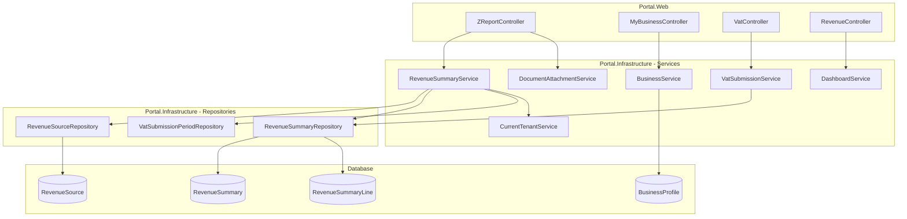
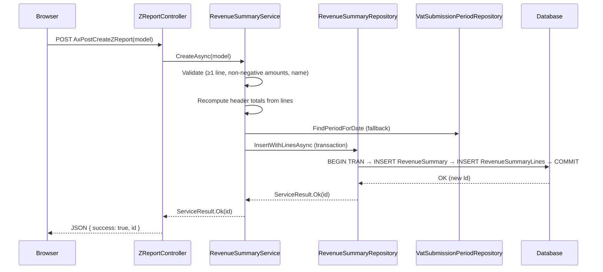

# Design Document: Revenue Ingestion — Phase 1

## Overview

This design covers Phase 1 of the Revenue Ingestion feature: enabling businesses to manually record Z-Report summaries from external POS systems. The feature integrates into the existing Portal architecture (Controller → Service → Repository) and extends VAT reporting to include external revenue.

Key technical decisions:
- **New controller**: `ZReportController` handles all Z-Report page actions and AJAX endpoints, keeping `RevenueController` focused on dashboards/payments
- **New service**: `IRevenueSummaryService` / `RevenueSummaryService` encapsulates all Z-Report business logic (CRUD, validation, total computation, period assignment)
- **New repositories**: `RevenueSourceRepository` and `RevenueSummaryRepository` for direct table access
- **Existing services extended**: `VatSubmissionService` gains Revenue Summary contribution to Output VAT; `DashboardService` gains Z-Report aggregation
- **Feature toggle**: `IsZReportEnabled` on `BusinessProfile` controls visibility across navigation, VAT reports, and dashboard

## Architecture



### Request Flow — Z-Report Create



## Components and Interfaces

### 1. ZReportController (Portal.Web)

New controller dedicated to Z-Report operations. Decorated with `[Authorize]` and `[ModuleAccess(PortalModules.Revenue)]`.

```csharp
[Authorize]
[ModuleAccess(PortalModules.Revenue)]
public class ZReportController : Controller
{
    // === Page Actions ===
    public async Task<IActionResult> Index();           // Z-Reports list page
    public async Task<IActionResult> Create();          // Create form
    public async Task<IActionResult> Edit(int id);      // Edit form (pre-populated)
    public async Task<IActionResult> Sources();         // Revenue Source management page

    // === AJAX Endpoints ===
    [HttpPost] public async Task<IActionResult> AxPostCreateZReport(ZReportFormModel model);
    [HttpPost] public async Task<IActionResult> AxPostUpdateZReport(ZReportFormModel model);
    [HttpPost] public async Task<IActionResult> AxPostDeleteZReport(int id);
    [HttpPost] public async Task<IActionResult> AxPostCreateRevenueSource(RevenueSourceFormModel model);
    [HttpPost] public async Task<IActionResult> AxPostUpdateRevenueSource(RevenueSourceFormModel model);
    [HttpPost] public async Task<IActionResult> AxPostToggleRevenueSource(int id, bool isActive);
    [HttpGet]  public async Task<IActionResult> AxGetZReportList(ZReportFilterModel filter);
    [HttpGet]  public async Task<IActionResult> AxGetRevenueSourceList();
}
```

### 2. IRevenueSummaryService / RevenueSummaryService (Portal.Infrastructure)

Core business logic for Z-Report management.

```csharp
public interface IRevenueSummaryService
{
    // Revenue Source CRUD
    Task<List<RevenueSource>> GetActiveSourcesAsync();
    Task<List<RevenueSource>> GetAllSourcesAsync();
    Task<RevenueSource?> GetSourceByIdAsync(int id);
    Task<ServiceResult> CreateSourceAsync(RevenueSource source);
    Task<ServiceResult> UpdateSourceAsync(RevenueSource source);
    Task<ServiceResult> ToggleSourceActiveAsync(int id, bool isActive);
    Task<bool> SourceHasSummariesAsync(int sourceId);

    // Revenue Summary CRUD
    Task<ServiceResult> CreateSummaryAsync(RevenueSummaryCreateModel model);
    Task<ServiceResult> UpdateSummaryAsync(RevenueSummaryUpdateModel model);
    Task<ServiceResult> SoftDeleteSummaryAsync(int id);
    Task<RevenueSummary?> GetSummaryByIdAsync(int id);
    Task<PagedResult<RevenueSummaryListItem>> GetFilteredSummariesAsync(ZReportFilterModel filter);

    // VAT Integration
    Task<decimal> GetTotalVatForPeriodAsync(int businessId, int vatSubmissionPeriodId);
    Task<List<RevenueSummaryListItem>> GetSummariesForPeriodAsync(int businessId, int periodId);

    // Dashboard
    Task<decimal> GetTotalGrossForDateRangeAsync(int businessId, DateOnly from, DateOnly to);
}
```

**Key internal methods:**
- `RecomputeHeaderTotals(List<RevenueSummaryLineModel> lines)` — server-side computation of TotalNet, TotalVat, TotalGross, TotalDiscount from lines
- `AssignVatPeriodAsync(RevenueSummary summary)` — explicit selection or date-range fallback
- `ValidateSummaryAsync(RevenueSummaryCreateModel model)` — validates ≥1 line, non-negative amounts, valid RevenueSourceId

### 3. RevenueSourceRepository (Portal.Infrastructure)

Table repository following established patterns. Uses `ExecuteSqlRawAsync` with full table names.

```csharp
public class RevenueSourceRepository : GenericStoredProcedureRepository<RevenueSource>
{
    public async Task<List<RevenueSource>> GetAllByBusinessIdAsync(int businessId);
    public async Task<List<RevenueSource>> GetActiveByBusinessIdAsync(int businessId);
    public async Task<RevenueSource?> GetByIdAndBusinessIdAsync(int id, int businessId);
    public async Task InsertAsync(RevenueSource entity);
    public async Task UpdateAsync(RevenueSource entity);
    public async Task SetIsActiveAsync(int id, int businessId, bool isActive);
    public async Task<bool> HasSummariesAsync(int id, int businessId);
}
```

### 4. RevenueSummaryRepository (Portal.Infrastructure)

Table repository for RevenueSummary + RevenueSummaryLine (transactional writes).

```csharp
public class RevenueSummaryRepository : GenericStoredProcedureRepository<RevenueSummary>
{
    public async Task<int> InsertWithLinesAsync(RevenueSummary header, List<RevenueSummaryLine> lines);
    public async Task UpdateWithLinesAsync(RevenueSummary header, List<RevenueSummaryLine> lines);
    public async Task SoftDeleteAsync(int id, int businessId);
    public async Task<RevenueSummary?> GetByIdWithLinesAsync(int id, int businessId);
    public async Task<List<RevenueSummary>> GetFilteredAsync(int businessId, ZReportFilterModel filter);
    public async Task<int> CountFilteredAsync(int businessId, ZReportFilterModel filter);
    public async Task<decimal> SumTotalVatForPeriodAsync(int businessId, int periodId);
    public async Task<decimal> SumTotalGrossForDateRangeAsync(int businessId, DateOnly from, DateOnly to);
    public async Task<List<RevenueSummary>> GetByPeriodIdAsync(int businessId, int periodId);
}
```

**Transaction pattern for InsertWithLinesAsync:**
```csharp
public async Task<int> InsertWithLinesAsync(RevenueSummary header, List<RevenueSummaryLine> lines)
{
    try
    {
        using var transaction = await _context.Database.BeginTransactionAsync();

        // 1. Insert header, capture new Id via OUTPUT INSERTED.Id
        const string headerQuery = @"
            INSERT INTO [dbo].[RevenueSummary]
                ([BusinessId], [RevenueSourceId], [SummaryDate], ...)
            OUTPUT INSERTED.Id
            VALUES (@BusinessId, @RevenueSourceId, @SummaryDate, ...)";

        var headerId = await _context.Database
            .SqlQueryRaw<int>(headerQuery, headerParams).FirstAsync();

        // 2. Insert each line with the new RevenueSummaryId
        foreach (var line in lines)
        {
            const string lineQuery = @"
                INSERT INTO [dbo].[RevenueSummaryLine]
                    ([RevenueSummaryId], [VatRate], [NetAmount], ...)
                VALUES (@RevenueSummaryId, @VatRate, @NetAmount, ...)";

            await _context.Database.ExecuteSqlRawAsync(lineQuery, lineParams);
        }

        await transaction.CommitAsync();
        return headerId;
    }
    catch (Exception ex)
    {
        throw;
    }
}
```

### 5. View Models (Portal.Web/Models)

```csharp
// Form submission model for create/edit
public class ZReportFormModel
{
    public int? Id { get; set; }  // null for create, populated for edit
    public int RevenueSourceId { get; set; }
    public DateOnly SummaryDate { get; set; }
    public DateOnly? PeriodEndDate { get; set; }
    public string? ZReportNumber { get; set; }
    public int? TransactionCount { get; set; }
    public string? Reference { get; set; }
    public string? Notes { get; set; }
    public DateTime? ExportedAtUtc { get; set; }
    public int? VatSubmissionPeriodId { get; set; }
    public List<ZReportLineFormModel> Lines { get; set; } = new();
}

public class ZReportLineFormModel
{
    public int? Id { get; set; }  // null for new lines
    public decimal VatRate { get; set; }
    public decimal NetAmount { get; set; }
    public decimal VatAmount { get; set; }
    public decimal? DiscountAmount { get; set; }
    public string? Description { get; set; }
}

// Filter model for list page
public class ZReportFilterModel
{
    public int? RevenueSourceId { get; set; }
    public int? VatSubmissionPeriodId { get; set; }
    public DateOnly? DateFrom { get; set; }
    public DateOnly? DateTo { get; set; }
    public int Page { get; set; } = 1;
    public int PageSize { get; set; } = 10;
}

// List item DTO
public class RevenueSummaryListItem
{
    public int Id { get; set; }
    public DateOnly SummaryDate { get; set; }
    public DateOnly? PeriodEndDate { get; set; }
    public string RevenueSourceName { get; set; } = null!;
    public string? ZReportNumber { get; set; }
    public decimal TotalNet { get; set; }
    public decimal TotalVat { get; set; }
    public decimal TotalGross { get; set; }
    public string? VatPeriodLabel { get; set; }  // "Mar-May 2025" or null
}

// Revenue Source form model
public class RevenueSourceFormModel
{
    public int? Id { get; set; }
    public string Name { get; set; } = null!;
    public string? Description { get; set; }
}
```

### 6. Client-Side JavaScript (Auto-Computation)

The Z-Report form includes real-time client-side computation for immediate UX feedback. Located in `wwwroot/js/zreport-form.js`.

```javascript
// Recalculates totals whenever a line field changes
function recalculateTotals() {
    let totalNet = 0, totalVat = 0, totalGross = 0, totalDiscount = 0;

    document.querySelectorAll('.vat-line-row').forEach(row => {
        const net = parseFloat(row.querySelector('.net-amount').value) || 0;
        const vat = parseFloat(row.querySelector('.vat-amount').value) || 0;
        const discount = parseFloat(row.querySelector('.discount-amount').value) || 0;
        const lineTotal = net + vat;

        row.querySelector('.line-total').textContent = lineTotal.toFixed(2);

        totalNet += net;
        totalVat += vat;
        totalGross += lineTotal;
        totalDiscount += discount;
    });

    document.getElementById('headerTotalNet').textContent = totalNet.toFixed(2);
    document.getElementById('headerTotalVat').textContent = totalVat.toFixed(2);
    document.getElementById('headerTotalGross').textContent = totalGross.toFixed(2);
    document.getElementById('headerTotalDiscount').textContent = totalDiscount.toFixed(2);
}
```

Server-side recomputation happens in `RevenueSummaryService` regardless of what the client sends — the header totals are always derived from line amounts.

### 7. VatSubmissionService Extension

The existing `CreateOrRecalculateAsync` method gains Revenue Summary contribution:

```csharp
// After existing explicitOutputVat + dateRangeOutputVat calculation:

// Part 3: Revenue Summary contribution (only if IsZReportEnabled)
decimal revenueSummaryVat = 0m;
var profile = await _portalDbContext.BusinessProfiles
    .FirstOrDefaultAsync(bp => bp.BusinessId == businessId);

if (profile?.IsZReportEnabled == true)
{
    revenueSummaryVat = await _portalDbContext.RevenueSummaries
        .Where(rs => rs.BusinessId == businessId
            && rs.IsActive
            && rs.VatSubmissionPeriodId == vatSubmissionPeriodId)
        .SumAsync(rs => (decimal?)rs.TotalVat) ?? 0m;
}

var totalOutputVat = explicitOutputVat + dateRangeOutputVat + revenueSummaryVat - creditNoteTaxReduction;
```

### 8. Navigation Sidebar Extension

The sidebar navigation (likely a ViewComponent or partial) gains conditional rendering:

```razor
@if (Model.IsZReportEnabled)
{
    <li class="nav-item">
        <a class="nav-link" asp-controller="ZReport" asp-action="Index">
            <i class="icon-zreport"></i>
            <span>Z-Reports</span>
        </a>
    </li>
}
```

## Data Models

### SQL Migrations

**Migration 1: Add IsZReportEnabled to BusinessProfile**

```sql
-- ============================================================
-- Add IsZReportEnabled toggle to BusinessProfile
-- ============================================================

USE [Portal]
GO

ALTER TABLE [dbo].[BusinessProfile]
ADD [IsZReportEnabled] BIT NOT NULL DEFAULT 0;
GO
```

**Migration 2: Create RevenueSource table**

```sql
-- ============================================================
-- Create RevenueSource table for POS device/register management
-- ============================================================

USE [Portal]
GO

CREATE TABLE [dbo].[RevenueSource] (
    [Id]            INT IDENTITY(1,1) NOT NULL,
    [BusinessId]    INT NOT NULL,
    [Name]          NVARCHAR(200) NOT NULL,
    [Description]   NVARCHAR(500) NULL,
    [IsActive]      BIT NOT NULL DEFAULT 1,
    [CreatedAtUtc]  DATETIME NOT NULL DEFAULT GETUTCDATE(),
    CONSTRAINT [PK_RevenueSource] PRIMARY KEY ([Id]),
    CONSTRAINT [FK_RevenueSource_Business] FOREIGN KEY ([BusinessId])
        REFERENCES [dbo].[Business]([Id])
);
GO
```

**Migration 3: Create RevenueSummary table**

```sql
-- ============================================================
-- Create RevenueSummary (Z-Report header) table
-- ============================================================

USE [Portal]
GO

CREATE TABLE [dbo].[RevenueSummary] (
    [Id]                    INT IDENTITY(1,1) NOT NULL,
    [BusinessId]            INT NOT NULL,
    [RevenueSourceId]       INT NOT NULL,
    [SummaryDate]           DATE NOT NULL,
    [PeriodEndDate]         DATE NULL,
    [ZReportNumber]         NVARCHAR(50) NULL,
    [TotalNet]              DECIMAL(18,2) NOT NULL,
    [TotalVat]              DECIMAL(18,2) NOT NULL,
    [TotalGross]            DECIMAL(18,2) NOT NULL,
    [TotalDiscount]         DECIMAL(18,2) NULL,
    [TransactionCount]      INT NULL,
    [Reference]             NVARCHAR(200) NULL,
    [Notes]                 NVARCHAR(MAX) NULL,
    [ExportedAtUtc]         DATETIME NULL,
    [VatSubmissionPeriodId] INT NULL,
    [ImportSessionId]       INT NULL,
    [IsActive]              BIT NOT NULL DEFAULT 1,
    [CreatedAtUtc]          DATETIME NOT NULL DEFAULT GETUTCDATE(),
    CONSTRAINT [PK_RevenueSummary] PRIMARY KEY ([Id]),
    CONSTRAINT [FK_RevenueSummary_Business] FOREIGN KEY ([BusinessId])
        REFERENCES [dbo].[Business]([Id]),
    CONSTRAINT [FK_RevenueSummary_RevenueSource] FOREIGN KEY ([RevenueSourceId])
        REFERENCES [dbo].[RevenueSource]([Id]),
    CONSTRAINT [FK_RevenueSummary_VatPeriod] FOREIGN KEY ([VatSubmissionPeriodId])
        REFERENCES [dbo].[VatSubmissionPeriod]([Id])
);
GO
```

**Migration 4: Create RevenueSummaryLine table**

```sql
-- ============================================================
-- Create RevenueSummaryLine (VAT breakdown per Z-Report) table
-- ============================================================

USE [Portal]
GO

CREATE TABLE [dbo].[RevenueSummaryLine] (
    [Id]                INT IDENTITY(1,1) NOT NULL,
    [RevenueSummaryId]  INT NOT NULL,
    [VatRate]           DECIMAL(5,2) NOT NULL,
    [NetAmount]         DECIMAL(18,2) NOT NULL,
    [VatAmount]         DECIMAL(18,2) NOT NULL,
    [TotalAmount]       DECIMAL(18,2) NOT NULL,
    [DiscountAmount]    DECIMAL(18,2) NULL,
    [Description]       NVARCHAR(200) NULL,
    [CreatedAtUtc]      DATETIME NOT NULL DEFAULT GETUTCDATE(),
    CONSTRAINT [PK_RevenueSummaryLine] PRIMARY KEY ([Id]),
    CONSTRAINT [FK_RevenueSummaryLine_Summary] FOREIGN KEY ([RevenueSummaryId])
        REFERENCES [dbo].[RevenueSummary]([Id])
);
GO
```

### EF Core Entity Classes

```csharp
// Portal.Infrastructure/Entities/RevenueSource.cs
public class RevenueSource
{
    public int Id { get; set; }
    public int BusinessId { get; set; }
    public string Name { get; set; } = null!;
    public string? Description { get; set; }
    public bool IsActive { get; set; }
    public DateTime CreatedAtUtc { get; set; }

    // Navigation
    public Business Business { get; set; } = null!;
    public ICollection<RevenueSummary> RevenueSummaries { get; set; } = new List<RevenueSummary>();
}

// Portal.Infrastructure/Entities/RevenueSummary.cs
public class RevenueSummary
{
    public int Id { get; set; }
    public int BusinessId { get; set; }
    public int RevenueSourceId { get; set; }
    public DateOnly SummaryDate { get; set; }
    public DateOnly? PeriodEndDate { get; set; }
    public string? ZReportNumber { get; set; }
    public decimal TotalNet { get; set; }
    public decimal TotalVat { get; set; }
    public decimal TotalGross { get; set; }
    public decimal? TotalDiscount { get; set; }
    public int? TransactionCount { get; set; }
    public string? Reference { get; set; }
    public string? Notes { get; set; }
    public DateTime? ExportedAtUtc { get; set; }
    public int? VatSubmissionPeriodId { get; set; }
    public int? ImportSessionId { get; set; }
    public bool IsActive { get; set; }
    public DateTime CreatedAtUtc { get; set; }

    // Navigation
    public Business Business { get; set; } = null!;
    public RevenueSource RevenueSource { get; set; } = null!;
    public VatSubmissionPeriod? VatSubmissionPeriod { get; set; }
    public ICollection<RevenueSummaryLine> Lines { get; set; } = new List<RevenueSummaryLine>();
}

// Portal.Infrastructure/Entities/RevenueSummaryLine.cs
public class RevenueSummaryLine
{
    public int Id { get; set; }
    public int RevenueSummaryId { get; set; }
    public decimal VatRate { get; set; }
    public decimal NetAmount { get; set; }
    public decimal VatAmount { get; set; }
    public decimal TotalAmount { get; set; }
    public decimal? DiscountAmount { get; set; }
    public string? Description { get; set; }
    public DateTime CreatedAtUtc { get; set; }

    // Navigation
    public RevenueSummary RevenueSummary { get; set; } = null!;
}
```

### EF Core Configuration (in PortalDbContext OnModelCreating)

```csharp
modelBuilder.Entity<RevenueSource>(entity =>
{
    entity.ToTable("RevenueSource");
    entity.HasKey(e => e.Id);
    entity.Property(e => e.Name).IsRequired().HasMaxLength(200);
    entity.Property(e => e.Description).HasMaxLength(500);
    entity.Property(e => e.IsActive).IsRequired().HasDefaultValue(true);
    entity.Property(e => e.CreatedAtUtc).IsRequired().HasDefaultValueSql("GETUTCDATE()");
    entity.HasOne(e => e.Business).WithMany().HasForeignKey(e => e.BusinessId);
});

modelBuilder.Entity<RevenueSummary>(entity =>
{
    entity.ToTable("RevenueSummary");
    entity.HasKey(e => e.Id);
    entity.Property(e => e.TotalNet).HasColumnType("decimal(18,2)");
    entity.Property(e => e.TotalVat).HasColumnType("decimal(18,2)");
    entity.Property(e => e.TotalGross).HasColumnType("decimal(18,2)");
    entity.Property(e => e.TotalDiscount).HasColumnType("decimal(18,2)");
    entity.Property(e => e.IsActive).IsRequired().HasDefaultValue(true);
    entity.Property(e => e.CreatedAtUtc).IsRequired().HasDefaultValueSql("GETUTCDATE()");
    entity.HasOne(e => e.Business).WithMany().HasForeignKey(e => e.BusinessId);
    entity.HasOne(e => e.RevenueSource).WithMany(s => s.RevenueSummaries).HasForeignKey(e => e.RevenueSourceId);
    entity.HasOne(e => e.VatSubmissionPeriod).WithMany().HasForeignKey(e => e.VatSubmissionPeriodId);
});

modelBuilder.Entity<RevenueSummaryLine>(entity =>
{
    entity.ToTable("RevenueSummaryLine");
    entity.HasKey(e => e.Id);
    entity.Property(e => e.VatRate).HasColumnType("decimal(5,2)");
    entity.Property(e => e.NetAmount).HasColumnType("decimal(18,2)");
    entity.Property(e => e.VatAmount).HasColumnType("decimal(18,2)");
    entity.Property(e => e.TotalAmount).HasColumnType("decimal(18,2)");
    entity.Property(e => e.DiscountAmount).HasColumnType("decimal(18,2)");
    entity.Property(e => e.Description).HasMaxLength(200);
    entity.Property(e => e.CreatedAtUtc).IsRequired().HasDefaultValueSql("GETUTCDATE()");
    entity.HasOne(e => e.RevenueSummary).WithMany(s => s.Lines).HasForeignKey(e => e.RevenueSummaryId);
});
```

### BusinessProfile Extension

```csharp
// Add to existing BusinessProfile entity:
public bool IsZReportEnabled { get; set; }

// Add to EF Core configuration:
entity.Property(e => e.IsZReportEnabled).IsRequired().HasDefaultValue(false);
```

## Correctness Properties

*A property is a characteristic or behavior that should hold true across all valid executions of a system — essentially, a formal statement about what the system should do. Properties serve as the bridge between human-readable specifications and machine-verifiable correctness guarantees.*

### Property 1: Tenant Isolation

*For any* set of RevenueSource and RevenueSummary records across multiple businesses, querying from any single business context SHALL return only records belonging to that business — never records from other businesses.

**Validates: Requirements 2.4, 16.1, 16.2, 16.3, 16.4, 16.5, 16.6**

### Property 2: Active Source Filtering

*For any* business with a mix of active and inactive Revenue Sources, the Revenue Source dropdown (used by the Z-Report form) SHALL return only sources where IsActive = 1 belonging to the current business.

**Validates: Requirements 3.6**

### Property 3: Revenue Source Name Validation

*For any* Revenue Source name input, the system SHALL reject names that are empty, whitespace-only, or exceed 200 characters, and SHALL accept all non-empty trimmed strings of 200 characters or fewer.

**Validates: Requirements 3.8**

### Property 4: Minimum One Line Required

*For any* Revenue Summary submission with zero VAT lines, the system SHALL reject the submission. For any submission with one or more valid lines, this validation SHALL pass.

**Validates: Requirements 5.4, 6.7, 7.6**

### Property 5: Line Total Computation

*For any* VAT line with non-negative NetAmount and VatAmount, the computed TotalAmount SHALL equal NetAmount + VatAmount exactly (decimal precision).

**Validates: Requirements 6.3**

### Property 6: Header Totals Invariant

*For any* set of Revenue Summary lines, the server-computed header totals SHALL satisfy: TotalNet = SUM(lines.NetAmount), TotalVat = SUM(lines.VatAmount), TotalGross = SUM(lines.TotalAmount), TotalDiscount = SUM(lines.DiscountAmount where not null). This holds regardless of what values the client submits as header totals.

**Validates: Requirements 6.4, 7.4, 18.1, 18.3, 18.4**

### Property 7: Non-Negative Amounts Validation

*For any* Revenue Summary line submission, the system SHALL reject lines where NetAmount, VatAmount, or TotalAmount is negative. Lines with all non-negative monetary amounts SHALL pass this validation.

**Validates: Requirements 6.8**

### Property 8: Soft Delete Exclusion

*For any* Revenue Summary with IsActive = 0, the record SHALL NOT appear in the Z-Reports list, SHALL NOT contribute to Output VAT calculations, and SHALL NOT be included in Revenue Dashboard aggregations.

**Validates: Requirements 8.1, 9.4**

### Property 9: VAT Period Date-Range Fallback

*For any* Revenue Summary where VatSubmissionPeriodId is not explicitly selected and whose SummaryDate falls within an unsubmitted VAT period's date range, the system SHALL assign VatSubmissionPeriodId to that period. If no unsubmitted period covers the SummaryDate, VatSubmissionPeriodId SHALL remain NULL.

**Validates: Requirements 10.5, 10.6**

### Property 10: Output VAT Formula

*For any* VAT period with IsZReportEnabled = true, the Output VAT SHALL equal: SUM(Invoice.TaxAmount for issued invoices in period) + SUM(RevenueSummary.TotalVat for active assigned summaries in period) - SUM(CreditNote.TaxAmount for issued/applied credit notes in period). When IsZReportEnabled = false, the Revenue Summary contribution SHALL be zero.

**Validates: Requirements 12.1, 12.2, 12.3**

### Property 11: Transactional Save Integrity

*For any* valid Z-Report form submission with N lines, after successful save there SHALL exist exactly 1 RevenueSummary record and exactly N RevenueSummaryLine records linked to it, with ImportSessionId = NULL for manual entries.

**Validates: Requirements 6.5, 6.9**

### Property 12: Edit Form Round-Trip

*For any* saved Revenue Summary, loading it into the edit form and saving without changes SHALL produce an identical record (same field values for all columns except timestamps that may be updated).

**Validates: Requirements 7.1**

## Error Handling

### Service Layer

All service methods return `ServiceResult` or `ServiceResult<T>` to communicate success/failure to controllers.

| Scenario | Response |
|----------|----------|
| Validation failure (no lines, negative amounts, name too long) | `ServiceResult.Fail("Specific validation message")` |
| Revenue Source not found or wrong tenant | `ServiceResult.Fail("Revenue Source not found.")` |
| Revenue Summary not found or wrong tenant | `ServiceResult.Fail("Z-Report not found.")` |
| Attempt to edit locked Z-Report (submitted period) | `ServiceResult.Fail("Locked — assigned to a submitted VAT period.")` |
| Attempt to delete locked Z-Report | `ServiceResult.Fail("Cannot delete — assigned to a submitted VAT period.")` |
| Database transaction failure | Exception propagates (catch/rethrow in repository), controller returns generic error JSON |

### Controller Layer

Controllers translate `ServiceResult` to JSON responses for AJAX:

```csharp
[HttpPost]
public async Task<IActionResult> AxPostCreateZReport(ZReportFormModel model)
{
    try
    {
        var result = await _revenueSummaryService.CreateSummaryAsync(model);
        if (!result.Success)
        {
            return Json(new { success = false, message = result.Message });
        }
        return Json(new { success = true, id = result.Id, message = "Z-Report saved successfully." });
    }
    catch (Exception ex)
    {
        return Json(new { success = false, message = "An unexpected error occurred. Please try again." });
    }
}
```

### Client-Side Error Handling

Following the UI Feedback standards:
1. `BlockUI.show('Saving Z-Report...')` before AJAX
2. `BlockUI.hide()` in both success and error paths
3. `Swal.fire(...)` with appropriate icon (`success` / `error` / `warning`)
4. Validation errors shown inline on the form (client-side) or via SweetAlert2 (server-side rejection)

### Locking Logic

A Revenue Summary is "locked" when assigned to a VAT period that has a VatSubmission with `IsSubmitted = true`. The service checks this before allowing edit or delete:

```csharp
private async Task<bool> IsSummaryLockedAsync(int? vatSubmissionPeriodId, int businessId)
{
    if (!vatSubmissionPeriodId.HasValue) return false;

    return await _portalDbContext.VatSubmissions
        .AnyAsync(s => s.BusinessId == businessId
            && s.VatSubmissionPeriodId == vatSubmissionPeriodId
            && s.IsSubmitted);
}
```

## Testing Strategy

### Approach

This feature involves CRUD operations, business rule validation, financial computations, and integration with existing VAT/Dashboard systems. The testing strategy uses:

1. **Property-based tests** — For universal computation properties (header totals, line totals, validation rules, tenant isolation, period assignment fallback)
2. **Unit tests** — For specific scenarios (locking logic, toggle behavior, form pre-population)
3. **Integration tests** — For end-to-end flows involving database transactions and multi-service coordination

### Property-Based Testing

**Library**: [FsCheck](https://fscheck.github.io/FsCheck/) (C# / .NET) with xUnit integration

**Configuration**: Minimum 100 iterations per property test.

**Tag format**: `Feature: revenue-ingestion, Property {N}: {title}`

Properties to implement as PBT:
- Property 1: Tenant Isolation — generate multi-tenant data, verify isolation
- Property 3: Revenue Source Name Validation — generate valid/invalid names
- Property 4: Minimum One Line Required — generate submissions with 0..N lines
- Property 5: Line Total Computation — generate random decimal pairs
- Property 6: Header Totals Invariant — generate random line sets, verify sums
- Property 7: Non-Negative Amounts Validation — generate positive/negative amounts
- Property 9: VAT Period Date-Range Fallback — generate dates and period configurations
- Property 10: Output VAT Formula — generate invoice/summary/credit note combinations

### Unit Tests

Specific scenarios not suited to PBT:
- Toggle enable/disable updates IsZReportEnabled correctly
- Locked Z-Report (submitted period) rejects edit
- Locked Z-Report rejects delete
- Deactivating a source with summaries shows advisory
- Empty state prompt when no Revenue Sources exist
- Navigation visibility based on toggle state

### Integration Tests

- Full create flow: form submission → database records exist with correct values
- Full edit flow: modify lines → verify transaction (deleted lines removed, new lines added)
- Full delete flow: soft delete → excluded from list and VAT calculations
- VAT recalculation with Z-Report contribution
- Document attachment via EntityType = "RevenueSummary"

### Test Project Structure

```
Portal.Tests/
├── Properties/
│   ├── RevenueSummaryTotalsProperties.cs    (Properties 5, 6)
│   ├── RevenueSummaryValidationProperties.cs (Properties 3, 4, 7)
│   ├── TenantIsolationProperties.cs          (Property 1)
│   ├── VatPeriodFallbackProperties.cs        (Property 9)
│   └── OutputVatFormulaProperties.cs         (Property 10)
├── Unit/
│   ├── RevenueSummaryServiceTests.cs
│   ├── RevenueSourceValidationTests.cs
│   └── LockingLogicTests.cs
└── Integration/
    ├── ZReportCreateFlowTests.cs
    ├── ZReportEditFlowTests.cs
    └── VatIntegrationTests.cs
```
