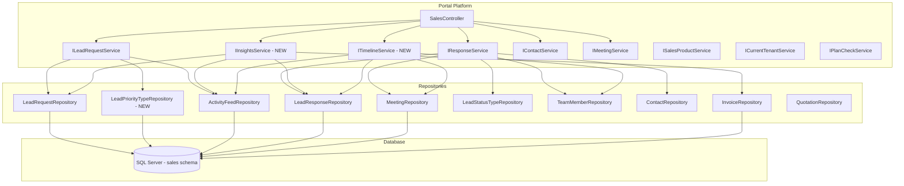
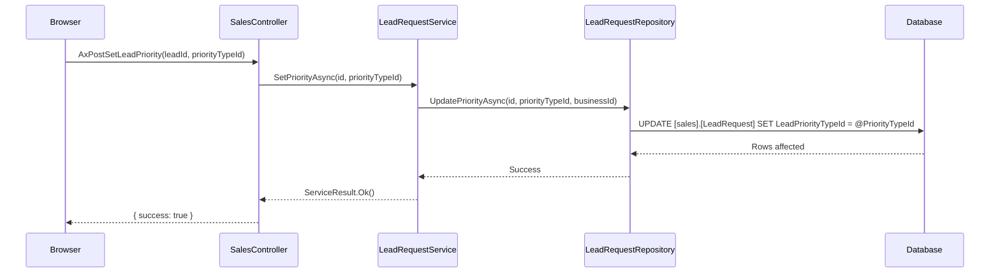
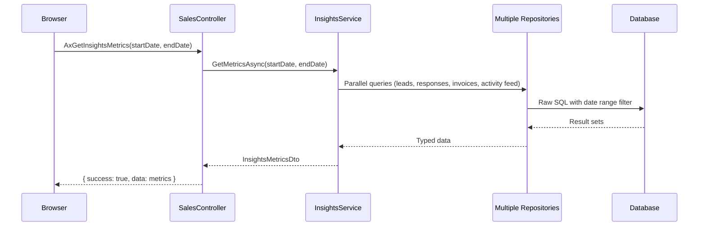
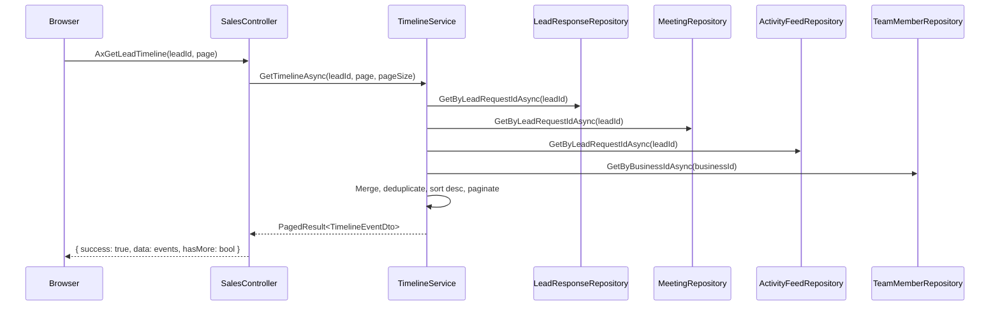

# Design Document — Sales Pipeline Enhancements (Phase 2)

## Overview

Phase 2 extends the existing Sales Pipeline module with four capabilities: lead priority indicators with days-since-last-activity tracking on pipeline cards, nine additional template placeholders for richer communication, an operational metrics dashboard (Insights page), and a unified timeline view on the Lead Detail page.

### Key Design Decisions

1. **Two new services** — `IInsightsService` for metrics computation and `ITimelineService` for event aggregation. These are independent of existing services and follow the same DI/repository pattern.
2. **Existing service extension** — `ILeadRequestService` gains priority management and days-since-last-activity computation. `IResponseService` gains extended placeholder resolution.
3. **No schema changes to existing tables beyond two columns** — Only `LeadPriorityTypeId` (nullable FK) and `ClosedAtUtc` (nullable datetime) are added to `[sales].[LeadRequest]`. One new lookup table `[sales].[LeadPriorityType]` is introduced.
4. **Double-brace placeholder format** — All placeholders use `{{TokenName}}` format per existing `ResponseService.RenderTemplate`.
5. **ActivityFeed as timeline source** — The existing `[sales].[ActivityFeed]` table is the source-of-truth for non-entity events. Responses and meetings are sourced exclusively from their entity tables to avoid duplication.
6. **Date range filtering** — All Insights metrics accept a start/end date pair. The controller passes these from the UI filter.

### Scope Boundaries

- **In scope:** Priority CRUD, ClosedAtUtc lifecycle, days-since-last-activity, extended placeholders, Insights page with 6 metric types, unified timeline.
- **Out of scope:** Automated priority assignment (AI/rules-based), email delivery tracking, scheduled reports, real-time dashboard updates via SignalR.

## Architecture

### Extended System Context



### Request Flows

#### Priority Assignment Flow



#### Insights Metrics Flow



#### Timeline Aggregation Flow



## Components and Interfaces

### New Controller Actions on SalesController

**Page Actions:**
| Action | Route | Description |
|--------|-------|-------------|
| Insights | /Sales/Insights | Operational Metrics dashboard page |

**New AJAX Endpoints:**
| Method | HTTP | Description |
|--------|------|-------------|
| AxPostSetLeadPriority | POST | Assign a priority type to a lead |
| AxPostClearLeadPriority | POST | Remove priority from a lead |
| AxGetInsightsMetrics | GET | Retrieve all computed metrics for a date range |
| AxGetLeadTimeline | GET | Get paginated timeline events for a lead |
| AxGetLeadPriorityTypes | GET | Get available priority types for dropdown |

### New Service: IInsightsService

```csharp
public interface IInsightsService
{
    Task<InsightsMetricsDto> GetMetricsAsync(DateTime startDate, DateTime endDate);
    Task<int> GetNewLeadsCountAsync(DateTime startDate, DateTime endDate);
    Task<decimal?> GetResponseSlaPercentageAsync(DateTime startDate, DateTime endDate);
    Task<ConversionRatesDto> GetConversionRatesAsync(DateTime startDate, DateTime endDate);
    Task<List<RevenueBreakdownDto>> GetRevenueByProductAsync(DateTime startDate, DateTime endDate);
    Task<List<RevenueBreakdownDto>> GetRevenueBySourceAsync(DateTime startDate, DateTime endDate);
    Task<double?> GetAverageSalesCycleDaysAsync(DateTime startDate, DateTime endDate);
}
```

### New Service: ITimelineService

```csharp
public interface ITimelineService
{
    Task<PagedResult<TimelineEventDto>> GetTimelineAsync(int leadRequestId, int page, int pageSize);
}
```

### Extended Service: ILeadRequestService

New methods added to existing interface:

```csharp
// Priority management
Task<ServiceResult> SetPriorityAsync(int leadRequestId, int leadPriorityTypeId);
Task<ServiceResult> ClearPriorityAsync(int leadRequestId);
Task<List<LeadPriorityTypeDto>> GetPriorityTypesAsync();
```

The existing `ChangeStageAsync` method is updated to handle `ClosedAtUtc` lifecycle:
- When transitioning TO a terminal stage (Won/Lost): set `ClosedAtUtc = DateTime.UtcNow` if currently null
- When transitioning FROM a terminal stage to non-terminal: set `ClosedAtUtc = null`

The existing `GetPipelineDataAsync` method is updated to include `LeadPriorityTypeId`, `PriorityName`, `PriorityColour`, and `DaysSinceLastActivity` in each `LeadCardDto`.

### Extended Service: IResponseService

The private `RenderTemplate` method is extended to handle 13 placeholders (4 existing + 9 new). A new `BuildExtendedPlaceholderValuesAsync` method resolves all placeholder values:

```csharp
// New internal method for building extended placeholder values
private async Task<TemplatePlaceholderValues> BuildExtendedPlaceholderValuesAsync(
    LeadRequest lead, int businessId);
```

### New Repository: LeadPriorityTypeRepository

```csharp
public class LeadPriorityTypeRepository : GenericStoredProcedureRepository<LeadPriorityType>
{
    public async Task<List<LeadPriorityType>> GetAllAsync();
}
```

### Extended Repository: LeadRequestRepository

New methods:

```csharp
public async Task UpdatePriorityAsync(int id, int? leadPriorityTypeId, int businessId);
public async Task SetClosedAtUtcAsync(int id, DateTime? closedAtUtc, int businessId);
public async Task<List<LeadActivityDateDto>> GetLastActivityDatesAsync(List<int> leadRequestIds, int businessId);
```

### Days Since Last Activity Computation

The `DaysSinceLastActivity` is computed per lead by finding the most recent timestamp across:

1. Latest `LeadResponse.SentAtUtc` for the lead
2. Latest `Meeting.ScheduledAtUtc` for meetings linked to the lead
3. Latest `ActivityFeedEntry.CreatedAtUtc` for the lead
4. `LeadRequest.CreatedAtUtc` as fallback when no other activity exists

**SQL approach** (single query per pipeline load, batch for all leads in view):

```sql
SELECT LeadRequest.Id,
    DATEDIFF(DAY,
        (SELECT MAX(MaxDate) FROM (VALUES
            ((SELECT MAX(LeadResponse.SentAtUtc)
              FROM [sales].[LeadResponse]
              WHERE LeadResponse.LeadRequestId = LeadRequest.Id)),
            ((SELECT MAX(Meeting.ScheduledAtUtc)
              FROM [sales].[Meeting]
              WHERE Meeting.LeadRequestId = LeadRequest.Id AND Meeting.IsCancelled = 0)),
            ((SELECT MAX(ActivityFeed.CreatedAtUtc)
              FROM [sales].[ActivityFeed]
              WHERE ActivityFeed.LeadRequestId = LeadRequest.Id)),
            (LeadRequest.CreatedAtUtc)
        ) AS AllDates(MaxDate) WHERE MaxDate IS NOT NULL),
        GETUTCDATE()
    ) AS DaysSinceLastActivity
FROM [sales].[LeadRequest]
WHERE LeadRequest.BusinessId = @BusinessId
    AND LeadRequest.IsActive = 1
    AND LeadRequest.IsCancelled = 0
```

### Template Placeholder Resolution

The `TemplatePlaceholderValues` class is extended with 9 new properties:

```csharp
public class TemplatePlaceholderValues
{
    // Existing
    public string ContactName { get; set; } = string.Empty;
    public string ProductName { get; set; } = string.Empty;
    public string BusinessName { get; set; } = string.Empty;
    public string ResponseTime { get; set; } = string.Empty;

    // New - Phase 2
    public string AssignedSalesperson { get; set; } = string.Empty;
    public string MeetingDate { get; set; } = string.Empty;
    public string MeetingLink { get; set; } = string.Empty;
    public string ProposalLink { get; set; } = string.Empty;
    public string Company { get; set; } = string.Empty;
    public string Phone { get; set; } = string.Empty;
    public string BusinessWebsite { get; set; } = string.Empty;
    public string NextStage { get; set; } = string.Empty;
    public string SupportEmail { get; set; } = string.Empty;
}
```

**Placeholder value resolution logic:**

| Placeholder | Source | Fallback |
|-------------|--------|----------|
| `{{AssignedSalesperson}}` | `TeamMember.FirstName + " " + TeamMember.LastName` (via `LeadRequest.TeamMemberId`) | Empty string if no team member assigned |
| `{{MeetingDate}}` | Most recent upcoming `Meeting.ScheduledAtUtc` (where `ScheduledAtUtc > UtcNow` and linked to lead), formatted `"dd MMM yyyy HH:mm"` | Empty string if no upcoming meeting |
| `{{MeetingLink}}` | `Meeting.Location` of the same upcoming meeting, only if Location contains `"http"` | Empty string if unavailable or not a URL |
| `{{ProposalLink}}` | `Quotation.SharedUrl` from most recent quotation linked to lead (via `Quotation.LeadRequestId`) | Empty string if no linked quotation |
| `{{Company}}` | `SalesContact.CompanyName` via `LeadRequest.ContactId` | Empty string if null |
| `{{Phone}}` | `SalesContact.PhoneNumber` via `LeadRequest.ContactId` | Empty string if null |
| `{{BusinessWebsite}}` | `Business.Website` for the authenticated business | Empty string if no website configured |
| `{{NextStage}}` | Next `LeadStatusType.Name` by `DisplayOrder` after current `LeadStatusTypeId`; "Completed" if current is terminal | "Completed" for terminal stages |
| `{{SupportEmail}}` | `Business.SupportEmail` for the authenticated business | Empty string if not configured |

**Extended RenderTemplate method:**

```csharp
private static string RenderTemplate(string bodyTemplate, TemplatePlaceholderValues values)
{
    return bodyTemplate
        .Replace("{{ContactName}}", values.ContactName)
        .Replace("{{ProductName}}", values.ProductName)
        .Replace("{{BusinessName}}", values.BusinessName)
        .Replace("{{ResponseTime}}", values.ResponseTime)
        .Replace("{{AssignedSalesperson}}", values.AssignedSalesperson)
        .Replace("{{MeetingDate}}", values.MeetingDate)
        .Replace("{{MeetingLink}}", values.MeetingLink)
        .Replace("{{ProposalLink}}", values.ProposalLink)
        .Replace("{{Company}}", values.Company)
        .Replace("{{Phone}}", values.Phone)
        .Replace("{{BusinessWebsite}}", values.BusinessWebsite)
        .Replace("{{NextStage}}", values.NextStage)
        .Replace("{{SupportEmail}}", values.SupportEmail);
}
```

### Insights Service Computation Logic

All metrics are scoped to the authenticated `BusinessId` via `ICurrentTenantService`.

**New Leads Count:**
```sql
SELECT COUNT(*)
FROM [sales].[LeadRequest]
WHERE LeadRequest.BusinessId = @BusinessId
    AND LeadRequest.CreatedAtUtc >= @StartDate
    AND LeadRequest.CreatedAtUtc < @EndDate
    AND LeadRequest.IsActive = 1
```

**Response SLA:**
1. For each lead created within the date range that has at least one response:
   - Compute elapsed hours: `DATEDIFF(HOUR, LeadRequest.CreatedAtUtc, MIN(LeadResponse.SentAtUtc))`
   - Compare against `LeadResponseTemplate.ResponseTimeInHours` (matched by ProductId), or 24 hours as default
2. SLA % = (leads within threshold) / (leads with at least one response) × 100
3. Return `null` if denominator is zero

**Demo Conversion Rate:**
- Numerator: Leads with an ActivityFeed entry where `Action = 'stage_changed'` and `Description` indicates transition to "Meeting Scheduled", with `CreatedAtUtc` within date range
- Denominator: Leads that were at "New" or "Contacted" stage at any point during the date range
- Return `null` if denominator is zero

**Proposal Conversion Rate:**
- Numerator: Leads with ActivityFeed `Action = 'stage_changed'` to "Proposal Sent" within date range
- Denominator: All leads at any non-terminal stage during date range
- Return `null` if denominator is zero

**Win Rate:**
- Numerator: Leads where `ClosedAtUtc` within date range AND terminal stage = Won
- Denominator: Leads where `ClosedAtUtc` within date range AND terminal stage in (Won, Lost) — excludes Inactive
- Return `null` if denominator is zero

**Revenue by Product:**
```sql
SELECT ISNULL(SalesProduct.Name, 'General Enquiry') AS ProductName,
    SUM(Invoice.TotalAmount) AS TotalRevenue
FROM [dbo].[Invoice]
INNER JOIN [sales].[LeadRequest] ON Invoice.LeadRequestId = LeadRequest.Id
LEFT JOIN [sales].[Product] AS SalesProduct ON LeadRequest.ProductId = SalesProduct.Id
WHERE LeadRequest.BusinessId = @BusinessId
    AND LeadRequest.ClosedAtUtc >= @StartDate
    AND LeadRequest.ClosedAtUtc < @EndDate
    AND LeadRequest.LeadStatusTypeId = @WonStatusTypeId
GROUP BY ISNULL(SalesProduct.Name, 'General Enquiry')
ORDER BY SUM(Invoice.TotalAmount) DESC
```

**Revenue by Source:**
Same pattern as Revenue by Product but grouped by `LeadSourceType.Name`.

**Average Sales Cycle Duration:**
```sql
SELECT AVG(CAST(DATEDIFF(DAY, LeadRequest.CreatedAtUtc, LeadRequest.ClosedAtUtc) AS FLOAT))
FROM [sales].[LeadRequest]
WHERE LeadRequest.BusinessId = @BusinessId
    AND LeadRequest.ClosedAtUtc >= @StartDate
    AND LeadRequest.ClosedAtUtc < @EndDate
    AND LeadRequest.LeadStatusTypeId IN (@WonStatusTypeId, @LostStatusTypeId)
    AND LeadRequest.IsActive = 1
```

### Timeline Service Aggregation Logic

The timeline merges events from two source categories:

**Direct Entity Sources (responses & meetings only):**
- `LeadResponse` → EventType "response", Timestamp = SentAtUtc, Title = "Email response sent", Description = ResponseText (truncated to 200 chars), Colour = "#129867"
- `Meeting` → EventType "meeting", Timestamp = ScheduledAtUtc, Title = Subject, Description = Outcome, Colour = "#C8912E"

**ActivityFeed Sources (all other event types):**
| Action | EventType | Title Pattern | Colour |
|--------|-----------|---------------|--------|
| `stage_changed` | "stage_change" | "Stage changed to {stage}" (from Metadata JSON) | #0D5EA6 |
| `assigned` / `unassigned` | "assignment" | "Assigned to {name}" / "Unassigned" | #0D5EA6 |
| `proposal_linked` | "proposal_linked" | "Proposal linked" | #57B8E8 |
| `invoice_linked` | "invoice_linked" | "Invoice linked" | #57B8E8 |
| `marked_as_won` | "conversion" | "Marked as Won — Customer converted" | #129867 |
| `task_created` | "task" | "Follow-up task created" | #8a9bab |

**Lead Creation Event (synthetic):**
- EventType "creation", Timestamp = `LeadRequest.CreatedAtUtc`, Title = "Lead created", Description = null, ActorName = "System", Colour = "#8a9bab"

**Actor Resolution:**
- ActivityFeed entries: resolve `PerformedByTeamMemberId` → `TeamMember.FirstName + " " + TeamMember.LastName`; if null, fall back to "System"
- LeadResponse: resolve `RespondedByUserId` → team member lookup via `TeamMember.UserId`; if null, "System"
- Meeting: resolve `CreatedByUserId` → team member lookup via `TeamMember.UserId`; if null, "System"

**Deduplication Rule:**
- Responses and meetings are ONLY sourced from entity tables (`[sales].[LeadResponse]`, `[sales].[Meeting]`)
- All other events are ONLY sourced from `[sales].[ActivityFeed]`
- This architectural split ensures zero duplication

**Pagination:**
- Page size: 20 events per page
- Ordered by Timestamp descending (most recent first)
- Returns `hasMore` flag for "Load More" button

## Data Models

### New Table: [sales].[LeadPriorityType]

```sql
CREATE TABLE [sales].[LeadPriorityType] (
    Id INT IDENTITY(1,1) PRIMARY KEY,
    Name NVARCHAR(50) NOT NULL,
    DisplayOrder INT NOT NULL,
    Colour NVARCHAR(10) NOT NULL,
    CreatedAtUtc DATETIME NOT NULL DEFAULT GETUTCDATE()
);
```

**Seed Data:**
| Id | Name | DisplayOrder | Colour |
|----|------|--------------|--------|
| 1 | Hot | 1 | #E53E3E |
| 2 | Warm | 2 | #DD6B20 |
| 3 | Cold | 3 | #3182CE |

### Altered Table: [sales].[LeadRequest]

Two new columns:

```sql
ALTER TABLE [sales].[LeadRequest]
    ADD LeadPriorityTypeId INT NULL
        CONSTRAINT FK_LeadRequest_LeadPriorityType
        FOREIGN KEY REFERENCES [sales].[LeadPriorityType](Id);

ALTER TABLE [sales].[LeadRequest]
    ADD ClosedAtUtc DATETIME NULL;
```

### New Entity: LeadPriorityType

```csharp
namespace Portal.Infrastructure.Entities.Sales;

public class LeadPriorityType
{
    public int Id { get; set; }
    public string Name { get; set; } = null!;
    public int DisplayOrder { get; set; }
    public string Colour { get; set; } = null!;
    public DateTime CreatedAtUtc { get; set; }
}
```

### Extended Entity: LeadRequest

Two new properties added:

```csharp
// In existing LeadRequest class
public int? LeadPriorityTypeId { get; set; }
public DateTime? ClosedAtUtc { get; set; }

// New navigation property
public LeadPriorityType? LeadPriorityType { get; set; }
```

### New DTOs

```csharp
/// <summary>
/// Priority type for dropdown display.
/// </summary>
public class LeadPriorityTypeDto
{
    public int Id { get; set; }
    public string Name { get; set; } = null!;
    public string Colour { get; set; } = null!;
}

/// <summary>
/// All computed metrics for the Insights page.
/// </summary>
public class InsightsMetricsDto
{
    public int NewLeadsCount { get; set; }
    public decimal? ResponseSlaPercentage { get; set; }
    public decimal? DemoConversionRate { get; set; }
    public decimal? ProposalConversionRate { get; set; }
    public decimal? WinRate { get; set; }
    public List<RevenueBreakdownDto> RevenueByProduct { get; set; } = new();
    public List<RevenueBreakdownDto> RevenueBySource { get; set; } = new();
    public double? AverageSalesCycleDays { get; set; }
}

/// <summary>
/// Revenue breakdown row for product or source grouping.
/// </summary>
public class RevenueBreakdownDto
{
    public string Name { get; set; } = null!;
    public decimal TotalRevenue { get; set; }
    public decimal Percentage { get; set; }
}

/// <summary>
/// Conversion rates grouped together.
/// </summary>
public class ConversionRatesDto
{
    public decimal? DemoConversionRate { get; set; }
    public decimal? ProposalConversionRate { get; set; }
    public decimal? WinRate { get; set; }
}

/// <summary>
/// A single timeline event for the unified timeline view.
/// </summary>
public class TimelineEventDto
{
    public string EventType { get; set; } = null!;
    public DateTime Timestamp { get; set; }
    public string Title { get; set; } = null!;
    public string? Description { get; set; }
    public string ActorName { get; set; } = "System";
    public string Colour { get; set; } = null!;
}
```

### Extended DTOs

**LeadCardDto** — three new fields:

```csharp
// Added to existing LeadCardDto
public int? LeadPriorityTypeId { get; set; }
public string? PriorityName { get; set; }
public string? PriorityColour { get; set; }
public int DaysSinceLastActivity { get; set; }
```

**LeadRequestDetailDto** — new fields for priority display on detail page:

```csharp
// Added to existing LeadRequestDetailDto
public int? LeadPriorityTypeId { get; set; }
public string? PriorityName { get; set; }
public string? PriorityColour { get; set; }
```

### Database Migrations (Phase 2)

| # | Migration | Description |
|---|-----------|-------------|
| 140 | CreateLeadPriorityTypeTable | `[sales].[LeadPriorityType]` + seed Hot/Warm/Cold |
| 141 | AddLeadPriorityTypeIdToLeadRequest | Nullable FK column on `[sales].[LeadRequest]` |
| 142 | AddClosedAtUtcToLeadRequest | Nullable datetime column on `[sales].[LeadRequest]` |

## Correctness Properties

*A property is a characteristic or behavior that should hold true across all valid executions of a system — essentially, a formal statement about what the system should do. Properties serve as the bridge between human-readable specifications and machine-verifiable correctness guarantees.*

### Property 1: Priority Assignment Round-Trip

*For any* lead and any valid priority type (Hot, Warm, Cold), setting the priority and then clearing it SHALL result in `LeadPriorityTypeId = null`. Conversely, setting any priority SHALL result in `LeadPriorityTypeId` equal to the specified value. A newly created lead (without priority specified) SHALL always have `LeadPriorityTypeId = null`.

**Validates: Requirements 1.5, 1.6, 1.7**

### Property 2: ClosedAtUtc Lifecycle

*For any* lead with a null `ClosedAtUtc`, transitioning to a terminal stage (Won or Lost) SHALL set `ClosedAtUtc` to a value within 2 seconds of the current UTC time. *For any* lead with a non-null `ClosedAtUtc` in a terminal stage, transitioning to any non-terminal stage SHALL set `ClosedAtUtc` to null.

**Validates: Requirements 1.8, 1.9**

### Property 3: Days Since Last Activity Computation

*For any* lead with any combination of responses, meetings, and activity feed entries, the computed `DaysSinceLastActivity` SHALL equal the number of calendar days between the current UTC date and the maximum timestamp among: the latest `LeadResponse.SentAtUtc`, the latest non-cancelled `Meeting.ScheduledAtUtc`, the latest `ActivityFeedEntry.CreatedAtUtc`, and `LeadRequest.CreatedAtUtc` as a floor.

**Validates: Requirements 3.1, 3.2, 2.3**

### Property 4: Days Since Activity Display Formatting

*For any* non-negative integer N representing days since last activity: if N = 0, the display text SHALL be "Today"; if N > 0, the display text SHALL be "{N}d ago".

**Validates: Requirements 3.3, 3.4**

### Property 5: Template Rendering Leaves No Raw Tokens

*For any* template body string containing any subset of the 13 supported placeholders (`{{ContactName}}`, `{{ProductName}}`, `{{BusinessName}}`, `{{ResponseTime}}`, `{{AssignedSalesperson}}`, `{{MeetingDate}}`, `{{MeetingLink}}`, `{{ProposalLink}}`, `{{Company}}`, `{{Phone}}`, `{{BusinessWebsite}}`, `{{NextStage}}`, `{{SupportEmail}}`), and any `TemplatePlaceholderValues` instance (including all-empty-string values), the rendered output SHALL contain zero occurrences of any `{{...}}` placeholder token.

**Validates: Requirements 4.1, 4.11**

### Property 6: Template Placeholder Value Resolution

*For any* lead with an assigned team member, the rendered `{{AssignedSalesperson}}` SHALL equal that team member's display name. *For any* lead with an upcoming meeting, `{{MeetingDate}}` SHALL equal the meeting's `ScheduledAtUtc` formatted as "dd MMM yyyy HH:mm". *For any* lead whose contact has a non-null `CompanyName`, `{{Company}}` SHALL equal that `CompanyName`. *For any* lead at a non-terminal stage, `{{NextStage}}` SHALL equal the name of the next stage by `DisplayOrder`. For terminal stages, `{{NextStage}}` SHALL equal "Completed". When any source value is null, the corresponding placeholder SHALL resolve to empty string.

**Validates: Requirements 4.2, 4.3, 4.4, 4.5, 4.6, 4.7, 4.8, 4.9, 4.10**

### Property 7: New Leads Count Correctness

*For any* set of leads and any date range [startDate, endDate), the new leads count SHALL equal the number of active leads (IsActive = 1) with `CreatedAtUtc >= startDate AND CreatedAtUtc < endDate` belonging to the authenticated business.

**Validates: Requirements 5.1**

### Property 8: Response SLA Computation Correctness

*For any* set of leads created within a date range that have at least one response, the SLA percentage SHALL equal: (count of leads where hours between `CreatedAtUtc` and earliest `LeadResponse.SentAtUtc` is within the configured `ResponseTimeInHours`) divided by (count of leads with at least one response) × 100. If no leads have responses, the result SHALL be null.

**Validates: Requirements 6.1, 6.3**

### Property 9: Win Rate Computation Correctness

*For any* set of leads whose `ClosedAtUtc` falls within the date range, the Win Rate SHALL equal: (count where terminal stage = Won) / (count where terminal stage = Won OR Lost) × 100. Leads marked Inactive SHALL be excluded. If the denominator is zero, the result SHALL be null.

**Validates: Requirements 7.3, 7.5**

### Property 10: Revenue Grouping Correctness

*For any* set of won leads with linked invoices whose `ClosedAtUtc` falls within the date range, Revenue by Product SHALL equal the sum of `Invoice.TotalAmount` grouped by `SalesProduct.Name` (or "General Enquiry" for null ProductId). The percentage for each group SHALL equal its total divided by the grand total × 100. Leads without linked invoices SHALL be excluded.

**Validates: Requirements 8.1, 8.2, 8.5, 8.6**

### Property 11: Average Sales Cycle Duration Correctness

*For any* set of leads whose `ClosedAtUtc` falls within the date range and whose terminal stage is Won or Lost (not Inactive), the average sales cycle SHALL equal the mean of `(ClosedAtUtc - CreatedAtUtc).TotalDays` across all qualifying leads. If no qualifying leads exist, the result SHALL be null.

**Validates: Requirements 9.1, 9.3, 9.4**

### Property 12: Timeline Aggregation Correctness

*For any* lead, the unified timeline SHALL contain: exactly one event per `LeadResponse` (sourced from entity table), exactly one event per non-cancelled `Meeting` (sourced from entity table), exactly one event per `ActivityFeedEntry` with actions excluding response/meeting duplicates, and exactly one "creation" event. Each event SHALL have a non-null EventType, Timestamp, Title, ActorName, and Colour matching its type-specific colour code. All events SHALL belong to the authenticated business's leads only.

**Validates: Requirements 11.1, 11.3, 11.4, 12.6**

### Property 13: Timeline Ordering Invariant

*For any* timeline query result, events SHALL be ordered strictly by Timestamp descending. For any two adjacent events in the list, `events[i].Timestamp >= events[i+1].Timestamp`.

**Validates: Requirements 11.2**

### Property 14: Timeline Pagination Bounds

*For any* timeline with N total events and a page size of 20, page P (1-indexed) SHALL return events at indices `[(P-1)*20, min(P*20, N))`. The `hasMore` flag SHALL be true if and only if `P * 20 < N`.

**Validates: Requirements 12.3**

## Error Handling

### New Error Scenarios

| Error Scenario | Service | Response |
|---------------|---------|----------|
| Invalid LeadPriorityTypeId (not 1, 2, or 3) | ILeadRequestService | `ServiceResult.Fail("Invalid priority type.")` |
| Lead not found (wrong business or inactive) | ILeadRequestService, ITimelineService | `ServiceResult.Fail("Lead not found.")` |
| Invalid date range (startDate > endDate) | IInsightsService | `ServiceResult.Fail("Start date must be before end date.")` |
| Timeline page out of range | ITimelineService | Returns empty list with `hasMore = false` |

### Repository Layer

All new and extended repositories follow the established pattern:

```csharp
try
{
    // SQL execution
}
catch (Exception ex)
{
    throw;
}
```

### Controller Layer

All new AJAX endpoints follow the established pattern:

```csharp
[HttpPost]
public async Task<IActionResult> AxPostSetLeadPriority(int leadRequestId, int leadPriorityTypeId)
{
    try
    {
        var result = await _leadRequestService.SetPriorityAsync(leadRequestId, leadPriorityTypeId);
        return Json(new { success = result.Success, message = result.Message });
    }
    catch (Exception ex)
    {
        return Json(new { success = false, message = "Something went wrong. Please try again." });
    }
}
```

### Subscription Gating

The Insights page and all new AJAX endpoints check `IPlanCheckService.IsModuleInPlanAsync("sales")` before executing. If the module is not in the plan, the Insights page redirects to an upgrade prompt and AJAX endpoints return `{ success: false, message: "Module not available in your plan." }`.

## Testing Strategy

### Unit Tests (Example-Based)

Unit tests cover:
- **Priority type validation** — reject invalid IDs, accept valid IDs 1-3
- **ClosedAtUtc edge cases** — already-set ClosedAtUtc on terminal transition (should not overwrite), null on creation
- **SLA null case** — no responses in period returns null
- **Win Rate null case** — no terminal leads returns null
- **Timeline colour mapping** — each event type maps to correct hex colour
- **Placeholder resolution edge cases** — meeting in the past not used for MeetingDate, Location without URL not used for MeetingLink
- **Days-since boundary** — "Today" at 0, normal formatting at 1+
- **Revenue exclusion** — leads without invoices excluded, null ProductId grouped as "General Enquiry"

### Property-Based Tests (FsCheck with xUnit)

The project uses **FsCheck.Xunit** for property-based testing (already present in `build_check` dependencies).

Each property test runs a minimum of 100 iterations with randomly generated inputs.

**Tag format:** `Feature: sales-pipeline-enhancements, Property {N}: {title}`

| Property | Test Focus | Generator |
|----------|-----------|-----------|
| 1 | Priority round-trip | Random priority IDs (1-3), random lead IDs |
| 2 | ClosedAtUtc lifecycle | Random leads at various stages, random target stages |
| 3 | Days since last activity | Random activity timestamps across sources |
| 4 | Display formatting | Random non-negative integers |
| 5 | No raw tokens | Random template bodies with random placeholder combinations |
| 6 | Placeholder value resolution | Random leads with random entity data |
| 7 | New leads count | Random lead sets with random date ranges |
| 8 | Response SLA | Random response times vs random thresholds |
| 9 | Win Rate | Random terminal leads with Won/Lost distribution |
| 10 | Revenue grouping | Random invoices, products, sources |
| 11 | Sales cycle average | Random CreatedAtUtc/ClosedAtUtc pairs |
| 12 | Timeline aggregation | Random event combinations from all sources |
| 13 | Timeline ordering | Random timestamp sets |
| 14 | Timeline pagination | Random total counts and page numbers |

### Integration Tests

- Insights page route returns 200 for authenticated users with sales module access
- Priority dropdown on Lead Detail page lists all 3 priority types
- Timeline endpoint returns valid JSON array
- Date range filter defaults to current month on Insights page
- Sidebar navigation includes "Insights" link in correct position
