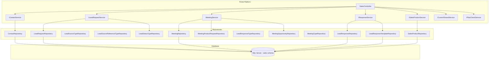
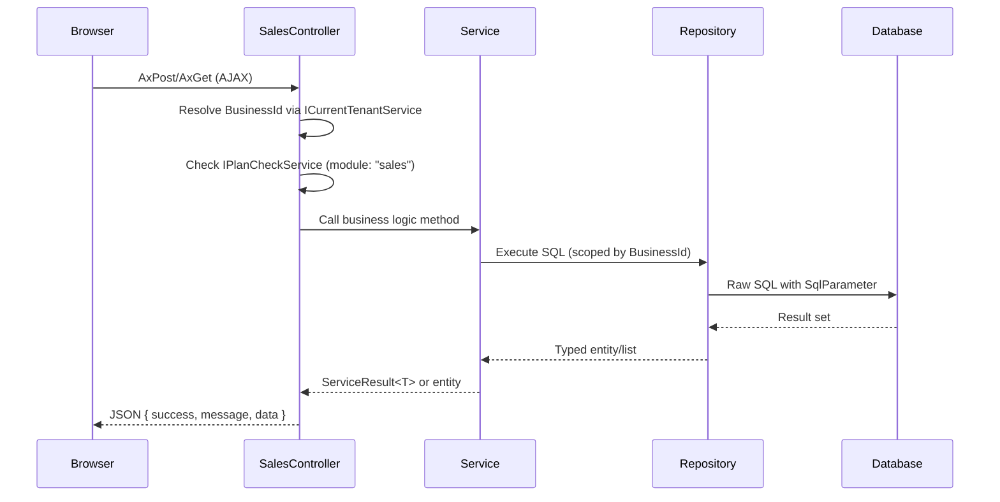
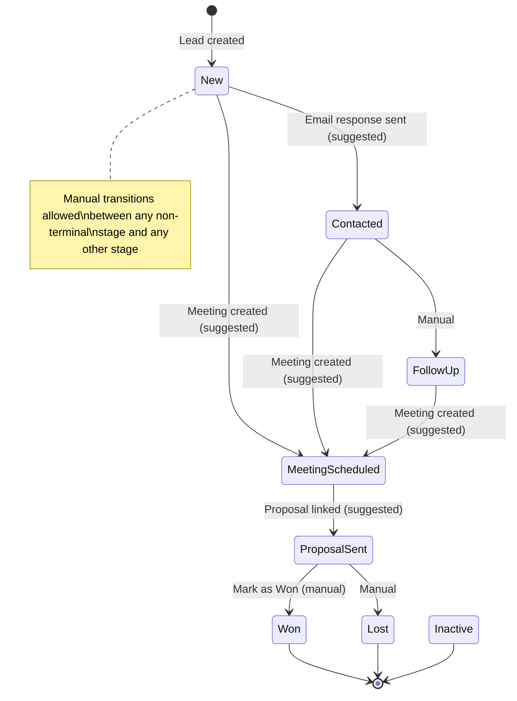

# Design Document — Sales Pipeline (Phase 1)

## Overview

The Sales Pipeline module introduces a native CRM pipeline to the Portal platform under the `[sales]` schema. It provides a complete lead-to-customer lifecycle: Contact management, lead tracking through pipeline stages, meeting scheduling with ICS downloads, suggested response emails from templates, and proposal/invoice linking — all scoped to the multi-tenant architecture via BusinessId.

### Key Design Decisions

1. **Single Controller** — All sales module views and AJAX endpoints are served from `SalesController`, keeping the routing surface cohesive and matching the sidebar module pattern.
2. **5 Services** — Business logic is split into `IContactService`, `ILeadRequestService`, `IMeetingService`, `IResponseService`, and `ISalesProductService` — each owning a clear domain boundary.
3. **13 Repositories** — One per entity/table, following the existing `GenericStoredProcedureRepository<T>` pattern with raw SQL and `SqlParameter` for all data access.
4. **Event-driven stage suggestions** — When key events occur (response sent, meeting created, proposal linked), the system suggests a stage transition. Manual transitions are always allowed and override suggestions.
5. **ICS in-process generation** — RFC 5545 compliant `.ics` files generated via string building (no external calendar library), returned as `text/calendar` content type.
6. **Template rendering via string.Replace** — Simple placeholder replacement (`{ContactFirstName}`, `{ProductName}`, `{BusinessName}`, `{MeetingBookingLink}`) with empty string fallback for unavailable values.

### Scope Boundaries

- **In scope (Phase 1):** Manual pipeline operations, suggested responses, ICS download, Contact→Customer conversion, proposal/invoice linking.
- **Out of scope (Phase 2+):** Lead ingestion API, automated responses, follow-up schedules, notifications, email delivery tracking.

## Architecture

### System Context



### Request Flow



## Components and Interfaces

### Controller: SalesController

Located at `Portal.Web/Controllers/SalesController.cs`. Responsible for all page actions and AJAX endpoints.

**Page Actions (return views):**
| Action | Route | Description |
|--------|-------|-------------|
| Pipeline | /Sales/Pipeline | Kanban board + table toggle |
| Contacts | /Sales/Contacts | Paginated contact list |
| Products | /Sales/Products | Paginated product catalogue |
| Meetings | /Sales/Meetings | Meetings list (standalone, not per-lead) |
| Templates | /Sales/Templates | Response template management |
| LeadDetail | /Sales/LeadDetail/{id} | Comprehensive lead view |
| ContactDetail | /Sales/ContactDetail/{id} | Contact interest history |

**AJAX Endpoints (AxPost/AxGet):**
| Method | Description |
|--------|-------------|
| AxPostCreateContact | Create contact with dedup check |
| AxPostUpdateContact | Update contact details |
| AxPostDeactivateContact | Soft-delete contact |
| AxPostCreateProduct | Create sales product |
| AxPostUpdateProduct | Update product |
| AxPostDeactivateProduct | Soft-delete product |
| AxPostCreateLeadRequest | Create new lead |
| AxPostChangeLeadStage | Manual pipeline stage transition |
| AxPostAssignLead | Assign lead to user |
| AxPostUnassignLead | Remove assignment |
| AxPostCancelLead | Cancel lead with description |
| AxPostDeactivateLead | Soft-delete lead |
| AxPostMarkAsWon | Mark lead as Won + Contact→Customer conversion |
| AxPostCreateMeeting | Schedule meeting |
| AxPostUpdateMeeting | Update meeting + record outcome |
| AxPostCancelMeeting | Cancel meeting |
| AxGetDownloadIcs | Generate and download .ics file |
| AxPostCreateMeetingProductRequest | Add product request to meeting |
| AxPostCreateMeetingOpportunity | Add opportunity to meeting |
| AxGetPrepareResponse | Load suggested response from template |
| AxPostSendResponse | Confirm and record response |
| AxPostCreateTemplate | Create response template |
| AxPostUpdateTemplate | Update template |
| AxPostDeactivateTemplate | Soft-delete template |
| AxGetPipelineData | Get leads grouped by stage (for Kanban) |
| AxGetContactsSearch | Search contacts (paginated) |
| AxGetLeadDetail | Get lead detail data |

### Service Interfaces

#### IContactService

```csharp
public interface IContactService
{
    Task<ServiceResult<int>> CreateContactAsync(CreateContactRequest request, int businessId);
    Task<ServiceResult> UpdateContactAsync(UpdateContactRequest request, int businessId);
    Task<ServiceResult> DeactivateContactAsync(int contactId, int businessId);
    Task<Contact?> GetByIdAsync(int contactId, int businessId);
    Task<PagedResult<ContactListDto>> GetContactsPagedAsync(string? searchTerm, int page, int pageSize, int businessId);
    Task<List<LeadRequest>> GetContactInterestHistoryAsync(int contactId, int businessId);
    Task<ServiceResult<int>> ConvertToCustomerAsync(int contactId, int businessId);
}
```

#### ILeadRequestService

```csharp
public interface ILeadRequestService
{
    Task<ServiceResult<int>> CreateLeadRequestAsync(CreateLeadRequest request, int businessId);
    Task<ServiceResult> ChangeStageAsync(int leadRequestId, int newStatusTypeId, int businessId);
    Task<ServiceResult> AssignLeadAsync(int leadRequestId, string? userId, int businessId);
    Task<ServiceResult> CancelLeadAsync(int leadRequestId, string cancellationDescription, int businessId);
    Task<ServiceResult> DeactivateLeadAsync(int leadRequestId, int businessId);
    Task<ServiceResult> MarkAsWonAsync(int leadRequestId, int businessId);
    Task<ServiceResult> SuggestStageTransitionAsync(int leadRequestId, int suggestedStatusTypeId, int businessId);
    Task<ServiceResult> LinkProposalAsync(int leadRequestId, int quotationId, int businessId);
    Task<ServiceResult> LinkInvoiceAsync(int leadRequestId, int invoiceId, int businessId);
    Task<LeadRequestDetailDto?> GetLeadDetailAsync(int leadRequestId, int businessId);
    Task<Dictionary<int, List<LeadCardDto>>> GetPipelineDataAsync(int businessId, string? assignedToUserId, int? productId);
    Task<PagedResult<LeadTableRowDto>> GetLeadsPagedAsync(LeadFilterDto filter, int page, int pageSize, int businessId);
}
```

#### IMeetingService

```csharp
public interface IMeetingService
{
    Task<ServiceResult<int>> CreateMeetingAsync(CreateMeetingRequest request, int businessId, string createdByUserId);
    Task<ServiceResult> UpdateMeetingAsync(UpdateMeetingRequest request, int businessId);
    Task<ServiceResult> CancelMeetingAsync(int meetingId, string cancellationDescription, int businessId);
    Task<Meeting?> GetByIdAsync(int meetingId, int businessId);
    Task<List<MeetingListDto>> GetMeetingsForLeadAsync(int leadRequestId, int businessId);
    Task<byte[]> GenerateIcsFileAsync(int meetingId, int businessId);
    Task<ServiceResult<int>> CreateProductRequestAsync(CreateMeetingProductRequest request, int businessId);
    Task<ServiceResult<int>> CreateOpportunityAsync(CreateMeetingOpportunity request, int businessId);
    Task<List<MeetingProductRequest>> GetProductRequestsForMeetingAsync(int meetingId, int businessId);
    Task<List<MeetingOpportunity>> GetOpportunitiesForMeetingAsync(int meetingId, int businessId);
}
```

#### IResponseService

```csharp
public interface IResponseService
{
    Task<PreparedResponseDto> PrepareResponseAsync(int leadRequestId, int businessId);
    Task<ServiceResult<int>> SendResponseAsync(SendResponseRequest request, int businessId, string respondedByUserId);
    Task<ServiceResult<int>> CreateTemplateAsync(CreateTemplateRequest request, int businessId);
    Task<ServiceResult> UpdateTemplateAsync(UpdateTemplateRequest request, int businessId);
    Task<ServiceResult> DeactivateTemplateAsync(int templateId, int businessId);
    Task<PagedResult<TemplateListDto>> GetTemplatesPagedAsync(int page, int pageSize, int businessId);
    Task<LeadResponseTemplate?> GetTemplateByIdAsync(int templateId, int businessId);
    Task<List<LeadResponse>> GetResponsesForLeadAsync(int leadRequestId, int businessId);
    string RenderTemplate(string bodyTemplate, TemplatePlaceholderValues values);
}
```

#### ISalesProductService

```csharp
public interface ISalesProductService
{
    Task<ServiceResult<int>> CreateProductAsync(CreateSalesProductRequest request, int businessId);
    Task<ServiceResult> UpdateProductAsync(UpdateSalesProductRequest request, int businessId);
    Task<ServiceResult> DeactivateProductAsync(int productId, int businessId);
    Task<Product?> GetByIdAsync(int productId, int businessId);
    Task<PagedResult<Product>> GetProductsPagedAsync(string? searchTerm, int page, int pageSize, int businessId);
    Task<List<Product>> GetActiveProductsAsync(int businessId);
}
```

### Repositories (13 total)

Each follows the `GenericStoredProcedureRepository<T>` base pattern with raw SQL, `SqlParameter`, and `try/catch (Exception ex) { throw; }`.

| Repository | Entity | Key Operations |
|------------|--------|----------------|
| ContactRepository | Contact | Insert, Update, Deactivate, GetPaged (with search), GetById, CheckDuplicate |
| LeadRequestRepository | LeadRequest | Insert, UpdateStage, UpdateAssignment, Cancel, Deactivate, GetPaged, GetById, GetGroupedByStage |
| LeadSourceTypeRepository | LeadSourceType | GetAll |
| LeadSourceReferenceTypeRepository | LeadSourceReferenceType | GetAll |
| LeadStatusTypeRepository | LeadStatusType | GetAll (ordered by DisplayOrder) |
| LeadResponseRepository | LeadResponse | Insert, GetByLeadRequestId |
| LeadResponseTemplateRepository | LeadResponseTemplate | Insert, Update, Deactivate, GetPaged, GetById, FindMatchingTemplate |
| LeadResponseTypeRepository | LeadResponseType | GetAll |
| MeetingRepository | Meeting | Insert, Update, Cancel, GetById, GetByLeadRequestId |
| MeetingTypeRepository | MeetingType | GetAll |
| MeetingProductRequestRepository | MeetingProductRequest | Insert, GetByMeetingId |
| MeetingOpportunityRepository | MeetingOpportunity | Insert, GetByMeetingId |
| SalesProductRepository | Product | Insert, Update, Deactivate, GetPaged, GetById, GetAllActive |

### Pipeline Stage Transition Logic



**Event-driven suggestions (conditional):**
| Event | Condition | Suggested Transition |
|-------|-----------|---------------------|
| Email response sent | Current status = New (1) | → Contacted (2) |
| Meeting created (linked to lead) | Current status = New (1), Contacted (2), or Follow-Up (3) | → Meeting Scheduled (4) |
| Proposal linked to lead | Current status = New (1), Contacted (2), Follow-Up (3), or Meeting Scheduled (4) | → Proposal Sent (5) |

**Manual transitions:** Always allowed between any stage (including reopening from terminal stages).

### ICS File Generation

The `IMeetingService.GenerateIcsFileAsync` method produces an RFC 5545 compliant iCalendar file using in-process string building (no external library).

**ICS Structure:**
```
BEGIN:VCALENDAR
VERSION:2.0
PRODID:-//Portal//Sales Meeting//EN
BEGIN:VEVENT
UID:{meeting-id}@portal.local
DTSTART:{ScheduledAtUtc in yyyyMMddTHHmmssZ format}
DTEND:{ScheduledAtUtc + DurationMinutes in yyyyMMddTHHmmssZ format}
SUMMARY:{Subject}
LOCATION:{Location or empty}
DESCRIPTION:{Notes or empty}
END:VEVENT
END:VCALENDAR
```

**Response headers:**
- Content-Type: `text/calendar; charset=utf-8`
- Content-Disposition: `attachment; filename="meeting-{Id}.ics"`

### Template Rendering

The `IResponseService.RenderTemplate` method performs simple placeholder replacement:

```csharp
public string RenderTemplate(string bodyTemplate, TemplatePlaceholderValues values)
{
    return bodyTemplate
        .Replace("{ContactFirstName}", values.ContactFirstName ?? "")
        .Replace("{ProductName}", values.ProductName ?? "")
        .Replace("{BusinessName}", values.BusinessName ?? "")
        .Replace("{MeetingBookingLink}", values.MeetingBookingLink ?? "");
}
```

**Rules:**
- If a placeholder value is null or unavailable, replace with empty string (never leave raw placeholder tokens)
- Template matching priority: product-specific template first, then template with `ProductId = NULL` as fallback
- Only active templates (`IsActive = 1`) are considered for matching

### Contact → Customer Conversion

When "Mark as Won" is triggered:

1. Set `LeadStatusTypeId = 6` (Won) on the LeadRequest
2. Check if a Customer record exists for the same BusinessId with matching Email or matching Name (FirstName + " " + LastName)
3. If **no match**: Create a new Customer with `FirstName`, `LastName`, `Email`, `PhoneNumber`, `CompanyName` mapped from the Contact, and set `Customer.ContactId = Contact.Id`
4. If **match found**: Set `Customer.ContactId = Contact.Id` (if not already set) and return a message indicating the customer already exists

### Contact Deduplication

Enforced at two layers:
1. **Database layer:** Partial unique indexes on `(BusinessId, Email) WHERE Email IS NOT NULL` and `(BusinessId, PhoneNumber) WHERE PhoneNumber IS NOT NULL`
2. **Service layer:** Before insert, `ContactRepository.CheckDuplicateAsync` queries for existing contacts with the same email or phone within the business. Returns the existing contact's name for user feedback.

**Validation rule:** At least one of Email or PhoneNumber is required. The service rejects creation if both are null/empty.

## Data Models

### Database Migrations (120–136)

| # | Migration | Description |
|---|-----------|-------------|
| 120 | CreateSalesSchema | `CREATE SCHEMA [sales]` |
| 121 | CreateSalesProductTable | `[sales].[Product]` |
| 122 | CreateLeadSourceTypeTable | `[sales].[LeadSourceType]` + seed |
| 123 | CreateLeadSourceReferenceTypeTable | `[sales].[LeadSourceReferenceType]` + seed |
| 124 | CreateLeadStatusTypeTable | `[sales].[LeadStatusType]` + seed |
| 125 | CreateLeadResponseTypeTable | `[sales].[LeadResponseType]` + seed |
| 126 | CreateMeetingTypeTable | `[sales].[MeetingType]` + seed |
| 127 | CreateContactTable | `[sales].[Contact]` + partial unique indexes |
| 128 | CreateLeadRequestTable | `[sales].[LeadRequest]` |
| 129 | CreateLeadResponseTemplateTable | `[sales].[LeadResponseTemplate]` |
| 130 | CreateLeadResponseTable | `[sales].[LeadResponse]` |
| 131 | CreateMeetingTable | `[sales].[Meeting]` |
| 132 | CreateMeetingProductRequestTable | `[sales].[MeetingProductRequest]` |
| 133 | CreateMeetingOpportunityTable | `[sales].[MeetingOpportunity]` |
| 134 | AddLeadRequestIdToQuotation | `ALTER TABLE [dbo].[Quotation] ADD LeadRequestId` |
| 135 | AddLeadRequestIdToInvoice | `ALTER TABLE [dbo].[Invoice] ADD LeadRequestId` |
| 136 | AddContactIdToCustomer | `ALTER TABLE [dbo].[Customer] ADD ContactId` |

### Entity Classes

All entities live in `Portal.Infrastructure/Entities/` and map to the `[sales]` schema tables.

```csharp
// Core entities
public class SalesContact { ... }      // [sales].[Contact]
public class SalesProduct { ... }      // [sales].[Product]
public class LeadRequest { ... }       // [sales].[LeadRequest]
public class LeadResponse { ... }      // [sales].[LeadResponse]
public class LeadResponseTemplate { ... } // [sales].[LeadResponseTemplate]
public class Meeting { ... }           // [sales].[Meeting]
public class MeetingProductRequest { ... } // [sales].[MeetingProductRequest]
public class MeetingOpportunity { ... }   // [sales].[MeetingOpportunity]

// Lookup entities
public class LeadSourceType { ... }
public class LeadSourceReferenceType { ... }
public class LeadStatusType { ... }
public class LeadResponseType { ... }
public class MeetingType { ... }
```

**Naming note:** The Contact entity is named `SalesContact` to avoid collision with any other Contact concept. The Product entity is named `SalesProduct` to differentiate from the existing `[dbo].[Product]` used for quotation line items.

### DTOs and View Models

| DTO | Purpose |
|-----|---------|
| ContactListDto | Contacts list: Name, Email, Phone, Company, LeadCount, IsActive, CreatedAtUtc |
| CreateContactRequest | Create form: FirstName, LastName, Email, Phone, Company, JobTitle, Country, Notes |
| UpdateContactRequest | Edit form: same fields + Id |
| LeadCardDto | Pipeline Kanban card: Id, ContactName, ProductName, AssignedUserName, CreatedAtUtc, LeadStatusTypeId |
| LeadTableRowDto | Pipeline table row: Id, ContactName, ProductName, Stage, Source, AssignedTo, CreatedDate |
| LeadRequestDetailDto | Lead detail: all fields + related responses, meetings, proposals, invoices |
| LeadFilterDto | Pipeline filter: AssignedToUserId?, ProductId?, SearchTerm? |
| CreateLeadRequest | Create lead: ContactId, ProductId?, LeadSourceTypeId, LeadSourceReferenceTypeId?, SourceUrl?, RequestText? |
| MeetingListDto | Meeting list item: Subject, MeetingType, ScheduledAt, Duration, OutcomeSummary, IsCancelled |
| CreateMeetingRequest | Create meeting: ContactId, LeadRequestId?, MeetingTypeId, Subject, ScheduledAtUtc, DurationMinutes, Location?, Notes? |
| UpdateMeetingRequest | Update meeting: Id, Subject, ScheduledAtUtc, DurationMinutes, Location?, Notes?, Outcome? |
| PreparedResponseDto | Suggested response: TemplateId?, SubjectLine?, RenderedBody?, IsBlank |
| SendResponseRequest | Send response: LeadRequestId, LeadResponseTypeId, LeadResponseTemplateId?, ResponseText |
| TemplateListDto | Template list: Name, ProductName, ResponseType, ResponseTimeInHours, IsActive |
| CreateTemplateRequest | Create template: Name, ProductId?, LeadResponseTypeId, Subject?, BodyTemplate, ResponseTimeInHours |
| UpdateTemplateRequest | Update template: Id + same fields |
| TemplatePlaceholderValues | Render context: ContactFirstName?, ProductName?, BusinessName?, MeetingBookingLink? |
| CreateSalesProductRequest | Create product: Name, Description? |
| UpdateSalesProductRequest | Update product: Id, Name, Description? |
| CreateMeetingProductRequest | Add product to meeting: MeetingId, ProductId, RequestText? |
| CreateMeetingOpportunity | Add opportunity: MeetingId, Title, Description?, EstimatedValue? |

## Correctness Properties

*A property is a characteristic or behavior that should hold true across all valid executions of a system — essentially, a formal statement about what the system should do. Properties serve as the bridge between human-readable specifications and machine-verifiable correctness guarantees.*

### Property 1: Tenant Isolation

*For any* sales module query executed by an authenticated user, all returned entities (contacts, leads, products, meetings, templates, responses) SHALL belong exclusively to the authenticated user's BusinessId, and entities from any other BusinessId SHALL never appear in results.

**Validates: Requirements 1.8, 2.5, 3.10, 6.8, 7.10, 8.6, 14.1, 14.2, 14.3, 14.4, 14.5, 14.6, 14.7**

### Property 2: Contact Email Uniqueness Per Business

*For any* two contacts within the same BusinessId, if both have a non-null Email, their Email values SHALL be distinct. Attempting to create a contact with an Email that already exists for the same BusinessId SHALL return an error containing the existing contact's name.

**Validates: Requirements 1.3, 1.5**

### Property 3: Contact Phone Uniqueness Per Business

*For any* two contacts within the same BusinessId, if both have a non-null PhoneNumber, their PhoneNumber values SHALL be distinct. Attempting to create a contact with a PhoneNumber that already exists for the same BusinessId SHALL return an error containing the existing contact's name.

**Validates: Requirements 1.4, 1.6**

### Property 4: Contact Requires Email or Phone

*For any* contact creation request where both Email and PhoneNumber are null or whitespace-only, the service SHALL reject the request with a validation error indicating at least one is required.

**Validates: Requirements 1.7**

### Property 5: Entity Creation Defaults

*For any* newly created entity (Contact, Product, LeadRequest, Meeting, MeetingProductRequest, MeetingOpportunity, LeadResponseTemplate), the persisted record SHALL have IsActive set to true and CreatedAtUtc set to a value within 2 seconds of the current UTC time. For LeadRequest specifically, LeadStatusTypeId SHALL be 1 (New) and IsCancelled SHALL be false.

**Validates: Requirements 2.2, 3.5, 6.2, 7.3, 8.3, 8.4**

### Property 6: Deactivation Sets IsActive False

*For any* active entity (Contact, Product, LeadRequest, LeadResponseTemplate) that is deactivated, the resulting record SHALL have IsActive set to false, and subsequent standard queries SHALL exclude this entity from results.

**Validates: Requirements 2.4, 3.9, 6.4**

### Property 7: Cancellation Atomicity

*For any* cancellable entity (LeadRequest, Meeting) that is cancelled with a description string, the resulting record SHALL have IsCancelled set to true, CancellationTimestamp set to a value within 2 seconds of the current UTC time, and CancellationDescription set to the provided description value.

**Validates: Requirements 3.8, 7.6**

### Property 8: Event-Driven Stage Suggestions

*For any* LeadRequest, when a qualifying event occurs (email response sent, meeting created and linked, proposal linked), the LeadStatusTypeId SHALL be updated to the suggested stage if and only if the current status meets the precondition:
- Email response sent AND current status = 1 (New) → status becomes 2 (Contacted)
- Meeting created (linked) AND current status ∈ {1, 2, 3} → status becomes 4 (Meeting Scheduled)
- Proposal linked AND current status ∈ {1, 2, 3, 4} → status becomes 5 (Proposal Sent)

If the precondition is not met, the status SHALL remain unchanged.

**Validates: Requirements 5.7, 7.4, 9.4**

### Property 9: Manual Stage Transition Unrestricted

*For any* LeadRequest in any stage (including terminal stages Won, Lost, Inactive), a manual stage change request to any valid LeadStatusTypeId SHALL succeed and persist the new stage value.

**Validates: Requirements 3.6, 3.11, 13.8**

### Property 10: Template Rendering Replaces All Placeholders

*For any* template body string containing any combination of the supported placeholders ({ContactFirstName}, {ProductName}, {BusinessName}, {MeetingBookingLink}) and any set of replacement values (including null values), the rendered output SHALL contain zero occurrences of any placeholder token. Null values SHALL be replaced with empty string.

**Validates: Requirements 5.4, 6.5, 6.6**

### Property 11: Pipeline Filter Correctness

*For any* set of active leads and any filter combination (AssignedToUserId, ProductId), all leads returned by the filtered pipeline query SHALL satisfy every active filter condition. No lead that violates any active filter condition SHALL appear in the results.

**Validates: Requirements 4.5, 4.6, 11.5**

### Property 12: ICS File Contains Required VEVENT Fields

*For any* meeting with valid ScheduledAtUtc, DurationMinutes, and Subject, the generated ICS byte array SHALL be parseable as a valid iCalendar file containing a VEVENT with DTSTART matching ScheduledAtUtc, DTEND matching ScheduledAtUtc + DurationMinutes, and SUMMARY matching Subject.

**Validates: Requirements 7.7**

### Property 13: Contact Search Returns Partial Matches

*For any* search term and set of contacts, all contacts returned by the search SHALL contain the search term (case-insensitive) in at least one of: FirstName, LastName, Email, PhoneNumber, or CompanyName. No contact that does not match on any of these fields SHALL appear in results.

**Validates: Requirements 12.3**

### Property 14: Contact-to-Customer Conversion Correctness

*For any* contact that is converted to a customer (via Mark as Won), if no matching Customer exists, a new Customer record SHALL be created with FirstName, LastName, Email, PhoneNumber, and CompanyName mapped from the Contact, and Customer.ContactId SHALL equal the Contact's Id. If a matching Customer already exists, Customer.ContactId SHALL be set to the Contact's Id (if not already set).

**Validates: Requirements 10.3, 10.4, 10.5**

### Property 15: Lead Assignment and Unassignment

*For any* lead and valid user within the same BusinessId, assigning the user SHALL result in AssignedToUserId equal to that user's Id. Unassigning SHALL result in AssignedToUserId being null.

**Validates: Requirements 3.7, 11.1, 11.2**

### Property 16: Document Linking Sets LeadRequestId

*For any* proposal (Quotation) or invoice (Invoice) created from a lead detail view, the document's LeadRequestId column SHALL be set to the originating LeadRequest's Id.

**Validates: Requirements 9.3, 9.5**

### Property 17: Pipeline Stage Count Accuracy

*For any* set of active leads grouped by stage, the count displayed in each stage column header SHALL equal the actual number of leads with that LeadStatusTypeId in the filtered result set.

**Validates: Requirements 4.4**

## Error Handling

### Service Layer

All services return `ServiceResult` or `ServiceResult<T>` for operations that can fail with business logic errors:

| Error Scenario | Service | Response |
|---------------|---------|----------|
| Duplicate email on contact create | IContactService | `ServiceResult.Fail("A contact with this email already exists: {name}")` |
| Duplicate phone on contact create | IContactService | `ServiceResult.Fail("A contact with this phone number already exists: {name}")` |
| Neither email nor phone provided | IContactService | `ServiceResult.Fail("At least one of Email or Phone Number is required")` |
| Entity not found (wrong business) | All services | `ServiceResult.Fail("Resource not found")` |
| Invalid stage transition (invalid ID) | ILeadRequestService | `ServiceResult.Fail("Invalid pipeline stage")` |
| User not in same business (assignment) | ILeadRequestService | `ServiceResult.Fail("User does not belong to this business")` |
| Meeting in the past | IMeetingService | `ServiceResult.Fail("Meeting cannot be scheduled in the past")` |

### Repository Layer

Repositories follow the established pattern:
```csharp
try
{
    // SQL execution
}
catch (Exception ex)
{
    throw;
}
```

Exceptions propagate to the controller, which catches and returns:
```csharp
catch (Exception ex)
{
    return Json(new { success = false, message = "Something went wrong. Please try again." });
}
```

### Controller Layer

All AJAX endpoints follow:
1. Resolve BusinessId from `ICurrentTenantService.CurrentBusinessId`
2. Check plan access via `IPlanCheckService.IsModuleInPlanAsync("sales")`
3. Call service method
4. Return `Json(new { success, message, data? })`

If `CurrentBusinessId` resolves to 0, all service calls return empty results (global query filters ensure zero data exposure).

### Subscription Gating

The `SalesController` checks module access on every action:
- If `IsModuleInPlanAsync("sales")` returns false, page actions redirect to an upgrade prompt
- AJAX endpoints return `{ success: false, message: "This feature requires a plan upgrade." }`

## Testing Strategy

### Property-Based Testing

**Library:** [FsCheck](https://fscheck.github.io/FsCheck/) with xUnit integration (`FsCheck.Xunit`)

**Configuration:** Minimum 100 iterations per property test.

**Applicable properties for PBT:**

| Property | Test Approach |
|----------|--------------|
| P1: Tenant Isolation | Generate contacts/leads across multiple business IDs, query as one business, assert zero cross-tenant leakage |
| P2: Email Uniqueness | Generate random contact pairs with same email + same business, assert second insert fails |
| P3: Phone Uniqueness | Same as P2 but for phone numbers |
| P4: Contact Requires Email or Phone | Generate contacts with both null/whitespace, assert rejection |
| P5: Entity Creation Defaults | Generate valid creation requests for each entity type, assert defaults are correct |
| P6: Deactivation | Generate active entities, deactivate, assert IsActive=false and excluded from queries |
| P7: Cancellation Atomicity | Generate active leads/meetings + random descriptions, cancel, assert all three fields set |
| P8: Event-Driven Stage Suggestions | Generate leads in various statuses, trigger events, assert conditional transitions |
| P9: Manual Stage Transition | Generate leads in every stage, transition to every other stage, assert all succeed |
| P10: Template Rendering | Generate templates with random placeholder combinations + random values (including nulls), assert no raw tokens remain |
| P11: Pipeline Filter | Generate leads with various assignments/products, apply filters, assert only matching leads returned |
| P12: ICS Generation | Generate meetings with random subjects, dates, durations, locations, assert valid ICS output |
| P13: Contact Search | Generate contacts with random names/emails/phones, search with substrings, assert correctness |
| P14: Conversion | Generate contacts + existing/non-existing customers, assert correct conversion behavior |
| P15: Assignment | Generate leads + users within same/different business, assert correct assignment/rejection |
| P16: Document Linking | Generate leads + create proposals, assert LeadRequestId is set |
| P17: Stage Count | Generate random lead distributions across stages, assert count matches |

**Tag format:** Each test tagged with:
```
// Feature: sales-pipeline, Property {N}: {property text}
```

### Unit Tests (Example-Based)

Cover specific scenarios not suitable for PBT:
- Template matching priority (product-specific over fallback)
- Blank response form when no template exists
- ICS file content type and filename format
- Pipeline view renders correct columns
- SweetAlert2 confirmation on destructive actions
- Subscription gating returns upgrade prompt
- Page size fixed at 15

### Integration Tests

Cover database-level invariants:
- Partial unique index enforcement (actual SQL Server constraint violation)
- Migration ordering and schema creation
- Seed data presence
- FK constraint enforcement

### Smoke Tests

One-time verification after deployment:
- Sales schema exists
- All tables created with correct columns
- Lookup tables seeded with expected values
- Module registration in sidebar
- Subscription tier gating works end-to-end
