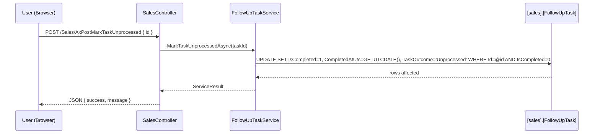
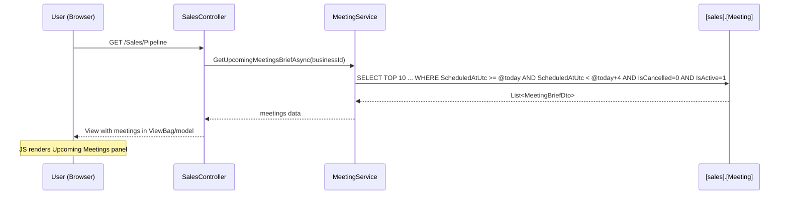
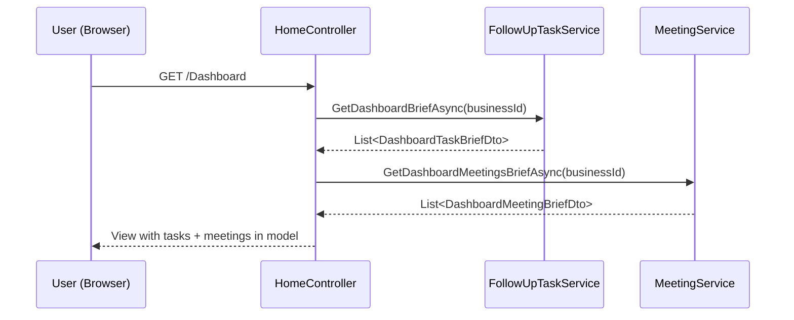

# Design Document: Sales Tasks & Meetings Enhancements

## Overview

This design covers four enhancements to the Sales/Opportunities module, extending the existing `[sales].[FollowUpTask]` and `[sales].[Meeting]` infrastructure with new closure semantics, scheduling precision, and daily operational visibility panels.

### Enhancements Summary

1. **Task "Unprocessed" Status** — New `TaskOutcome` column on `[sales].[FollowUpTask]` with a dedicated closure path distinct from "Completed"
2. **Optional Time on Tasks** — New `ScheduledTimeUtc` column (`time(0)`, nullable) enabling time-specific task scheduling
3. **Meetings Brief on Pipeline Page** — New collapsible panel below Today's Actions showing upcoming meetings (today + 3 days)
4. **Dashboard Today's Brief** — New section on Home/Index aggregating tasks + meetings for today/tomorrow

### Design Decisions

| Decision | Rationale |
|----------|-----------|
| `TaskOutcome` as `nvarchar(20)` nullable | Preserves backward compatibility — existing completed tasks are backfilled with `TaskOutcome = 'Completed'` via a data migration in the same script. New completions set "Completed", unprocessed closures set "Unprocessed". |
| `ScheduledTimeUtc` as `time(0)` nullable | SQL Server `time(0)` stores time without fractional seconds (smallest precision). Nullable preserves the "all-day" default behaviour. |
| Outcome stored on the same row (not a junction table) | Each task has exactly one outcome at a time. A junction table adds complexity for a simple classification. |
| Meetings brief limited to 10 results | Keeps the pipeline panel concise and avoids performance issues with large meeting counts. The 3-day window + 10-row cap ensures a quick-glance overview. |
| Meetings panel loads via AJAX (not server-rendered) | Mirrors the existing Today's Actions pattern (both load via fetch after page render). Keeps the Pipeline action method lightweight and allows skeleton loading for consistent UX. |
| Dashboard brief uses separate service methods | `GetDashboardBriefAsync` (tasks) and `GetDashboardMeetingsBriefAsync` (meetings) keep responsibilities separated and allow independent caching/tuning later. |
| Panel collapse state in `localStorage` | Mirrors the existing Today's Actions pattern. No server-side session needed for a UI preference. |
| BlockUI + SweetAlert2 for Unprocessed action | Consistent with existing Complete/Snooze pattern in `follow-up-tasks.js`. |

---

## Architecture

### Data Flow — Task "Unprocessed" Closure



### Data Flow — Pipeline Meetings Brief



### Data Flow — Dashboard Today's Brief



---

## Components and Interfaces

### Service Layer Extensions

#### IFollowUpTaskService — New Methods

```csharp
// Mark a task as "Unprocessed" (closed without successful action)
Task<ServiceResult> MarkTaskUnprocessedAsync(int taskId);

// Dashboard brief: incomplete tasks due today or tomorrow
Task<List<DashboardTaskBriefDto>> GetDashboardBriefAsync(int businessId);
```

#### IMeetingService — New Methods

```csharp
// Pipeline panel: upcoming meetings (today + 3 days ahead), max 10
Task<List<MeetingBriefDto>> GetUpcomingMeetingsBriefAsync(int businessId);

// Dashboard brief: meetings for today/tomorrow
Task<List<DashboardMeetingBriefDto>> GetDashboardMeetingsBriefAsync(int businessId);
```

#### FollowUpTaskService — Modified Methods

- `CompleteTaskAsync(int taskId)` — Now also sets `TaskOutcome = "Completed"`
- `ReopenTaskAsync(int taskId)` — Now also clears `TaskOutcome = NULL`
- `CreateTaskAsync(...)` — Accepts optional `ScheduledTimeUtc` from request model
- `UpdateTaskAsync(...)` — Accepts optional `ScheduledTimeUtc` parameter
- `GetTodaysActionsAsync(...)` — Orders tasks with `ScheduledTimeUtc` before all-day tasks within same urgency group

### Controller Layer

#### SalesController — New Endpoints

```csharp
[HttpPost] AxPostMarkTaskUnprocessed(int id)       // Mark task as unprocessed
[HttpGet]  AxGetUpcomingMeetingsBrief()             // AJAX load for meetings panel
```

#### HomeController — Modified

- `Index()` action gains two additional service calls: `GetDashboardBriefAsync` and `GetDashboardMeetingsBriefAsync`
- Results passed to view via the existing `DashboardViewModel` (extended with new properties)

### View / JavaScript Layer

#### Pipeline Page

- New `<section id="upcomingMeetingsPanel">` below existing Today's Actions panel
- New JS function `loadUpcomingMeetings()` fetching via `AxGetUpcomingMeetingsBrief` AJAX endpoint
- Collapse/expand toggle with `localStorage` key `upcomingMeetingsCollapsed`

#### Home/Index Page

- New partial or section for "Today's Brief" within the existing dashboard layout
- Server-rendered (consistent with how other dashboard KPI sections are built)

#### follow-up-tasks.js — Modified

- `renderTaskCard(t)` gains an "Unprocessed" button alongside "Complete"
- `renderTaskCard(t)` shows `ScheduledTimeUtc` formatted as "HH:mm" when present
- New `markTaskUnprocessed(taskId)` function following the BlockUI + refresh pattern
- Completed task cards show a `TaskOutcome` badge ("Completed" / "Unprocessed")

---

## Data Models

### Database Changes

#### ALTER TABLE: `[sales].[FollowUpTask]`

```sql
USE [Portal]
GO

-- Enhancement 1: Task outcome classification
ALTER TABLE [sales].[FollowUpTask]
ADD TaskOutcome NVARCHAR(20) NULL;
GO

-- Enhancement 2: Optional scheduled time
ALTER TABLE [sales].[FollowUpTask]
ADD ScheduledTimeUtc TIME(0) NULL;
GO
```

### Entity Changes

#### FollowUpTask.cs — New Properties

```csharp
/// <summary>
/// Closure outcome: "Completed" or "Unprocessed". NULL for open tasks.
/// </summary>
public string? TaskOutcome { get; set; }

/// <summary>
/// Optional time-of-day for the task. NULL means all-day task.
/// </summary>
public TimeOnly? ScheduledTimeUtc { get; set; }
```

### New DTOs

#### MeetingBriefDto (Pipeline Panel)

```csharp
public class MeetingBriefDto
{
    public int Id { get; set; }
    public int? LeadRequestId { get; set; }
    public string Subject { get; set; } = null!;
    public string ContactName { get; set; } = null!;
    public string MeetingTypeName { get; set; } = null!;
    public DateTime ScheduledAtUtc { get; set; }
    public int DurationMinutes { get; set; }
    public string? Location { get; set; }
}
```

#### DashboardTaskBriefDto (Home Page)

```csharp
public class DashboardTaskBriefDto
{
    public int Id { get; set; }
    public string Title { get; set; } = null!;
    public string TaskType { get; set; } = null!;
    public DateTime DueAtUtc { get; set; }
    public TimeOnly? ScheduledTimeUtc { get; set; }
    public string? ContactName { get; set; }
    /// <summary>"today" or "tomorrow"</summary>
    public string Urgency { get; set; } = null!;
}
```

#### DashboardMeetingBriefDto (Home Page)

```csharp
public class DashboardMeetingBriefDto
{
    public int Id { get; set; }
    public string Subject { get; set; } = null!;
    public string ContactName { get; set; } = null!;
    public string MeetingTypeName { get; set; } = null!;
    public DateTime ScheduledAtUtc { get; set; }
    public int DurationMinutes { get; set; }
    /// <summary>"today" or "tomorrow"</summary>
    public string Urgency { get; set; } = null!;
}
```

### Modified DTOs

#### FollowUpTaskDto — New Properties

```csharp
public string? TaskOutcome { get; set; }       // "Completed", "Unprocessed", or null
public TimeOnly? ScheduledTimeUtc { get; set; } // Optional time-of-day
```

#### CreateFollowUpTaskRequest — New Property

```csharp
public TimeOnly? ScheduledTimeUtc { get; set; }
```

#### UpdateFollowUpTaskRequest — New Property

```csharp
public TimeOnly? ScheduledTimeUtc { get; set; }
```

#### FollowUpTaskFilter — Extended Status Options

The existing `Status` filter (`pending`, `completed`, `overdue`) gains additional option values:
- `"completed"` — tasks with `TaskOutcome = "Completed"`
- `"unprocessed"` — tasks with `TaskOutcome = "Unprocessed"`
- `"all_closed"` — both completed and unprocessed

---


## Correctness Properties

*A property is a characteristic or behavior that should hold true across all valid executions of a system — essentially, a formal statement about what the system should do. Properties serve as the bridge between human-readable specifications and machine-verifiable correctness guarantees.*

### Property 1: Task Closure State Transition

*For any* active (non-completed) FollowUpTask, closing it via either the Complete or Unprocessed path SHALL set `IsCompleted = true`, `CompletedAtUtc` to a non-null UTC timestamp, and `TaskOutcome` to the corresponding value ("Completed" or "Unprocessed" respectively).

**Validates: Requirements 1.2, 1.3**

### Property 2: Already-Closed Task Rejects Unprocessed

*For any* FollowUpTask where `IsCompleted = true`, invoking `MarkTaskUnprocessedAsync` SHALL return `ServiceResult.Success = false` and leave the task state unchanged.

**Validates: Requirements 1.4**

### Property 3: Reopen Clears All Closure Fields

*For any* closed FollowUpTask (regardless of whether TaskOutcome is "Completed" or "Unprocessed"), invoking `ReopenTaskAsync` SHALL set `IsCompleted = false`, `CompletedAtUtc = null`, and `TaskOutcome = null`.

**Validates: Requirements 1.5**

### Property 4: ScheduledTimeUtc Round-Trip Preservation

*For any* valid `TimeOnly?` value (including null), creating or updating a FollowUpTask with that value and then querying the task SHALL return the same `ScheduledTimeUtc` value in the DTO.

**Validates: Requirements 3.2, 3.4, 3.5, 3.6**

### Property 5: Task Ordering Within Urgency Group

*For any* set of tasks in the same urgency group (overdue, today, tomorrow, upcoming), the service SHALL order tasks that have a non-null `ScheduledTimeUtc` before all-day tasks (null), and within the timed subset, tasks SHALL be ordered by `ScheduledTimeUtc` ascending.

**Validates: Requirements 4.5**

### Property 6: TaskOutcome Filter Correctness

*For any* set of tasks with mixed `TaskOutcome` values, filtering by "Completed" SHALL return only tasks with `TaskOutcome = "Completed"`, filtering by "Unprocessed" SHALL return only tasks with `TaskOutcome = "Unprocessed"`, and filtering by "All" SHALL return tasks regardless of outcome.

**Validates: Requirements 2.5**

### Property 7: Upcoming Meetings Brief Query Correctness

*For any* set of meetings with varying `ScheduledAtUtc`, `IsCancelled`, `IsActive`, and `BusinessId` values, `GetUpcomingMeetingsBriefAsync` SHALL return only meetings where `IsActive = true`, `IsCancelled = false`, `BusinessId` matches, and `ScheduledAtUtc` falls within today through today+3 days; results SHALL be ordered by `ScheduledAtUtc` ascending and capped at 10.

**Validates: Requirements 5.1, 5.3, 5.4**

### Property 8: Dashboard Tasks Brief Query Correctness

*For any* set of tasks with varying `DueAtUtc`, `IsCompleted`, and `BusinessId` values, `GetDashboardBriefAsync` SHALL return only tasks where `IsCompleted = false`, `BusinessId` matches, and `DueAtUtc` date is today or tomorrow; results SHALL be ordered by `DueAtUtc` ascending then `ScheduledTimeUtc` ascending (nulls last).

**Validates: Requirements 7.1**

### Property 9: Dashboard Meetings Brief Query Correctness

*For any* set of meetings with varying `ScheduledAtUtc`, `IsCancelled`, `IsActive`, and `BusinessId` values, `GetDashboardMeetingsBriefAsync` SHALL return only meetings where `IsActive = true`, `IsCancelled = false`, `BusinessId` matches, and `ScheduledAtUtc` date is today or tomorrow; results SHALL be ordered by `ScheduledAtUtc` ascending.

**Validates: Requirements 7.2**

### Property 10: DTO Projection Completeness

*For any* FollowUpTask or Meeting entity, the corresponding DTO (FollowUpTaskDto, MeetingBriefDto, DashboardTaskBriefDto, DashboardMeetingBriefDto) SHALL include all required fields with values matching the source entity's data (including resolved navigation properties for ContactName and MeetingTypeName).

**Validates: Requirements 1.6, 3.6, 5.2, 7.3, 7.4**

### Property 11: Preparation Reminder for Tomorrow's Meetings

*For any* meeting in the dashboard brief with `Urgency = "tomorrow"`, the rendered Today's Brief section SHALL produce a preparation reminder string containing the meeting's ContactName and the formatted scheduled time.

**Validates: Requirements 8.5**

---

## Error Handling

### Service Layer

| Scenario | Handling |
|----------|----------|
| `MarkTaskUnprocessedAsync` called on non-existent task | Return `ServiceResult.Fail("Task not found.")` |
| `MarkTaskUnprocessedAsync` called on already-completed task | Return `ServiceResult.Fail("Task is already closed.")` |
| `CompleteTaskAsync` called on already-completed task | Return `ServiceResult.Fail("Task is already completed.")` (existing behaviour preserved) |
| `ReopenTaskAsync` called on a task that is not completed | Return `ServiceResult.Fail("Task is not completed.")` (existing behaviour preserved) |
| `GetUpcomingMeetingsBriefAsync` with no results | Return empty list (no error) |
| `GetDashboardBriefAsync` / `GetDashboardMeetingsBriefAsync` with no results | Return empty list (no error) |
| Database exception during any service operation | `catch (Exception ex) { throw; }` — propagates to controller |

### Controller Layer

| Scenario | Handling |
|----------|----------|
| AJAX endpoint catches exception | Log via `_logger.LogError(ex, ...)`, return `Json(new { success = false, message = "An error occurred." })` |
| Pipeline action fails to load meetings brief | Log error, set meetings list to empty (degrade gracefully) |
| Home/Index action fails to load brief data | Log error, set brief data to empty lists (degrade gracefully) |

### JavaScript Layer

| Scenario | Handling |
|----------|----------|
| `markTaskUnprocessed` AJAX fails | `BlockUI.hide()` → `Swal.fire({ icon: 'error', ... })` |
| `loadUpcomingMeetings` fetch fails | `console.error(...)`, hide panel gracefully |
| Panel data returns empty | Show "No upcoming meetings" / "All clear" message |

---

## Testing Strategy

### Unit Tests (Example-Based)

- **AxPostMarkTaskUnprocessed endpoint**: verify JSON response shape, antiforgery token enforcement
- **Pipeline action**: verify view model includes meetings brief data
- **HomeController Index**: verify model includes brief data after service call
- **UI rendering**: verify "Unprocessed" button exists on active task cards
- **Empty states**: verify correct messages when no data
- **Form fields**: verify time picker presence on create/edit forms

### Property-Based Tests (FsCheck + xUnit)

The project already uses **FsCheck.Xunit** (visible in build output). Each property test will:
- Run minimum 100 iterations
- Be tagged with the feature name and property number
- Use FsCheck generators for FollowUpTask and Meeting entities

| Property | Test Focus |
|----------|-----------|
| Property 1 | State transition: Close task → verify fields |
| Property 2 | Guard: already-closed → reject |
| Property 3 | State transition: Reopen → verify fields cleared |
| Property 4 | Round-trip: ScheduledTimeUtc persists correctly |
| Property 5 | Ordering invariant: timed before all-day, ascending |
| Property 6 | Filter correctness: outcome filter returns matching tasks |
| Property 7 | Query invariant: meetings brief filtering + ordering + cap |
| Property 8 | Query invariant: dashboard tasks filtering + ordering |
| Property 9 | Query invariant: dashboard meetings filtering + ordering |
| Property 10 | Projection: DTO fields match entity |
| Property 11 | Rendering: tomorrow meetings → preparation reminder |

### Integration Tests

- SQL migration verification (column existence, types)
- End-to-end AJAX flow: mark unprocessed → verify DB state → verify panel refresh
- Pipeline page loads with meetings panel rendered
- Dashboard page loads with Today's Brief section

### Test Configuration

```csharp
// FsCheck property test attribute pattern
[Property(MaxTest = 100)]
// Tag: Feature: sales-tasks-meetings-enhancements, Property 1: Task Closure State Transition
```
