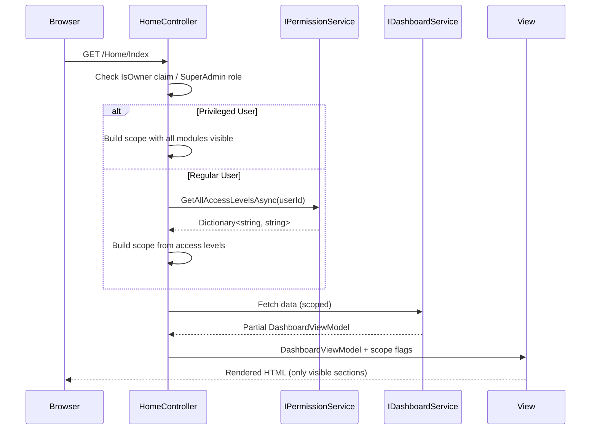

# Design Document

## Overview

The Scoped Dashboard feature modifies the existing `HomeController.Index` action and its supporting services to conditionally fetch and render KPI sections based on the authenticated user's module permissions. The design introduces a `DashboardScopeDto` that captures which modules are visible, threads it through the service layer to skip unnecessary database queries, and passes visibility flags to the view for conditional rendering.

**Key Design Decisions:**

1. **Permission resolution at controller level** — The controller resolves permissions once and passes a scope object downstream, avoiding repeated permission checks in services.
2. **No new database tables** — The feature leverages the existing `IPermissionService` and user claims; no schema changes are required.
3. **Conditional data fetching** — The `IDashboardService` receives scope flags so it can skip queries for hidden sections, reducing database load for restricted users.
4. **View-level conditional rendering** — The Razor view uses scope flags on the view model to show/hide sections and adapt grid layout.

## Architecture



### Layer Responsibilities

| Layer | Responsibility |
|-------|---------------|
| **HomeController** | Resolves user identity, determines privileged status, builds `DashboardScopeDto`, orchestrates scoped data fetching, populates view model |
| **IPermissionService** | Returns module → access level dictionary (existing, unchanged) |
| **IDashboardService** | Fetches KPI data conditionally based on scope flags (modified) |
| **DashboardViewModel** | Carries data + visibility flags to the view |
| **Index.cshtml** | Conditionally renders sections based on visibility flags |

## Components and Interfaces

### 1. DashboardScopeDto (New)

A lightweight DTO that encapsulates which dashboard sections are visible for the current request.

```csharp
namespace Portal.Infrastructure.Models;

/// <summary>
/// Determines which dashboard sections should be fetched and displayed
/// based on the authenticated user's module permissions.
/// </summary>
public class DashboardScopeDto
{
    public bool ShowRevenue { get; set; }
    public bool ShowInvoice { get; set; }
    public bool ShowQuotation { get; set; }
    public bool ShowPurchase { get; set; }
    public bool ShowVat { get; set; }
    public bool ShowCustomer { get; set; }

    /// <summary>
    /// Returns true if at least one KPI-bearing module is visible.
    /// </summary>
    public bool HasAnyKpiSection =>
        ShowRevenue || ShowInvoice || ShowQuotation || ShowPurchase || ShowVat;

    /// <summary>
    /// Creates a scope where all sections are visible (for privileged users).
    /// </summary>
    public static DashboardScopeDto FullAccess() => new()
    {
        ShowRevenue = true,
        ShowInvoice = true,
        ShowQuotation = true,
        ShowPurchase = true,
        ShowVat = true,
        ShowCustomer = true
    };

    /// <summary>
    /// Creates a scope from a module permissions dictionary.
    /// A module is visible if its access level is "full" or "readonly".
    /// </summary>
    public static DashboardScopeDto FromPermissions(Dictionary<string, string> permissions)
    {
        bool isVisible(string module) =>
            permissions.TryGetValue(module, out var level)
            && level != AccessLevels.None;

        return new DashboardScopeDto
        {
            ShowRevenue = isVisible(PortalModules.Revenue),
            ShowInvoice = isVisible(PortalModules.Invoice),
            ShowQuotation = isVisible(PortalModules.Quotation),
            ShowPurchase = isVisible(PortalModules.Purchase),
            ShowVat = isVisible(PortalModules.Vat),
            ShowCustomer = isVisible(PortalModules.Customer)
        };
    }
}
```

### 2. DashboardViewModel (Modified)

Add scope visibility flags to the existing view model:

```csharp
// Add to existing DashboardViewModel
public class DashboardViewModel
{
    // ... existing properties ...

    // Scope visibility flags
    public bool ShowRevenue { get; set; } = true;
    public bool ShowInvoice { get; set; } = true;
    public bool ShowQuotation { get; set; } = true;
    public bool ShowPurchase { get; set; } = true;
    public bool ShowVat { get; set; } = true;
    public bool ShowCustomer { get; set; } = true;
    public bool HasAnyKpiSection { get; set; } = true;

    // Empty state
    public string? BusinessName { get; set; }
}
```

### 3. HomeController.Index (Modified)

```csharp
[HttpGet]
public async Task<IActionResult> Index()
{
    var businessId = _tenantService.CurrentBusinessId;
    if (businessId == 0)
        return RedirectToAction(nameof(Error));

    // Resolve scope
    DashboardScopeDto scope;
    var isPrivileged = User.HasClaim("IsOwner", "true")
                    || User.IsInRole("SuperAdmin");

    if (isPrivileged)
    {
        scope = DashboardScopeDto.FullAccess();
    }
    else
    {
        var userId = User.FindFirst(System.Security.Claims.ClaimTypes.NameIdentifier)?.Value;
        try
        {
            var permissions = await _permissionService.GetAllAccessLevelsAsync(userId!, businessId);
            scope = DashboardScopeDto.FromPermissions(permissions);
        }
        catch
        {
            // Permission service failure — show empty state
            return View(new DashboardViewModel
            {
                HasAnyKpiSection = false,
                BusinessName = (await _businessService.GetBusinessProfileAsync(businessId))?.BusinessName
            });
        }
    }

    // Fetch data conditionally based on scope
    // ... (only call service methods for visible sections)
}
```

### 4. IDashboardService (Unchanged Interface)

The interface remains unchanged. The controller simply skips calling methods for hidden sections. This avoids breaking changes and keeps the service layer focused on data retrieval.

### 5. View Conditional Rendering Pattern

```razor
@if (Model.HasAnyKpiSection)
{
    @if (Model.ShowRevenue)
    {
        <!-- Revenue gauges -->
    }
    @if (Model.ShowQuotation || Model.ShowVat)
    {
        <!-- Quotation stats strip + VAT -->
    }
    <!-- ... more sections ... -->
}
else
{
    <!-- Empty state welcome message -->
}
```

### 6. Grid Layout Adaptation

When one section in a two-column row is hidden, the remaining section expands to full width:

```razor
@if (Model.ShowRevenue && Model.ShowInvoice)
{
    <div class="grid-2"><!-- both charts --></div>
}
else if (Model.ShowRevenue)
{
    <div><!-- revenue chart full width --></div>
}
else if (Model.ShowInvoice)
{
    <div><!-- invoice chart full width --></div>
}
```

## Data Models

### DashboardScopeDto

| Property | Type | Description |
|----------|------|-------------|
| ShowRevenue | bool | Revenue module visible |
| ShowInvoice | bool | Invoice module visible |
| ShowQuotation | bool | Quotation module visible |
| ShowPurchase | bool | Purchase module visible |
| ShowVat | bool | VAT module visible |
| ShowCustomer | bool | Customer module visible (for quick actions) |
| HasAnyKpiSection | bool (computed) | True if any KPI-bearing module is visible |

### DashboardViewModel Additions

| Property | Type | Description |
|----------|------|-------------|
| ShowRevenue | bool | Controls revenue section rendering |
| ShowInvoice | bool | Controls invoice section rendering |
| ShowQuotation | bool | Controls quotation section rendering |
| ShowPurchase | bool | Controls purchase/expenses section rendering |
| ShowVat | bool | Controls VAT section rendering |
| ShowCustomer | bool | Controls customer quick action rendering |
| HasAnyKpiSection | bool | Controls empty state vs content rendering |
| BusinessName | string? | Displayed in empty state message |

### Module-to-Section Mapping

| Module Key | Dashboard Section | Quick Actions |
|------------|------------------|---------------|
| `"revenue"` | Revenue gauges, Revenue vs Expenses chart, Recent Payments, Overdue Invoices, Top Customers, Revenue by Customer chart | Record Payment, Customer Statement |
| `"invoice"` | Invoice Status Breakdown chart, Recent Invoices table | Create Invoice |
| `"quotation"` | Quotation stats strip, Recent Quotations table | New Quotation |
| `"purchase"` | Expenses gauge | Record Purchase |
| `"vat"` | VAT summary strip | — |
| `"customer"` | — | New Customer |


## Correctness Properties

*A property is a characteristic or behavior that should hold true across all valid executions of a system — essentially, a formal statement about what the system should do. Properties serve as the bridge between human-readable specifications and machine-verifiable correctness guarantees.*

### Property 1: Permission-to-visibility mapping is a biconditional on access level

*For any* module in {revenue, invoice, quotation, purchase, vat, customer} and *for any* access level in {full, readonly, none}, the corresponding `DashboardScopeDto` flag is `true` if and only if the access level is not "none".

**Validates: Requirements 2.1, 2.2, 3.1, 3.2, 4.1, 4.2, 5.1, 5.2, 6.1, 6.2, 7.1, 7.2, 7.3, 7.4, 7.5, 7.6, 9.1, 9.2**

### Property 2: Privileged users always receive full access scope

*For any* permission dictionary (including empty dictionaries and dictionaries with all modules set to "none"), when the user is a Privileged_User (IsOwner = true OR SuperAdmin role), the resulting `DashboardScopeDto` SHALL have all section flags set to `true`.

**Validates: Requirements 1.2**

### Property 3: HasAnyKpiSection is true iff at least one KPI-bearing module is visible

*For any* permission dictionary, `HasAnyKpiSection` is `true` if and only if at least one of ShowRevenue, ShowInvoice, ShowQuotation, ShowPurchase, or ShowVat is `true` in the resulting `DashboardScopeDto`.

**Validates: Requirements 8.1, 8.3**

## Error Handling

| Scenario | Handling | User Experience |
|----------|----------|-----------------|
| `IPermissionService.GetAllAccessLevelsAsync` throws | Controller catches exception, returns view with `HasAnyKpiSection = false` and `BusinessName` populated | User sees empty state with "data temporarily unavailable" message |
| `businessId == 0` (no tenant) | Redirect to `/Home/Error` (existing behaviour) | Error page |
| User has no claims/identity | ASP.NET `[Authorize]` redirects to login (existing behaviour) | Login page |
| Individual dashboard service method throws | Let exception propagate (existing behaviour — global error handler) | Error page |
| Permission dictionary missing a module key | `TryGetValue` returns false → treated as "none" (hidden) | Section not shown — safe default |

**Design Rationale:** The permission service failure is the only new error path introduced by this feature. The safe default is to show an empty state rather than exposing data the user may not be authorised to see. This follows the principle of "fail closed" for access control.

## Testing Strategy

### Property-Based Tests (FsCheck + xUnit)

The core scoping logic in `DashboardScopeDto.FromPermissions` and `DashboardScopeDto.FullAccess` is a pure function with clear input/output behaviour — ideal for property-based testing.

**Library:** FsCheck.Xunit (NuGet package for .NET)
**Minimum iterations:** 100 per property

Each property test must be tagged with a comment referencing the design property:
- **Feature: scoped-dashboard, Property 1: Permission-to-visibility mapping is a biconditional on access level**
- **Feature: scoped-dashboard, Property 2: Privileged users always receive full access scope**
- **Feature: scoped-dashboard, Property 3: HasAnyKpiSection is true iff at least one KPI-bearing module is visible**

### Unit Tests (xUnit)

| Test | Validates |
|------|-----------|
| Controller returns empty state when IPermissionService throws | Requirement 1.3 |
| Controller skips revenue service calls when ShowRevenue is false | Requirements 2.4 |
| Controller skips invoice service calls when ShowInvoice is false | Requirement 3.3 |
| Controller skips quotation service calls when ShowQuotation is false | Requirement 4.3 |
| Controller skips expenses service call when ShowPurchase is false | Requirement 5.3 |
| Controller skips VAT service call when ShowVat is false | Requirement 6.3 |
| Empty state view model includes BusinessName | Requirement 8.2 |
| Grid layout renders single chart at full width | Requirement 10.1 |
| Grid row is hidden when both sections are hidden | Requirement 10.2 |
| Grid layout renders single table at full width | Requirement 10.3 |

### Integration Tests

| Test | Validates |
|------|-----------|
| Full page render for privileged user shows all sections | Requirement 1.2 (end-to-end) |
| Full page render for user with only "revenue" access shows only revenue sections | Requirements 2.1, 3.2, 4.2, 5.2, 6.2 |
| Full page render for user with no KPI modules shows empty state | Requirement 8.1 |

