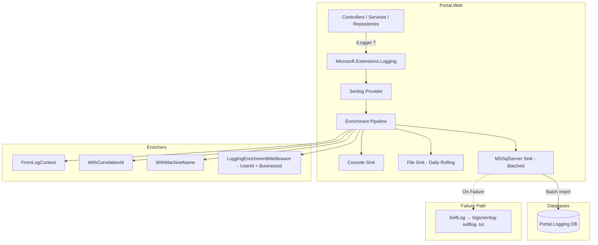

# Design Document: Serilog Structured Logging

## Overview

This design extends the Portal platform's existing Serilog logging infrastructure to persist structured log entries in a dedicated `Portal.Logging` SQL Server database. The solution adds a `Serilog.Sinks.MSSqlServer` sink alongside the existing Console and File sinks, enriches every log entry with contextual properties (CorrelationId, UserId, BusinessId, MachineName), and provides a migration script for consistent database provisioning across environments.

The architecture follows a non-intrusive approach: all existing `ILogger<T>` call sites continue to work unchanged because Serilog already acts as the logging provider. The new sink simply adds another destination for the same log events.

### Key Design Decisions

1. **Separate database** — Log data is isolated in `Portal.Logging` to prevent high-volume writes from impacting transactional Portal/Membership databases and to allow independent growth/retention policies.
2. **Auto-create disabled in production** — The migration script handles schema creation. Auto-create is enabled only for development convenience.
3. **Batch posting** — The MSSqlServer sink uses periodic batching (default 50 events / 5 seconds) to reduce database round-trips.
4. **Graceful degradation** — If the logging database is unreachable, the application continues operating with Console and File sinks. SelfLog captures sink failures for diagnostics.
5. **Custom middleware enricher** — UserId and BusinessId are extracted per-request via a lightweight middleware enricher rather than relying on `LogContext.PushProperty` scattered across controllers.

## Architecture



### Component Interaction Flow

1. Application code logs via `ILogger<T>` (no changes required)
2. Microsoft.Extensions.Logging routes to Serilog provider (already configured)
3. Serilog enrichment pipeline adds CorrelationId, MachineName, UserId, BusinessId
4. Each sink receives the enriched log event independently
5. MSSqlServer sink batches events and writes to `[dbo].[Logs]` in `Portal.Logging`
6. On database failure, SelfLog captures the error; Console and File sinks continue unaffected

## Components and Interfaces

### 1. NuGet Packages

| Package | Version | Purpose |
|---------|---------|---------|
| `Serilog.Sinks.MSSqlServer` | 7.0.1 | SQL Server sink for structured log persistence |
| `Serilog.Enrichers.Environment` | 3.0.1 | MachineName enrichment |
| `Serilog.AspNetCore` | 8.0.3 | Already installed — Serilog integration with ASP.NET Core |
| `Serilog.Enrichers.CorrelationId` | 3.0.1 | Already installed — request correlation |

> **Note:** Version 7.0.1 of `Serilog.Sinks.MSSqlServer` is chosen for compatibility with `Serilog.AspNetCore 8.0.3` and .NET 8. The 9.x line targets Serilog 4.x which would require upgrading the entire Serilog stack.

### 2. LoggingEnrichmentMiddleware

A custom ASP.NET Core middleware that pushes `UserId` and `BusinessId` into the Serilog `LogContext` for every HTTP request.

```csharp
namespace Portal.Web.Middleware;

public class LoggingEnrichmentMiddleware
{
    private readonly RequestDelegate _next;

    public LoggingEnrichmentMiddleware(RequestDelegate next)
    {
        _next = next;
    }

    public async Task InvokeAsync(HttpContext context)
    {
        var userId = context.User?.FindFirst(System.Security.Claims.ClaimTypes.NameIdentifier)?.Value;
        var businessIdClaim = context.User?.FindFirst("BusinessId")?.Value;
        int.TryParse(businessIdClaim, out var businessId);

        using (LogContext.PushProperty("UserId", userId))
        using (LogContext.PushProperty("BusinessId", businessId == 0 ? null : (object)businessId))
        {
            await _next(context);
        }
    }
}
```

**Placement in pipeline:** After `UseAuthentication()` and `UseAuthorization()` so that claims are available, but before `MapControllerRoute()`.

### 3. Serilog Configuration (Program.cs)

The existing `UseSerilog` block is extended to include the MSSqlServer sink with custom column mappings:

```csharp
builder.Host.UseSerilog((context, services, configuration) => configuration
    .ReadFrom.Configuration(context.Configuration)
    .Enrich.FromLogContext()
    .Enrich.WithProperty("Application", "Portal.Web")
    .Enrich.WithCorrelationId()
    .Enrich.WithMachineName()
    .WriteTo.Console(outputTemplate: "[{Timestamp:HH:mm:ss} {Level:u3}] {Message:lj} {Properties:j}{NewLine}{Exception}")
    .WriteTo.File("logs/portal-.log",
        rollingInterval: RollingInterval.Day,
        outputTemplate: "{Timestamp:yyyy-MM-dd HH:mm:ss.fff zzz} [{Level:u3}] [{CorrelationId}] [{UserId}] [{BusinessId}] {Message:lj}{NewLine}{Exception}")
    .WriteTo.MSSqlServer(
        connectionString: context.Configuration.GetConnectionString("LoggingDb"),
        sinkOptions: new MSSqlServerSinkOptions
        {
            TableName = "Logs",
            SchemaName = "dbo",
            AutoCreateSqlTable = context.HostingEnvironment.IsDevelopment(),
            BatchPostingLimit = 50,
            BatchPeriod = TimeSpan.FromSeconds(5)
        },
        columnOptions: GetColumnOptions()));
```

### 4. Column Options Configuration

```csharp
private static ColumnOptions GetColumnOptions()
{
    var columnOptions = new ColumnOptions();

    // Remove Properties XML column — we use dedicated columns instead
    columnOptions.Store.Remove(StandardColumn.Properties);

    // Add custom columns for structured properties
    columnOptions.AdditionalColumns = new Collection<SqlColumn>
    {
        new SqlColumn { ColumnName = "CorrelationId", DataType = System.Data.SqlDbType.NVarChar, DataLength = 128, AllowNull = true },
        new SqlColumn { ColumnName = "UserId", DataType = System.Data.SqlDbType.NVarChar, DataLength = 450, AllowNull = true },
        new SqlColumn { ColumnName = "BusinessId", DataType = System.Data.SqlDbType.Int, AllowNull = true },
        new SqlColumn { ColumnName = "SourceContext", DataType = System.Data.SqlDbType.NVarChar, DataLength = 512, AllowNull = true },
        new SqlColumn { ColumnName = "RequestPath", DataType = System.Data.SqlDbType.NVarChar, DataLength = 512, AllowNull = true },
        new SqlColumn { ColumnName = "MachineName", DataType = System.Data.SqlDbType.NVarChar, DataLength = 128, AllowNull = true }
    };

    // Configure TimeStamp column
    columnOptions.TimeStamp.ConvertToUtc = true;

    return columnOptions;
}
```

### 5. SelfLog Configuration

Added at application startup before any logging occurs:

```csharp
Serilog.Debugging.SelfLog.Enable(msg =>
    File.AppendAllText("logs/serilog-selflog-.txt", $"{DateTime.UtcNow:o} {msg}{Environment.NewLine}"));
```

### 6. Connection String

Added to `appsettings.json`:

```json
"ConnectionStrings": {
    "PortalDb": "...",
    "MembershipDb": "...",
    "LoggingDb": "Server=127.0.0.1;Database=Portal.Logging;User ID=sa;Password=...;TrustServerCertificate=True;MultipleActiveResultSets=true"
}
```

### 7. Migration Script

A new migration script `001_CreateLoggingDatabase.sql` placed in `Portal.Database/Migrations/Logging/` (a new subdirectory to keep logging migrations separate from Portal DB migrations, following the existing `Membership/` subdirectory pattern).

## Data Models

### Logs Table Schema

| Column | Type | Nullable | Description |
|--------|------|----------|-------------|
| Id | BIGINT IDENTITY(1,1) | NOT NULL | Primary key — high-volume capable |
| Message | NVARCHAR(MAX) | NOT NULL | Rendered log message |
| MessageTemplate | NVARCHAR(MAX) | NULL | Serilog message template |
| Level | NVARCHAR(128) | NOT NULL | Log severity (Information, Warning, Error, etc.) |
| TimeStamp | DATETIME2 | NOT NULL | UTC timestamp of the log event |
| Exception | NVARCHAR(MAX) | NULL | Full exception text including stack trace |
| CorrelationId | NVARCHAR(128) | NULL | HTTP request correlation identifier |
| UserId | NVARCHAR(450) | NULL | Authenticated user's Identity ID |
| BusinessId | INT | NULL | Tenant business ID from claims |
| SourceContext | NVARCHAR(512) | NULL | Fully qualified type name of the logger |
| RequestPath | NVARCHAR(512) | NULL | HTTP request path |
| MachineName | NVARCHAR(128) | NULL | Server hostname |

### Indexes

| Index Name | Column(s) | Type | Rationale |
|------------|-----------|------|-----------|
| PK_Logs | Id | Clustered | Primary key |
| IX_Logs_TimeStamp | TimeStamp | Non-clustered | Time-range queries for diagnostics |
| IX_Logs_Level | Level | Non-clustered | Filter by severity |
| IX_Logs_BusinessId | BusinessId | Non-clustered | Tenant-scoped log queries |

### Entity Relationship

The `Portal.Logging` database is standalone with no foreign key relationships to Portal or Membership databases. This is intentional:
- Avoids cross-database FK constraints (not supported in SQL Server)
- Allows independent backup/restore/retention policies
- Prevents logging failures from cascading to transactional operations

## Correctness Properties

*A property is a characteristic or behavior that should hold true across all valid executions of a system — essentially, a formal statement about what the system should do. Properties serve as the bridge between human-readable specifications and machine-verifiable correctness guarantees.*

### Property 1: Enrichment middleware preserves claim values in LogContext

*For any* HTTP context with an authenticated user carrying a UserId claim (any non-empty string) and a BusinessId claim (any valid integer string), invoking the `LoggingEnrichmentMiddleware` SHALL push those exact values into the Serilog LogContext such that downstream log events contain `UserId` equal to the claim value and `BusinessId` equal to the parsed integer.

**Validates: Requirements 4.3, 4.4**

### Property 2: Unauthenticated requests produce null enrichment values

*For any* HTTP context where the user is unauthenticated (no claims principal or no NameIdentifier/BusinessId claims), invoking the `LoggingEnrichmentMiddleware` SHALL push null for both `UserId` and `BusinessId` into the Serilog LogContext.

**Validates: Requirements 4.5**

## Error Handling

### Sink Failure Isolation

The MSSqlServer sink operates independently of the Console and File sinks. Serilog's sink architecture ensures that a failure in one sink does not propagate to others:

1. **Database unreachable** — The MSSqlServer sink catches `SqlException` internally and routes the error to SelfLog. The application continues without interruption.
2. **Batch failure** — If a batch insert fails, the sink retries according to its internal retry policy. Failed events are logged to SelfLog but do not block subsequent batches.
3. **Schema mismatch** — If the Logs table schema doesn't match the column configuration, the sink logs the error to SelfLog on first write attempt.

### SelfLog Strategy

```
logs/serilog-selflog-.txt
```

SelfLog is enabled at application startup before any Serilog configuration. This ensures that even configuration errors are captured. The file uses append mode and is not subject to rolling — operators should monitor its size.

### Middleware Error Handling

The `LoggingEnrichmentMiddleware` uses defensive coding:
- `context.User?.FindFirst(...)` — null-safe claim access
- `int.TryParse(...)` — graceful handling of non-integer BusinessId claims
- No exceptions thrown from enrichment logic — worst case is null properties

### Startup Resilience

The application MUST NOT fail to start if the logging database is unreachable. This is achieved by:
1. The MSSqlServer sink connects lazily on first write, not during configuration
2. `AutoCreateSqlTable` failures are caught internally by the sink
3. No eager connection validation in Program.cs

## Testing Strategy

### Approach

This feature is primarily infrastructure configuration with a small amount of custom logic (the enrichment middleware). The testing strategy reflects this:

- **Property-based tests**: For the `LoggingEnrichmentMiddleware` which has meaningful input variation (different claim combinations)
- **Integration tests**: For end-to-end sink verification (log entry appears in database with correct columns)
- **Smoke tests**: For configuration verification (packages installed, connection string present, migration script valid)

### Property-Based Tests

**Library:** [FsCheck.Xunit](https://github.com/fscheck/FsCheck) (compatible with .NET 8, xUnit)

**Configuration:** Minimum 100 iterations per property test.

**Tag format:** `Feature: serilog-structured-logging, Property {number}: {property_text}`

| Property | What It Tests | Generator Strategy |
|----------|---------------|-------------------|
| Property 1 | Middleware extracts claims correctly | Generate random strings for UserId, random ints for BusinessId, random combinations of present/absent claims |
| Property 2 | Null handling for unauthenticated | Generate HttpContexts with no user, anonymous user, or user with missing claims |

### Integration Tests

| Test | What It Verifies |
|------|-----------------|
| Log entry reaches database | Write a log, flush, query Logs table |
| Custom columns populated | Write log with enriched context, verify CorrelationId/UserId/BusinessId columns |
| Resilience on DB failure | Configure invalid connection string, verify app still serves HTTP requests |
| Console/File sinks unaffected | With DB down, verify file sink still writes |

### Smoke Tests

| Test | What It Verifies |
|------|-----------------|
| Migration idempotency | Run migration script twice, no errors |
| Schema correctness | Verify all columns, types, and indexes after migration |
| Package references | Verify csproj contains required NuGet packages |
| Configuration present | Verify LoggingDb connection string exists |

### What Is NOT Tested with PBT

- Database schema creation (infrastructure — use smoke tests)
- Sink batch behavior (third-party package — already tested by Serilog maintainers)
- SelfLog output format (configuration — use example test)
- Migration script SQL syntax (infrastructure — use integration test against real DB)

