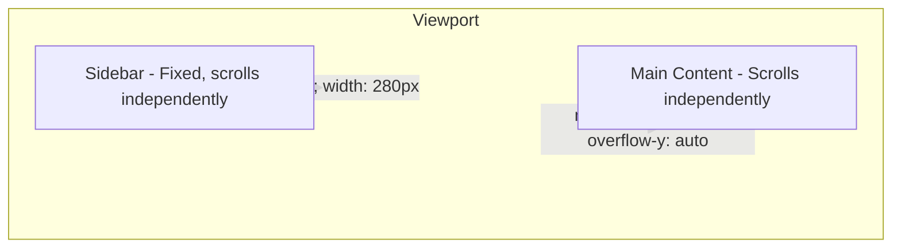

# Design Document: Sidebar Scroll Navigation

## Overview

This feature converts the Portal sidebar from a grid-based column (that scrolls with the page) to a **fixed, independently scrollable panel** with scroll position persistence across page navigations. The main content area becomes independently scrollable as well, preventing the two regions from interfering with each other.

The change is purely front-end: CSS restructuring + a small JavaScript snippet for sessionStorage-based scroll position save/restore.

## Architecture

The current layout uses a CSS Grid with `grid-template-columns: 280px 1fr`. The sidebar is a grid cell that grows with content and scrolls as part of the document flow. This causes:
1. Users lose their sidebar scroll position on every navigation.
2. Scrolling main content also scrolls the sidebar out of view.

The new approach:
- **Sidebar** → `position: fixed` with independent `overflow-y: auto`
- **Main Content** → `margin-left` to offset the fixed sidebar, with `height: 100vh; overflow-y: auto`
- **html, body** → `height: 100%; overflow: hidden` to prevent double scrollbars on desktop
- **Scroll persistence** → JavaScript saves sidebar `scrollTop` to `sessionStorage` on link click, restores on page load



### Key Decision: Why Fixed Instead of Sticky

`position: sticky` requires a scrollable parent, which would still tie the sidebar to the page scroll. `position: fixed` completely decouples the sidebar from any scroll context, giving true independence.

### Key Decision: sessionStorage vs localStorage

- **sessionStorage**: Cleared when the tab closes. Appropriate because scroll position is ephemeral — it should reset between sessions but persist within a browsing session.
- **localStorage**: Already used for the collapsed/expanded toggle state, which is a persistent user preference.

## Components and Interfaces

### CSS Changes (site.css)

| Selector | Current | New |
|----------|---------|-----|
| `html, body` | (not set for overflow) | `height: 100%; overflow: hidden` |
| `.app` | `display: grid; grid-template-columns: 280px 1fr` | `display: block` (grid removed for desktop) |
| `.sidebar` | `position: relative; overflow: hidden` | `position: fixed; top: 0; left: 0; bottom: 0; width: 280px; overflow-y: auto; overflow-x: hidden; z-index: 100` |
| `.content` | `padding: 24px; overflow-x: hidden` | `margin-left: 280px; height: 100vh; overflow-y: auto; padding: 24px` |
| `.app.sidebar-collapsed .sidebar` | `padding: 24px 8px; overflow: visible` | `width: 64px` |
| `.app.sidebar-collapsed .content` | (inherits grid) | `margin-left: 64px` |

### Custom Scrollbar (sidebar only)

```css
.sidebar::-webkit-scrollbar { width: 5px }
.sidebar::-webkit-scrollbar-track { background: transparent }
.sidebar::-webkit-scrollbar-thumb { background: rgba(13,94,166,.15); border-radius: 4px }
.sidebar::-webkit-scrollbar-thumb:hover { background: rgba(13,94,166,.3) }
```

### JavaScript (inline in _Layout.cshtml)

```javascript
// Sidebar scroll position persistence
(function() {
    var sidebar = document.querySelector('.sidebar');
    if (!sidebar) return;
    var KEY = 'sidebar-scroll-pos';

    // Restore on load
    var saved = sessionStorage.getItem(KEY);
    if (saved !== null) {
        sidebar.scrollTop = parseInt(saved, 10);
    }

    // Save before navigation — intercept all nav links inside sidebar
    sidebar.addEventListener('click', function(e) {
        var link = e.target.closest('a[href]');
        if (link) {
            sessionStorage.setItem(KEY, sidebar.scrollTop);
        }
    });
})();
```

### Mobile Layout Preservation

The mobile CSS (`mobile.css`) already applies `position: fixed !important` and `overflow-y: auto !important` to the sidebar at `≤1100px`. The mobile layout converts the sidebar into an off-canvas drawer with `transform: translateX(-100%)`. 

**No changes to mobile.css are required** — the mobile breakpoint styles already override all desktop positioning with `!important` flags, ensuring the new desktop styles don't leak into mobile.

## Data Models

No data models are involved. The only persisted data is:
- `sessionStorage['sidebar-scroll-pos']` — integer (pixel offset)
- `localStorage['sidebar-collapsed']` — string `"true"` or `"false"` (already exists, unchanged)

## Error Handling

- If `sessionStorage` is unavailable (private browsing edge cases), the scroll restore silently fails and sidebar starts at position 0.
- If the saved scroll position exceeds the sidebar's current `scrollHeight` (e.g., module permissions changed between navigations), the browser clamps `scrollTop` to the maximum valid value automatically.

## Testing Strategy

### Unit Tests
Not applicable — this is a CSS/layout change with a trivial JS snippet. No functions to unit test.

### Manual Testing Checklist
1. **Desktop expanded**: Sidebar scrolls independently, scroll position persists across navigation.
2. **Desktop collapsed**: Sidebar width is 64px, content adjusts, tooltips still work.
3. **Toggle transition**: Expanding/collapsing sidebar animates smoothly, content adjusts.
4. **Mobile (≤768px)**: Sidebar remains a drawer (off-canvas), no regressions.
5. **Tablet (769–1100px)**: Sidebar remains a drawer, no regressions.
6. **Hard refresh**: Scroll position restores from sessionStorage, collapsed state restores from localStorage.
7. **New tab**: Scroll position starts at 0 (sessionStorage is per-tab).
8. **Long sidebar content**: Scrollbar appears only when content overflows.
9. **No double scrollbars**: `html/body` overflow hidden prevents browser-level scrollbar on desktop.

### Build Verification
- `dotnet build` passes with no errors.
- Visual inspection in Chrome, Firefox, and Edge.

### Why PBT Does Not Apply
This feature is a CSS/JavaScript layout change with no algorithmic logic, data transformations, or pure functions to test. Property-based testing is not appropriate for UI positioning and scroll behavior changes. Manual testing and visual verification are the correct approach.
