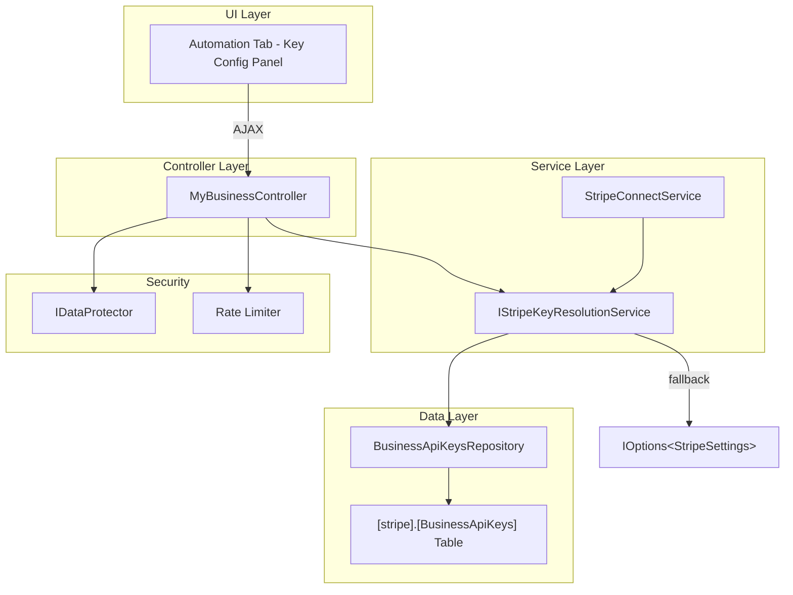
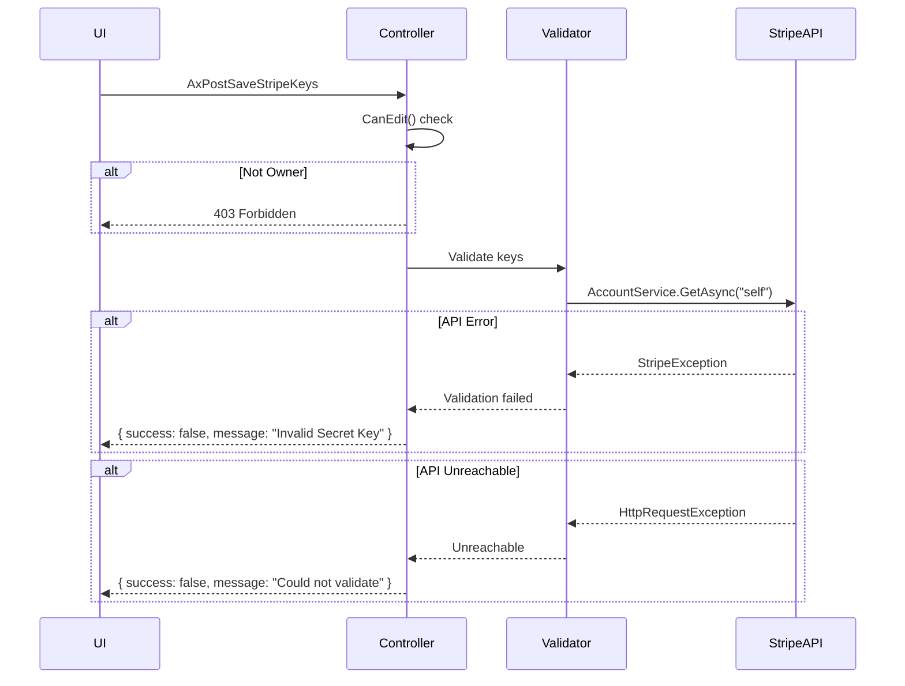

# Design Document: Stripe API Keys Configuration

## Overview

This feature allows business owners to configure their own Stripe Connect API keys through the Portal UI (Business Settings → Automation tab), removing the dependency on developer-level User Secrets. Keys are encrypted at rest using ASP.NET Core Data Protection, stored per-business in a dedicated `[stripe].[BusinessApiKeys]` table, and override platform-level defaults from User Secrets.

The key resolution hierarchy is: per-business DB keys → platform User Secrets fallback. Only the business owner (`IsOwner` claim) can manage keys; team members see a read-only "Configured / Not configured" status badge.

### Key Design Decisions

| Decision | Rationale |
|----------|-----------|
| Separate `[stripe]` schema | Groups Stripe-related tables logically; follows schema-per-module convention |
| `IDataProtector` with purpose `"StripeApiKeys.v1"` | Isolates key material from other protected data; version suffix allows key rotation |
| Enum-based KeyType column | Allows adding new key types without schema changes |
| Resolution service replaces direct `IOptions<StripeSettings>` usage | Single point of key resolution; clean fallback logic |
| Rate limiting on reveal endpoint | Prevents automated key extraction (10 req/min/user) |
| Validation via Stripe API call on save | Ensures keys are functional before persisting |

## Architecture



### Request Flow

1. **Save Keys**: UI → `AxPostSaveStripeKeys` → validate with Stripe API → encrypt with `IDataProtector` → upsert to DB → return success
2. **Get Status**: UI → `AxGetStripeKeyStatus` → query DB → decrypt → mask → return masked values
3. **Reveal Key**: UI → `AxPostRevealStripeKey` → rate limit check → owner check → decrypt → audit log → return full value
4. **Delete Keys**: UI → `AxPostDeleteStripeKeys` → confirm → delete from DB → audit log → return success
5. **Runtime Resolution**: `StripeConnectService` → `IStripeKeyResolutionService.ResolveAsync(businessId)` → check DB → fallback to User Secrets

## Components and Interfaces

### IStripeKeyResolutionService

```csharp
namespace Portal.Web.Services.Stripe;

public interface IStripeKeyResolutionService
{
    /// <summary>
    /// Resolves the active Stripe keys for a business.
    /// Checks per-business DB keys first, falls back to platform User Secrets.
    /// </summary>
    Task<ResolvedStripeKeys> ResolveKeysAsync(int businessId);

    /// <summary>
    /// Returns whether the business has per-business keys configured in the DB.
    /// </summary>
    Task<bool> HasBusinessKeysAsync(int businessId);
}

public class ResolvedStripeKeys
{
    public string? ConnectClientId { get; set; }
    public string? SecretKey { get; set; }
    public string? ConnectWebhookSecret { get; set; }
    public string ConnectOAuthRedirectUri { get; set; } = null!;
    public bool IsFromDatabase { get; set; }
}
```

### IStripeKeyEncryptionService

```csharp
namespace Portal.Web.Services.Stripe;

public interface IStripeKeyEncryptionService
{
    string Encrypt(string plainText);
    string Decrypt(string cipherText);
    string Mask(string decryptedValue);
}
```

### BusinessApiKeysRepository

```csharp
namespace Portal.Infrastructure.Repositories;

public class BusinessApiKeysRepository
{
    Task<List<BusinessApiKey>> GetByBusinessIdAsync(int businessId);
    Task<BusinessApiKey?> GetByBusinessIdAndKeyTypeAsync(int businessId, string keyType);
    Task UpsertAsync(BusinessApiKey entity);
    Task DeleteAllByBusinessIdAsync(int businessId);
}
```

### Controller Endpoints (MyBusinessController)

| Endpoint | HTTP | Purpose | Access |
|----------|------|---------|--------|
| `AxGetStripeKeyStatus` | GET | Return masked key status for display | Owner: masked values; Team: configured/not badge |
| `AxPostSaveStripeKeys` | POST | Validate → encrypt → save keys | Owner only |
| `AxPostRevealStripeKey` | POST | Decrypt and return full value | Owner only, rate-limited, audit-logged |
| `AxPostDeleteStripeKeys` | POST | Remove all per-business keys | Owner only, confirmation required |

## Data Models

### Database Table: `[stripe].[BusinessApiKeys]`

```sql
USE [Portal]
GO

CREATE SCHEMA [stripe]
GO

CREATE TABLE [stripe].[BusinessApiKeys] (
    [Id]            INT             IDENTITY(1,1) NOT NULL,
    [BusinessId]    INT             NOT NULL,
    [KeyType]       NVARCHAR(50)    NOT NULL,
    [EncryptedValue] NVARCHAR(MAX)  NOT NULL,
    [CreatedAtUtc]  DATETIME        NOT NULL CONSTRAINT [DF_BusinessApiKeys_CreatedAtUtc] DEFAULT (GETUTCDATE()),
    [UpdatedAtUtc]  DATETIME        NULL,
    CONSTRAINT [PK_BusinessApiKeys] PRIMARY KEY CLUSTERED ([Id]),
    CONSTRAINT [FK_BusinessApiKeys_BusinessId] FOREIGN KEY ([BusinessId]) REFERENCES [portal].[Businesses]([Id]),
    CONSTRAINT [UQ_BusinessApiKeys_BusinessId_KeyType] UNIQUE ([BusinessId], [KeyType])
);
GO
```

**KeyType Values:**
- `connect_client_id` — Stripe Connect platform Client ID (ca_...)
- `secret_key` — Stripe Secret Key (sk_...)
- `webhook_secret` — Stripe Connect Webhook Signing Secret (whsec_...)

### EF Core Entity

```csharp
namespace Portal.Infrastructure.Entities;

public class BusinessApiKey
{
    public int Id { get; set; }
    public int BusinessId { get; set; }
    public string KeyType { get; set; } = null!;
    public string EncryptedValue { get; set; } = null!;
    public DateTime CreatedAtUtc { get; set; }
    public DateTime? UpdatedAtUtc { get; set; }

    // Navigation
    public Business Business { get; set; } = null!;
}
```

### Key Type Constants

```csharp
namespace Portal.Infrastructure.Constants;

public static class StripeKeyTypes
{
    public const string ConnectClientId = "connect_client_id";
    public const string SecretKey = "secret_key";
    public const string WebhookSecret = "webhook_secret";

    public static readonly string[] All = { ConnectClientId, SecretKey, WebhookSecret };
}
```

### Request/Response Models

```csharp
public class SaveStripeKeysRequest
{
    public string? ConnectClientId { get; set; }
    public string? SecretKey { get; set; }
    public string? WebhookSecret { get; set; }
}

public class StripeKeyStatusResponse
{
    public string? ConnectClientIdMasked { get; set; }
    public string? SecretKeyMasked { get; set; }
    public string? WebhookSecretMasked { get; set; }
    public bool IsConfigured { get; set; }
}

public class RevealStripeKeyRequest
{
    public string KeyType { get; set; } = null!;
}
```

## Error Handling

| Scenario | Handling |
|----------|----------|
| Stripe API unreachable during validation | Return error: "Validation could not be completed. Keys were not saved." |
| Invalid Secret Key (auth error from Stripe) | Return error identifying which key failed |
| Data Protection decrypt failure (key rotation) | Log error, return "Keys are corrupted. Please re-enter." |
| Rate limit exceeded on reveal | Return HTTP 429 with retry-after header |
| Non-owner access attempt | Return HTTP 403 Forbidden |
| Unauthenticated request | Return HTTP 401 Unauthorized |
| Database constraint violation (duplicate key type) | Use UPSERT pattern — never hits this in practice |
| Active Stripe connection + key deletion with no fallback | Show warning dialog before confirming |

### Error Flow



## Testing Strategy

### Why Property-Based Testing Does Not Apply

This feature is primarily CRUD with encryption — storing, retrieving, masking, and deleting encrypted key values. The operations are:
- Configuration storage (database INSERT/UPDATE)
- Encryption/decryption (delegated to ASP.NET Core Data Protection — already tested by framework authors)
- Access control checks (boolean owner check)
- UI display logic (masked strings)
- External API validation (Stripe API call — external dependency)

There are no pure algorithmic transformations, no complex input spaces that benefit from randomization, and no universal properties that would reveal edge cases through 100+ iterations. Example-based unit tests and integration tests provide better coverage for this type of feature.

### Unit Tests

| Test | What it verifies |
|------|-----------------|
| `Mask_ReturnsCorrectFormat` | Masking produces `prefix****...last4` format |
| `Mask_ShortKey_HandlesGracefully` | Keys shorter than expected don't crash |
| `ResolveKeys_WithDbKeys_ReturnsDbKeys` | DB keys take precedence over User Secrets |
| `ResolveKeys_WithoutDbKeys_FallsBackToUserSecrets` | Fallback logic works correctly |
| `ResolveKeys_AlwaysGeneratesRedirectUri` | RedirectUri derived from domain regardless of key source |
| `SaveKeys_InvalidSecretKey_ReturnsError` | Stripe validation failure prevents save |
| `SaveKeys_StripeUnreachable_ReturnsError` | Network failure prevents save with clear message |
| `Reveal_NonOwner_Returns403` | Access control enforced |
| `Reveal_RateLimited_Returns429` | Rate limit enforced after 10 requests/min |
| `Delete_WithActivConnection_ShowsWarning` | Warning logic triggers when no fallback exists |

### Integration Tests

| Test | What it verifies |
|------|-----------------|
| `SaveAndRetrieve_RoundTrip` | Keys saved encrypted, retrieved and decrypted correctly |
| `Delete_RemovesAllKeys` | All three key types removed for business |
| `KeyResolution_AfterDelete_FallsBack` | Resolution returns User Secrets after delete |
| `AuditLog_OnReveal_RecordsEntry` | Audit trail written on reveal action |
| `AuditLog_OnSave_RecordsEntry` | Audit trail written on save action |

### Test Configuration

- Framework: xUnit (existing project convention)
- Mocking: Moq for service dependencies
- Stripe API mocking: Mock `IStripeClient` for validation tests
- Data Protection: Use `EphemeralDataProtectionProvider` in tests
