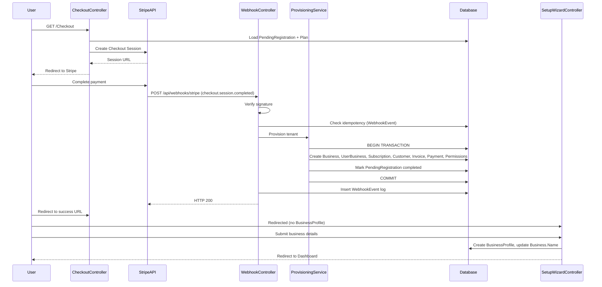
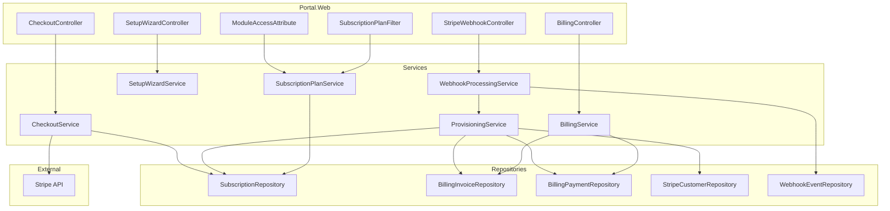
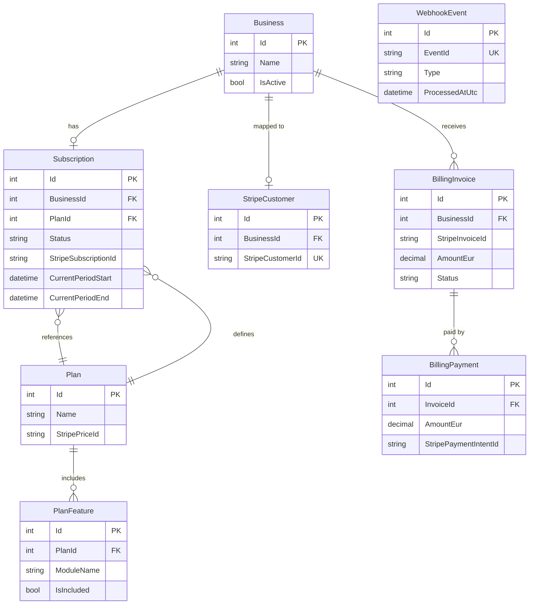

# Design Document: Stripe Onboarding

## Overview

This design covers the Stripe integration and tenant onboarding pipeline for the Portal platform. The flow begins after a user confirms their email (from the identity-pages spec) and proceeds through:

1. **Stripe Checkout Session creation** — redirecting the user to Stripe's hosted payment page
2. **Webhook processing** — receiving and handling Stripe payment lifecycle events
3. **Tenant auto-provisioning** — creating Business, Subscription, and permissions on successful payment
4. **Post-signup setup wizard** — collecting business details before dashboard access
5. **Module access middleware** — gating features by active subscription plan
6. **Billing history & PDF export** — viewing payment history and downloading invoices

The implementation introduces two new database schemas (`[billing]` and `[stripe]`), extends the existing `[dbo].[Plan]` table with a `StripePriceId` column, and replaces the `BusinessPlan` table with `billing.Subscription` as the single source of truth for subscription status.

### Key Design Decisions

| Decision | Rationale |
|----------|-----------|
| Stripe-hosted Checkout (not embedded) | Reduces PCI scope; Stripe handles card collection |
| Webhook-driven provisioning (not redirect-driven) | Guarantees provisioning even if user closes browser after payment |
| Single database transaction for provisioning | Atomicity — no partial tenant state |
| `billing.Subscription` replaces `BusinessPlan` | Single source of truth aligned with Stripe lifecycle |
| Authorization filter (not middleware pipeline) | Matches existing `ModuleAccessAttribute` pattern; per-controller granularity |
| Request-scoped caching for plan checks | Avoids repeated DB queries within a single HTTP request |
| DinkToPdf for invoice PDF | Consistent with existing StatementRenderer pattern |

---

## Architecture

### High-Level Flow



### Component Architecture



---

## Components and Interfaces

### 1. StripeSettings (Configuration)

```csharp
public class StripeSettings
{
    public string SecretKey { get; set; } = null!;
    public string PublishableKey { get; set; } = null!;
    public string WebhookSigningSecret { get; set; } = null!;
}
```

Registered via `IOptions<StripeSettings>` from User Secrets. Validated at startup — missing values throw a descriptive exception preventing application start.

### 2. CheckoutService

```csharp
public interface ICheckoutService
{
    /// <summary>
    /// Creates a Stripe Checkout Session for the user's pending registration.
    /// Returns the Stripe-hosted checkout URL for redirect.
    /// </summary>
    Task<CheckoutResult> CreateCheckoutSessionAsync(string userId);
}

public class CheckoutResult
{
    public bool Success { get; set; }
    public string? CheckoutUrl { get; set; }
    public string? ErrorMessage { get; set; }
    public CheckoutFailureReason? FailureReason { get; set; }
}

public enum CheckoutFailureReason
{
    NoPendingRegistration,
    AlreadyCompleted,
    PlanNotAvailable,
    StripeApiError
}
```

**Responsibilities:**
- Loads PendingRegistration and Plan from database
- Validates preconditions (not completed, Plan has StripePriceId)
- Creates Stripe Checkout Session with metadata (PendingRegistrationId, UserId)
- Sets success/cancel URLs
- Enables `allow_promotion_codes`
- Logs session creation via Serilog structured logging

### 3. StripeWebhookController

```csharp
[ApiController]
[Route("api/webhooks/stripe")]
public class StripeWebhookController : ControllerBase
{
    [HttpPost]
    public async Task<IActionResult> HandleWebhook();
}
```

**Responsibilities:**
- Reads raw request body
- Verifies Stripe signature using webhook signing secret
- Deserializes event and checks idempotency via `stripe.WebhookEvent`
- Routes to appropriate handler based on event type
- Wraps state changes + WebhookEvent log insert in a single transaction
- Returns HTTP 200 for success, 400 for invalid signature, 500 for unhandled errors

**Handled Event Types:**
| Event Type | Action |
|-----------|--------|
| `checkout.session.completed` | Invoke ProvisioningService |
| `invoice.paid` | Update subscription period, record payment |
| `invoice.payment_failed` | Set subscription status to `past_due` |
| `customer.subscription.updated` | Update subscription status/plan/period |
| `customer.subscription.deleted` | Set subscription status to `cancelled` |

### 4. ProvisioningService

```csharp
public interface IProvisioningService
{
    /// <summary>
    /// Provisions a new tenant from a completed Stripe checkout session.
    /// Creates Business, UserBusiness, Subscription, StripeCustomer, Invoice, Payment, and Permissions.
    /// All within a single database transaction.
    /// </summary>
    Task<ProvisioningResult> ProvisionTenantAsync(ProvisioningRequest request);
}

public class ProvisioningRequest
{
    public string UserId { get; set; } = null!;
    public int PendingRegistrationId { get; set; }
    public int PlanId { get; set; }
    public string StripeCustomerId { get; set; } = null!;
    public string StripeSessionId { get; set; } = null!;
    public string StripeSubscriptionId { get; set; } = null!;
    public string StripePaymentIntentId { get; set; } = null!;
    public DateTime SubscriptionStart { get; set; }
    public DateTime SubscriptionEnd { get; set; }
    public decimal AmountPaid { get; set; }
    public string Currency { get; set; } = null!;
}
```

**Transaction scope includes:**
1. Create `[portal].Business` (Name = "{FirstName} {LastName}'s Business", IsActive = true)
2. Create `[membership].UserBusiness` (IsOwner = true, IsDefault = true, IsActive = true)
3. Create `[billing].Subscription` (Status = "active")
4. Create `[stripe].Customer` (BusinessId → StripeCustomerId mapping)
5. Create `[billing].Invoice` (Status = "paid", initial payment amount)
6. Create `[billing].Payment` (linked to invoice, StripePaymentIntentId)
7. Create `[membership].UserBusinessPermission` for each included PlanFeature
8. Mark PendingRegistration as completed (IsCompleted = true, CompletedAtUtc)

### 5. SetupWizardService

```csharp
public interface ISetupWizardService
{
    /// <summary>
    /// Checks whether the business has completed the setup wizard (has a BusinessProfile).
    /// </summary>
    Task<bool> IsSetupCompleteAsync(int businessId);

    /// <summary>
    /// Validates and saves the setup wizard form data.
    /// Creates BusinessProfile and updates Business.Name.
    /// </summary>
    Task<SetupWizardResult> CompleteSetupAsync(int businessId, SetupWizardModel model);

    /// <summary>
    /// Checks if a business name is already in use by another tenant.
    /// </summary>
    Task<bool> IsBusinessNameTakenAsync(string name, int excludeBusinessId);
}
```

**Setup Wizard redirect logic** is implemented as an `IAsyncActionFilter` (`SetupWizardRedirectFilter`) registered globally. It checks:
- User is authenticated with `IsOwner` claim
- User has a `BusinessId` claim
- No `BusinessProfile` exists for that BusinessId
- Current request is NOT already targeting the setup wizard

If all conditions met → redirect to `/Setup/Wizard`.

### 6. SubscriptionPlanService (Module Access)

```csharp
public interface ISubscriptionPlanService
{
    /// <summary>
    /// Gets the subscription status and plan features for a business.
    /// Results are cached for the HTTP request lifetime.
    /// </summary>
    Task<SubscriptionAccessResult> GetAccessAsync(int businessId);
}

public class SubscriptionAccessResult
{
    public bool HasActiveSubscription { get; set; }
    public string SubscriptionStatus { get; set; } = null!;
    public string PlanName { get; set; } = null!;
    public HashSet<string> IncludedModules { get; set; } = new();
}
```

The existing `ModuleAccessAttribute` will be extended to check subscription status before checking user-level permissions. The check order:
1. SuperAdmin bypass (existing)
2. Resolve BusinessId from claims
3. Check `billing.Subscription` status (active/trialing → allow, past_due → allow with warning, others → deny)
4. Check `PlanFeature` includes the requested module
5. Check user-level permission (existing `IPermissionService`)

### 7. BillingService

```csharp
public interface IBillingService
{
    Task<BillingOverviewModel> GetBillingOverviewAsync(int businessId);
    Task<PagedResult<BillingInvoiceModel>> GetInvoicesAsync(int businessId, int page, int pageSize);
    Task<byte[]> GenerateInvoicePdfAsync(int invoiceId, int businessId);
}
```

PDF generation uses the existing `IViewRenderService` + DinkToPdf pattern (same as `StatementRenderer`). The PDF includes:
- 3 Inventors company header (logo, name, address)
- Subscribing business details (from BusinessProfile)
- Invoice number, date, period
- Line items (plan name, qty 1, unit price)
- Subtotal, VAT (if applicable), total
- Payment method and date

---

## Data Models

### New Schemas

```sql
-- [billing] schema: subscription lifecycle and financial records
-- [stripe] schema: Stripe integration data (customer mapping, webhook idempotency)
```

### billing.Subscription

| Column | Type | Constraints |
|--------|------|-------------|
| Id | INT IDENTITY | PK |
| BusinessId | INT | NOT NULL, FK → [dbo].[Business].Id |
| PlanId | INT | NOT NULL, FK → [dbo].[Plan].Id |
| Status | NVARCHAR(20) | NOT NULL, CHECK IN ('active','past_due','cancelled','trialing','incomplete','unpaid') |
| StripeSubscriptionId | NVARCHAR(100) | NULL, for correlation with Stripe |
| CurrentPeriodStart | DATETIME | NOT NULL |
| CurrentPeriodEnd | DATETIME | NOT NULL |
| CancelledAtUtc | DATETIME | NULL |
| CreatedAtUtc | DATETIME | NOT NULL, DEFAULT GETUTCDATE() |

### billing.Invoice

| Column | Type | Constraints |
|--------|------|-------------|
| Id | INT IDENTITY | PK |
| BusinessId | INT | NOT NULL, FK → [dbo].[Business].Id |
| StripeInvoiceId | NVARCHAR(100) | NULL |
| AmountEur | DECIMAL(10,2) | NOT NULL, CHECK >= 0.00 |
| PeriodStart | DATETIME | NOT NULL |
| PeriodEnd | DATETIME | NOT NULL |
| Status | NVARCHAR(20) | NOT NULL, CHECK IN ('draft','open','paid','void','uncollectible') |
| PaidAtUtc | DATETIME | NULL |
| CreatedAtUtc | DATETIME | NOT NULL, DEFAULT GETUTCDATE() |

### billing.Payment

| Column | Type | Constraints |
|--------|------|-------------|
| Id | INT IDENTITY | PK |
| InvoiceId | INT | NOT NULL, FK → billing.Invoice.Id |
| AmountEur | DECIMAL(10,2) | NOT NULL, CHECK >= 0.00 |
| Method | NVARCHAR(50) | NOT NULL |
| PaidAtUtc | DATETIME | NOT NULL |
| StripePaymentIntentId | NVARCHAR(100) | NULL |
| CreatedAtUtc | DATETIME | NOT NULL, DEFAULT GETUTCDATE() |

### stripe.Customer

| Column | Type | Constraints |
|--------|------|-------------|
| Id | INT IDENTITY | PK |
| BusinessId | INT | NOT NULL, FK → [dbo].[Business].Id |
| StripeCustomerId | NVARCHAR(100) | NOT NULL, UNIQUE |
| CreatedAtUtc | DATETIME | NOT NULL, DEFAULT GETUTCDATE() |

### stripe.WebhookEvent

| Column | Type | Constraints |
|--------|------|-------------|
| Id | INT IDENTITY | PK |
| EventId | NVARCHAR(100) | NOT NULL, UNIQUE |
| Type | NVARCHAR(100) | NOT NULL |
| ProcessedAtUtc | DATETIME | NULL |
| CreatedAtUtc | DATETIME | NOT NULL, DEFAULT GETUTCDATE() |

### Extension to [dbo].[Plan]

| Column | Type | Constraints |
|--------|------|-------------|
| StripePriceId | NVARCHAR(100) | NULL |

### Entity Relationship Diagram



---


## Correctness Properties

*A property is a characteristic or behavior that should hold true across all valid executions of a system — essentially, a formal statement about what the system should do. Properties serve as the bridge between human-readable specifications and machine-verifiable correctness guarantees.*

### Property 1: Checkout precondition enforcement

*For any* authenticated user with a PendingRegistration, the CheckoutService SHALL create a Stripe Checkout Session if and only if the PendingRegistration is not completed AND the referenced Plan has a non-null, non-empty StripePriceId. In all other cases, no Stripe session is created and the appropriate redirect or error is returned.

**Validates: Requirements 1.1, 1.6, 1.8**

### Property 2: Webhook idempotency

*For any* Stripe webhook event whose EventId already exists in the `stripe.WebhookEvent` table, the handler SHALL return HTTP 200 without modifying any database state (no subscription updates, no new records, no duplicate WebhookEvent entries).

**Validates: Requirements 2.4, 2.5**

### Property 3: Webhook state transitions

*For any* active `billing.Subscription`, when an `invoice.payment_failed` event is processed the status SHALL become `past_due`, and when a `customer.subscription.deleted` event is processed the status SHALL become `cancelled` with `CancelledAtUtc` set to the current UTC time. No other fields are modified beyond the status and cancellation timestamp.

**Validates: Requirements 2.8, 2.10**

### Property 4: Webhook subscription synchronization

*For any* `invoice.paid` event with a valid subscription reference, the handler SHALL update `CurrentPeriodEnd` to match the Stripe invoice period end and record the payment amount. *For any* `customer.subscription.updated` event, the handler SHALL update the local subscription's Status, PlanId, CurrentPeriodStart, and CurrentPeriodEnd to match the values in the Stripe event data.

**Validates: Requirements 2.7, 2.9**

### Property 5: Provisioning completeness

*For any* valid `checkout.session.completed` event with a non-completed PendingRegistration, the ProvisioningService SHALL create exactly: one Business (IsActive=true, Name="{FirstName} {LastName}'s Business"), one UserBusiness (IsOwner=true, IsDefault=true, IsActive=true), one Subscription (Status="active", correct period dates), one StripeCustomer mapping, one billing Invoice (Status="paid"), one billing Payment (linked to invoice), and N UserBusinessPermission records (one per PlanFeature where IsIncluded=true with AccessLevel="full"). The PendingRegistration SHALL be marked completed.

**Validates: Requirements 3.1, 3.2, 3.3, 3.4, 3.5, 3.6, 3.9, 3.10**

### Property 6: Provisioning idempotency

*For any* `checkout.session.completed` event where the PendingRegistration is already marked as completed OR the Stripe Session Id has already been provisioned, the ProvisioningService SHALL create zero new records and return success without error.

**Validates: Requirements 3.11, 3.12**

### Property 7: Setup wizard redirect enforcement

*For any* authenticated HTTP request by a user with the `IsOwner` claim whose Business has no `BusinessProfile` record, the system SHALL redirect to the setup wizard page, regardless of the originally requested URL (excluding the setup wizard route itself).

**Validates: Requirements 4.1, 4.11**

### Property 8: Setup wizard form persistence

*For any* valid setup wizard submission (business name 1–200 chars, currency selected, optional fields within length limits), the system SHALL create a BusinessProfile with values matching the submitted data, update Business.Name to the submitted business name, and store null for any optional fields left empty.

**Validates: Requirements 4.3, 4.5, 4.9**

### Property 9: Setup wizard input validation

*For any* business name that is empty, whitespace-only, or exceeds 200 characters, the setup wizard SHALL reject the submission without creating a BusinessProfile. *For any* VAT number exceeding 50 characters, the submission SHALL be rejected. *For any* uploaded file that is not PNG/JPG/SVG or exceeds 2MB, the submission SHALL be rejected.

**Validates: Requirements 4.7, 4.8, 4.4, 4.12**

### Property 10: Business name uniqueness enforcement

*For any* setup wizard submission where the provided business name matches an existing Business.Name belonging to a different tenant, the system SHALL reject the submission with a validation error.

**Validates: Requirements 4.14**

### Property 11: Module access decision correctness

*For any* authenticated user requesting a module-gated endpoint: access SHALL be granted if and only if (1) the user's Business has a Subscription with Status in {active, trialing, past_due} AND (2) the requested module exists in PlanFeature with IsIncluded=true for the Business's Plan AND (3) the module identifier is a valid value in PortalModules.All. When Status is `past_due`, access is granted with a warning flag set. For any invalid module identifier, access is denied and a warning is logged.

**Validates: Requirements 5.1, 5.2, 5.3, 5.4, 5.8, 5.11**

### Property 12: Billing invoice ordering

*For any* set of billing invoices belonging to a Business, the Billing page SHALL return them ordered by PaidAtUtc descending (most recent first), and pagination SHALL preserve this ordering across pages.

**Validates: Requirements 9.3**

### Property 13: Billing summary aggregation

*For any* set of billing invoices for a Business, the summary SHALL display: total amount paid = sum of all invoice AmountEur where Status = 'paid', invoice count = total number of invoices, and last payment date = maximum PaidAtUtc value. When no invoices exist, total paid = 0, count = 0, and last payment date is null.

**Validates: Requirements 9.7, 9.8**

### Property 14: Invoice PDF content completeness

*For any* billing invoice with an associated Business and BusinessProfile, the generated PDF SHALL contain: the 3 Inventors company header, the business name, VAT number (if available), address (if available), invoice number (derived from Id), invoice date, period covered, plan name as line item with quantity 1 and unit price, subtotal, total amount, payment method, and payment date.

**Validates: Requirements 9.4, 9.5, 9.6**

---

## Error Handling

### Checkout Flow Errors

| Scenario | Handling |
|----------|----------|
| PendingRegistration not found | Redirect to registration page |
| PendingRegistration already completed | Redirect to dashboard |
| Plan.StripePriceId is null/empty | Log error (PlanId, UserId), display "plan not available" message |
| Stripe API error | Log full Stripe error details, display "payment setup failed" with retry button |
| User not authenticated | Redirect to login (handled by `[Authorize]`) |

### Webhook Errors

| Scenario | Handling |
|----------|----------|
| Invalid/missing signature | HTTP 400, log warning with timestamp and source IP |
| Duplicate EventId | HTTP 200, log informational, skip processing |
| Referenced subscription not found | HTTP 200, log warning with event type and Stripe subscription ID |
| Unhandled event type | HTTP 200, log informational |
| Processing exception | Roll back transaction, log error with EventId and type, HTTP 500 (triggers Stripe retry) |
| Timeout risk (>25s processing) | N/A — all operations are local DB; if slow, investigate query performance |

### Provisioning Errors

| Scenario | Handling |
|----------|----------|
| PendingRegistration not found or completed | Log warning, skip provisioning, return success to Stripe |
| Duplicate Stripe Session Id | Log informational, skip provisioning, return success |
| Any step failure | Roll back entire transaction, log error (UserId, PlanId, SessionId), leave PendingRegistration incomplete |
| Business name collision during provisioning | Use placeholder name (collision resolved during setup wizard) |

### Setup Wizard Errors

| Scenario | Handling |
|----------|----------|
| Invalid business name (empty/>200 chars) | Client-side + server-side validation error |
| Duplicate business name | Server-side validation error: "business name already in use" |
| Invalid logo (wrong type/>2MB) | Client-side + server-side validation error with specific constraint message |
| Server error on save | Display error message, preserve form data for retry |

### Module Access Errors

| Scenario | Handling |
|----------|----------|
| No Business association | Redirect to error page |
| Subscription inactive (cancelled/incomplete/unpaid) | Redirect to "subscription required" page |
| Module not in plan | Display "upgrade required" page showing available plans |
| Invalid module identifier | Deny access, log warning (UserId, module, BusinessId) |
| past_due subscription | Allow access, set `ViewData["SubscriptionWarning"]` for banner display |

### General Error Patterns

- **Repositories**: try/catch with `throw;` (rethrow to preserve stack trace)
- **Services**: catch, add context, rethrow or return typed result
- **Controllers**: catch, log via Serilog structured logging, return appropriate HTTP response
- **Webhook controller**: never swallow errors for handled events (HTTP 500 triggers Stripe retry)

---

## Testing Strategy

### Property-Based Testing

**Library**: [FsCheck](https://fscheck.github.io/FsCheck/) with xUnit integration (`FsCheck.Xunit`)

**Configuration**: Minimum 100 iterations per property test.

**Tag format**: `Feature: stripe-onboarding, Property {number}: {property_text}`

Each correctness property (1–14) maps to a single property-based test. Generators will produce:
- Random Plan configurations (with/without StripePriceId, varying features)
- Random PendingRegistration states (completed/incomplete)
- Random Stripe event payloads (varying amounts, periods, statuses)
- Random business names (valid/invalid lengths, duplicates)
- Random file metadata (type, size combinations)
- Random subscription states and module combinations

### Unit Tests (Example-Based)

| Area | Tests |
|------|-------|
| CheckoutService | Redirect URLs set correctly, metadata includes correct keys, allow_promotion_codes enabled |
| WebhookController | Signature verification (valid/invalid), HTTP response codes, unhandled event type logging |
| ProvisioningService | Transaction rollback on failure, correct Business.Name format |
| SetupWizardService | Redirect after completion, form data preservation on error |
| BillingService | Empty state handling, PDF generation with missing optional fields |
| ModuleAccessAttribute | SuperAdmin bypass, check order (plan before user-level) |

### Integration Tests

| Area | Tests |
|------|-------|
| Database | Schema creation (billing/stripe schemas exist), FK constraints, CHECK constraints |
| Webhook pipeline | End-to-end event processing with real DB transaction |
| Provisioning | Full transaction with all record creation, rollback verification |
| Module access | Full request pipeline with real authorization filter |

### Test Infrastructure

- **Mocking**: Moq for Stripe API client, ILogger, external services
- **Database**: In-memory SQLite or SQL Server LocalDB for integration tests
- **Stripe events**: Factory methods generating valid Stripe event JSON payloads
- **Test fixtures**: Shared setup for Plan/PlanFeature seed data

