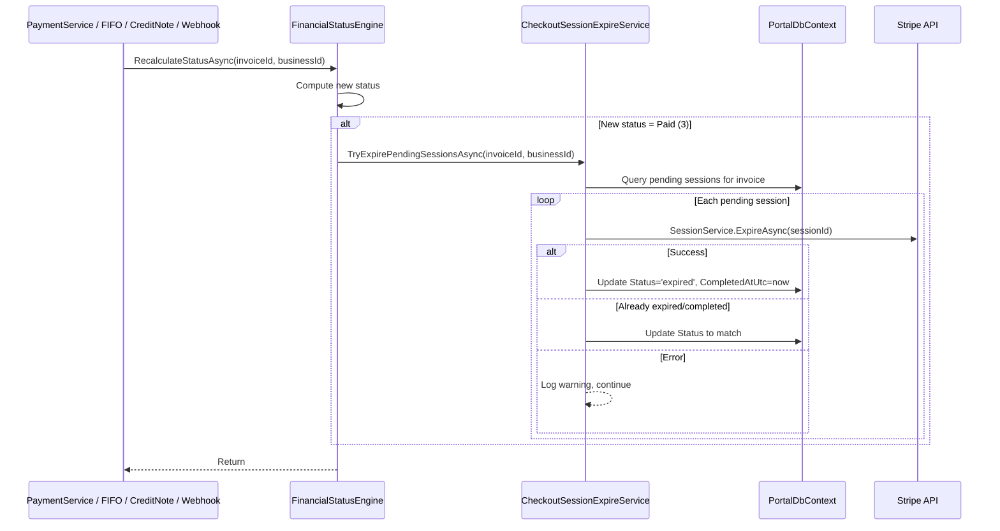

# Design Document: Stripe Session Auto-Expire

## Overview

When an invoice becomes fully paid, any still-open Stripe Checkout Sessions for that invoice become a liability — a customer with the checkout page open can complete payment, causing an overpayment. This feature introduces an `ICheckoutSessionExpireService` that proactively expires all pending Checkout Sessions via the Stripe API the moment an invoice transitions to the Paid status.

The integration point is inside `FinancialStatusEngine.RecalculateStatusAsync`. After the engine determines the new status is Paid (3), it calls the expire service. This single hook covers all trigger paths (manual payment, FIFO allocation, credit note, webhook) without requiring changes to each caller.

For the webhook path (checkout.session.completed), special handling excludes the session that just completed from the expiration batch.

## Architecture



### Integration Strategy

The expire service is injected into `FinancialStatusEngine` as an optional dependency. The engine calls it fire-and-forget style (no `await` blocking the critical path — or more precisely, the expire runs but its failure never propagates to the caller).

For the webhook special case, `HandleCheckoutCompletedAsync` passes an `excludeSessionId` parameter so the session that just completed is not expired.

## Components and Interfaces

### ICheckoutSessionExpireService

```csharp
namespace Portal.Infrastructure.Services;

/// <summary>
/// Expires pending Stripe Checkout Sessions when an invoice becomes fully paid.
/// </summary>
public interface ICheckoutSessionExpireService
{
    /// <summary>
    /// Attempts to expire all pending checkout sessions for the specified invoice.
    /// Runs gracefully — never throws, logs warnings on failure.
    /// </summary>
    /// <param name="invoiceId">The invoice that became fully paid.</param>
    /// <param name="businessId">The business owning the invoice.</param>
    /// <param name="excludeSessionId">Optional Stripe session ID to exclude (the session that just completed).</param>
    Task TryExpirePendingSessionsAsync(int invoiceId, int businessId, string? excludeSessionId = null);
}
```

### CheckoutSessionExpireService

```csharp
namespace Portal.Infrastructure.Services;

public class CheckoutSessionExpireService : ICheckoutSessionExpireService
{
    private readonly PortalDbContext _context;
    private readonly IStripeKeyResolutionService _keyResolutionService;
    private readonly ILogger<CheckoutSessionExpireService> _logger;

    // Constructor with DI

    public async Task TryExpirePendingSessionsAsync(int invoiceId, int businessId, string? excludeSessionId = null)
    {
        // 1. Query pending sessions for invoice (excluding excludeSessionId if provided)
        // 2. Log: "Starting auto-expire for InvoiceId={id}, PendingSessions={count}"
        // 3. Resolve Stripe keys for business
        // 4. For each session:
        //    a. Call Stripe ExpireAsync with RequestOptions using resolved secret key
        //    b. On success: update Status='expired', CompletedAtUtc=UtcNow
        //    c. On StripeException (resource_missing / already expired): update status, continue
        //    d. On other StripeException: log warning, continue
        // 5. SaveChanges once at the end (batch)
        // 6. Log summary: processed, succeeded, failed
    }
}
```

### FinancialStatusEngine Changes

Add `ICheckoutSessionExpireService` as an optional constructor parameter. After determining the new status is Paid (3) and updating the invoice, call the expire service:

```csharp
// After updating financial status
if (newStatusId == StatusPaid)
{
    try
    {
        await _checkoutSessionExpireService.TryExpirePendingSessionsAsync(invoiceId, businessId);
    }
    catch (Exception ex)
    {
        // Never let expire failure block the payment recording
        // Log is handled inside the service, but guard here too
    }
}
```

### Webhook Handler Changes

In `StripeConnectService.HandleCheckoutCompletedAsync`, after calling `RecalculateStatusAsync`, we need to handle the case where the engine already fired the expire service. Since the engine doesn't know about the "just completed" session, we modify the approach:

**Option chosen**: The `FinancialStatusEngine` accepts an optional `excludeSessionId` parameter that it passes through to the expire service. The webhook handler calls a new overload:

```csharp
Task RecalculateStatusAsync(int invoiceId, int businessId, string? excludeStripeSessionId = null);
```

This keeps all logic in one path without requiring the webhook to call the expire service separately.

## Data Models

### Existing Entity: StripeCheckoutSession

No schema changes needed. The feature uses existing columns:

| Column | Type | Usage |
|--------|------|-------|
| `Id` | int | PK |
| `BusinessId` | int | Filter |
| `InvoiceId` | int | Filter — find sessions for the paid invoice |
| `StripeSessionId` | string | Used for Stripe API call |
| `Status` | string | Filter by 'pending', update to 'expired' |
| `CompletedAtUtc` | DateTime? | Set to UtcNow on expiration |

### Query Pattern

```sql
SELECT StripeCheckoutSessions.Id, StripeCheckoutSessions.StripeSessionId
FROM [stripe].[CheckoutSession] AS StripeCheckoutSessions
WHERE StripeCheckoutSessions.InvoiceId = @invoiceId
  AND StripeCheckoutSessions.BusinessId = @businessId
  AND StripeCheckoutSessions.Status = 'pending'
  AND (@excludeSessionId IS NULL OR StripeCheckoutSessions.StripeSessionId <> @excludeSessionId)
```

## Correctness Properties

*A property is a characteristic or behavior that should hold true across all valid executions of a system — essentially, a formal statement about what the system should do. Properties serve as the bridge between human-readable specifications and machine-verifiable correctness guarantees.*

### Property 1: All pending sessions are attempted exactly once

*For any* set of N pending sessions for an invoice (with any failure pattern applied to the Stripe API), the expire service SHALL attempt to expire each session exactly once, regardless of whether other sessions in the batch succeed or fail.

**Validates: Requirements 1.2, 3.1**

### Property 2: Successful expiration updates the local record

*For any* pending session where the Stripe API returns a successful expiration response, the local database record SHALL have its Status set to 'expired' and CompletedAtUtc set to a non-null UTC timestamp.

**Validates: Requirements 1.3, 4.1, 4.2**

### Property 3: Failed expiration preserves the local record

*For any* pending session where the Stripe API returns an error (excluding "already expired/completed"), the local database record SHALL remain unchanged with Status = 'pending' and CompletedAtUtc = null.

**Validates: Requirements 3.1, 4.3**

### Property 4: Webhook exclusion removes exactly one session

*For any* set of N pending sessions for an invoice where one session matches the `excludeSessionId`, the expire service SHALL attempt to expire exactly N-1 sessions (all except the excluded one).

**Validates: Requirements 2.4**

## Error Handling

| Scenario | Handling | Impact |
|----------|----------|--------|
| Stripe API returns 5xx / timeout | Log warning with session ID and error, continue to next session | Session remains 'pending' — can be manually expired or will expire naturally after 24h |
| Stripe API returns "session already expired" | Update local Status to 'expired', set CompletedAtUtc, continue | Data consistency maintained |
| Stripe API returns "session already completed" | Update local Status to 'completed', continue | Edge case: customer completed between our check and expire call |
| Stripe completely unreachable | All sessions fail individually, log summary, return without throwing | Payment recording succeeds; sessions expire naturally on Stripe's side after 24h |
| StripeKeyResolution fails | Log error, return immediately without processing any sessions | Sessions remain 'pending' |
| Database query fails | Exception logged by repository layer, caught in engine's try/catch | Payment recording still succeeds |

### Failure Isolation Principle

The expire service NEVER throws exceptions to its caller. All failures are contained and logged. The payment recording operation (the critical business path) always completes regardless of expire service behavior.

## Testing Strategy

### Property-Based Tests (FsCheck)

The expire service has clear input/output behavior suitable for property-based testing with mocked dependencies:

- **Generator**: Random lists of `StripeCheckoutSession` entities (varying count 0–10, random session IDs)
- **Generator**: Random failure patterns (which sessions succeed/fail at the Stripe API level)
- **Mock**: `IStripeKeyResolutionService` returns valid keys
- **Mock**: Stripe `SessionService` — configurable per-session success/failure

Each property test runs minimum 100 iterations with FsCheck.

Tag format: `Feature: stripe-session-auto-expire, Property {N}: {property_text}`

### Unit Tests (xUnit)

Example-based tests for:
- Empty pending sessions list → no API calls, no errors
- Single pending session → one expire call
- "Already expired" Stripe response → status updated without error log
- Total Stripe unreachability → returns without exception
- Logging output verification (start, success, failure, summary messages)

### Integration Tests

- Manual payment → Paid → expire service triggered (verify via mock)
- FIFO allocation → Paid → expire service triggered
- Credit note → Paid → expire service triggered
- Webhook → Paid → expire service triggered with exclusion
- Partial payment → NOT Paid → expire service NOT triggered
