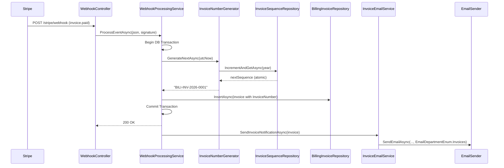
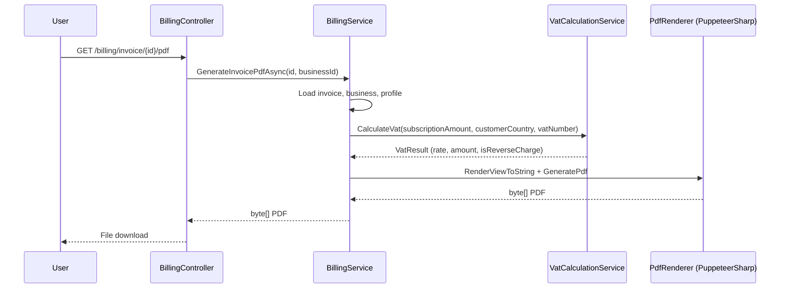
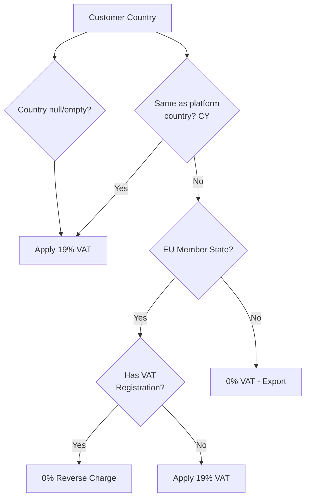

# Design Document: Subscription Billing Invoices

## Overview

This design introduces formal invoice number generation and management for the Portal (Bili) platform's subscription billing system. While Stripe handles payment collection, 3 Inventors requires its own compliant invoices for accounting, VAT reporting, and legal compliance in Cyprus (EU).

The system adds:
1. A sequential invoice numbering service producing `{PlatformCode}-INV-{yyyy}-{NNNN}` formatted numbers
2. A database-persisted sequence counter ensuring uniqueness across restarts and multi-instance deployments
3. Schema extensions to store the formal invoice number on existing billing records
4. Updated PDF generation using proper invoice numbers and full Cyprus VAT invoice fields
5. VAT calculation logic based on customer country and EU reverse-charge rules
6. Email delivery of invoice notifications upon payment
7. A backfill mechanism for existing records
8. Parsing/formatting utilities with round-trip guarantees

### Key Design Decisions

| Decision | Rationale |
|----------|-----------|
| Database-level atomic counter (not in-memory) | Survives app restarts, safe for multi-instance deployments |
| `UPDATE ... OUTPUT` for sequence increment | SQL Server atomic operation prevents duplicates without explicit locks |
| Nullable InvoiceNumber on existing table | Backward compatibility — legacy records remain valid |
| Filtered unique index (WHERE InvoiceNumber IS NOT NULL) | Allows NULL legacy records while enforcing uniqueness on assigned numbers |
| Asynchronous email after commit | Email failure must not block Stripe webhook acknowledgment |
| VAT logic in a dedicated service | Separation of concerns; testable independently of PDF rendering |
| Invoice number format utility as pure functions | Enables property-based testing for round-trip correctness |

## Architecture



### Component Interaction (Billing PDF Download)



## Components and Interfaces

### 1. InvoiceNumberGenerator

**Location:** `Portal.Web/Services/Billing/InvoiceNumberGenerator.cs`

**Responsibilities:**
- Generate sequential invoice numbers in the format `{PlatformCode}-INV-{yyyy}-{NNNN}`
- Validate PlatformCode configuration
- Delegate persistence to `InvoiceSequenceRepository`
- Provide format/parse utility methods

```csharp
public interface IInvoiceNumberGenerator
{
    /// <summary>
    /// Generates the next sequential invoice number for the current UTC year.
    /// Must be called within an active database transaction.
    /// </summary>
    Task<string> GenerateNextAsync(DateTime utcNow);

    /// <summary>
    /// Formats an invoice number from its components.
    /// </summary>
    string Format(string platformCode, int year, int sequence);

    /// <summary>
    /// Parses an invoice number string into its components.
    /// Returns null if the format is invalid.
    /// </summary>
    InvoiceNumberComponents? Parse(string invoiceNumber);
}

public record InvoiceNumberComponents(string PlatformCode, int Year, int Sequence);
```

### 2. InvoiceSequenceRepository

**Location:** `Portal.Infrastructure/Repositories/InvoiceSequenceRepository.cs`

**Responsibilities:**
- Atomic increment-and-return of the sequence counter per year
- Create new year rows on first use
- Enforce the 9999 annual limit (requirement 2.5)

```csharp
public interface IInvoiceSequenceRepository
{
    /// <summary>
    /// Atomically increments and returns the next sequence number for the given year.
    /// Creates the year row if it does not exist.
    /// Throws InvalidOperationException if the annual limit (9999) is exceeded.
    /// Must be called within an active database transaction.
    /// </summary>
    Task<int> IncrementAndGetAsync(int year);
}
```

**SQL Strategy:** Uses `MERGE` with `OUTPUT` to atomically insert-or-update:

```sql
MERGE [billing].[InvoiceSequence] WITH (HOLDLOCK) AS Target
USING (SELECT @Year AS [Year]) AS Source
ON Target.[Year] = Source.[Year]
WHEN MATCHED THEN
    UPDATE SET Target.[LastNumber] = Target.[LastNumber] + 1
WHEN NOT MATCHED THEN
    INSERT ([Year], [LastNumber], [CreatedAtUtc])
    VALUES (@Year, 1, GETUTCDATE())
OUTPUT INSERTED.[LastNumber];
```

### 3. VatCalculationService

**Location:** `Portal.Web/Services/Billing/VatCalculationService.cs`

**Responsibilities:**
- Determine the applicable VAT rate based on customer country and VAT registration status
- Apply Cyprus domestic VAT rules (19%)
- Apply EU reverse-charge mechanism (0% with notation)
- Handle non-EU customers (0%)
- Default to 19% when country is unknown

```csharp
public interface IVatCalculationService
{
    /// <summary>
    /// Calculates VAT for a subscription invoice based on customer location and VAT registration.
    /// </summary>
    VatCalculationResult Calculate(decimal netAmount, string? customerCountry, string? customerVatNumber);
}

public record VatCalculationResult(
    decimal VatRate,
    decimal VatAmount,
    decimal GrossAmount,
    bool IsReverseCharge,
    string? ReverseChargeNotation);
```

### 4. InvoiceEmailService

**Location:** `Portal.Web/Services/Billing/InvoiceEmailService.cs`

**Responsibilities:**
- Send invoice notification emails after payment using `EmailDepartmentEnum.Invoices`
- Prevent duplicate sends using an `IsEmailSent` flag on the BillingInvoice
- Log failures as warnings without rolling back invoice creation
- Skip delivery when no email is registered

```csharp
public interface IInvoiceEmailService
{
    /// <summary>
    /// Sends an invoice notification email to the business owner.
    /// Called after the invoice creation transaction has committed.
    /// Failures are logged but do not throw.
    /// </summary>
    Task SendInvoiceNotificationAsync(int billingInvoiceId);
}
```

### 5. InvoiceBackfillService

**Location:** `Portal.Web/Services/Billing/InvoiceBackfillService.cs`

**Responsibilities:**
- Assign InvoiceNumbers to existing records with NULL values
- Process in chronological order per year
- Execute within a single transaction per year for sequence integrity
- Idempotent: skip records that already have numbers

```csharp
public interface IInvoiceBackfillService
{
    /// <summary>
    /// Backfills invoice numbers for all BillingInvoice records with null InvoiceNumber.
    /// Processes year by year in chronological order.
    /// Returns the count of records updated.
    /// </summary>
    Task<int> BackfillAsync();
}
```

### 6. Updated BillingService

The existing `BillingService.GenerateInvoicePdfAsync` will be updated to:
- Use the persisted `InvoiceNumber` instead of `INV-{Id:D6}`
- Fall back to legacy format for NULL InvoiceNumber records
- Include full company details from `InvoiceSettings`
- Include VAT calculation results from `VatCalculationService`
- Include reverse-charge notation when applicable

### 7. Updated WebhookProcessingService

The `HandleInvoicePaid` method will be updated to:
- Call `IInvoiceNumberGenerator.GenerateNextAsync()` within the existing transaction
- Store the InvoiceNumber on the `BillingInvoice` entity
- Call `IInvoiceEmailService.SendInvoiceNotificationAsync()` after transaction commit

## Data Models

### New Table: `[billing].[InvoiceSequence]`

| Column | Type | Nullable | Default | Description |
|--------|------|----------|---------|-------------|
| Year | INT | NOT NULL | — | Primary Key. Calendar year (e.g. 2026) |
| LastNumber | INT | NOT NULL | 0 | Last assigned sequence number for this year |
| CreatedAtUtc | DATETIME | NOT NULL | GETUTCDATE() | When this year row was first created |

**Constraints:**
- `PK_InvoiceSequence` — PRIMARY KEY on `Year`
- `CK_InvoiceSequence_LastNumber` — CHECK (`LastNumber >= 0`)

**Migration:** `085_CreateInvoiceSequenceTable.sql`

```sql
IF NOT EXISTS (SELECT 1 FROM sys.tables WHERE name = 'InvoiceSequence' AND schema_id = SCHEMA_ID('billing'))
BEGIN
    CREATE TABLE [billing].[InvoiceSequence]
    (
        [Year]          INT         NOT NULL,
        [LastNumber]    INT         NOT NULL CONSTRAINT DF_InvoiceSequence_LastNumber DEFAULT (0),
        [CreatedAtUtc]  DATETIME    NOT NULL CONSTRAINT DF_InvoiceSequence_CreatedAtUtc DEFAULT (GETUTCDATE()),

        CONSTRAINT PK_InvoiceSequence PRIMARY KEY CLUSTERED ([Year]),
        CONSTRAINT CK_InvoiceSequence_LastNumber CHECK ([LastNumber] >= 0)
    );
END
```

### Schema Extension: `[billing].[Invoice]` — Add InvoiceNumber Column

**Migration:** `086_AddInvoiceNumberToBillingInvoice.sql`

| Column | Type | Nullable | Description |
|--------|------|----------|-------------|
| InvoiceNumber | NVARCHAR(50) | NULL | Formal invoice number (e.g. BILI-INV-2026-0001) |
| IsEmailSent | BIT | NOT NULL, DEFAULT 0 | Whether the notification email has been sent |

```sql
IF NOT EXISTS (SELECT 1 FROM sys.columns WHERE object_id = OBJECT_ID('[billing].[Invoice]') AND name = 'InvoiceNumber')
BEGIN
    ALTER TABLE [billing].[Invoice]
    ADD [InvoiceNumber] NVARCHAR(50) NULL;
END

IF NOT EXISTS (SELECT 1 FROM sys.columns WHERE object_id = OBJECT_ID('[billing].[Invoice]') AND name = 'IsEmailSent')
BEGIN
    ALTER TABLE [billing].[Invoice]
    ADD [IsEmailSent] BIT NOT NULL CONSTRAINT DF_Invoice_IsEmailSent DEFAULT (0);
END

-- Filtered unique index: only applies to non-null InvoiceNumber values
IF NOT EXISTS (SELECT 1 FROM sys.indexes WHERE name = 'UX_Invoice_InvoiceNumber' AND object_id = OBJECT_ID('[billing].[Invoice]'))
BEGIN
    CREATE UNIQUE NONCLUSTERED INDEX [UX_Invoice_InvoiceNumber]
    ON [billing].[Invoice] ([InvoiceNumber])
    WHERE [InvoiceNumber] IS NOT NULL;
END
```

### Updated Entity: `BillingInvoice`

```csharp
public class BillingInvoice
{
    public int Id { get; set; }
    public int BusinessId { get; set; }
    public string? StripeInvoiceId { get; set; }
    public decimal AmountEur { get; set; }
    public DateTime PeriodStart { get; set; }
    public DateTime PeriodEnd { get; set; }
    public string Status { get; set; } = null!;
    public DateTime? PaidAtUtc { get; set; }
    public string? InvoiceNumber { get; set; }       // NEW
    public bool IsEmailSent { get; set; }            // NEW
    public DateTime CreatedAtUtc { get; set; }

    // Navigation properties
    public Business Business { get; set; } = null!;
    public ICollection<BillingPayment> BillingPayments { get; set; } = new List<BillingPayment>();
}
```

### New Entity: `InvoiceSequence`

```csharp
public class InvoiceSequence
{
    public int Year { get; set; }
    public int LastNumber { get; set; }
    public DateTime CreatedAtUtc { get; set; }
}
```

### Updated PDF Model: `BillingInvoicePdfModel`

The existing `BillingInvoicePdfModel` will be extended with:

```csharp
// Issuer details (from InvoiceSettings)
public string CompanyCountryCode { get; set; } = null!;
public string CompanyVatNumber { get; set; } = null!;
public string CompanyEmail { get; set; } = null!;

// VAT details
public decimal VatRate { get; set; }
public decimal VatAmount { get; set; }
public bool IsReverseCharge { get; set; }
public string? ReverseChargeNotation { get; set; }

// Subscriber VAT
public string? SubscriberVatNumber { get; set; }
```

### VAT Determination Logic



### EU Member States List

The `VatCalculationService` will maintain a static list of EU member state ISO 3166-1 alpha-2 codes for determination. This list is updated infrequently (last change: Croatia joined in 2013) and can be maintained as a constant array.


## Correctness Properties

*A property is a characteristic or behavior that should hold true across all valid executions of a system — essentially, a formal statement about what the system should do. Properties serve as the bridge between human-readable specifications and machine-verifiable correctness guarantees.*

### Property 1: Invoice number format validity

*For any* valid PlatformCode (1–10 alphanumeric characters), any valid year (4-digit), and any positive sequence number, the `Format` method SHALL produce a string matching the pattern `^[A-Za-z0-9]{1,10}-INV-\d{4}-\d{4,}$` where the year and sequence components correspond to the input values.

**Validates: Requirements 1.1, 8.1**

### Property 2: Format/Parse round-trip

*For any* valid PlatformCode, year, and sequence number, formatting the components into an invoice number string and then parsing that string back SHALL produce an `InvoiceNumberComponents` record with identical PlatformCode, year, and sequence values.

**Validates: Requirements 8.4**

### Property 3: Parse rejects malformed input

*For any* string that does not conform to the invoice number pattern `{AlphaNumeric}-INV-{4digits}-{digits}`, the `Parse` method SHALL return null (failure result).

**Validates: Requirements 8.3**

### Property 4: PlatformCode validation rejects invalid codes

*For any* string that is null, empty, or contains at least one non-alphanumeric character, the `InvoiceNumberGenerator` SHALL throw a configuration error and refuse to generate an invoice number.

**Validates: Requirements 1.6**

### Property 5: VAT calculation correctness

*For any* positive subscription amount, customer country code, and customer VAT registration number:
- If the country is "CY" (Cyprus), the VAT rate SHALL be 19%.
- If the country is an EU member state (not CY) and the VAT number is non-empty, the VAT rate SHALL be 0% with `IsReverseCharge = true`.
- If the country is an EU member state (not CY) and the VAT number is null or empty, the VAT rate SHALL be 19%.
- If the country is not an EU member state, the VAT rate SHALL be 0% with `IsReverseCharge = false`.
- In all cases, `VatAmount = netAmount × VatRate` and `GrossAmount = netAmount + VatAmount`.

**Validates: Requirements 9.1, 9.2, 9.3, 9.4**

### Property 6: No duplicate emails per invoice

*For any* BillingInvoice record, calling `SendInvoiceNotificationAsync` multiple times SHALL result in at most one email being sent — subsequent calls SHALL be no-ops when `IsEmailSent` is already true.

**Validates: Requirements 6.7**

### Property 7: Backfill chronological ordering with correct year

*For any* set of BillingInvoice records with null InvoiceNumber and varying CreatedAtUtc values, after backfill completes: (a) each assigned InvoiceNumber's year component SHALL match the record's `CreatedAtUtc.Year`, and (b) within the same year, records with earlier CreatedAtUtc SHALL receive lower sequence numbers.

**Validates: Requirements 7.1, 7.2**

### Property 8: Backfill idempotence

*For any* database state, running the backfill operation twice SHALL produce the same final state — invoices that already have an InvoiceNumber SHALL not be modified, and no additional InvoiceNumbers SHALL be assigned on the second run.

**Validates: Requirements 7.3**

## Error Handling

| Scenario | Behavior | Log Level | User Impact |
|----------|----------|-----------|-------------|
| PlatformCode invalid (null/empty/non-alphanumeric) | Throw `InvalidOperationException` at startup/first use | Error | Invoice creation blocked until config fixed |
| Sequence increment DB failure | Exception propagated, transaction rolled back | Error | Webhook returns 500, Stripe retries |
| InvoiceNumber generation failure mid-transaction | Full transaction rollback (invoice not created) | Error | Webhook returns 500, Stripe retries |
| Annual sequence limit (9999) exceeded | `InvalidOperationException` thrown | Error | Invoice creation blocked; operator intervention needed |
| Email SMTP failure or timeout | Log warning, no retry, no rollback | Warning | Invoice created successfully; email not delivered |
| No registered email for business | Log warning, skip email send | Warning | Invoice created successfully; no notification |
| Duplicate webhook event (idempotency) | Return 200 immediately, skip processing | Information | No impact |
| BusinessProfile.Country is null/empty | Default to 19% VAT, log warning | Warning | Invoice created with domestic VAT rate |
| PDF generation timeout (>30 seconds) | `OperationCanceledException` thrown | Error | User sees error; can retry download |

### Transaction Boundaries

```
HandleInvoicePaid:
┌─────────────────────────────────────────────────────┐
│ BEGIN TRANSACTION                                    │
│   1. Update subscription period                     │
│   2. IncrementAndGetAsync(year) → sequence          │
│   3. INSERT [billing].[Invoice] with InvoiceNumber  │
│   4. INSERT [billing].[Payment]                     │
│   5. INSERT [billing].[WebhookEvent]                │
│ COMMIT TRANSACTION                                  │
└─────────────────────────────────────────────────────┘
│ (after commit, fire-and-forget)                     │
│   6. SendInvoiceNotificationAsync(invoiceId)        │
└─────────────────────────────────────────────────────┘
```

Key guarantee: If any step 1–5 fails, the entire operation rolls back. Stripe receives a 500 and will retry the webhook. Email delivery (step 6) is decoupled from the transaction — a failure there does not affect invoice persistence.

## Testing Strategy

### Property-Based Tests (via FsCheck + xUnit)

The project will use **FsCheck** (the .NET property-based testing library) integrated with xUnit for property tests. Each property test runs a minimum of **100 iterations** with randomly generated inputs.

| Property | Target Component | Generator Strategy |
|----------|-----------------|-------------------|
| Property 1: Format validity | `InvoiceNumberGenerator.Format()` | Random alphanumeric strings (1-10 chars), years (2020-2099), sequences (1-99999) |
| Property 2: Round-trip | `InvoiceNumberGenerator.Format()` + `Parse()` | Same as Property 1 |
| Property 3: Parse rejects malformed | `InvoiceNumberGenerator.Parse()` | Random strings excluding valid invoice number patterns |
| Property 4: PlatformCode validation | `InvoiceNumberGenerator.GenerateNextAsync()` | Random strings with special characters, null, empty |
| Property 5: VAT calculation | `VatCalculationService.Calculate()` | Random positive decimals, random country codes (EU/non-EU/CY/null), random VAT numbers |
| Property 6: No duplicate emails | `InvoiceEmailService.SendInvoiceNotificationAsync()` | Random invoice records, multiple invocations per record |
| Property 7: Backfill ordering | `InvoiceBackfillService.BackfillAsync()` | Random sets of BillingInvoice records with varying dates |
| Property 8: Backfill idempotence | `InvoiceBackfillService.BackfillAsync()` | Random initial states, double execution |

**Tag format:** Each property test includes a comment:
```csharp
// Feature: subscription-billing-invoices, Property {N}: {property_text}
```

### Unit Tests (xUnit)

Unit tests cover specific examples and edge cases not handled by property tests:

- **Edge Cases:**
  - Sequence at 9999 → rejection (Req 2.5)
  - Sequence at 10000+ → extended digits without truncation (Req 1.7)
  - Null/empty country defaults to 19% VAT (Req 9.5)
  - No email address → skip with warning (Req 6.6)
  - Null InvoiceNumber fallback to legacy format (Req 4.2)

- **Examples:**
  - Year reset: invoices in 2025 then 2026 → second year starts at 0001 (Req 1.5)
  - PDF contains all required issuer fields (Req 5.1)
  - PDF contains reverse charge notation for EU customer (Req 9.7)
  - Email uses EmailDepartmentEnum.Invoices (Req 6.3)
  - Successful generation logs Information (Req 10.1)

### Integration Tests

- Concurrent sequence increment (parallel tasks) → no duplicates (Req 1.4, 2.4)
- Full webhook processing with InvoiceNumber generation (Req 3.3)
- Transaction rollback on failure (Req 3.4)
- Email sent after commit, not blocking response (Req 6.5)

### Test Project Structure

```
Portal.Tests/
├── Properties/
│   ├── InvoiceNumberFormatPropertyTests.cs    (Properties 1-4)
│   ├── VatCalculationPropertyTests.cs         (Property 5)
│   ├── InvoiceEmailPropertyTests.cs           (Property 6)
│   └── BackfillPropertyTests.cs               (Properties 7-8)
├── Unit/
│   ├── InvoiceNumberGeneratorTests.cs
│   ├── VatCalculationServiceTests.cs
│   ├── InvoiceEmailServiceTests.cs
│   └── BackfillServiceTests.cs
└── Integration/
    ├── InvoiceSequenceConcurrencyTests.cs
    └── WebhookInvoiceCreationTests.cs
```
