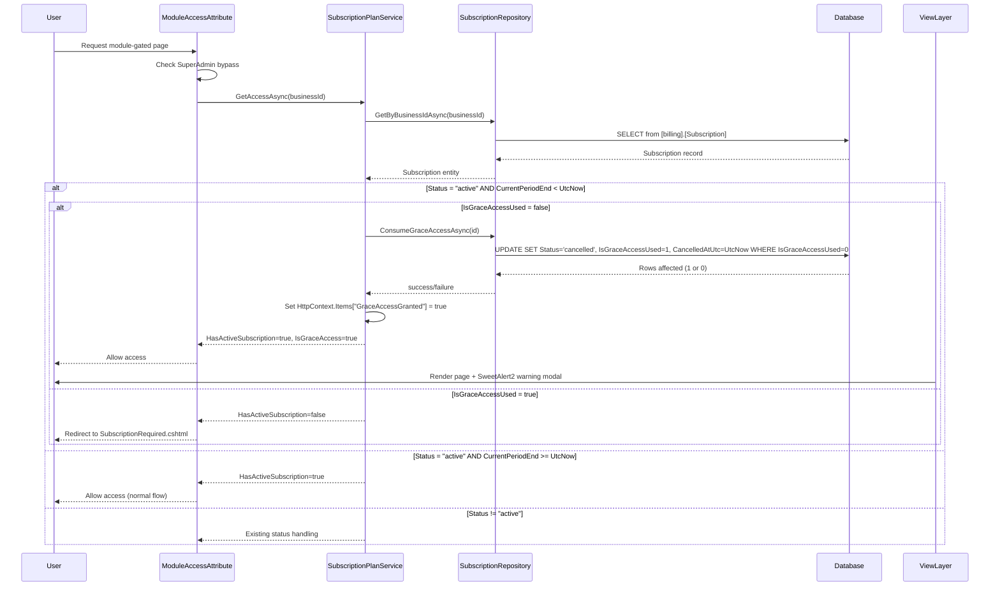

# Design Document: Subscription Expiry Guard

## Overview

The Subscription Expiry Guard adds a server-side expiration enforcement layer to the existing `SubscriptionPlanService` and `ModuleAccessAttribute` pipeline. It detects expired subscriptions at the point of module access by comparing `CurrentPeriodEnd` against `DateTime.UtcNow`, independent of Stripe webhook delivery.

The design introduces a **grace access** mechanism: when an expired subscription is first detected, the user receives one final page access accompanied by a warning modal, after which the subscription is atomically transitioned to "cancelled" and all subsequent access is denied.

This feature integrates into the existing authorization pipeline without breaking the current Stripe webhook flow. Both mechanisms (webhook and expiry guard) can fire independently — whichever detects expiration first wins, and the other gracefully handles the already-cancelled state.

### Key Design Decisions

1. **Inline detection in SubscriptionPlanService** — The expiry check lives inside `GetAccessAsync()` rather than a separate middleware, keeping the single-responsibility of "resolve subscription access" in one place and leveraging the existing per-request cache.
2. **Atomic UPDATE with row-level locking** — The grace access state transition uses `UPDATE ... WHERE IsGraceAccessUsed = 0` with `ROWLOCK` hint to guarantee at most one concurrent request receives grace access without requiring application-level distributed locks.
3. **Fail-open on grace access only** — If the database update fails during grace processing, the current request proceeds (fail-open) but logs a warning. This prevents a transient DB error from locking out a user who hasn't yet seen the warning.
4. **HttpContext.Items signalling** — The grace access flag is communicated to the view layer via `HttpContext.Items`, consistent with the existing `SubscriptionWarning` pattern used for `past_due` status.

## Architecture



## Components and Interfaces

### Modified Components

#### 1. `SubscriptionPlanService` (Service Layer)

**File:** `Portal.Web/Services/Stripe/SubscriptionPlanService.cs`

The `GetAccessAsync` method gains expiry detection logic after retrieving the subscription:

```csharp
public interface ISubscriptionPlanService
{
    Task<SubscriptionAccessResult> GetAccessAsync(int businessId);
}
```

**New internal logic within `GetAccessAsync`:**
- After fetching the subscription, if `Status == "active"` and `CurrentPeriodEnd < DateTime.UtcNow`:
  - If `BusinessId == 1` (Three Inventors): skip expiry detection, treat as valid
  - If `IsGraceAccessUsed == false`: attempt atomic grace access consumption
  - If `IsGraceAccessUsed == true`: return `HasActiveSubscription = false`

#### 2. `SubscriptionAccessResult` (Model)

**File:** `Portal.Web/Models/Stripe/SubscriptionAccessResult.cs`

Add a property to signal grace access was granted:

```csharp
public class SubscriptionAccessResult
{
    public bool HasActiveSubscription { get; set; }
    public bool IsGraceAccess { get; set; }  // NEW
    public string SubscriptionStatus { get; set; } = null!;
    public string PlanName { get; set; } = null!;
    public HashSet<string> IncludedModules { get; set; } = new();
}
```

#### 3. `SubscriptionRepository` (Data Access)

**File:** `Portal.Infrastructure/Repositories/SubscriptionRepository.cs`

Add a new method for atomic grace access consumption:

```csharp
/// <summary>
/// Atomically consumes the grace access for an expired subscription.
/// Sets Status='cancelled', CancelledAtUtc=UtcNow, IsGraceAccessUsed=1
/// only if IsGraceAccessUsed is currently 0.
/// Returns true if the update was applied (this request gets grace access).
/// Returns false if another request already consumed it.
/// </summary>
public virtual async Task<bool> ConsumeGraceAccessAsync(int subscriptionId)
```

#### 4. `Subscription` Entity

**File:** `Portal.Infrastructure/Entities/Billing/Subscription.cs`

Add the new column property:

```csharp
public bool IsGraceAccessUsed { get; set; }
```

#### 5. `ModuleAccessAttribute` (Authorization Filter)

**File:** `Portal.Web/Security/ModuleAccessAttribute.cs`

No structural changes needed. The attribute already reads `HasActiveSubscription` from `SubscriptionAccessResult`. The grace access flag is communicated via `HttpContext.Items` for the view layer.

#### 6. `WebhookProcessingService` (Webhook Handler)

**File:** `Portal.Web/Services/Stripe/WebhookProcessingService.cs`

Modify `HandleSubscriptionUpdated` to reset `IsGraceAccessUsed` when a renewal occurs (new period with Status="active").

Modify `HandleSubscriptionDeleted` to skip updates when Status is already "cancelled".

#### 7. View Layer — Grace Access Modal

**File:** `Portal.Web/Views/Shared/_GraceAccessModal.cshtml` (new partial view)

Renders the SweetAlert2 warning modal when `HttpContext.Items["GraceAccessGranted"]` is true.

### New Components

#### 1. SQL Migration — Add `IsGraceAccessUsed` Column

**File:** `Portal.Database/Migrations/080_AddIsGraceAccessUsedToSubscription.sql`

```sql
IF NOT EXISTS (
    SELECT 1
    FROM INFORMATION_SCHEMA.COLUMNS
    WHERE TABLE_SCHEMA = 'billing'
      AND TABLE_NAME = 'Subscription'
      AND COLUMN_NAME = 'IsGraceAccessUsed'
)
BEGIN
    ALTER TABLE [billing].[Subscription]
        ADD [IsGraceAccessUsed] BIT NOT NULL
            CONSTRAINT [DF_Subscription_IsGraceAccessUsed] DEFAULT (0);
END
GO
```

## Data Models

### Modified Table: `[billing].[Subscription]`

| Column | Type | Nullable | Default | Description |
|--------|------|----------|---------|-------------|
| Id | INT IDENTITY | NOT NULL | — | Primary key |
| BusinessId | INT | NOT NULL | — | FK to [portal].[Business] |
| PlanId | INT | NOT NULL | — | FK to [dbo].[Plan] |
| Status | NVARCHAR(20) | NOT NULL | — | active, trialing, past_due, cancelled, incomplete, unpaid |
| StripeSubscriptionId | NVARCHAR(100) | NULL | — | Stripe subscription reference |
| CurrentPeriodStart | DATETIME | NOT NULL | — | Billing period start |
| CurrentPeriodEnd | DATETIME | NOT NULL | — | Billing period end |
| CancelledAtUtc | DATETIME | NULL | — | When subscription was cancelled |
| **IsGraceAccessUsed** | **BIT** | **NOT NULL** | **0** | **Whether the one-time grace access has been consumed** |
| CreatedAtUtc | DATETIME | NOT NULL | GETUTCDATE() | Record creation timestamp |

### Atomic Update SQL (ConsumeGraceAccessAsync)

```sql
UPDATE [billing].[Subscription] WITH (ROWLOCK)
SET [Status] = 'cancelled',
    [CancelledAtUtc] = @CancelledAtUtc,
    [IsGraceAccessUsed] = 1
WHERE [billing].[Subscription].[Id] = @Id
  AND [billing].[Subscription].[IsGraceAccessUsed] = 0
  AND [billing].[Subscription].[Status] = 'active'
```

The `WHERE IsGraceAccessUsed = 0 AND Status = 'active'` clause ensures:
- Only one concurrent request can succeed (optimistic concurrency via row state)
- If a Stripe webhook already set Status to "cancelled", this UPDATE affects 0 rows and the request is denied grace access

### Webhook Reset SQL (HandleSubscriptionUpdated)

When a renewal webhook arrives with Status="active" and a new `CurrentPeriodEnd`:

```sql
UPDATE [billing].[Subscription]
SET [CurrentPeriodStart] = @CurrentPeriodStart,
    [CurrentPeriodEnd] = @CurrentPeriodEnd,
    [Status] = @Status,
    [PlanId] = @PlanId,
    [IsGraceAccessUsed] = 0
WHERE [billing].[Subscription].[Id] = @Id
```

The `IsGraceAccessUsed` is reset to 0 only when the webhook sets Status to "active" with a `CurrentPeriodEnd` later than the currently stored value (indicating a genuine renewal).

## Correctness Properties

*A property is a characteristic or behavior that should hold true across all valid executions of a system — essentially, a formal statement about what the system should do. Properties serve as the bridge between human-readable specifications and machine-verifiable correctness guarantees.*

### Property 1: Non-expired active subscriptions are treated as valid

*For any* subscription with Status = "active" and CurrentPeriodEnd >= DateTime.UtcNow (and BusinessId ≠ 1), the Expiry Guard SHALL return HasActiveSubscription = true and IsGraceAccess = false.

**Validates: Requirements 1.2**

### Property 2: Expired active subscription with unused grace grants access with flag

*For any* subscription with Status = "active", CurrentPeriodEnd < DateTime.UtcNow, IsGraceAccessUsed = false, and BusinessId ≠ 1, the Expiry Guard SHALL return HasActiveSubscription = true, IsGraceAccess = true, and set the grace access flag in HttpContext.Items.

**Validates: Requirements 1.1, 2.1, 2.2**

### Property 3: Expired active subscription with consumed grace denies access

*For any* subscription with Status = "active", CurrentPeriodEnd < DateTime.UtcNow, and IsGraceAccessUsed = true (and BusinessId ≠ 1), the Expiry Guard SHALL return HasActiveSubscription = false.

**Validates: Requirements 4.2, 4.3, 5.4**

### Property 4: Non-active statuses bypass expiry detection

*For any* subscription with Status in {"trialing", "past_due", "cancelled", "incomplete", "unpaid"}, the Expiry Guard SHALL NOT perform expiration detection or modify the subscription record, regardless of the CurrentPeriodEnd value.

**Validates: Requirements 1.5, 6.3**

### Property 5: Grace access triggers correct state transition

*For any* subscription where grace access is successfully consumed, the resulting database state SHALL have Status = "cancelled", CancelledAtUtc set to a value within 1 second of the current UTC time, and IsGraceAccessUsed = true.

**Validates: Requirements 3.1, 5.2**

### Property 6: Webhook renewal resets grace access flag

*For any* subscription with IsGraceAccessUsed = true, when a webhook update arrives with Status = "active" and a CurrentPeriodEnd later than the previously stored value, the system SHALL reset IsGraceAccessUsed to false.

**Validates: Requirements 5.3**

## Error Handling

| Scenario | Behaviour | Severity |
|----------|-----------|----------|
| Database unavailable during `GetByBusinessIdAsync` | Exception propagates up; `ModuleAccessAttribute` returns 500 via global error handler | Error |
| `ConsumeGraceAccessAsync` throws (DB timeout, connection failure) | Log at Warning, allow current request to proceed (fail-open for grace only), do NOT retry | Warning |
| `ConsumeGraceAccessAsync` returns false (another request won the race) | Treat as grace already consumed → deny access, redirect to SubscriptionRequired | Info |
| Webhook receives event for already-cancelled subscription | Skip status update, record webhook event, return HTTP 200 | Info |
| `IsGraceAccessUsed` column missing (migration not applied) | SQL query fails → exception propagates → 500 error. Migration must be applied before deployment. | Error |
| BusinessId claim missing or invalid | Existing `ModuleAccessAttribute` handling (403 with NoBusinessAssociation view) | Warning |

### Fail-Open Rationale

The fail-open behaviour on `ConsumeGraceAccessAsync` failure is intentional:
- The user has not yet seen the expiry warning — locking them out without warning violates the grace access contract
- The next request will re-attempt the update (the subscription is still "active" with `IsGraceAccessUsed = false`)
- A persistent DB failure will be caught by health checks and monitoring before it becomes exploitable

## Testing Strategy

### Property-Based Tests (FsCheck + xUnit)

The project uses **FsCheck** with **xUnit** for property-based testing, consistent with the existing `ModuleAccessDecisionPropertyTests` pattern.

**Configuration:**
- Minimum 100 iterations per property test (`[Property(MaxTest = 100)]`)
- Each test references its design document property via XML doc comment
- Tag format: `Feature: subscription-expiry-guard, Property {number}: {property_text}`
- Tests mock `SubscriptionRepository` and use in-memory `PortalDbContext`
- `IHttpContextAccessor` is mocked to verify `HttpContext.Items` flag setting

**Properties to implement:**
1. Property 1: Non-expired active → valid access
2. Property 2: Expired + grace unused → grace access granted + flag set
3. Property 3: Expired + grace used → access denied
4. Property 4: Non-active statuses → no expiry detection
5. Property 5: Grace consumption → correct state transition
6. Property 6: Webhook renewal → IsGraceAccessUsed reset

### Unit Tests (xUnit + Moq)

| Test | Validates |
|------|-----------|
| SuperAdmin bypasses expiry guard | Req 1.3 |
| BusinessId=1 bypasses expiry guard | Req 1.4 |
| CurrentPeriodEnd exactly equal to UtcNow → valid (boundary) | Req 1.6 |
| Grace access modal renders correct SweetAlert2 config | Req 7.1–7.5 |
| DB update failure during grace → fail-open + warning log | Req 3.4 |
| Webhook skips update for already-cancelled subscription | Req 6.2 |
| Webhook does not revert "cancelled" to "active" on race | Req 6.4 |

### Integration Tests

| Test | Validates |
|------|-----------|
| Concurrent grace access requests → at most one succeeds | Req 2.5, 3.3, 4.4 |
| Full request pipeline: expired subscription → grace → lockout | Req 1.1, 2.1, 4.2 |
| Stripe webhook + expiry guard race condition → valid final state | Req 6.4 |

### Test File Locations

```
Portal.Tests/
├── PropertyBased/
│   └── SubscriptionExpiryGuard/
│       └── ExpiryGuardPropertyTests.cs
├── Unit/
│   └── SubscriptionExpiryGuard/
│       ├── ExpiryDetectionTests.cs
│       ├── GraceAccessTests.cs
│       └── WebhookCoexistenceTests.cs
└── Integration/
    └── SubscriptionExpiryGuard/
        └── ConcurrencyTests.cs
```
