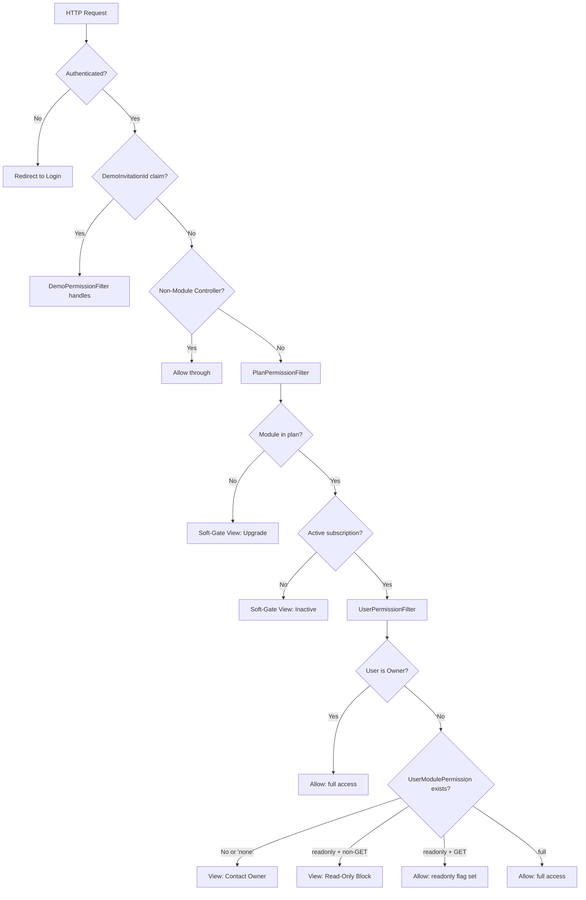

# Design Document: Subscription Permission Gating

## Overview

This design implements a two-dimensional permission gating system for the Portal: plan-level (what the subscription allows) and user-level (what the business owner grants to each team member). The system uses two global `IAsyncAuthorizationFilter` instances — `PlanPermissionFilter` and `UserPermissionFilter` — to enforce access control on every module controller request.

The existing codebase already has foundational entities (`Plan`, `PlanFeature`, `BusinessPlan`, `UserBusinessPermission`) that largely align with the requirements. The design extends these existing structures rather than creating duplicate tables, adding missing columns (e.g., `AccessLevel` on `PlanFeature`, `Status`/`TrialEndsAtUtc` on `BusinessPlan`) and introducing the new filters plus a `PlanCheckService` for programmatic permission queries.

### Design Decisions

1. **Extend existing tables** — The `Plan`, `PlanFeature`, `BusinessPlan`, and `UserBusinessPermission` entities already exist. We add columns to bring them to parity with the requirements rather than creating new parallel tables. This avoids data duplication and maintains consistency with Stripe billing integration already in place.

2. **Follow DemoPermissionFilter pattern** — Both new filters mirror the controller-to-module resolution approach, access level enforcement logic (none/readonly/full), and the AJAX-aware response handling.

3. **Filter ordering via `Order` property** — ASP.NET Core executes `IAsyncAuthorizationFilter` instances by their `Order` value. We assign: DemoPermissionFilter = 0, PlanPermissionFilter = 1, UserPermissionFilter = 2.

4. **Caching per-request** — Plan and user permissions are resolved once per request and stored in `HttpContext.Items` to avoid redundant DB queries between the filter and view-level checks via `PlanCheckService`.

---

## Architecture



### Filter Registration Order

```csharp
options.Filters.Add<DemoPermissionFilter>(0);
options.Filters.Add<PlanPermissionFilter>(1);
options.Filters.Add<UserPermissionFilter>(2);
```

Once any filter sets `context.Result`, ASP.NET Core short-circuits and subsequent filters do not execute.

---

## Components and Interfaces

### 1. PlanPermissionFilter

**Location:** `Portal.Web/Filters/PlanPermissionFilter.cs`

```csharp
public class PlanPermissionFilter : IAsyncAuthorizationFilter
{
    Task OnAuthorizationAsync(AuthorizationFilterContext context);
}
```

**Responsibilities:**
- Skip if DemoInvitationId claim is present
- Skip if controller is non-module (Home, Account, Demo, Admin, MyBusiness, Billing, SetupWizard)
- Resolve module from controller name using `ModuleControllers` dictionary (same pattern as `DemoPermissionFilter`)
- Query business subscription via `PlanCheckService`
- If no active subscription → return `SoftGateView` (inactive)
- If module not in plan → return `SoftGateView` (upgrade)
- Store resolved plan permissions in `HttpContext.Items["PlanPermissions"]`

### 2. UserPermissionFilter

**Location:** `Portal.Web/Filters/UserPermissionFilter.cs`

```csharp
public class UserPermissionFilter : IAsyncAuthorizationFilter
{
    Task OnAuthorizationAsync(AuthorizationFilterContext context);
}
```

**Responsibilities:**
- Skip if DemoInvitationId claim is present
- Skip if controller is non-module
- Skip if user is business Owner (resolved from `UserBusiness.IsOwner`)
- Query user's module permission via `PlanCheckService`
- If no permission or AccessLevel == 'none' → return access-denied view
- If AccessLevel == 'readonly' and request is non-GET (excluding data-fetch actions) → return readonly-blocked view/JSON
- Set `HttpContext.Items["UserReadOnly"] = true` for readonly access

### 3. IPlanCheckService / PlanCheckService

**Location:** `Portal.Infrastructure/Services/IPlanCheckService.cs` and implementation

```csharp
public interface IPlanCheckService
{
    /// <summary>
    /// Returns true if the module is included in the current business's active subscription plan.
    /// </summary>
    Task<bool> IsModuleInPlanAsync(string module);

    /// <summary>
    /// Returns the effective access level for the current user and module.
    /// Combines plan-level and user-level permissions, returning the more restrictive.
    /// Returns "none" if module is not in plan or user has no permission.
    /// </summary>
    Task<string> GetEffectiveAccessLevelAsync(string userId, string module);

    /// <summary>
    /// Returns all modules included in the current business's subscription plan.
    /// </summary>
    Task<List<string>> GetPlanModulesAsync();

    /// <summary>
    /// Returns the plan name that includes the specified module (for soft-gate display).
    /// </summary>
    Task<string?> GetRequiredPlanForModuleAsync(string module);

    /// <summary>
    /// Returns true if the current business has an active (non-expired, non-cancelled) subscription.
    /// </summary>
    Task<bool> HasActiveSubscriptionAsync();

    /// <summary>
    /// Returns true if the current user is the business owner.
    /// </summary>
    Task<bool> IsOwnerAsync(string userId);
}
```

**Implementation details:**
- Injected with `ICurrentTenantService` for business context resolution
- Uses `PortalDbContext` (reads `PlanFeature` via `BusinessPlan.Plan.PlanFeatures`)
- Uses `MembershipDbContext` (reads `UserBusinessPermission`)
- Per-request caching via `IMemoryCache` with short TTL or `HttpContext.Items`
- Access level resolution: `min(planLevel, userLevel)` where full > readonly > none

### 4. Extended PortalModules Constants

**Location:** `Portal.Infrastructure/Constants/PortalModules.cs`

Add the 13 missing module keys to bring the total to 22:

```csharp
public const string PaymentLinkManual = "payment_link_manual";
public const string PaymentReminderManual = "payment_reminder_manual";
public const string PaymentLinkAuto = "payment_link_auto";
public const string PaymentReminderAuto = "payment_reminder_auto";
public const string Cashflow = "cashflow";
public const string Pnl = "pnl";
public const string ExpenseInsights = "expense_insights";
public const string Attachments = "attachments";
public const string ClientPortal = "client_portal";
public const string ActivityTimeline = "activity_timeline";
public const string AuditLog = "audit_log";
public const string Api = "api";
public const string Webhooks = "webhooks";
public const string MultiCurrency = "multi_currency";
```

Update `All` array and `IsValid()` method accordingly.

### 5. Module-to-Controller Map

Shared between `DemoPermissionFilter`, `PlanPermissionFilter`, and `UserPermissionFilter`. Extracted to a static helper:

**Location:** `Portal.Web/Filters/ModuleControllerMap.cs`

```csharp
public static class ModuleControllerMap
{
    public static readonly Dictionary<string, string[]> Map = new()
    {
        [PortalModules.Customer] = new[] { "Customer", "Customers" },
        [PortalModules.Quotation] = new[] { "Quotation", "Quotations", "Proposal" },
        [PortalModules.Invoice] = new[] { "Invoice", "Invoices" },
        [PortalModules.Revenue] = new[] { "Payment", "Payments", "Revenue" },
        [PortalModules.Purchase] = new[] { "Purchase", "Purchases", "Supplier", "Expense" },
        [PortalModules.Vat] = new[] { "Vat", "VatSubmission" },
        [PortalModules.Credit] = new[] { "CreditNote", "CreditNotes" },
        [PortalModules.Audit] = new[] { "AuditLog", "Audit" },
        [PortalModules.Products] = new[] { "Product", "Products" },
        [PortalModules.Cashflow] = new[] { "Cashflow", "CashFlow" },
        [PortalModules.Pnl] = new[] { "ProfitLoss", "Pnl" },
        [PortalModules.ExpenseInsights] = new[] { "ExpenseInsight", "ExpenseInsights" },
        [PortalModules.Attachments] = new[] { "Attachment", "Attachments" },
        [PortalModules.ClientPortal] = new[] { "ClientPortal" },
        [PortalModules.ActivityTimeline] = new[] { "ActivityTimeline", "Activity" },
        [PortalModules.AuditLog] = new[] { "AuditLog", "Audit" },
        [PortalModules.Api] = new[] { "Api" },
        [PortalModules.Webhooks] = new[] { "Webhook", "Webhooks" },
        [PortalModules.MultiCurrency] = new[] { "MultiCurrency", "Currency" },
    };

    public static string? ResolveModule(string controllerName)
    {
        return Map
            .FirstOrDefault(kv => kv.Value.Contains(controllerName, StringComparer.OrdinalIgnoreCase))
            .Key;
    }
}
```

### 6. Soft-Gate Views

**Locations:**
- `Portal.Web/Views/Shared/PlanSoftGate.cshtml` — Plan not included
- `Portal.Web/Views/Shared/UserAccessDenied.cshtml` — User permission not granted
- `Portal.Web/Views/Shared/ReadOnlyBlocked.cshtml` — Readonly write attempt
- `Portal.Web/Views/Shared/SubscriptionInactive.cshtml` — No active subscription

Each uses a `SoftGateViewModel`:

```csharp
public class SoftGateViewModel
{
    public string ModuleName { get; set; } = null!;
    public string ModuleDisplayName { get; set; } = null!;
    public string ModuleDescription { get; set; } = null!;
    public string RequiredPlanName { get; set; } = null!;
    public string CurrentPlanName { get; set; } = null!;
}
```

### 7. SuperAdmin Subscription Management

**Location:** `Portal.Web/Controllers/AdminController.cs` (extend existing)

New actions:
- `SubscriptionManagement()` — GET, returns list of businesses with plans
- `AxPostChangeBusinessPlan(int businessId, int planId)` — AJAX, changes plan
- `AxPostChangeSubscriptionStatus(int businessPlanId, string status)` — AJAX, changes status

### 8. User Permission Management

**Location:** `Portal.Web/Controllers/MyBusinessController.cs` (extend existing)

New actions:
- `UserPermissions()` — GET, shows team members with module access grid
- `AxPostGrantPermission(string userId, string module, string accessLevel)` — AJAX
- `AxPostRevokePermission(string userId, string module)` — AJAX

---

## Data Models

### Existing Entity Extensions

#### PlanFeature (add AccessLevel column)

```csharp
// Existing entity — add:
public string AccessLevel { get; set; } = "full";  // 'full', 'readonly'
```

**Migration:** Add `AccessLevel NVARCHAR(20) NOT NULL DEFAULT 'full'` to `[dbo].[PlanFeature]`.

#### BusinessPlan (add Status, TrialEndsAtUtc)

```csharp
// Existing entity — add:
public string Status { get; set; } = "active";  // 'active', 'trial', 'cancelled', 'expired'
public DateTime? TrialEndsAtUtc { get; set; }
```

**Migration:** Add `Status NVARCHAR(20) NOT NULL DEFAULT 'active'` and `TrialEndsAtUtc DATETIME2 NULL` to `[dbo].[BusinessPlan]`.

#### UserBusinessPermission (add GrantedByUserId)

```csharp
// Existing entity — add:
public string? GrantedByUserId { get; set; }
```

**Migration:** Add `GrantedByUserId NVARCHAR(450) NULL` to `UserBusinessPermission`.

### Existing Entity Mappings (for reference)

| Requirements Name | Existing Entity | Table |
|---|---|---|
| SubscriptionPlan | `Plan` | `[dbo].[Plan]` |
| PlanModulePermission | `PlanFeature` | `[dbo].[PlanFeature]` |
| BusinessSubscription | `BusinessPlan` | `[dbo].[BusinessPlan]` |
| UserModulePermission | `UserBusinessPermission` | (via `MembershipDbContext`) |

### Seed Data (PlanFeature records)

The migration script will insert `PlanFeature` records for each plan:

**Starter Plan (10 modules):**
quotation, invoice, revenue, customer, purchase, vat, credit, products, payment_link_manual, payment_reminder_manual — all at `full`

**Professional Plan (16 modules):**
All Starter modules + payment_link_auto, payment_reminder_auto, cashflow, pnl, expense_insights, attachments — all at `full`

**Enterprise Plan (22 modules):**
All Professional modules + client_portal, activity_timeline, audit_log, api, webhooks, multi_currency — all at `full`

### Access Level Resolution Logic

```
EffectiveAccess(planLevel, userLevel) =
    if planLevel == "none" → "none"
    if userLevel == "none" → "none"
    if planLevel == "readonly" OR userLevel == "readonly" → "readonly"
    else → "full"
```

This follows a simple "more restrictive wins" rule with the ordering: none < readonly < full.

---

## Correctness Properties

*A property is a characteristic or behavior that should hold true across all valid executions of a system — essentially, a formal statement about what the system should do. Properties serve as the bridge between human-readable specifications and machine-verifiable correctness guarantees.*

### Property 1: Plan filter grants access if and only if the plan includes the module

*For any* authenticated non-demo user requesting a module controller, the PlanPermissionFilter SHALL allow the request if and only if the business's active subscription plan includes the requested module.

**Validates: Requirements 3.1, 3.2**

### Property 2: Non-module controllers bypass plan checks

*For any* request targeting a non-module controller (Home, Account, Demo, Admin, MyBusiness, Billing, SetupWizard), the PlanPermissionFilter SHALL allow the request without evaluating plan permissions.

**Validates: Requirements 3.4**

### Property 3: Demo sessions bypass both plan and user permission filters

*For any* request where the user has a DemoInvitationId claim, both the PlanPermissionFilter and UserPermissionFilter SHALL skip their checks entirely, regardless of the controller or module being accessed.

**Validates: Requirements 3.3, 4.5**

### Property 4: User filter grants non-owner access if and only if a permission record exists with level other than 'none'

*For any* non-owner, non-demo user requesting a module controller that passes the plan check, the UserPermissionFilter SHALL allow the request if and only if a UserBusinessPermission record exists for that user/module with AccessLevel not equal to 'none'.

**Validates: Requirements 4.1, 4.2**

### Property 5: Readonly access blocks non-GET requests

*For any* user with 'readonly' access level on a module, non-GET HTTP requests (excluding data-fetch actions starting with "Get") SHALL be blocked, while GET requests SHALL be allowed.

**Validates: Requirements 4.3**

### Property 6: Business owner always has full access to plan-permitted modules

*For any* module included in the business's subscription plan, a user who is the business owner SHALL always be granted full access without requiring a UserBusinessPermission record.

**Validates: Requirements 4.4**

### Property 7: Effective access level equals the more restrictive of plan and user levels

*For any* (planAccessLevel, userAccessLevel) pair drawn from {full, readonly, none}, the effective access level returned by the PlanCheckService SHALL equal the more restrictive of the two, where the ordering is none < readonly < full.

**Validates: Requirements 5.2, 5.4**

### Property 8: Module key validation matches known module list

*For any* string, `PortalModules.IsValid(s)` SHALL return true if and only if `s` is contained in the `PortalModules.All` array.

**Validates: Requirements 8.2**

### Property 9: Permission grant is bounded by the business plan

*For any* attempt to grant a UserBusinessPermission, the operation SHALL succeed only if (a) the module is included in the business's active subscription plan and (b) the requested access level does not exceed the plan's access level for that module.

**Validates: Requirements 10.2, 10.3**

### Property 10: Soft-gate view contains module identification and required plan

*For any* module blocked by the PlanPermissionFilter, the returned soft-gate view model SHALL contain the module's display name and the name of the lowest plan tier that includes it.

**Validates: Requirements 7.1**

---

## Error Handling

| Scenario | Response | Format |
|----------|----------|--------|
| Module not in plan | `PlanSoftGate` view with upgrade info | HTML view (or JSON `{ success: false, message: "..." }` for AJAX) |
| Subscription inactive/expired | `SubscriptionInactive` view | HTML view |
| User has no permission | `UserAccessDenied` view | HTML view (or JSON for AJAX) |
| Readonly write attempt | `ReadOnlyBlocked` view or JSON 403 | Depends on request type |
| Grant exceeds plan bounds | JSON error response | `{ success: false, message: "..." }` |
| Invalid module key | Ignored by filter (non-module controller logic) | N/A |
| Database unavailable | Exception propagates to global error handler | 500 error page |

### AJAX Detection

Both filters detect AJAX requests using the same pattern as `DemoPermissionFilter`:

```csharp
var isAjax = context.HttpContext.Request.Headers["X-Requested-With"] == "XMLHttpRequest"
          || context.HttpContext.Request.ContentType?.Contains("application/json") == true
          || context.HttpContext.Request.Headers["Accept"].ToString().Contains("application/json");
```

For AJAX requests, filters return `JsonResult` with `{ success: false, message: "..." }` and appropriate status code (403). For non-AJAX requests, they return a `ViewResult`.

---

## Testing Strategy

### Unit Tests (xUnit)

| Area | Tests |
|------|-------|
| `PlanPermissionFilter` | Filter allows/blocks based on plan inclusion; skips for demo; skips for non-module controllers |
| `UserPermissionFilter` | Filter allows/blocks based on permission; readonly enforcement; owner bypass; demo bypass |
| `PlanCheckService` | Effective access level computation; module lookup; owner detection |
| `PortalModules` | All 22 keys present; IsValid correctness |
| Permission grant logic | Bounded by plan; rejects over-grants; records GrantedByUserId |

### Property-Based Tests (FsCheck with xUnit)

The project uses C# with xUnit. Property-based tests will use **FsCheck.Xunit** for generating random inputs.

Each property test runs a minimum of **100 iterations** and is tagged with a comment referencing the design property.

| Property | Generator Strategy |
|----------|-------------------|
| Property 1 (Plan filter) | Random module + random plan config (with/without module) |
| Property 2 (Non-module bypass) | Random controller names from exempt list |
| Property 3 (Demo bypass) | Random controller + random DemoInvitationId claim value |
| Property 4 (User filter) | Random user + random permission state (exists/none/full/readonly) |
| Property 5 (Readonly blocks) | Random HTTP methods × readonly access level |
| Property 6 (Owner bypass) | Random modules for owner user |
| Property 7 (Effective access) | All combinations from {full, readonly, none} × {full, readonly, none} |
| Property 8 (Module validation) | Random strings (mix of valid module keys and arbitrary strings) |
| Property 9 (Grant bounded) | Random module + random plan config + random requested level |
| Property 10 (Soft-gate content) | Random blocked modules |

### Integration Tests

| Area | Tests |
|------|-------|
| Filter execution order | Verify short-circuit: DemoFilter block prevents Plan/User filter execution |
| Migration | Verify all businesses receive Professional plan after migration |
| Seed data | Verify Starter/Professional/Enterprise modules match specification |
| End-to-end filter pipeline | Full request through auth → demo → plan → user chain |

### Test Configuration

```
Property test minimum iterations: 100
Testing framework: xUnit
Property testing library: FsCheck.Xunit
Tag format: Feature: subscription-permission-gating, Property {N}: {property_text}
```
