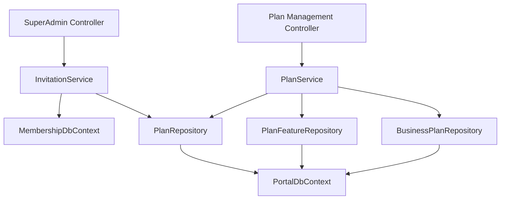
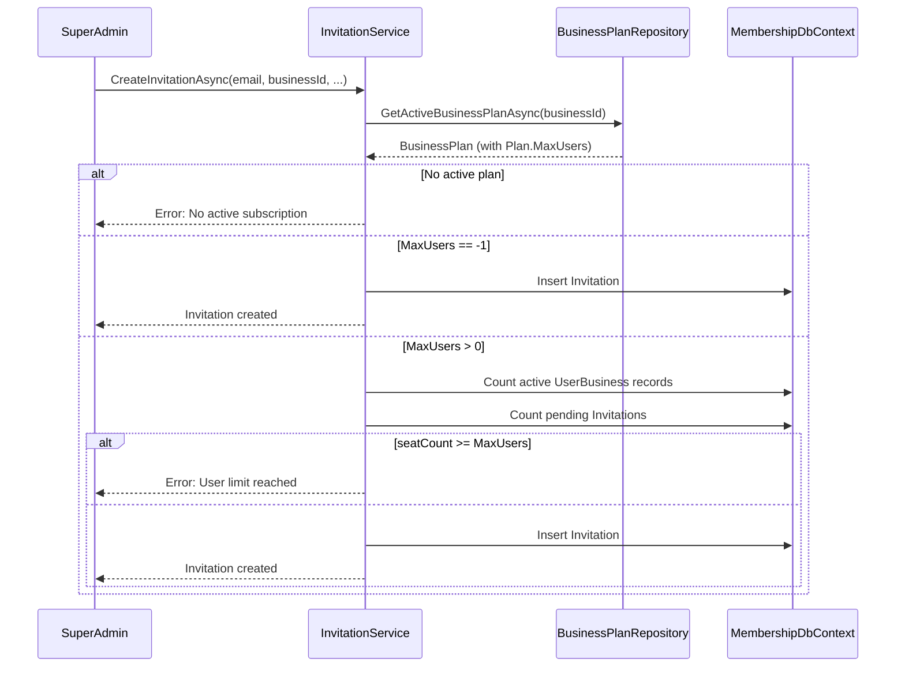

# Design Document: Subscription Plans

## Overview

This design introduces a structured subscription plan schema to the 3 Inventors Portal. The implementation adds three new tables (`Plan`, `PlanFeature`, `BusinessPlan`) to the `[dbo]` schema, along with EF Core entity models, repository classes, and service-layer enforcement of user limits within the existing `InvitationService`.

The architecture follows the established Portal pattern: Controller → Service → Repository → Database. The new tables reside in the Portal database and are accessed via `PortalDbContext`. The `InvitationService` (which operates against `MembershipDbContext`) will gain a dependency on a new `PlanRepository` to perform cross-database user limit checks.

### Design Decisions

1. **Tables in `[dbo]` schema** — Requirements specify `[dbo]` for all three tables, consistent with the plan being a platform-level concern rather than a module-specific one.
2. **Portal database, not Membership** — Plan/feature data is business configuration, not identity. The `InvitationService` will query the Portal DB via a dedicated repository injected alongside its existing `MembershipDbContext`.
3. **No stored procedures** — All operations are simple CRUD with direct SQL, following the Table Repository pattern.
4. **Seed data in migration script** — The Business plan seed is delivered as a separate idempotent migration script rather than EF Core `HasData()`, because the seed references dynamic identity values.

## Architecture



### Data Flow: Invitation with User Limit Check



## Components and Interfaces

### New Entities

| Entity | Table | Schema | DbContext |
|--------|-------|--------|-----------|
| `Plan` | `Plan` | `[dbo]` | `PortalDbContext` |
| `PlanFeature` | `PlanFeature` | `[dbo]` | `PortalDbContext` |
| `BusinessPlan` | `BusinessPlan` | `[dbo]` | `PortalDbContext` |

### New Repositories

| Repository | Responsibility |
|-----------|---------------|
| `PlanRepository` | CRUD on `[dbo].[Plan]` |
| `PlanFeatureRepository` | CRUD on `[dbo].[PlanFeature]` |
| `BusinessPlanRepository` | CRUD on `[dbo].[BusinessPlan]`, active plan lookups |

### Modified Services

| Service | Change |
|---------|--------|
| `InvitationService` | Add user limit enforcement before creating invitations |

### New Interfaces

```csharp
public interface IPlanRepository
{
    Task<Plan?> GetBySlugAsync(string slug);
    Task<Plan?> GetByIdAsync(int id);
    Task<List<Plan>> GetAllActiveAsync();
}

public interface IPlanFeatureRepository
{
    Task<List<PlanFeature>> GetByPlanIdAsync(int planId);
}

public interface IBusinessPlanRepository
{
    Task<BusinessPlan?> GetActiveByBusinessIdAsync(int businessId);
}
```

## Data Models

### Plan Entity

```csharp
namespace Portal.Infrastructure.Entities;

public class Plan
{
    public int Id { get; set; }
    public string Name { get; set; } = null!;
    public string Slug { get; set; } = null!;
    public decimal MonthlyPriceEur { get; set; }
    public decimal? AnnualPriceEur { get; set; }
    public int MaxUsers { get; set; }
    public bool IsActive { get; set; }
    public int DisplayOrder { get; set; }
    public string? Description { get; set; }
    public DateTime CreatedAtUtc { get; set; }
    public DateTime UpdatedAtUtc { get; set; }

    // Navigation properties
    public ICollection<PlanFeature> PlanFeatures { get; set; } = new List<PlanFeature>();
    public ICollection<BusinessPlan> BusinessPlans { get; set; } = new List<BusinessPlan>();
}
```

### PlanFeature Entity

```csharp
namespace Portal.Infrastructure.Entities;

public class PlanFeature
{
    public int Id { get; set; }
    public int PlanId { get; set; }
    public string ModuleName { get; set; } = null!;
    public bool IsIncluded { get; set; }
    public DateTime CreatedAtUtc { get; set; }

    // Navigation properties
    public Plan Plan { get; set; } = null!;
}
```

### BusinessPlan Entity

```csharp
namespace Portal.Infrastructure.Entities;

public class BusinessPlan
{
    public int Id { get; set; }
    public int BusinessId { get; set; }
    public int PlanId { get; set; }
    public DateTime StartDateUtc { get; set; }
    public DateTime? EndDateUtc { get; set; }
    public bool IsActive { get; set; }
    public DateTime CreatedAtUtc { get; set; }

    // Navigation properties
    public Business Business { get; set; } = null!;
    public Plan Plan { get; set; } = null!;
}
```

### EF Core Configuration (PortalDbContext additions)

```csharp
private static void ConfigurePlan(ModelBuilder modelBuilder)
{
    modelBuilder.Entity<Plan>(entity =>
    {
        entity.ToTable("Plan", "dbo");
        entity.HasKey(e => e.Id);

        entity.Property(e => e.Name).IsRequired().HasMaxLength(100);
        entity.Property(e => e.Slug).IsRequired().HasMaxLength(50);
        entity.HasIndex(e => e.Slug).IsUnique().HasDatabaseName("UX_Plan_Slug");

        entity.Property(e => e.MonthlyPriceEur).HasPrecision(10, 2);
        entity.Property(e => e.AnnualPriceEur).HasPrecision(10, 2);
        entity.Property(e => e.MaxUsers).IsRequired();
        entity.Property(e => e.IsActive).IsRequired().HasDefaultValue(true);
        entity.Property(e => e.DisplayOrder).IsRequired();
        entity.Property(e => e.Description).HasMaxLength(500);

        entity.Property(e => e.CreatedAtUtc).IsRequired().HasDefaultValueSql("GETUTCDATE()");
        entity.Property(e => e.UpdatedAtUtc).IsRequired().HasDefaultValueSql("GETUTCDATE()");

        entity.ToTable(t => t.HasCheckConstraint("CK_Plan_MonthlyPriceEur", "[MonthlyPriceEur] >= 0.00"));
        entity.ToTable(t => t.HasCheckConstraint("CK_Plan_AnnualPriceEur", "[AnnualPriceEur] IS NULL OR [AnnualPriceEur] >= 0.00"));
        entity.ToTable(t => t.HasCheckConstraint("CK_Plan_MaxUsers", "[MaxUsers] = -1 OR [MaxUsers] >= 1"));
    });
}

private static void ConfigurePlanFeature(ModelBuilder modelBuilder)
{
    modelBuilder.Entity<PlanFeature>(entity =>
    {
        entity.ToTable("PlanFeature", "dbo");
        entity.HasKey(e => e.Id);

        entity.Property(e => e.ModuleName).IsRequired().HasMaxLength(50);
        entity.Property(e => e.IsIncluded).IsRequired().HasDefaultValue(true);
        entity.Property(e => e.CreatedAtUtc).IsRequired().HasDefaultValueSql("GETUTCDATE()");

        entity.HasOne(e => e.Plan)
            .WithMany(p => p.PlanFeatures)
            .HasForeignKey(e => e.PlanId)
            .OnDelete(DeleteBehavior.NoAction);

        entity.HasIndex(e => new { e.PlanId, e.ModuleName })
            .IsUnique()
            .HasDatabaseName("UX_PlanFeature_PlanId_ModuleName");

        entity.HasIndex(e => e.PlanId).HasDatabaseName("IX_PlanFeature_PlanId");
    });
}

private static void ConfigureBusinessPlan(ModelBuilder modelBuilder)
{
    modelBuilder.Entity<BusinessPlan>(entity =>
    {
        entity.ToTable("BusinessPlan", "dbo");
        entity.HasKey(e => e.Id);

        entity.Property(e => e.StartDateUtc).IsRequired();
        entity.Property(e => e.IsActive).IsRequired().HasDefaultValue(true);
        entity.Property(e => e.CreatedAtUtc).IsRequired().HasDefaultValueSql("GETUTCDATE()");

        entity.HasOne(e => e.Business)
            .WithMany()
            .HasForeignKey(e => e.BusinessId)
            .OnDelete(DeleteBehavior.NoAction);

        entity.HasOne(e => e.Plan)
            .WithMany(p => p.BusinessPlans)
            .HasForeignKey(e => e.PlanId)
            .OnDelete(DeleteBehavior.NoAction);

        entity.HasIndex(e => new { e.BusinessId, e.IsActive })
            .IsUnique()
            .HasDatabaseName("UX_BusinessPlan_BusinessId_IsActive")
            .HasFilter("[IsActive] = 1");

        entity.HasIndex(e => e.BusinessId).HasDatabaseName("IX_BusinessPlan_BusinessId");
        entity.HasIndex(e => e.PlanId).HasDatabaseName("IX_BusinessPlan_PlanId");
    });
}
```

### Migration Scripts Structure

The next available migration number is **073**. Four migration scripts are required:

| # | Filename | Purpose |
|---|----------|---------|
| 073 | `073_CreatePlanTable.sql` | Creates `[dbo].[Plan]` with all columns, constraints, and indexes |
| 074 | `074_CreatePlanFeatureTable.sql` | Creates `[dbo].[PlanFeature]` with FK to Plan, unique constraint, indexes |
| 075 | `075_CreateBusinessPlanTable.sql` | Creates `[dbo].[BusinessPlan]` with FKs to Business and Plan, filtered unique index |
| 076 | `076_SeedBusinessPlan.sql` | Idempotent seed of the "Business" plan and all 9 module features |

Each script follows the established pattern:
- `USE [Portal]; GO` header
- Comment block with migration number, description, requirements, idempotency statement
- `IF NOT EXISTS` guards on all DDL
- Explicit constraint names (`PK_Plan`, `FK_PlanFeature_Plan`, etc.)
- `GO` batch terminators between statements
- Nonclustered indexes on all FK columns

### SQL Schema DDL (Key Excerpts)

**Plan Table:**
```sql
CREATE TABLE [dbo].[Plan]
(
    [Id]              INT             IDENTITY(1,1)   NOT NULL,
    [Name]            NVARCHAR(100)                   NOT NULL,
    [Slug]            NVARCHAR(50)                    NOT NULL,
    [MonthlyPriceEur] DECIMAL(10,2)                  NOT NULL,
    [AnnualPriceEur]  DECIMAL(10,2)                  NULL,
    [MaxUsers]        INT                             NOT NULL,
    [IsActive]        BIT                             NOT NULL  CONSTRAINT [DF_Plan_IsActive] DEFAULT (1),
    [DisplayOrder]    INT                             NOT NULL,
    [Description]     NVARCHAR(500)                   NULL,
    [CreatedAtUtc]    DATETIME                        NOT NULL  CONSTRAINT [DF_Plan_CreatedAtUtc] DEFAULT (GETUTCDATE()),
    [UpdatedAtUtc]    DATETIME                        NOT NULL  CONSTRAINT [DF_Plan_UpdatedAtUtc] DEFAULT (GETUTCDATE()),

    CONSTRAINT [PK_Plan] PRIMARY KEY CLUSTERED ([Id]),
    CONSTRAINT [UX_Plan_Slug] UNIQUE ([Slug]),
    CONSTRAINT [CK_Plan_MonthlyPriceEur] CHECK ([MonthlyPriceEur] >= 0.00),
    CONSTRAINT [CK_Plan_AnnualPriceEur] CHECK ([AnnualPriceEur] IS NULL OR [AnnualPriceEur] >= 0.00),
    CONSTRAINT [CK_Plan_MaxUsers] CHECK ([MaxUsers] = -1 OR [MaxUsers] >= 1)
);
```

**BusinessPlan Table:**
```sql
CREATE TABLE [dbo].[BusinessPlan]
(
    [Id]            INT       IDENTITY(1,1)   NOT NULL,
    [BusinessId]    INT                       NOT NULL,
    [PlanId]        INT                       NOT NULL,
    [StartDateUtc]  DATETIME                  NOT NULL,
    [EndDateUtc]    DATETIME                  NULL,
    [IsActive]      BIT                       NOT NULL  CONSTRAINT [DF_BusinessPlan_IsActive] DEFAULT (1),
    [CreatedAtUtc]  DATETIME                  NOT NULL  CONSTRAINT [DF_BusinessPlan_CreatedAtUtc] DEFAULT (GETUTCDATE()),

    CONSTRAINT [PK_BusinessPlan] PRIMARY KEY CLUSTERED ([Id]),
    CONSTRAINT [FK_BusinessPlan_Business] FOREIGN KEY ([BusinessId]) REFERENCES [portal].[Business] ([Id]),
    CONSTRAINT [FK_BusinessPlan_Plan] FOREIGN KEY ([PlanId]) REFERENCES [dbo].[Plan] ([Id])
);
```

**Filtered Unique Index (one active plan per business):**
```sql
CREATE UNIQUE NONCLUSTERED INDEX [UX_BusinessPlan_BusinessId_IsActive]
    ON [dbo].[BusinessPlan] ([BusinessId], [IsActive])
    WHERE [IsActive] = 1;
```

### Repository Implementation Pattern

Following the established Table Repository pattern with `GenericStoredProcedureRepository<T>` base class:

```csharp
public class BusinessPlanRepository : GenericStoredProcedureRepository<BusinessPlan>
{
    public BusinessPlanRepository(DbContext context) : base(context) { }

    public async Task<BusinessPlan?> GetActiveByBusinessIdAsync(int businessId)
    {
        try
        {
            const string query = @"
                SELECT [BusinessPlan].[Id], [BusinessPlan].[BusinessId], [BusinessPlan].[PlanId],
                       [BusinessPlan].[StartDateUtc], [BusinessPlan].[EndDateUtc],
                       [BusinessPlan].[IsActive], [BusinessPlan].[CreatedAtUtc]
                FROM [dbo].[BusinessPlan]
                INNER JOIN [dbo].[Plan] ON [BusinessPlan].[PlanId] = [Plan].[Id]
                WHERE [BusinessPlan].[BusinessId] = @BusinessId
                  AND [BusinessPlan].[IsActive] = 1";

            return await ExecuteSingleRecordStoredProcedure(query,
                new SqlParameter("@BusinessId", businessId));
        }
        catch (Exception)
        {
            throw;
        }
    }
}
```

### InvitationService Modification

The `InvitationService` will receive a new dependency on `IBusinessPlanRepository` (injected via constructor). The `CreateInvitationAsync` method will be modified to:

1. Query the active `BusinessPlan` for the target `businessId`
2. If no active plan exists → throw with descriptive message
3. Retrieve `MaxUsers` from the associated `Plan`
4. If `MaxUsers == -1` → skip seat check, proceed
5. Count active `UserBusiness` records for the business
6. Count pending (unused, unexpired) `Invitation` records for the business
7. If `(activeUsers + pendingInvitations) >= MaxUsers` → throw with descriptive message
8. Otherwise → proceed with invitation creation

```csharp
public async Task<Invitation> CreateInvitationAsync(string email, int businessId, string createdByUserId, List<InvitationModulePermission>? modulePermissions = null)
{
    // --- User Limit Enforcement ---
    var activePlan = await _businessPlanRepository.GetActiveByBusinessIdAsync(businessId);
    if (activePlan == null)
    {
        throw new InvalidOperationException("Cannot create invitation: no active subscription plan found for this business.");
    }

    var maxUsers = activePlan.Plan.MaxUsers;
    if (maxUsers != -1)
    {
        var activeUserCount = await _membershipDbContext.UserBusinesses
            .CountAsync(ub => ub.BusinessId == businessId && ub.IsActive);

        var pendingInvitationCount = await _membershipDbContext.Invitations
            .CountAsync(i => i.BusinessId == businessId && !i.IsUsed && i.ExpiresAtUtc > DateTime.UtcNow);

        var occupiedSeats = activeUserCount + pendingInvitationCount;
        if (occupiedSeats >= maxUsers)
        {
            throw new InvalidOperationException(
                $"Cannot create invitation: the user limit of {maxUsers} has been reached for this business. " +
                $"Current seats occupied: {occupiedSeats} (active users: {activeUserCount}, pending invitations: {pendingInvitationCount}).");
        }
    }

    // --- Existing validation and creation logic continues below ---
    // ...
}
```

## Correctness Properties

*A property is a characteristic or behavior that should hold true across all valid executions of a system — essentially, a formal statement about what the system should do. Properties serve as the bridge between human-readable specifications and machine-verifiable correctness guarantees.*

### Property 1: Slug format validation

*For any* string, the Plan slug validation logic SHALL accept it if and only if it matches the pattern `^[a-z0-9]+(-[a-z0-9]+)*$` (lowercase alphanumeric segments separated by single hyphens).

**Validates: Requirements 1.3**

### Property 2: Price constraint validation

*For any* Plan record, the MonthlyPriceEur value SHALL be accepted if and only if it is >= 0.00, and the AnnualPriceEur value SHALL be accepted if and only if it is NULL or >= 0.00.

**Validates: Requirements 1.4, 1.5**

### Property 3: MaxUsers constraint validation

*For any* integer value assigned to MaxUsers, the Plan SHALL accept it if and only if the value equals -1 or is a positive integer >= 1.

**Validates: Requirements 1.6**

### Property 4: ModuleName validation

*For any* string assigned to PlanFeature.ModuleName, the system SHALL accept it if and only if it is a member of the defined PortalModules.All set (customer, quotation, invoice, revenue, purchase, vat, credit, audit, products).

**Validates: Requirements 2.3**

### Property 5: Single active plan per business

*For any* business, the system SHALL permit at most one BusinessPlan record with IsActive = 1 at any given time. Attempting to insert a second active plan for the same business SHALL be rejected.

**Validates: Requirements 3.9**

### Property 6: User limit enforcement

*For any* business with an active plan, the InvitationService SHALL permit a new invitation if and only if MaxUsers equals -1 (unlimited) OR the current occupied seat count (active users + pending invitations) is strictly less than MaxUsers.

**Validates: Requirements 5.2, 5.3**

### Property 7: Seat count calculation

*For any* business, the occupied seat count SHALL equal the number of active UserBusiness records for that business plus the number of unused, unexpired Invitation records for that business.

**Validates: Requirements 5.4**

## Error Handling

| Scenario | Error Type | Message Pattern |
|----------|-----------|-----------------|
| No active plan for business | `InvalidOperationException` | "Cannot create invitation: no active subscription plan found for this business." |
| User limit reached | `InvalidOperationException` | "Cannot create invitation: the user limit of {maxUsers} has been reached for this business. Current seats occupied: {occupiedSeats} (active users: {activeUserCount}, pending invitations: {pendingInvitationCount})." |
| Invalid slug format | `ArgumentException` | "Invalid plan slug: '{slug}'. Slug must contain only lowercase alphanumeric characters and hyphens." |
| Invalid module name | `ArgumentException` | "Invalid module name: '{moduleName}'. Valid modules are: {PortalModules.All}" |
| Duplicate PlanFeature | SQL constraint violation | Caught at DB level via unique constraint `UX_PlanFeature_PlanId_ModuleName` |
| Duplicate active plan | SQL constraint violation | Caught at DB level via filtered unique index `UX_BusinessPlan_BusinessId_IsActive` |

### Error Handling Pattern

Following established Portal conventions:
- **Repository layer**: `try/catch` with `throw;` (rethrow, no logging)
- **Service layer**: Validate inputs and throw descriptive exceptions for business rule violations
- **Controller layer**: Catch exceptions, log via `SystemLoggerExtensions`, return appropriate JSON response (`{ success: false, message: "..." }`)

## Testing Strategy

### Property-Based Tests (xUnit + FsCheck or similar)

Property-based testing is appropriate for this feature because the core business logic (slug validation, price validation, MaxUsers constraints, user limit enforcement) involves pure functions with clear input/output behavior and universal properties that hold across a wide input space.

**Library**: FsCheck.Xunit (C# property-based testing library for .NET)
**Minimum iterations**: 100 per property test

Each property test will be tagged with:
```
Feature: subscription-plans, Property {number}: {property_text}
```

| Property | Test Focus | Generator Strategy |
|----------|-----------|-------------------|
| 1 | Slug validation | Generate random strings (valid slugs + invalid strings with uppercase, spaces, special chars) |
| 2 | Price validation | Generate random decimals (positive, zero, negative, null) |
| 3 | MaxUsers validation | Generate random integers (including -1, 0, negatives, positives) |
| 4 | ModuleName validation | Generate random strings (valid module names + invalid strings) |
| 5 | Single active plan | Generate random business IDs with multiple plan insertions |
| 6 | User limit enforcement | Generate random (maxUsers, activeUsers, pendingInvitations) tuples |
| 7 | Seat count calculation | Generate random combinations of active users and pending invitations |

### Unit Tests (Example-Based)

| Test | Validates |
|------|-----------|
| Seed data contains "business" plan with correct values | Req 4.1, 4.4 |
| Seed data contains all 9 module features | Req 4.2 |
| Seed script is idempotent (no duplicates on re-run) | Req 4.3 |
| No active plan returns descriptive error | Req 5.5 |
| Referential integrity prevents Plan deletion with features | Req 2.8 |
| Referential integrity prevents Business deletion with plan | Req 3.10 |
| Duplicate PlanFeature insert returns constraint error | Req 2.9 |

### Integration Tests

| Test | Validates |
|------|-----------|
| Migration scripts execute successfully against clean database | Req 7.x |
| Migration scripts are idempotent (re-run without error) | Req 7.2 |
| Full invitation flow with user limit enforcement end-to-end | Req 5.1–5.5 |
| BusinessPlan filtered unique index prevents second active plan | Req 3.9 |
