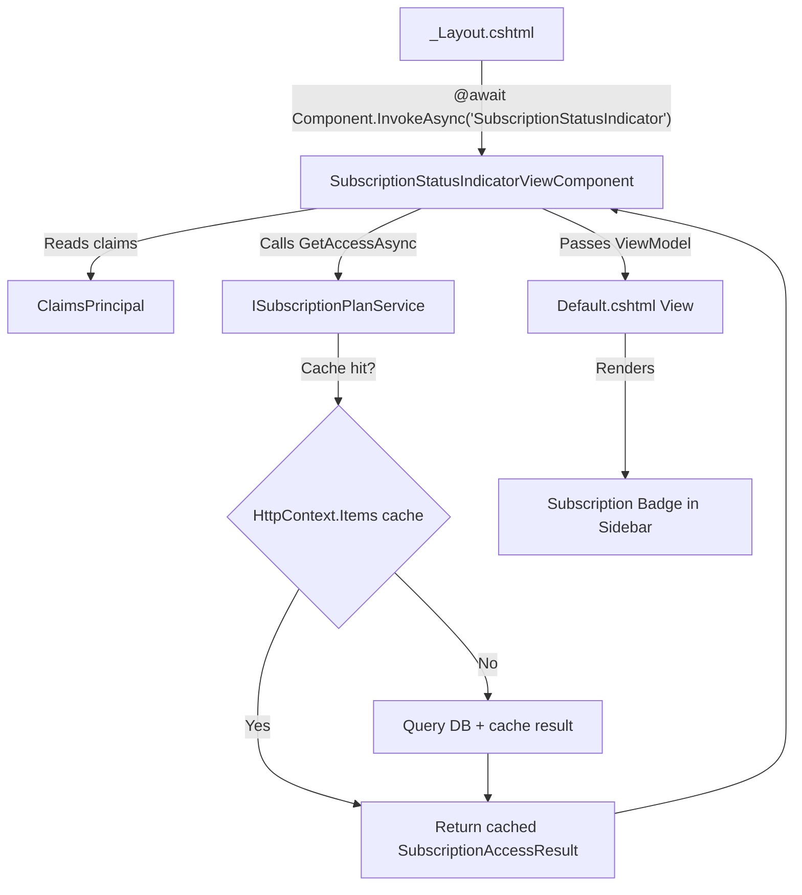

# Design Document: Subscription Status Indicator

## Overview

The Subscription Status Indicator is a ViewComponent rendered at the bottom of the sidebar in the authenticated layout (`_Layout.cshtml`). It provides persistent, at-a-glance visibility into the current business's subscription plan and status using color-coded badges aligned with the MyChair Design System.

The component follows the same architectural pattern as the existing `ModuleNavigationViewComponent`: a C# ViewComponent class resolves data via an injected service, then passes a view model to a Razor partial. The indicator reuses the per-request cached result from `SubscriptionPlanService` (stored in `HttpContext.Items`), ensuring zero additional database queries.

### Key Design Decisions

1. **ViewComponent over Partial View** — ViewComponents encapsulate async logic and DI, matching the established `ModuleNavigation` pattern. A partial would require the layout to resolve subscription data inline.
2. **Reuse SubscriptionPlanService caching** — The service already caches results per-request in `HttpContext.Items`. The ViewComponent calls `GetAccessAsync(businessId)` which hits the cache on subsequent calls within the same request.
3. **CSS-driven collapsed/expanded state** — The sidebar collapse is controlled by the `.sidebar-collapsed` class on the `#appShell` div. The indicator uses the same `.nav-text` pattern so text hides automatically when collapsed.
4. **Conditional link rendering** — The indicator renders as an `<a>` tag only for business owners. Non-owners see a `<div>` with `role="status"` for accessibility.

## Architecture



### Request Flow

1. `_Layout.cshtml` invokes the ViewComponent inside the `<aside class="sidebar">` element
2. `SubscriptionStatusIndicatorViewComponent.InvokeAsync()` reads `BusinessId` and role claims from `UserClaimsPrincipal`
3. If the user is a SuperAdmin without a BusinessId, returns `Content(string.Empty)` (renders nothing)
4. Otherwise calls `ISubscriptionPlanService.GetAccessAsync(businessId)` — this returns the per-request cached result
5. If no subscription exists for the business (null/empty SubscriptionStatus and PlanName), the ViewModel applies fallback display values ("No Plan", "No Subscription")
6. The Razor view renders the indicator HTML with the appropriate badge color, text, and link behavior

## Components and Interfaces

### SubscriptionStatusIndicatorViewComponent

**Location:** `Portal.Web/ViewComponents/SubscriptionStatusIndicatorViewComponent.cs`

```csharp
public class SubscriptionStatusIndicatorViewComponent : ViewComponent
{
    private readonly ISubscriptionPlanService _subscriptionPlanService;

    public SubscriptionStatusIndicatorViewComponent(ISubscriptionPlanService subscriptionPlanService);

    public async Task<IViewComponentResult> InvokeAsync();
}
```

**Responsibilities:**
- Extract `BusinessId` claim from `UserClaimsPrincipal` and parse as integer
- Check if user is SuperAdmin without a valid BusinessId — return empty content
- Call `ISubscriptionPlanService.GetAccessAsync(businessId)`
- If service returns null/empty status and plan, apply fallback values
- Determine `IsOwner` flag from claims (`IsOwner` claim = `"true"`)
- Build and return the `SubscriptionStatusIndicatorViewModel`

### SubscriptionStatusIndicatorViewModel

**Location:** `Portal.Web/Models/ViewComponents/SubscriptionStatusIndicatorViewModel.cs`

```csharp
public class SubscriptionStatusIndicatorViewModel
{
    public string PlanName { get; set; } = "No Plan";
    public string BadgeText { get; set; } = "No Subscription";
    public string BadgeBackgroundColor { get; set; } = "#C24A4A";
    public string BadgeTextColor { get; set; } = "#FFFFFF";
    public bool IsOwner { get; set; }
    public bool HasActiveSubscription { get; set; }
    public bool IsGraceAccess { get; set; }
}
```

### Default.cshtml (ViewComponent View)

**Location:** `Portal.Web/Views/Shared/Components/SubscriptionStatusIndicator/Default.cshtml`

**Responsibilities:**
- Render the indicator container at the bottom of the sidebar
- Display plan name (truncated at 20 chars with ellipsis) using `.nav-text` class for collapse behavior
- Render the color-coded badge pill
- Conditionally wrap in `<a href="/Account/Billing">` for owners, or `<div role="status">` for non-owners
- Apply appropriate `aria-label` attributes for accessibility

### Status-to-Badge Mapping Logic

The ViewComponent maps `SubscriptionAccessResult.SubscriptionStatus` to badge display values:

| Status (case-insensitive) | Badge Text | Background | Text Color |
|---------------------------|-----------|------------|------------|
| `active` | Active | `#129867` | `#FFFFFF` |
| `trialing` | Trial | `#0D5EA6` | `#FFFFFF` |
| `past_due` | Past Due | `#C8912E` | `#FFFFFF` |
| `cancelled` | Cancelled | `#C24A4A` | `#FFFFFF` |
| null/empty | No Subscription | `#C24A4A` | `#FFFFFF` |
| any other value | Unknown | `#C24A4A` | `#FFFFFF` |

### ISubscriptionPlanService (Existing — No Changes)

The existing interface remains unchanged. The ViewComponent depends on it via constructor injection:

```csharp
public interface ISubscriptionPlanService
{
    Task<SubscriptionAccessResult> GetAccessAsync(int businessId);
}
```

## Data Models

### Existing Models Used (No Modifications)

**SubscriptionAccessResult** — returned by `ISubscriptionPlanService.GetAccessAsync()`:

```csharp
public class SubscriptionAccessResult
{
    public bool HasActiveSubscription { get; set; }
    public bool IsGraceAccess { get; set; }
    public string SubscriptionStatus { get; set; } = null!;
    public string PlanName { get; set; } = null!;
    public HashSet<string> IncludedModules { get; set; } = new();
}
```

### New ViewModel

**SubscriptionStatusIndicatorViewModel** — passed from ViewComponent to Razor view:

```csharp
public class SubscriptionStatusIndicatorViewModel
{
    /// <summary>
    /// Display name for the plan. Truncated to 20 chars in the view.
    /// Defaults to "No Plan" when no subscription exists.
    /// </summary>
    public string PlanName { get; set; } = "No Plan";

    /// <summary>
    /// Text displayed inside the badge pill (e.g., "Active", "Trial", "Past Due", "Cancelled", "No Subscription", "Unknown").
    /// </summary>
    public string BadgeText { get; set; } = "No Subscription";

    /// <summary>
    /// CSS hex color for badge background. Determined by status mapping.
    /// </summary>
    public string BadgeBackgroundColor { get; set; } = "#C24A4A";

    /// <summary>
    /// CSS hex color for badge text. Always #FFFFFF per design system.
    /// </summary>
    public string BadgeTextColor { get; set; } = "#FFFFFF";

    /// <summary>
    /// Whether the current user is a business owner (controls link rendering).
    /// </summary>
    public bool IsOwner { get; set; }

    /// <summary>
    /// Passthrough from SubscriptionAccessResult for potential future use.
    /// </summary>
    public bool HasActiveSubscription { get; set; }

    /// <summary>
    /// Passthrough from SubscriptionAccessResult for potential future use.
    /// </summary>
    public bool IsGraceAccess { get; set; }
}
```

### Claims Used

| Claim | Source | Purpose |
|-------|--------|---------|
| `BusinessId` | Custom claim added at login | Identifies which business to query subscription for |
| `IsOwner` | Custom claim (`"true"` / absent) | Determines if billing link is rendered |
| Role: `SuperAdmin` | ASP.NET Core Identity role | Controls visibility when no business is associated |


## Correctness Properties

*A property is a characteristic or behavior that should hold true across all valid executions of a system — essentially, a formal statement about what the system should do. Properties serve as the bridge between human-readable specifications and machine-verifiable correctness guarantees.*

### Property 1: Status-to-badge mapping is total and deterministic

*For any* string value of `SubscriptionStatus` (including null, empty, and arbitrary casing), the mapping function SHALL produce exactly one valid badge configuration: a non-empty `BadgeText`, a valid hex `BadgeBackgroundColor`, and `#FFFFFF` as `BadgeTextColor`. Specifically:
- Case-insensitive "active" → ("Active", "#129867")
- Case-insensitive "trialing" → ("Trial", "#0D5EA6")
- Case-insensitive "past_due" → ("Past Due", "#C8912E")
- Case-insensitive "cancelled" → ("Cancelled", "#C24A4A")
- Null or empty → ("No Subscription", "#C24A4A")
- Any other value → ("Unknown", "#C24A4A")

**Validates: Requirements 2.1, 2.2, 2.3, 2.4, 2.5, 5.2**

### Property 2: Plan name display truncation

*For any* string value of `PlanName` (including null and empty):
- If null or empty, the displayed plan name SHALL be "No Plan"
- If length ≤ 20 characters, the displayed plan name SHALL equal the original value unchanged
- If length > 20 characters, the displayed plan name SHALL be the first 20 characters followed by "…" (ellipsis)

**Validates: Requirements 1.2, 5.1**

### Property 3: Link rendering is conditioned on ownership

*For any* combination of `IsOwner` flag and valid subscription data:
- If `IsOwner` is true, the rendered output SHALL contain an anchor element with `href="/Account/Billing"` and `aria-label="View billing and subscription"`
- If `IsOwner` is false, the rendered output SHALL NOT contain an anchor element and SHALL contain an element with `role="status"`

**Validates: Requirements 3.1, 3.2, 3.3, 3.4, 7.2, 7.3**

### Property 4: Invalid BusinessId produces empty content

*For any* `BusinessId` claim value that is null, empty, non-numeric, zero, or negative, the ViewComponent SHALL return an empty content result (no HTML rendered).

**Validates: Requirements 6.5**

### Property 5: Aria-label format consistency

*For any* badge configuration produced by the status mapping, the badge element's `aria-label` attribute SHALL equal `"Subscription status: {BadgeText}"` where `{BadgeText}` is the visible badge text from Property 1.

**Validates: Requirements 7.1**

## Error Handling

### ViewComponent Failure Modes

| Scenario | Handling | User Impact |
|----------|----------|-------------|
| `ISubscriptionPlanService` throws exception | ViewComponent catches, logs via `ILogger`, returns `Content(string.Empty)` | Indicator silently hidden; page loads normally |
| `BusinessId` claim missing or unparseable | Return `Content(string.Empty)` before calling service | Indicator hidden; no service call made |
| `SubscriptionAccessResult` has null/empty fields | ViewModel applies defaults ("No Plan", "No Subscription") | User sees fallback state |
| User not authenticated | Return `Content(string.Empty)` | Indicator hidden (layout only shows for authenticated users anyway) |

### Design Rationale

The indicator is a **non-critical UI element**. If it fails to render, the user's workflow is unaffected — they can still navigate to `/Account/Billing` via other means. Therefore:

1. **Fail-silent** — Never throw from `InvokeAsync()`. Any exception results in empty content.
2. **No retry** — The per-request cache means the data was already fetched (or failed) earlier in the request pipeline. Retrying adds no value.
3. **Log at Warning level** — Exceptions in ViewComponent logic are logged for debugging but don't warrant Error-level since the page still renders.

```csharp
public async Task<IViewComponentResult> InvokeAsync()
{
    try
    {
        // ... logic ...
    }
    catch (Exception ex)
    {
        _logger.LogWarning(ex, "Failed to render subscription status indicator");
        return Content(string.Empty);
    }
}
```

## Testing Strategy

### Unit Tests (Example-Based)

Unit tests cover specific scenarios and structural verification:

| Test | Description | Validates |
|------|-------------|-----------|
| SuperAdmin_NoBusiness_ReturnsEmpty | SuperAdmin with null BusinessId → empty content | Req 4.1 |
| SuperAdmin_WithBusiness_RendersIndicator | SuperAdmin with valid BusinessId → returns view | Req 4.2 |
| SuperAdmin_NoSubscription_ReturnsEmpty | SuperAdmin with BusinessId but no subscription record → empty | Req 4.3 |
| Owner_RendersLink | User with IsOwner=true → anchor element in output | Req 3.1, 3.2 |
| NonOwner_RendersDiv | User without IsOwner → div with role=status | Req 3.3 |
| AriaLabel_OnLink | Owner link has aria-label="View billing and subscription" | Req 3.4 |
| ExpandedState_ShowsBothElements | Rendered HTML contains nav-text plan name and badge | Req 1.4 |
| CollapsedState_NavTextClass | Plan name element uses nav-text class (CSS hides it) | Req 1.5 |
| NoSubscription_StillRendersView | HasActiveSubscription=false with empty plan/status → returns view (not empty) | Req 5.3 |
| WCAG_ContrastRatios | All badge color/text combinations meet 4.5:1 ratio | Req 7.4 |
| TabAccessibility_AnchorElement | Owner rendering produces native anchor element (inherently focusable) | Req 7.5 |
| ServiceCalledWithCorrectBusinessId | Mock verifies GetAccessAsync called with parsed BusinessId | Req 6.2 |
| CachedResult_NoDuplicateQueries | Verify per-request cache prevents additional DB calls | Req 6.4 |

### Property-Based Tests

Property-based tests validate universal properties across randomly generated inputs using a PBT library (e.g., FsCheck for .NET or a custom xUnit Theory with random data generators):

| Property Test | Iterations | Validates |
|---------------|-----------|-----------|
| StatusMapping_AlwaysProducesValidBadge | 100+ | Property 1 (Req 2.1-2.5, 5.2) |
| PlanNameDisplay_TruncatesCorrectly | 100+ | Property 2 (Req 1.2, 5.1) |
| LinkRendering_MatchesOwnership | 100+ | Property 3 (Req 3.1-3.4, 7.2, 7.3) |
| InvalidBusinessId_AlwaysEmpty | 100+ | Property 4 (Req 6.5) |
| AriaLabel_AlwaysMatchesBadgeText | 100+ | Property 5 (Req 7.1) |

**PBT Library:** FsCheck (via `FsCheck.Xunit`) — the standard property-based testing library for .NET, integrates with xUnit.

**Configuration:**
- Minimum 100 iterations per property test
- Each test tagged with: `Feature: subscription-status-indicator, Property {N}: {description}`
- Generators produce random strings with varying lengths, casing, special characters, null values

### Test File Locations

- Unit tests: `Portal.Tests/ViewComponents/SubscriptionStatusIndicatorViewComponentTests.cs`
- Property tests: `Portal.Tests/ViewComponents/SubscriptionStatusIndicatorPropertyTests.cs`

### What is NOT Tested via PBT

- CSS/layout behavior (sidebar collapse visibility) — verified visually and via HTML structure assertions
- Integration with `SubscriptionPlanService` caching — integration test with real service
- Placement in `_Layout.cshtml` — structural smoke test
- Keyboard accessibility — inherent to HTML `<a>` elements; verified structurally
