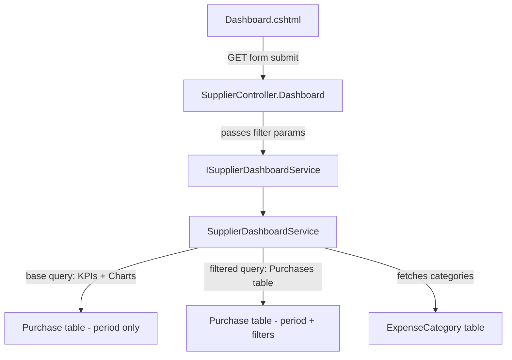

# Design Document: Supplier Dashboard Purchase Filters

## Overview

This feature extends the Supplier Dashboard page (`/Supplier/Dashboard/{id}`) with granular filtering controls for the purchases table. The filters — description search, category dropdown, and date range — are applied server-side alongside the existing period filter and pagination. Critically, these filters affect **only** the purchases table query; KPI cards and charts remain scoped solely by the period filter.

The implementation follows the existing full-page-reload pattern (GET form submission) and integrates with EF Core LINQ queries using the global BusinessId query filter already in place.

## Architecture

The feature touches four layers of the existing MVC stack:



**Key architectural decision**: The service method receives all filter parameters but applies them only when building the purchases table query. The base query used for KPIs and charts remains unchanged (supplier + period only). This ensures filter isolation without duplicating service methods.

**Query flow within `GetDashboardAsync`**:
1. Build `baseQuery` scoped by supplierId + periodId (used for KPIs, charts)
2. Build `purchaseQuery` by cloning `baseQuery` and appending filter predicates (description, categoryId, dateFrom, dateTo)
3. Pass `purchaseQuery` to `GetPurchasesPageAsync` for pagination
4. Fetch active expense categories for the dropdown (separate query)

## Components and Interfaces

### Controller Changes

**`SupplierController.Dashboard`** — Updated action signature:

```csharp
[HttpGet]
public async Task<IActionResult> Dashboard(
    int id,
    int? periodId = null,
    int page = 1,
    string? description = null,
    int? categoryId = null,
    DateOnly? dateFrom = null,
    DateOnly? dateTo = null)
```

**Responsibilities**:
- Trim and truncate `description` to 200 characters max (same pattern as `Index` action)
- Nullify whitespace-only description values
- Pass all parameters to the service
- The service handles validation of `categoryId` and date range logic

### Service Interface Changes

**`ISupplierDashboardService`** — Updated method signature:

```csharp
Task<SupplierDashboardViewModel> GetDashboardAsync(
    int supplierId,
    int? periodId,
    int page,
    string? description = null,
    int? categoryId = null,
    DateOnly? dateFrom = null,
    DateOnly? dateTo = null);
```

### Service Implementation Changes

**`SupplierDashboardService.GetDashboardAsync`**:

1. Validate `categoryId` — confirm it references an active `ExpenseCategory` belonging to the current business. If invalid, treat as null.
2. Validate date range — if both `dateFrom` and `dateTo` are provided and `dateFrom > dateTo`, treat both as null.
3. Build `purchaseQuery` from `baseQuery` by appending:
   - `.Where(p => p.Description != null && p.Description.Contains(description))` when description is provided
   - `.Where(p => p.ExpenseCategoryId == categoryId)` when categoryId is valid
   - `.Where(p => p.InvoiceDate >= dateFrom)` when dateFrom is provided
   - `.Where(p => p.InvoiceDate <= dateTo)` when dateTo is provided
4. Fetch active categories for the dropdown: `_dbContext.ExpenseCategories.Where(c => c.IsActive).OrderBy(c => c.Name)`
5. Populate new ViewModel properties with filter state and categories list

### ViewModel Changes

**`SupplierDashboardViewModel`** — New properties:

```csharp
// Purchase filter state (for form preservation and pagination links)
public string? FilterDescription { get; set; }
public int? FilterCategoryId { get; set; }
public DateOnly? FilterDateFrom { get; set; }
public DateOnly? FilterDateTo { get; set; }

// Category dropdown options
public List<ExpenseCategoryOption> ExpenseCategories { get; set; } = new();
```

**New supporting model**:

```csharp
public class ExpenseCategoryOption
{
    public int Id { get; set; }
    public string Name { get; set; } = null!;
}
```

### View Changes

**`Dashboard.cshtml`** — New filter panel inserted between the charts section and the purchases table section:

```html
<!-- Purchase Filters -->
<section class="glass card-pad" style="margin-bottom:22px;">
    <form method="get" action="/Supplier/Dashboard/@Model.SupplierId" style="display:flex;gap:14px;align-items:flex-end;flex-wrap:wrap;margin:0;">
        @if (Model.SelectedPeriodId.HasValue)
        {
            <input type="hidden" name="periodId" value="@Model.SelectedPeriodId" />
        }
        <div class="field" style="min-width:180px;">
            <label for="description">Description</label>
            <input type="text" id="description" name="description" placeholder="Search description..." maxlength="200" value="@Model.FilterDescription" />
        </div>
        <div class="field" style="min-width:180px;">
            <label for="categoryId">Category</label>
            <select id="categoryId" name="categoryId">
                <option value="">All Categories</option>
                @foreach (var cat in Model.ExpenseCategories)
                {
                    <option value="@cat.Id" selected="@(Model.FilterCategoryId == cat.Id)">@cat.Name</option>
                }
            </select>
        </div>
        <div class="field" style="min-width:180px;">
            <label for="dateFrom">From</label>
            <input type="date" id="dateFrom" name="dateFrom" value="@Model.FilterDateFrom?.ToString("yyyy-MM-dd")" />
        </div>
        <div class="field" style="min-width:180px;">
            <label for="dateTo">To</label>
            <input type="date" id="dateTo" name="dateTo" value="@Model.FilterDateTo?.ToString("yyyy-MM-dd")" />
        </div>
        <div style="padding-bottom:2px;">
            <button type="submit" class="btn btn-primary">Filter</button>
            <a href="/Supplier/Dashboard/@Model.SupplierId@(Model.SelectedPeriodId.HasValue ? "?periodId=" + Model.SelectedPeriodId : "")" class="btn btn-secondary">Clear</a>
        </div>
    </form>
</section>
```

**Pagination links** — Updated to include all active filter parameters:

```razor
@{
    var paginationParams = $"periodId={Model.SelectedPeriodId}";
    if (!string.IsNullOrEmpty(Model.FilterDescription))
        paginationParams += $"&description={Uri.EscapeDataString(Model.FilterDescription)}";
    if (Model.FilterCategoryId.HasValue)
        paginationParams += $"&categoryId={Model.FilterCategoryId}";
    if (Model.FilterDateFrom.HasValue)
        paginationParams += $"&dateFrom={Model.FilterDateFrom:yyyy-MM-dd}";
    if (Model.FilterDateTo.HasValue)
        paginationParams += $"&dateTo={Model.FilterDateTo:yyyy-MM-dd}";
}
```

## Data Models

### Existing Entities (No Changes)

- **`Purchase`** — Already has `Description` (string?), `ExpenseCategoryId` (int), `InvoiceDate` (DateOnly), `IsCancelled` (bool), `VatSubmissionPeriodId` (int?), `SupplierId` (int)
- **`ExpenseCategory`** — Already has `Id`, `BusinessId`, `Name`, `IsActive`

### ViewModel Additions

| Property | Type | Purpose |
|----------|------|---------|
| `FilterDescription` | `string?` | Preserves description search value across page loads |
| `FilterCategoryId` | `int?` | Preserves selected category across page loads |
| `FilterDateFrom` | `DateOnly?` | Preserves date-from value across page loads |
| `FilterDateTo` | `DateOnly?` | Preserves date-to value across page loads |
| `ExpenseCategories` | `List<ExpenseCategoryOption>` | Populates category dropdown |

### New Supporting Model

| Class | Properties | Purpose |
|-------|-----------|---------|
| `ExpenseCategoryOption` | `Id` (int), `Name` (string) | Lightweight DTO for category dropdown options |

### Query Filter Logic (Service Layer)

```
purchaseQuery = baseQuery  (supplier + period)
  AND (description IS NULL OR Purchase.Description CONTAINS description)  -- case-insensitive via SQL Server default collation
  AND (categoryId IS NULL OR Purchase.ExpenseCategoryId == categoryId)
  AND (dateFrom IS NULL OR Purchase.InvoiceDate >= dateFrom)
  AND (dateTo IS NULL OR Purchase.InvoiceDate <= dateTo)
```

No new database tables, columns, or migrations are required.


## Correctness Properties

*A property is a characteristic or behavior that should hold true across all valid executions of a system — essentially, a formal statement about what the system should do. Properties serve as the bridge between human-readable specifications and machine-verifiable correctness guarantees.*

### Property 1: Description filter returns only matching purchases

*For any* non-empty, non-whitespace description filter string and any set of purchases, the filtered result SHALL contain only purchases whose Description contains the filter value as a case-insensitive substring, and SHALL exclude all purchases whose Description does not contain it.

**Validates: Requirements 1.3**

### Property 2: Description truncation preserves first 200 characters

*For any* input string of length greater than 200 characters, the applied filter value SHALL equal exactly the first 200 characters of the input string.

**Validates: Requirements 1.5**

### Property 3: Category dropdown contains only active categories sorted alphabetically

*For any* set of ExpenseCategory records with varying IsActive and BusinessId values, the category dropdown list SHALL contain exactly those categories where IsActive is true AND BusinessId matches the current business, ordered alphabetically by Name ascending.

**Validates: Requirements 2.2**

### Property 4: Category filter returns only purchases with matching category

*For any* valid categoryId (referencing an active ExpenseCategory for the current business) and any set of purchases, the filtered result SHALL contain only purchases whose ExpenseCategoryId equals the provided categoryId.

**Validates: Requirements 2.5**

### Property 5: Date range filter bounds are inclusive

*For any* dateFrom and/or dateTo values (where dateFrom <= dateTo when both are provided) and any set of purchases, the filtered result SHALL contain only purchases whose InvoiceDate is >= dateFrom (when provided) AND <= dateTo (when provided).

**Validates: Requirements 3.4, 3.5**

### Property 6: Filter combination is a logical AND intersection

*For any* combination of active filters (description, categoryId, dateFrom, dateTo, periodId) and any set of purchases, the combined filtered result SHALL equal the intersection of applying each individual filter independently — a purchase appears in the result if and only if it satisfies every active filter condition.

**Validates: Requirements 4.1, 3.8**

### Property 7: Purchase filters do not affect KPIs or charts

*For any* set of purchase filter values (description, categoryId, dateFrom, dateTo), the KPI metrics (TotalSpend, TotalPurchases, AverageMonthlySpend) and chart data (SpendShareData, MonthlySpendData, PeriodSpendData) SHALL be identical to those computed with no purchase filters applied, given the same supplierId and periodId.

**Validates: Requirements 4.6**

## Error Handling

### Invalid Filter Values

| Scenario | Handling |
|----------|----------|
| `description` is whitespace-only | Treated as null (filter not applied) |
| `description` exceeds 200 chars | Truncated to first 200 characters |
| `categoryId` is not a valid integer | ASP.NET Core model binding yields null; filter not applied |
| `categoryId` references inactive or non-existent category | Service validates and treats as null |
| `dateFrom > dateTo` | Both date filters ignored; treated as not applied |
| `dateFrom` or `dateTo` is not a valid date | ASP.NET Core model binding yields null; filter not applied |

### No Results

When all filters combined yield zero purchases, the view renders an empty state message ("No purchases found.") inside the existing `.empty-state` container. No table or pagination controls are rendered.

### Service Layer Validation

The service validates `categoryId` by querying `ExpenseCategories` for an active record matching the current business. This prevents users from filtering by categories belonging to other tenants or inactive categories. The validation query is lightweight (single `AnyAsync` call).

## Testing Strategy

### Property-Based Tests (PBT)

**Library**: [FsCheck.Xunit](https://github.com/fscheck/FsCheck) (integrates with the project's existing xUnit test infrastructure)

**Configuration**: Minimum 100 iterations per property test.

Each property test will:
- Generate random `Purchase` collections with varied descriptions, categories, dates
- Generate random filter parameter combinations
- Apply the filtering logic (extracted into a testable static method or tested via the service with an in-memory DbContext)
- Assert the property holds

**Tag format**: `Feature: supplier-dashboard-purchase-filters, Property {number}: {property_text}`

| Property | Test Focus | Generator Strategy |
|----------|-----------|-------------------|
| 1 | Description substring matching | Random strings (ASCII + Unicode), random purchase descriptions |
| 2 | Truncation at 200 chars | Random strings with length 1–500 |
| 3 | Category list filtering + sorting | Random categories with varied IsActive/BusinessId |
| 4 | Category filter correctness | Random purchases with random ExpenseCategoryIds |
| 5 | Date range inclusivity | Random DateOnly values, random purchase InvoiceDates |
| 6 | AND combination | Random multi-filter combinations applied to random purchase sets |
| 7 | Filter isolation | Random filters; compare KPI/chart output with and without filters |

### Unit Tests (Example-Based)

| Test | Validates |
|------|-----------|
| Controller accepts all filter parameters and passes to service | Req 1.2, 2.3, 3.2, 3.3, 4.4 |
| Page resets to 1 when filters are submitted | Req 1.6, 2.7, 4.2 |
| ViewModel preserves filter state after service call | Req 1.7, 2.8, 3.7 |
| Clear button URL contains only periodId | Req 1.8, 4.5 |
| Empty state rendered when no purchases match | Req 5.6 |
| Invalid categoryId (non-existent) treated as null | Req 2.6 |
| Invalid date range (from > to) treated as null | Req 3.6 |

### Integration Tests

| Test | Validates |
|------|-----------|
| Full request cycle: GET with filters returns correct filtered page | End-to-end filter flow |
| Pagination links preserve all active filter parameters | Req 4.3 |
| Category dropdown populated from database | Req 2.1, 2.2 |

### Test Architecture

The filtering logic will be tested primarily through the `SupplierDashboardService` using an **in-memory EF Core database** (or SQLite in-memory) seeded with generated test data. This allows property-based tests to run efficiently (100+ iterations) without external dependencies.

For filter isolation (Property 7), the test will call `GetDashboardAsync` twice with the same supplierId/periodId — once with filters and once without — and assert KPI/chart equality.
