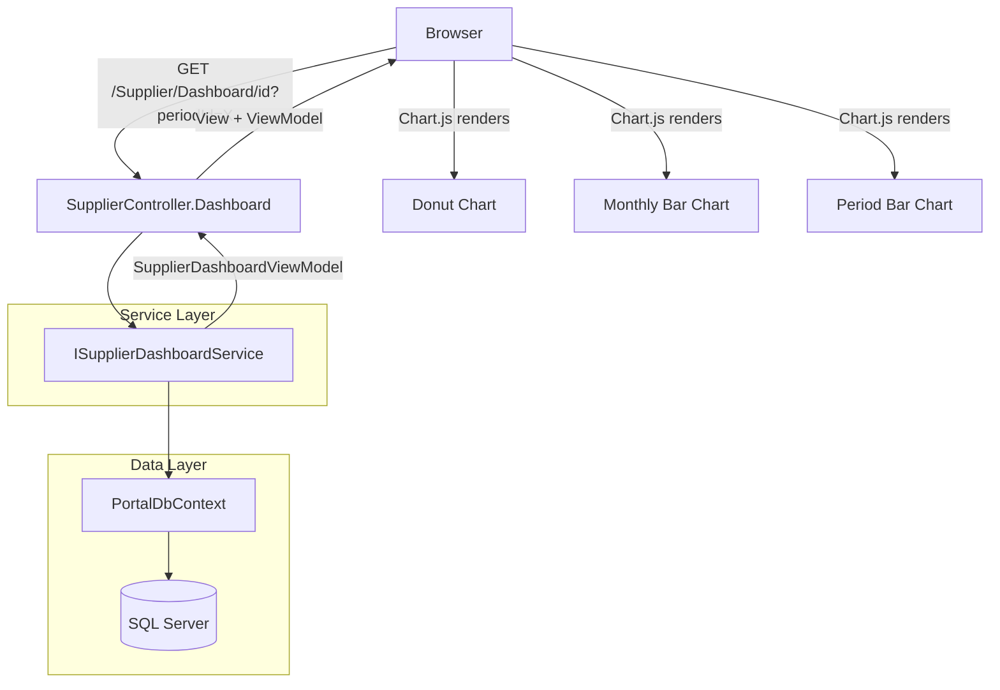

# Design Document: Supplier Dashboard

## Overview

The Supplier Dashboard is an analytics page at `/Supplier/Dashboard/{id}` that provides spend visibility, purchase history, and comparative analytics for a single supplier. It extends the existing `SupplierController` with a new `Dashboard` action and introduces a dedicated `ISupplierDashboardService` for computing metrics from existing purchase data.

The page renders three KPI cards, three Chart.js charts (donut + two bar charts), and a paginated purchases table — all scoped by an optional VAT period filter. No database schema changes are required; all metrics are computed from the existing `[purchase].[Purchase]`, `[purchase].[Supplier]`, and `[vat].[VatSubmissionPeriod]` tables.

**Key Design Decisions:**
- **Separate service interface** (`ISupplierDashboardService`) rather than extending `ISupplierService` — keeps CRUD operations separate from analytics concerns.
- **Server-side computation, client-side rendering** — the controller passes pre-computed JSON data to the view, Chart.js renders charts client-side.
- **Full page reload on filter change** — simplicity over AJAX; the period filter submits as a query parameter (`?periodId=X`) triggering a full GET request.
- **EF Core LINQ queries** — leverages the existing `PortalDbContext` with global query filters for BusinessId scoping, avoiding raw SQL for analytics.

## Architecture



**Request Flow:**
1. User navigates to `/Supplier/Dashboard/{id}` (optionally with `?periodId=X`)
2. `SupplierController.Dashboard` validates the supplier exists and belongs to the current business
3. `ISupplierDashboardService.GetDashboardAsync(supplierId, periodId)` computes all metrics
4. Controller passes `SupplierDashboardViewModel` to the Razor view
5. View renders KPI cards, table, and serializes chart data as JSON for Chart.js initialization

## Components and Interfaces

### Controller Extension

```csharp
// Added to existing SupplierController
[HttpGet]
public async Task<IActionResult> Dashboard(int id, int? periodId = null, int page = 1)
{
    var supplier = await _supplierService.GetSupplierByIdAsync(id);
    if (supplier == null)
        return NotFound();

    var dashboard = await _dashboardService.GetDashboardAsync(id, periodId, page);
    return View(dashboard);
}
```

### Service Interface

```csharp
public interface ISupplierDashboardService
{
    /// <summary>
    /// Computes all dashboard metrics for a supplier, optionally scoped to a VAT period.
    /// </summary>
    Task<SupplierDashboardViewModel> GetDashboardAsync(int supplierId, int? periodId, int page);
}
```

### Service Implementation

```csharp
public class SupplierDashboardService : ISupplierDashboardService
{
    private readonly PortalDbContext _dbContext;
    private readonly ICurrentTenantService _currentTenantService;
    private const int PageSize = 10;

    public SupplierDashboardService(
        PortalDbContext dbContext,
        ICurrentTenantService currentTenantService)
    {
        _dbContext = dbContext;
        _currentTenantService = currentTenantService;
    }

    public async Task<SupplierDashboardViewModel> GetDashboardAsync(int supplierId, int? periodId, int page);
}
```

### Key Methods (Internal to Service)

| Method | Responsibility |
|--------|---------------|
| `ComputeKpis(IQueryable<Purchase> query)` | Calculates Total Spend, Total Purchases, Average Monthly Spend |
| `ComputeSpendShare(int supplierId, int? periodId)` | Ranks all suppliers, returns top 5 + Others + current |
| `ComputeMonthlySpend(IQueryable<Purchase> query, int? periodId)` | Groups purchases by calendar month |
| `ComputePeriodSpend(int supplierId)` | Groups supplier purchases by VAT period |
| `GetPurchasesPage(IQueryable<Purchase> query, int page)` | Returns paginated, sorted purchase list |

## Data Models

### SupplierDashboardViewModel

```csharp
namespace Portal.Web.Models;

public class SupplierDashboardViewModel
{
    // Supplier info
    public int SupplierId { get; set; }
    public string SupplierName { get; set; } = null!;
    public DateTime CollaborationSince { get; set; }
    public bool IsActive { get; set; }
    public string CurrencySymbol { get; set; } = "€";

    // Period filter
    public int? SelectedPeriodId { get; set; }
    public List<VatPeriodOption> Periods { get; set; } = new();

    // KPIs
    public decimal TotalSpend { get; set; }
    public int TotalPurchases { get; set; }
    public decimal AverageMonthlySpend { get; set; }

    // Spend Share Chart (donut)
    public List<SpendShareSlice> SpendShareData { get; set; } = new();

    // Monthly Spend Chart (bar)
    public List<MonthlySpendBar> MonthlySpendData { get; set; } = new();

    // Period Spend Chart (bar)
    public List<PeriodSpendBar> PeriodSpendData { get; set; } = new();

    // Purchases Table
    public List<PurchaseTableRow> Purchases { get; set; } = new();
    public int CurrentPage { get; set; }
    public int TotalPages { get; set; }
    public int TotalRecords { get; set; }
}
```

### Supporting Models

```csharp
public class VatPeriodOption
{
    public int Id { get; set; }
    public string Label { get; set; } = null!;
}

public class SpendShareSlice
{
    public string SupplierName { get; set; } = null!;
    public decimal Amount { get; set; }
    public bool IsCurrentSupplier { get; set; }
}

public class MonthlySpendBar
{
    public string MonthLabel { get; set; } = null!;  // e.g., "Mar", "Apr"
    public decimal Amount { get; set; }
}

public class PeriodSpendBar
{
    public int PeriodId { get; set; }
    public string PeriodLabel { get; set; } = null!;
    public decimal Amount { get; set; }
    public bool IsSelected { get; set; }
}

public class PurchaseTableRow
{
    public DateOnly InvoiceDate { get; set; }
    public string Description { get; set; } = null!;
    public string Category { get; set; } = null!;
    public decimal AmountExcludingVat { get; set; }
    public decimal VatAmount { get; set; }
    public decimal TotalAmount { get; set; }
}
```

### Existing Entities Used (No Changes)

| Entity | Schema.Table | Role |
|--------|-------------|------|
| `Purchase` | `[purchase].[Purchase]` | Source of all spend data |
| `Supplier` | `[purchase].[Supplier]` | Supplier identity and metadata |
| `VatSubmissionPeriod` | `[vat].[VatSubmissionPeriod]` | Period definitions for filtering |
| `ExpenseCategory` | `[purchase].[ExpenseCategory]` | Category names for table display |
| `BusinessProfile` | `[portal].[BusinessProfile]` | CurrencySymbol for formatting |

### Database Query Strategy

All queries use EF Core LINQ against `PortalDbContext`. The global query filter on `BusinessId` (via `ICurrentTenantService`) ensures multi-tenancy scoping automatically.

**Base query pattern:**
```csharp
var baseQuery = _dbContext.Purchases
    .Where(p => p.SupplierId == supplierId && !p.IsCancelled);

if (periodId.HasValue)
    baseQuery = baseQuery.Where(p => p.VatSubmissionPeriodId == periodId.Value);
```

**Spend Share query (all suppliers):**
```csharp
var allSupplierSpend = await _dbContext.Purchases
    .Where(p => !p.IsCancelled)
    .Where(p => !periodId.HasValue || p.VatSubmissionPeriodId == periodId.Value)
    .GroupBy(p => new { p.SupplierId, p.Supplier.Name })
    .Select(g => new { g.Key.SupplierId, g.Key.Name, Total = g.Sum(p => p.AmountExcludingVat) })
    .OrderByDescending(x => x.Total)
    .ToListAsync();
```

## Correctness Properties

*A property is a characteristic or behavior that should hold true across all valid executions of a system — essentially, a formal statement about what the system should do. Properties serve as the bridge between human-readable specifications and machine-verifiable correctness guarantees.*

### Property 1: Cancelled Purchase Exclusion

*For any* set of purchases belonging to a supplier (with any mix of `IsCancelled` values), all computed metrics (Total Spend, Total Purchases, Average Monthly Spend, chart values, and table rows) SHALL only reflect purchases where `IsCancelled = false`.

**Validates: Requirements 5.2, 5.3, 10.2, 13.2**

### Property 2: Business Scoping Invariant

*For any* supplier dashboard request, all returned data (KPIs, chart data, table rows, period options) SHALL only contain records belonging to the authenticated user's `BusinessId` — no cross-tenant data leakage.

**Validates: Requirements 3.3, 13.3**

### Property 3: Period Filter Scoping

*For any* selected VAT period ID, all computed metrics (KPIs, spend share, monthly spend, and table rows) SHALL only include purchases where `VatSubmissionPeriodId` equals the selected period. When no period is selected ("All Time"), all non-cancelled purchases for the supplier SHALL be included regardless of their `VatSubmissionPeriodId` value.

**Validates: Requirements 5.5, 6.2, 6.3, 7.3**

### Property 4: Total Spend Computation

*For any* set of non-cancelled purchases for a supplier within the selected period, the Total Spend KPI SHALL equal the sum of `AmountExcludingVat` across all those purchases. If no purchases exist, Total Spend SHALL be zero.

**Validates: Requirements 5.2**

### Property 5: Total Purchases Count

*For any* set of non-cancelled purchases for a supplier within the selected period, the Total Purchases KPI SHALL equal the count of those purchases.

**Validates: Requirements 5.3**

### Property 6: Average Monthly Spend Computation

*For any* set of non-cancelled purchases for a supplier within the selected period, the Average Monthly Spend SHALL equal Total Spend divided by the number of distinct calendar months (year + month) containing at least one purchase. If no purchases exist, Average Monthly Spend SHALL be zero.

**Validates: Requirements 5.4**

### Property 7: Spend Share Ranking and Aggregation

*For any* set of suppliers with purchases in the selected period, the spend share data SHALL contain: (a) exactly one entry for the current supplier, (b) at most 5 entries for other suppliers ordered by descending spend, and (c) if more than 5 other suppliers exist, an "Others" entry whose amount equals the sum of all remaining suppliers' spend. The sum of all slices SHALL equal the total spend across all suppliers in the period.

**Validates: Requirements 7.2, 13.5**

### Property 8: Monthly Spend Bar Values

*For any* set of non-cancelled purchases for a supplier grouped by calendar month (year + month), each monthly bar value SHALL equal the sum of `AmountExcludingVat` for purchases in that month. The set of months displayed SHALL cover every calendar month within the selected period's date range (or all months with purchases when "All Time" is selected).

**Validates: Requirements 8.2, 8.3, 8.4**

### Property 9: Period Spend Bar Values

*For any* VAT period belonging to the business, the period spend bar value SHALL equal the sum of `AmountExcludingVat` for non-cancelled purchases assigned to that period for the current supplier. Periods with no purchases SHALL show a value of zero.

**Validates: Requirements 9.2, 9.3**

### Property 10: Purchases Table Sorting

*For any* set of non-cancelled purchases for a supplier in the selected period, the table rows SHALL be sorted by `InvoiceDate` in ascending order.

**Validates: Requirements 10.3**

### Property 11: Pagination Correctness

*For any* total record count N and page number P (where P ≥ 1), the returned page SHALL contain exactly `min(10, N - (P-1)*10)` records (or 0 if P exceeds total pages). The pagination info SHALL correctly report "Showing X–Y of N" where X = (P-1)*10 + 1 and Y = min(P*10, N).

**Validates: Requirements 10.4, 10.5**

### Property 12: Period Dropdown Ordering

*For any* set of VAT periods belonging to the business, the period filter options SHALL be ordered by `PeriodStartDate` ascending, with "All Time" always as the first option.

**Validates: Requirements 6.1**

## Error Handling

| Scenario | Handling |
|----------|----------|
| Supplier ID not found or belongs to another business | Controller returns `NotFound()` (HTTP 404) |
| Supplier exists but has no purchases | Service returns zero-value KPIs, empty chart data, empty table — view renders gracefully |
| Invalid page number (< 1 or > total pages) | Service clamps to valid range (page 1 or last page) |
| Invalid periodId (not belonging to business) | Service ignores the filter and treats as "All Time" |
| Chart.js CDN fails to load | Client-side fallback: `<noscript>`-style message "Charts unavailable" shown via `onerror` handler on script tag |
| Database query timeout | Exception propagates to global error handler; user sees standard error page |
| Null CurrencySymbol in BusinessProfile | Default to "€" (consistent with existing pattern across the platform) |

## Testing Strategy

### Unit Tests (Example-Based)

| Test | Validates |
|------|-----------|
| Dashboard action returns NotFound for invalid supplier | Req 3.3 |
| Dashboard action returns view for valid supplier with no purchases | Req 3.4 |
| KPI cards show zero when no purchases exist | Req 3.4 |
| Period dropdown shows "All Time" first | Req 6.1 |
| Spend share includes "Others" when > 5 other suppliers | Req 7.2 |
| Spend share handles supplier with zero spend | Req 7.5 |
| Monthly chart shows correct month labels for a 3-month period | Req 8.2 |
| Period chart highlights selected period | Req 9.4 |
| Table columns render in correct order | Req 10.1 |
| Back link navigates to /Supplier | Req 11.2 |

### Property-Based Tests

**Library:** [FsCheck](https://fscheck.github.io/FsCheck/) with xUnit integration (`FsCheck.Xunit`)

**Configuration:** Minimum 100 iterations per property test.

Each property test references its design document property:

| Property Test | Tag |
|--------------|-----|
| Cancelled purchases never appear in metrics | Feature: supplier-dashboard, Property 1: Cancelled Purchase Exclusion |
| All data scoped to current BusinessId | Feature: supplier-dashboard, Property 2: Business Scoping Invariant |
| Period filter correctly scopes all computations | Feature: supplier-dashboard, Property 3: Period Filter Scoping |
| Total Spend equals sum of AmountExcludingVat | Feature: supplier-dashboard, Property 4: Total Spend Computation |
| Total Purchases equals count of non-cancelled | Feature: supplier-dashboard, Property 5: Total Purchases Count |
| Average Monthly Spend formula correctness | Feature: supplier-dashboard, Property 6: Average Monthly Spend Computation |
| Spend share ranking produces correct structure | Feature: supplier-dashboard, Property 7: Spend Share Ranking and Aggregation |
| Monthly bars sum correctly per month | Feature: supplier-dashboard, Property 8: Monthly Spend Bar Values |
| Period bars sum correctly per period | Feature: supplier-dashboard, Property 9: Period Spend Bar Values |
| Table rows sorted by InvoiceDate ascending | Feature: supplier-dashboard, Property 10: Purchases Table Sorting |
| Pagination returns correct page size and info | Feature: supplier-dashboard, Property 11: Pagination Correctness |
| Period options ordered by PeriodStartDate | Feature: supplier-dashboard, Property 12: Period Dropdown Ordering |

### Integration Tests

| Test | Validates |
|------|-----------|
| Full request to `/Supplier/Dashboard/{id}` returns 200 with valid HTML | End-to-end routing |
| Unauthorized user gets redirected to login | Req 3.2 |
| User without Purchase module access gets 403 | Req 3.2 |
| Dashboard with real seed data shows correct KPI values | Data accuracy |

### Test Approach Notes

- Property tests target the `SupplierDashboardService` directly using an in-memory `PortalDbContext` (SQLite in-memory or EF Core InMemory provider)
- Generators produce random `Purchase` entities with varying `IsCancelled`, `VatSubmissionPeriodId`, `AmountExcludingVat`, `InvoiceDate`, and `SupplierId` values
- The service is tested in isolation from the controller — controller tests are example-based
- Chart rendering is not tested server-side (it's client-side Chart.js) — only the data passed to the view is validated
