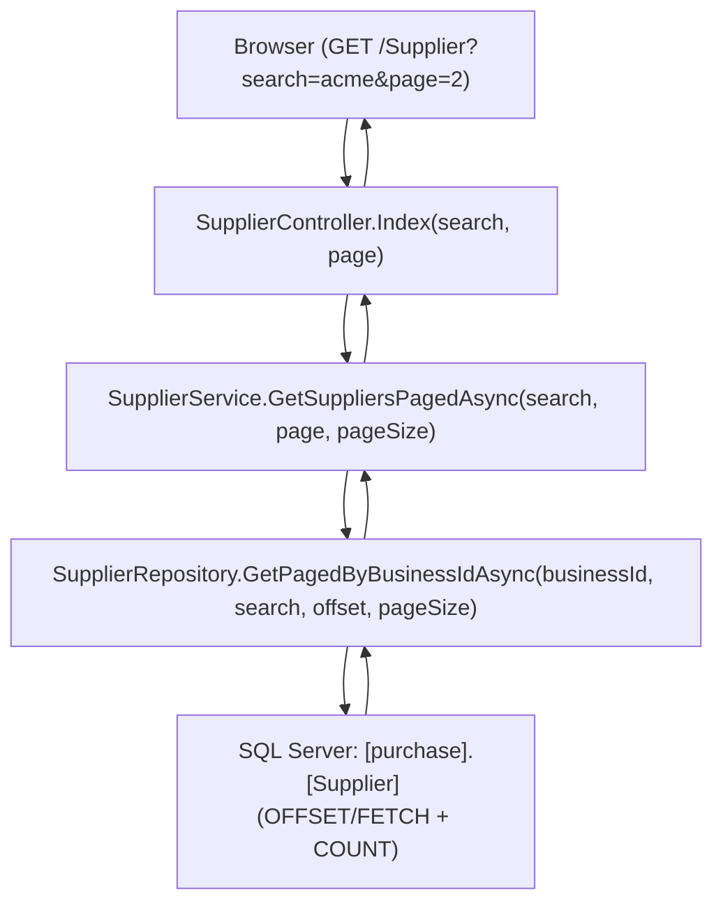

# Design Document: Supplier Table Search & Paging

## Overview

This design adds server-side pagination and a name-based search filter to the Supplier Index page (`/Supplier`). The current implementation loads all suppliers via `GetSuppliersAsync()` and renders them in a single table. As the supplier registry grows, this becomes inefficient and difficult to navigate.

The new design moves filtering and pagination to the SQL layer using `OFFSET`/`FETCH NEXT`, returning only the requested page of data. It reuses the existing shared `PagedResult<T>` model and `_PagingControl.cshtml` partial view established in the table-paging-search spec.

### Design Decisions

1. **SQL-level pagination** — Use `OFFSET`/`FETCH NEXT` in the SQL query rather than loading all records and paginating in memory. This ensures consistent performance regardless of dataset size.
2. **Single query with `COUNT(*) OVER()`** — Get both the paginated data and total count in a single database round-trip, matching the established InvoiceRepository pattern.
3. **Form GET submission** — Use `<form method="get">` for the search filter. This preserves browser back/forward navigation and bookmarkability.
4. **Reuse shared `PagedResult<T>`** — The existing generic model at `Portal.Infrastructure/Models/PagedResult.cs` encapsulates all pagination metadata.
5. **Reuse shared `_PagingControl.cshtml`** — The existing partial view handles page navigation rendering, "Showing X–Y of Z" text, and URL query string preservation.
6. **No JavaScript pagination** — Server-rendered pagination controls (Razor partial) consistent with the Invoice and Quotation list pages.
7. **Name-only search** — The Supplier entity is simple (Id, BusinessId, Name, IsActive, CreatedAtUtc), so only a name search filter is needed (no status/customer/date filters like Invoice/Quotation).

## Architecture



The architecture follows the existing MVC + Service + Repository pattern. The only structural change is that the `Index` action now accepts `search` and `page` query parameters, the service returns `PagedResult<Supplier>` instead of `List<Supplier>`, and the repository performs server-side filtering and pagination.

## Components and Interfaces

### Updated Repository: `SupplierRepository`

New method added to the existing repository:

```csharp
public async Task<(List<Supplier> Items, int TotalCount)> GetPagedByBusinessIdAsync(
    int businessId,
    string? searchTerm,
    int offset,
    int pageSize)
```

This method:
- Queries `[purchase].[Supplier]` with `BusinessId` filter
- Applies optional case-insensitive `LIKE` filter on `Name` when `searchTerm` is provided
- Escapes SQL wildcards (`%`, `_`, `[`) in the search term before passing to `LIKE`
- Orders by `Name ASC`
- Uses `OFFSET @Offset ROWS FETCH NEXT @PageSize ROWS ONLY` for pagination
- Uses `COUNT(*) OVER()` to get total count in the same query
- Uses `DataReader` pattern (matching InvoiceRepository)

### Updated Service Interface: `ISupplierService`

New method added:

```csharp
Task<PagedResult<Supplier>> GetSuppliersPagedAsync(string? searchTerm = null, int page = 1, int pageSize = 15);
```

### Updated Service: `SupplierService`

New method implementation:

```csharp
public async Task<PagedResult<Supplier>> GetSuppliersPagedAsync(string? searchTerm = null, int page = 1, int pageSize = 15)
{
    // Clamp page to minimum 1
    if (page < 1) page = 1;

    // Clamp pageSize to range [1, 100], default 15
    if (pageSize < 1 || pageSize > 100) pageSize = 15;

    int offset = (page - 1) * pageSize;

    var (items, totalCount) = await _supplierRepository.GetPagedByBusinessIdAsync(
        _currentTenantService.CurrentBusinessId,
        searchTerm,
        offset,
        pageSize);

    var result = new PagedResult<Supplier>
    {
        Items = items,
        CurrentPage = page,
        PageSize = pageSize,
        TotalCount = totalCount
    };

    // If requested page exceeds total pages, clamp to page 1
    if (page > result.TotalPages && result.TotalCount > 0)
    {
        offset = 0;
        var (clampedItems, _) = await _supplierRepository.GetPagedByBusinessIdAsync(
            _currentTenantService.CurrentBusinessId,
            searchTerm,
            0,
            pageSize);

        result.Items = clampedItems;
        result.CurrentPage = 1;
    }

    return result;
}
```

### Updated Controller: `SupplierController`

Updated `Index` action:

```csharp
[HttpGet]
public async Task<IActionResult> Index(string? search, int page = 1)
{
    // Trim and nullify empty search
    search = string.IsNullOrWhiteSpace(search) ? null : search.Trim();

    // Truncate search to 200 characters max
    if (search != null && search.Length > 200)
        search = search[..200];

    var pagedResult = await _supplierService.GetSuppliersPagedAsync(search, page);

    // Set ViewData for the shared paging control
    ViewData["CurrentPage"] = pagedResult.CurrentPage;
    ViewData["TotalPages"] = pagedResult.TotalPages;
    ViewData["TotalCount"] = pagedResult.TotalCount;
    ViewData["PageSize"] = pagedResult.PageSize;
    ViewData["HasPreviousPage"] = pagedResult.HasPreviousPage;
    ViewData["HasNextPage"] = pagedResult.HasNextPage;
    ViewData["SearchTerm"] = search;

    return View(pagedResult);
}
```

### Updated View: `Supplier/Index.cshtml`

Key changes:
- Model changes from `List<Supplier>` to `PagedResult<Supplier>`
- New filter panel section (`.glass.card-pad` with `margin-bottom:22px`) above the data table
- Filter panel contains a search input and Search/Clear buttons
- Table iterates over `Model.Items` instead of `Model`
- `@await Html.PartialAsync("_PagingControl")` rendered below the table
- Empty state message updated to reflect search context

### View Structure

```html
<!-- Filter Panel -->
<section class="glass card-pad" style="margin-bottom:22px;">
    <form method="get" action="/Supplier">
        <div style="display:flex;gap:14px;align-items:flex-end;flex-wrap:wrap;">
            <div class="field" style="min-width:180px;">
                <label for="search">Supplier Name</label>
                <input type="text" id="search" name="search" 
                       value="@ViewData["SearchTerm"]" 
                       placeholder="Search by name..." 
                       maxlength="200" />
            </div>
            <div style="padding-bottom:2px;">
                <button type="submit" class="btn btn-primary">Search</button>
                <a href="/Supplier" class="btn btn-secondary">Clear</a>
            </div>
        </div>
    </form>
</section>

<!-- Data Table -->
<section class="glass card-pad">
    @if (Model.Items.Any())
    {
        <table><!-- existing table structure iterating Model.Items --></table>
        @await Html.PartialAsync("_PagingControl")
    }
    else
    {
        <div class="empty-state">
            <p>No suppliers found for the current search.</p>
        </div>
    }
</section>
```

## Data Models

### SQL Query: `GetPagedByBusinessIdAsync`

```sql
SELECT [purchase].[Supplier].[Id],
       [purchase].[Supplier].[BusinessId],
       [purchase].[Supplier].[Name],
       [purchase].[Supplier].[IsActive],
       [purchase].[Supplier].[CreatedAtUtc],
       COUNT(*) OVER() AS [TotalCount]
FROM [purchase].[Supplier]
WHERE [purchase].[Supplier].[BusinessId] = @BusinessId
  AND (@SearchTerm IS NULL OR [purchase].[Supplier].[Name] LIKE '%' + @SearchTerm + '%')
ORDER BY [purchase].[Supplier].[Name] ASC
OFFSET @Offset ROWS FETCH NEXT @PageSize ROWS ONLY
```

### SQL Wildcard Escaping

Before passing the search term to the query, escape SQL `LIKE` wildcards:

```csharp
string? escapedSearchTerm = searchTerm != null
    ? searchTerm.Replace("[", "[[]").Replace("%", "[%]").Replace("_", "[_]")
    : null;
```

### Existing Model: `PagedResult<T>` (no changes)

```csharp
public class PagedResult<T>
{
    public List<T> Items { get; set; } = new();
    public int CurrentPage { get; set; }
    public int PageSize { get; set; }
    public int TotalCount { get; set; }
    public int TotalPages => (int)Math.Ceiling((double)TotalCount / PageSize);
    public bool HasPreviousPage => CurrentPage > 1;
    public bool HasNextPage => CurrentPage < TotalPages;
}
```

### Existing Entity: `Supplier` (no changes)

```csharp
public class Supplier
{
    public int Id { get; set; }
    public int BusinessId { get; set; }
    public string Name { get; set; }
    public bool IsActive { get; set; }
    public DateTime CreatedAtUtc { get; set; }
}
```

## Correctness Properties

*A property is a characteristic or behavior that should hold true across all valid executions of a system — essentially, a formal statement about what the system should do. Properties serve as the bridge between human-readable specifications and machine-verifiable correctness guarantees.*

### Property 1: Correct Page Slice

*For any* ordered dataset of suppliers and any valid page number P with page size S, the returned items SHALL be exactly the records at positions `[(P-1)*S .. min(P*S, totalCount)-1]` in the fully filtered and ordered (by name ascending) dataset.

**Validates: Requirements 1.1, 1.2**

### Property 2: Paging Metadata Correctness

*For any* total record count N and page size S, the computed `TotalPages` SHALL equal `⌈N / S⌉`, `HasPreviousPage` SHALL be true if and only if `CurrentPage > 1`, and `HasNextPage` SHALL be true if and only if `CurrentPage < TotalPages`.

**Validates: Requirements 1.4, 1.7, 1.8**

### Property 3: Search Filter Correctness

*For any* search term T and any dataset of suppliers, every returned record SHALL have T as a case-insensitive substring of the supplier name, and no record matching T in the name field SHALL be excluded from the complete filtered result set (before pagination).

**Validates: Requirements 1.9, 2.2**

### Property 4: URL Query String Preserves Filter State

*For any* active search term and current page number, the pagination navigation URLs generated by the paging control SHALL contain the search parameter as a query string key-value pair, such that loading the URL reproduces the same filtered, paged view.

**Validates: Requirements 1.11, 3.1**

## Error Handling

| Scenario | Handling |
|----------|----------|
| Page number < 1 or non-numeric | Clamp to page 1 in the service layer |
| Page number > total pages | Re-query with page 1 (service layer clamp) |
| Page size outside [1, 100] | Default to 15 |
| Search term > 200 characters | Truncate to 200 characters in the controller |
| Search term is whitespace-only | Treat as empty (no filter applied) |
| Search term contains SQL wildcards (`%`, `_`, `[`) | Escape wildcards before passing to `LIKE` parameter |
| Database timeout | Standard try/catch with rethrow in repository; ASP.NET Core error handling middleware returns error page |
| Empty result set (0 matching suppliers) | Display empty state message; paging control not rendered |
| Null/missing search query parameter | No filter applied, return all suppliers paginated |

## Testing Strategy

### Unit Tests (Example-Based)

- **Controller tests**: Verify that the `Index` action passes correct parameters to the service, sets all required ViewData keys, and handles edge cases (empty search, invalid page).
- **Service tests**: Verify page clamping logic (page < 1 → 1, page > totalPages → 1), pageSize clamping, and correct offset calculation.
- **Paging metadata edge cases**: Page 1 of 0 records, page 1 of 1 record, page 1 of exactly 15 records, page 2 of 16 records.
- **Search input retention**: Verify the search term is passed back to the view via ViewData after form submission.
- **SQL wildcard escaping**: Verify that `%`, `_`, and `[` characters in search terms are properly escaped.

### Property-Based Tests

Property-based testing is appropriate for this feature because the pagination and search logic involves pure computational functions (offset calculation, metadata computation, filter predicate application) with large input spaces (varying dataset sizes, page numbers, search terms).

**Library**: FsCheck (for .NET / xUnit integration)

**Configuration**:
- Minimum 100 iterations per property test
- Each test tagged with: `Feature: supplier-table-search-paging, Property {number}: {property_text}`

**Properties to implement**:
1. **Correct page slice** — Generate random lists of suppliers (varying sizes 0–500), random valid page numbers and page sizes, apply pagination logic, verify the returned slice matches the expected offset window of the name-sorted dataset.
2. **Paging metadata correctness** — Generate random `(totalCount, pageSize, currentPage)` tuples, verify `TotalPages = ⌈totalCount / pageSize⌉`, `HasPreviousPage = currentPage > 1`, `HasNextPage = currentPage < TotalPages`.
3. **Search filter correctness** — Generate random supplier datasets (with random names) and random search terms, apply case-insensitive contains filter, verify all returned items match and no matching items are excluded.
4. **URL preservation** — Generate random search terms and page numbers, verify the `_PagingControl` URL builder preserves the search parameter across page navigation.

### Integration Tests

- End-to-end test with seeded SQL data verifying the full `GetPagedByBusinessIdAsync` query returns correct paginated results.
- Verify `OFFSET`/`FETCH` behavior with actual SQL Server execution.
- Verify `LIKE` search with special characters (`%`, `_`, `[`) is properly escaped and does not cause unexpected matches.
- Verify multi-tenant isolation (BusinessId filter) prevents cross-tenant data leakage.
