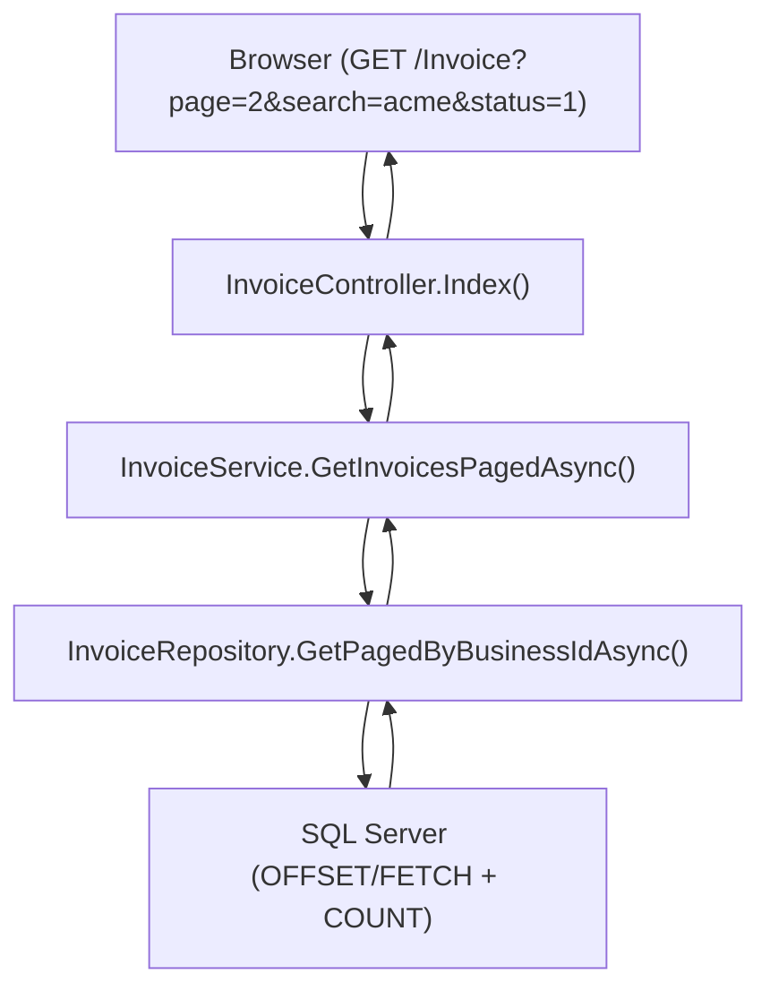

# Design Document: Table Paging & Search

## Overview

This design adds server-side pagination and text search to the Invoice and Quotation list pages in the Portal application. The current implementation loads all records into memory and renders them in a single table, which degrades performance as data grows. The new design moves filtering, searching, and pagination to the SQL layer, returning only the requested page of data.

Additionally, a CSS fix corrects the filter dropdown arrow (chevron) positioning issue where the arrow renders at the far right of the page container instead of adjacent to the select element content.

### Design Decisions

1. **SQL-level pagination** — Use `OFFSET`/`FETCH NEXT` in SQL queries rather than loading all records and paginating in memory. This ensures consistent performance regardless of dataset size.
2. **Single query with COUNT** — Use a CTE or subquery approach to get both the paginated data and total count in a single database round-trip.
3. **Form GET submission** — Keep the existing pattern of `<form method="get">` for filters, adding `page` and `search` parameters. This preserves browser back/forward navigation and bookmarkability.
4. **Shared PagedResult model** — Introduce a generic `PagedResult<T>` model to encapsulate pagination metadata, reusable across both Invoice and Quotation (and future list pages).
5. **No JavaScript pagination** — Use server-rendered pagination controls (Razor partial) rather than AJAX-based pagination, consistent with the existing filter pattern.

## Architecture



The architecture follows the existing MVC + Service + Repository pattern. The only structural change is that the repository returns a `PagedResult<T>` instead of `List<T>`, and the service/controller pass pagination and search parameters through the layers.

## Components and Interfaces

### New Model: `PagedResult<T>`

A generic wrapper for paginated query results, placed in `Portal.Infrastructure/Models/`.

```csharp
public class PagedResult<T>
{
    public List<T> Items { get; set; } = new();
    public int CurrentPage { get; set; }
    public int PageSize { get; set; }
    public int TotalCount { get; set; }
    public int TotalPages => (int)Math.Ceiling((double)TotalCount / PageSize);
    public bool HasPreviousPage => CurrentPage > 1;
    public bool HasNextPage => CurrentPage < TotalPages;
}
```

### Updated Service Interfaces

**IInvoiceService** — Add new paged method:

```csharp
Task<PagedResult<InvoiceListDto>> GetInvoicesPagedAsync(
    int? statusFilter = null,
    int? financialStatusFilter = null,
    int? customerFilter = null,
    string? searchTerm = null,
    int page = 1,
    int pageSize = 15);
```

**IQuotationService** — Add new paged method:

```csharp
Task<PagedResult<QuotationListDto>> GetQuotationsPagedAsync(
    int? statusFilter = null,
    int? customerFilter = null,
    DateTime? dateFrom = null,
    DateTime? dateTo = null,
    string? searchTerm = null,
    int page = 1,
    int pageSize = 15);
```

### Updated Repository Methods

**InvoiceRepository** — New method:

```csharp
public async Task<(List<InvoiceListDto> Items, int TotalCount)> GetPagedByBusinessIdAsync(
    int businessId,
    int? statusFilter,
    int? financialStatusFilter,
    int? customerFilter,
    string? searchTerm,
    int offset,
    int pageSize)
```

**QuotationRepository** — New method:

```csharp
public async Task<(List<QuotationListDto> Items, int TotalCount)> GetPagedByBusinessIdAsync(
    int businessId,
    int? statusFilter,
    int? customerFilter,
    DateTime? dateFrom,
    DateTime? dateTo,
    string? searchTerm,
    int offset,
    int pageSize)
```

### Updated View Models

**QuotationListViewModel** — Add pagination and search fields:

```csharp
public class QuotationListViewModel
{
    public PagedResult<QuotationListDto> PagedQuotations { get; set; } = new();
    public int? StatusFilter { get; set; }
    public int? CustomerFilter { get; set; }
    public DateTime? DateFrom { get; set; }
    public DateTime? DateTo { get; set; }
    public string? SearchTerm { get; set; }
    public List<Customer> Customers { get; set; } = new();
    public List<QuotationStatusType> Statuses { get; set; } = new();
}
```

The Invoice Index view currently uses `ViewBag` for filter state. We will add `ViewBag.SearchTerm` and `ViewBag.PagedResult` (or switch to a dedicated view model — implementation choice during task execution).

### Paging Partial View

A shared Razor partial `_PagingControl.cshtml` in `Views/Shared/` that renders:
- "Previous" button (disabled on page 1)
- Page number indicators
- "Next" button (disabled on last page)
- "Showing X–Y of Z records" text

### Updated Controller Actions

**InvoiceController.Index** — Accept additional parameters:

```csharp
public async Task<IActionResult> Index(int? status, int? financialStatus, int? customer, string? search, int page = 1)
```

**QuotationController.Index** — Accept additional parameters:

```csharp
public async Task<IActionResult> Index(int? status, int? customer, DateTime? dateFrom, DateTime? dateTo, string? search, int page = 1)
```

## Data Models

### SQL Query Pattern (Invoice)

```sql
SELECT [invoice].[Invoice].[Id],
       [invoice].[Invoice].[InvoiceNumber],
       [invoice].[Invoice].[CustomerId],
       [customer].[Customer].[Name] AS [CustomerName],
       [invoice].[Invoice].[InvoiceDate],
       [invoice].[Invoice].[DueDate],
       [invoice].[Invoice].[TotalAmount],
       [invoice].[InvoiceStatusType].[Name] AS [StatusName],
       [invoice].[InvoiceFinancialStatusType].[Name] AS [FinancialStatusName],
       [invoice].[Invoice].[InvoiceStatusTypeId],
       [invoice].[Invoice].[InvoiceFinancialStatusTypeId],
       COUNT(*) OVER() AS [TotalCount]
FROM [invoice].[Invoice]
INNER JOIN [customer].[Customer] ON [invoice].[Invoice].[CustomerId] = [customer].[Customer].[Id]
INNER JOIN [invoice].[InvoiceStatusType] ON [invoice].[Invoice].[InvoiceStatusTypeId] = [invoice].[InvoiceStatusType].[Id]
INNER JOIN [invoice].[InvoiceFinancialStatusType] ON [invoice].[Invoice].[InvoiceFinancialStatusTypeId] = [invoice].[InvoiceFinancialStatusType].[Id]
WHERE [invoice].[Invoice].[BusinessId] = @BusinessId
  AND [invoice].[Invoice].[IsDeleted] = 0
  AND (@StatusFilter IS NULL OR [invoice].[Invoice].[InvoiceStatusTypeId] = @StatusFilter)
  AND (@FinancialStatusFilter IS NULL OR [invoice].[Invoice].[InvoiceFinancialStatusTypeId] = @FinancialStatusFilter)
  AND (@CustomerFilter IS NULL OR [invoice].[Invoice].[CustomerId] = @CustomerFilter)
  AND (@SearchTerm IS NULL OR (
      [invoice].[Invoice].[InvoiceNumber] LIKE '%' + @SearchTerm + '%'
      OR [customer].[Customer].[Name] LIKE '%' + @SearchTerm + '%'
  ))
ORDER BY [invoice].[Invoice].[InvoiceDate] DESC
OFFSET @Offset ROWS FETCH NEXT @PageSize ROWS ONLY
```

### SQL Query Pattern (Quotation)

```sql
SELECT [quotation].[Quotation].[Id],
       [quotation].[Quotation].[Reference],
       [customer].[Customer].[Name] AS [CustomerName],
       [quotation].[QuotationStatusType].[Name] AS [StatusName],
       [quotation].[Quotation].[QuotationStatusTypeId],
       [quotation].[Quotation].[TotalAmount],
       [quotation].[Quotation].[ValidUntil],
       [quotation].[Quotation].[CreatedAtUtc],
       COUNT(*) OVER() AS [TotalCount]
FROM [quotation].[Quotation]
INNER JOIN [customer].[Customer] ON [quotation].[Quotation].[CustomerId] = [customer].[Customer].[Id]
INNER JOIN [quotation].[QuotationStatusType] ON [quotation].[Quotation].[QuotationStatusTypeId] = [quotation].[QuotationStatusType].[Id]
WHERE [quotation].[Quotation].[BusinessId] = @BusinessId
  AND [quotation].[Quotation].[IsDeleted] = 0
  AND (@StatusFilter IS NULL OR [quotation].[Quotation].[QuotationStatusTypeId] = @StatusFilter)
  AND (@CustomerFilter IS NULL OR [quotation].[Quotation].[CustomerId] = @CustomerFilter)
  AND (@DateFrom IS NULL OR [quotation].[Quotation].[CreatedAtUtc] >= @DateFrom)
  AND (@DateTo IS NULL OR [quotation].[Quotation].[CreatedAtUtc] <= @DateTo)
  AND (@SearchTerm IS NULL OR (
      [quotation].[Quotation].[Reference] LIKE '%' + @SearchTerm + '%'
      OR [customer].[Customer].[Name] LIKE '%' + @SearchTerm + '%'
  ))
ORDER BY [quotation].[Quotation].[CreatedAtUtc] DESC
OFFSET @Offset ROWS FETCH NEXT @PageSize ROWS ONLY
```

### CSS Fix for Filter Dropdown

The current `.field select` rule sets `width: 100%` but does not constrain the `appearance` or provide a custom chevron. The fix:

```css
.field select {
    appearance: none;
    -webkit-appearance: none;
    -moz-appearance: none;
    background-image: url("data:image/svg+xml,%3Csvg xmlns='http://www.w3.org/2000/svg' width='12' height='12' viewBox='0 0 12 12'%3E%3Cpath fill='%235E7385' d='M6 8.5L1.5 4h9L6 8.5z'/%3E%3C/svg%3E");
    background-repeat: no-repeat;
    background-position: right 14px center;
    background-size: 12px;
    padding-right: 38px;
    max-width: 100%;
}
```

This ensures:
- The native browser chevron is removed (`appearance: none`)
- A custom SVG chevron is positioned 14px from the right edge (adjacent to content)
- The select element respects the grid column width (`max-width: 100%`)
- Padding-right prevents text from overlapping the chevron

## Correctness Properties

*A property is a characteristic or behavior that should hold true across all valid executions of a system — essentially, a formal statement about what the system should do. Properties serve as the bridge between human-readable specifications and machine-verifiable correctness guarantees.*

### Property 1: Correct Page Slice

*For any* ordered dataset of invoices (or quotations) and any valid page number P with page size S, the returned items SHALL be exactly the records at positions `[(P-1)*S .. min(P*S, totalCount)-1]` in the fully filtered and ordered dataset.

**Validates: Requirements 1.1, 1.2, 2.1, 2.2**

### Property 2: Paging Metadata Correctness

*For any* total record count N and page size S, the computed `TotalPages` SHALL equal `⌈N / S⌉`, `HasPreviousPage` SHALL be true if and only if `CurrentPage > 1`, and `HasNextPage` SHALL be true if and only if `CurrentPage < TotalPages`.

**Validates: Requirements 1.3, 1.6, 1.7, 2.3, 2.6, 2.7**

### Property 3: Search Filter Correctness

*For any* search term T and any dataset of invoices, every returned record SHALL have T as a case-insensitive substring of either the invoice number or customer name, and no record matching T in those fields SHALL be excluded from the unfiltered result set. The same property applies to quotations searching reference and customer name.

**Validates: Requirements 3.2, 3.3, 4.2, 4.3**

### Property 4: Combined Filters with AND Logic

*For any* combination of active filters (status, financial status, customer, date range, search term), the paginated result SHALL be the correct page slice of the dataset where ALL filter predicates are satisfied simultaneously (AND logic). Changing any filter SHALL reset pagination to page 1.

**Validates: Requirements 1.8, 2.8, 3.5, 4.5, 1.9, 2.9**

### Property 5: URL Query String Preserves Filter State

*For any* set of active filter values and current page number, the pagination navigation URLs SHALL contain all active filter parameters as query string key-value pairs, such that loading the URL reproduces the same filtered, paged view.

**Validates: Requirements 6.1, 6.2, 6.3**

## Error Handling

| Scenario | Handling |
|----------|----------|
| Page number < 1 or non-numeric | Clamp to page 1 |
| Page number > total pages | Return empty items with correct metadata (or clamp to last page) |
| Search term contains SQL wildcards (`%`, `_`) | Escape wildcards in the parameterized query using `ESCAPE` clause or string replacement |
| Negative page size | Use default (15) |
| Database timeout on large datasets | Standard try/catch with rethrow in repository; controller returns error view |
| Empty result set | Display "No records found" empty state (existing pattern) |

## Testing Strategy

### Unit Tests (Example-Based)

- **Controller tests**: Verify that the Index action passes correct parameters to the service and populates ViewBag/ViewModel correctly.
- **Paging metadata edge cases**: Page 1 of 0 records (totalPages = 0), page 1 of 1 record, page 1 of exactly 15 records.
- **Search input retention**: Verify the search term is passed back to the view after form submission.
- **CSS visual tests**: Manual verification of dropdown arrow positioning at various viewport widths.

### Property-Based Tests

Property-based testing is appropriate for this feature because the pagination and search logic involves pure computational functions (offset calculation, metadata computation, filter predicate application) with large input spaces (varying dataset sizes, page numbers, search terms, filter combinations).

**Library**: FsCheck (for .NET / xUnit integration)

**Configuration**:
- Minimum 100 iterations per property test
- Each test tagged with: `Feature: table-paging-search, Property {number}: {property_text}`

**Properties to implement**:
1. Correct page slice — generate random lists of DTOs, apply pagination logic, verify slice correctness
2. Paging metadata — generate random (totalCount, pageSize, currentPage) tuples, verify computed properties
3. Search filter — generate random datasets and search terms, verify inclusion/exclusion correctness
4. Combined filters AND logic — generate random filter combinations, verify results satisfy all predicates
5. URL preservation — generate random filter state, verify URL round-trip preserves all values

### Integration Tests

- End-to-end test with seeded SQL data verifying the full query returns correct paginated results
- Verify `OFFSET`/`FETCH` behavior with actual SQL Server execution
- Verify `LIKE` search with special characters is properly escaped
