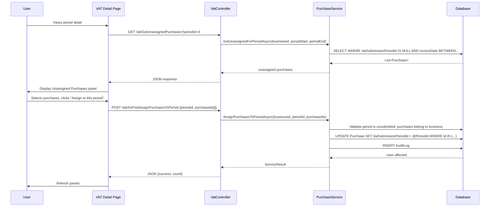
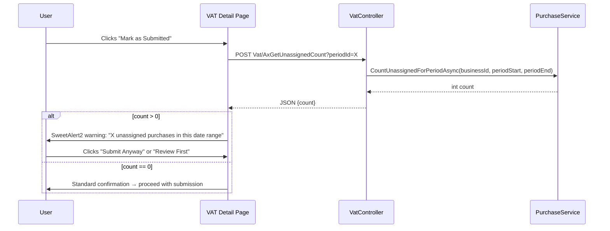

# Design Document: VAT Period Assignment Workflow

## Overview

This feature replaces automatic VAT period assignment with a user-controlled workflow. Purchases start unassigned (`VatSubmissionPeriodId = NULL`) and are explicitly assigned to a period by the user — either at the point of recording (optional dropdown on forms) or during VAT submission preparation (bulk assignment panel on the VAT Detail page).

The design preserves existing data (no migration needed for the Purchase table itself) and adds UI controls, a new API endpoint, and an advisory gate before submission.

### Key Design Decisions

1. **No auto-assignment** — The `AssignVatPeriodAsync` method is removed from the purchase creation flow. Purchases always start with `VatSubmissionPeriodId = NULL` unless the user explicitly selects a period.
2. **User authority** — The user decides which period a purchase belongs to. The system shows what's unassigned but never forces an assignment.
3. **Non-blocking** — The submission advisory is informational. Users can submit with unassigned purchases if they choose.
4. **Locking after submission** — Once a period is marked as Submitted, its assigned purchases cannot be reassigned. This protects the integrity of filed returns.
5. **Backward compatible** — Existing auto-assigned purchases retain their assignments. Only new behaviour changes going forward.

## Architecture

### Data Flow: Assignment Operations



### Data Flow: Submission Advisory



## Components and Interfaces

### 1. Service Layer Changes

**PurchaseService — Modified methods:**

```csharp
// REMOVED: private async Task AssignVatPeriodAsync(Purchase purchase)
// The entire method is deleted — no auto-assignment on create.

// NEW: Bulk assignment
Task<ServiceResult> AssignPurchasesToPeriodAsync(int businessId, int periodId, List<int> purchaseIds);

// NEW: Bulk unassignment
Task<ServiceResult> UnassignPurchasesFromPeriodAsync(int businessId, List<int> purchaseIds);

// NEW: Get unassigned purchases for a period's date range
Task<List<Purchase>> GetUnassignedForPeriodAsync(int businessId, DateOnly periodStart, DateOnly periodEnd);

// NEW: Count unassigned purchases for a period's date range
Task<int> CountUnassignedForPeriodAsync(int businessId, DateOnly periodStart, DateOnly periodEnd);
```

### 2. Controller Changes

**VatController — New AJAX endpoints:**

```csharp
// GET: /Vat/GetUnassignedPurchases?periodId=X
// Returns unassigned purchases with InvoiceDate in the period's date range
[HttpGet]
Task<IActionResult> GetUnassignedPurchases(int periodId);

// GET: /Vat/AxGetUnassignedCount?periodId=X
// Returns count of unassigned purchases (for submission advisory)
[HttpGet]
Task<IActionResult> AxGetUnassignedCount(int periodId);

// POST: /Vat/AxPostAssignPurchasesToPeriod
// Bulk-assigns selected purchases to a period
[HttpPost]
[ValidateAntiForgeryToken]
Task<IActionResult> AxPostAssignPurchasesToPeriod([FromBody] AssignPurchasesRequest request);

// POST: /Vat/AxPostUnassignPurchasesFromPeriod
// Bulk-unassigns selected purchases from their period
[HttpPost]
[ValidateAntiForgeryToken]
Task<IActionResult> AxPostUnassignPurchasesFromPeriod([FromBody] UnassignPurchasesRequest request);
```

**PurchaseController — Modified:**

```csharp
// Create action — passes VatSubmissionPeriodId from form (nullable)
// Edit action — passes VatSubmissionPeriodId from form (nullable), validates locking
// BulkCreate action — passes VatSubmissionPeriodId per row (nullable)
```

### 3. Request Models

```csharp
public class AssignPurchasesRequest
{
    public int PeriodId { get; set; }
    public List<int> PurchaseIds { get; set; } = new();
}

public class UnassignPurchasesRequest
{
    public List<int> PurchaseIds { get; set; } = new();
}
```

### 4. Repository Layer

**PurchaseRepository — New methods:**

```csharp
/// Updates VatSubmissionPeriodId for a batch of purchases
Task BulkAssignToPeriodAsync(int businessId, int periodId, List<int> purchaseIds);

/// Sets VatSubmissionPeriodId = NULL for a batch of purchases
Task BulkUnassignFromPeriodAsync(int businessId, List<int> purchaseIds);

/// Gets unassigned, non-cancelled purchases within a date range
Task<List<Purchase>> GetUnassignedByDateRangeAsync(int businessId, DateOnly startDate, DateOnly endDate);

/// Counts unassigned, non-cancelled purchases within a date range
Task<int> CountUnassignedByDateRangeAsync(int businessId, DateOnly startDate, DateOnly endDate);
```

### 5. View Changes

**Purchase/Create.cshtml** — Add optional VAT Period dropdown after Invoice Date field:
```html
<div class="field">
    <label>VAT Period (Optional)</label>
    <select name="VatSubmissionPeriodId">
        <option value="">— Not assigned —</option>
        @foreach (var period in unsubmittedPeriods)
        <option value="@period.Id">@period.PeriodLabel</option>
    </select>
    <span class="helper">Assign to a VAT period now, or leave empty to assign later.</span>
</div>
```

**Purchase/Edit.cshtml** — Add VAT Period dropdown (disabled if locked):
```html
<div class="field">
    <label>VAT Period</label>
    @if (isLockedToSubmittedPeriod)
    {
        <select disabled><option>@assignedPeriodLabel</option></select>
        <span class="helper">Locked — assigned to a submitted period.</span>
    }
    else
    {
        <select name="VatSubmissionPeriodId">
            <option value="">— Not assigned —</option>
            @foreach (var period in unsubmittedPeriods)
            <option value="@period.Id" selected="...">@period.PeriodLabel</option>
        </select>
    }
</div>
```

**Purchase/BulkEntry.cshtml** — Add VAT Period column and batch-set control.

**Vat/Detail.cshtml** — Add Unassigned Purchases panel section with:
- AJAX-loaded table of unassigned purchases
- Select all / individual checkboxes
- "Assign to this period" bulk action button
- Dismiss individual rows
- Empty state message when all assigned

**Vat/Detail.cshtml** — Modify `markAsSubmitted()` function to check unassigned count first.

### 6. PurchaseFormViewModel Changes

Add property:
```csharp
public int? VatSubmissionPeriodId { get; set; }
public List<VatSubmissionPeriod> UnsubmittedVatPeriods { get; set; } = new();
public bool IsVatPeriodLocked { get; set; }
public string? AssignedPeriodLabel { get; set; }
```

## SQL Patterns

### Get unassigned purchases for a period's date range

```sql
SELECT [purchase].[Purchase].[Id],
       [purchase].[Purchase].[InvoiceDate],
       [purchase].[Purchase].[Description],
       [purchase].[Purchase].[AmountExcludingVat],
       [purchase].[Purchase].[VatAmount],
       [purchase].[Purchase].[TotalAmount],
       [purchase].[Purchase].[SupplierId],
       [purchase].[Purchase].[ExpenseCategoryId]
FROM [purchase].[Purchase]
WHERE [purchase].[Purchase].[BusinessId] = @BusinessId
  AND [purchase].[Purchase].[VatSubmissionPeriodId] IS NULL
  AND [purchase].[Purchase].[IsCancelled] = 0
  AND [purchase].[Purchase].[InvoiceDate] >= @PeriodStartDate
  AND [purchase].[Purchase].[InvoiceDate] <= @PeriodEndDate
ORDER BY [purchase].[Purchase].[InvoiceDate] DESC
```

### Bulk assign purchases to a period

```sql
UPDATE [purchase].[Purchase]
SET [VatSubmissionPeriodId] = @PeriodId
WHERE [purchase].[Purchase].[BusinessId] = @BusinessId
  AND [purchase].[Purchase].[Id] IN (@Id1, @Id2, ...)
  AND [purchase].[Purchase].[IsCancelled] = 0
  AND [purchase].[Purchase].[VatSubmissionPeriodId] IS NULL
```

### Bulk unassign purchases from a period

```sql
UPDATE [purchase].[Purchase]
SET [VatSubmissionPeriodId] = NULL
WHERE [purchase].[Purchase].[BusinessId] = @BusinessId
  AND [purchase].[Purchase].[Id] IN (@Id1, @Id2, ...)
  AND [purchase].[Purchase].[VatSubmissionPeriodId] IS NOT NULL
  AND NOT EXISTS (
      SELECT 1 FROM [vat].[VatSubmission]
      WHERE [vat].[VatSubmission].[VatSubmissionPeriodId] = [purchase].[Purchase].[VatSubmissionPeriodId]
        AND [vat].[VatSubmission].[BusinessId] = @BusinessId
        AND [vat].[VatSubmission].[IsSubmitted] = 1
  )
```

### Count unassigned for advisory

```sql
SELECT COUNT(*)
FROM [purchase].[Purchase]
WHERE [purchase].[Purchase].[BusinessId] = @BusinessId
  AND [purchase].[Purchase].[VatSubmissionPeriodId] IS NULL
  AND [purchase].[Purchase].[IsCancelled] = 0
  AND [purchase].[Purchase].[InvoiceDate] >= @PeriodStartDate
  AND [purchase].[Purchase].[InvoiceDate] <= @PeriodEndDate
```

## Validation Rules

### Bulk Assign Validation

| Check | Failure Response |
|-------|-----------------|
| Period does not exist | "VAT period not found." |
| Period does not belong to business | "VAT period not found." (same — no information leakage) |
| Period is already submitted | "Cannot assign to a submitted period." |
| Purchase does not belong to business | Skip silently (don't reveal cross-tenant info) |
| Purchase is cancelled | Skip silently |
| Purchase is already assigned to a submitted period | Return error: "X purchase(s) are locked to a submitted period and cannot be reassigned." |

### Bulk Unassign Validation

| Check | Failure Response |
|-------|-----------------|
| Purchase does not belong to business | Skip silently |
| Purchase is assigned to a submitted period | Return error: "X purchase(s) are locked to a submitted period and cannot be unassigned." |

## Error Handling

- **Repository layer**: `try/catch (Exception ex) { throw; }`
- **Service layer**: Validates all business rules, returns `ServiceResult.Fail(message)` on violation
- **Controller layer**: Wraps in try/catch, always returns `Json(new { success, message })`
- **UI**: BlockUI.show → fetch → BlockUI.hide → Swal.fire (on error) or refresh panel (on success)

## UX Considerations

1. **Non-intrusive** — The VAT Period dropdown on Create/Edit is optional and at the bottom of the form. Users who don't care about period assignment at creation time can ignore it entirely.
2. **Natural workflow** — Most users will bulk-assign from the VAT Detail page when preparing their submission. This matches how accountants actually work: "I'm preparing this period, let me claim all relevant purchases."
3. **Forgiving** — Unassign is always available before submission. No irreversible actions until the period is filed.
4. **Informative** — The count badge on the periods list and the advisory before submission ensure nothing is forgotten accidentally.
