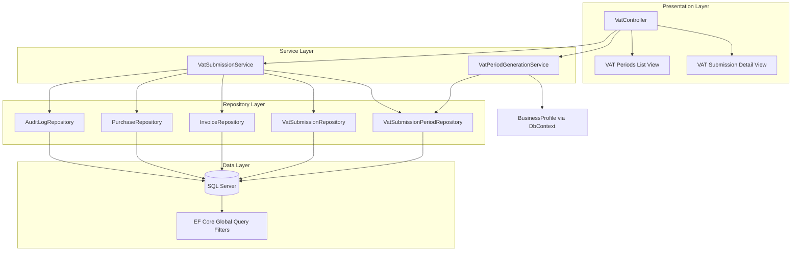

# Design Document: VAT Submissions

## Overview

The VAT Submissions module (Module 6) provides automated VAT period generation, submission computation, and filing status tracking for multi-tenant businesses within the Portal platform. It follows the established MVC → Service → Repository architecture, leveraging existing infrastructure (EF Core global query filters for tenant isolation, `GenericStoredProcedureRepository<T>` base class, `ServiceResult` pattern, and `AuditLogRepository` for audit trails).

The module introduces two new repositories (`VatSubmissionPeriodRepository`, `VatSubmissionRepository`), two new services (`VatPeriodGenerationService`, `VatSubmissionService`), one new controller (`VatController`), and two Razor views (Periods List, Submission Detail). The database tables already exist from migrations 017 and 018; this design covers the application layer only.

### Key Design Decisions

1. **Period generation is on-demand**: Periods are generated/extended each time the user navigates to the VAT periods list, ensuring new periods appear automatically as time progresses without background jobs.
2. **Submission computation is idempotent**: Creating a submission for a period that already has one recalculates the values, ensuring the user always sees current figures.
3. **EU Reverse Charge exclusion**: Input VAT computation explicitly excludes purchases with `PurchaseOriginTypeId = 2` as these are accounted for via the reverse charge mechanism.
4. **Immutable once submitted**: Once a submission is marked as submitted, it cannot be recalculated or modified, preserving the filed record.

## Architecture



### Request Flow

1. **Periods List**: `GET /Vat/Index` → `VatController.Index()` → `VatPeriodGenerationService.GeneratePeriodsAsync()` → `VatSubmissionPeriodRepository` (persist new periods) → Return view with all periods + submission status
2. **Submission Detail**: `GET /Vat/Detail/{periodId}` → `VatController.Detail(periodId)` → `VatSubmissionService.CreateOrRecalculateAsync(periodId)` → Compute output/input VAT → Return view with breakdown
3. **Mark as Submitted**: `POST /Vat/MarkAsSubmitted` → `VatController.MarkAsSubmitted(submissionId)` → `VatSubmissionService.MarkAsSubmittedAsync(submissionId)` → Update record + audit log → Return JSON result

## Components and Interfaces

### IVatPeriodGenerationService

```csharp
public interface IVatPeriodGenerationService
{
    /// <summary>
    /// Generates all missing VAT periods from VatRegistrationDate to the current date
    /// for the current tenant. Returns the complete list of periods (existing + newly created).
    /// </summary>
    Task<List<VatSubmissionPeriod>> GeneratePeriodsAsync();
}
```

### IVatSubmissionService

```csharp
public interface IVatSubmissionService
{
    /// <summary>
    /// Creates a new submission or recalculates an existing one for the specified period.
    /// Computes TotalOutputVat, TotalInputVat, and NetVatPayable from invoices and purchases.
    /// Returns ServiceResult with the VatSubmission on success.
    /// </summary>
    Task<ServiceResult<VatSubmission>> CreateOrRecalculateAsync(int vatSubmissionPeriodId);

    /// <summary>
    /// Marks an existing submission as filed with the tax authority.
    /// Sets IsSubmitted = true and SubmittedAtUtc = DateTime.UtcNow.
    /// </summary>
    Task<ServiceResult> MarkAsSubmittedAsync(int vatSubmissionId);

    /// <summary>
    /// Retrieves a submission by its period ID for the current tenant.
    /// Returns null if no submission exists for the period.
    /// </summary>
    Task<VatSubmission?> GetByPeriodIdAsync(int vatSubmissionPeriodId);
}
```

### VatSubmissionPeriodRepository

```csharp
public class VatSubmissionPeriodRepository : GenericStoredProcedureRepository<VatSubmissionPeriod>
{
    public VatSubmissionPeriodRepository(DbContext context) : base(context) { }

    public async Task<List<VatSubmissionPeriod>> GetAllByBusinessIdAsync(int businessId);
    public async Task<VatSubmissionPeriod?> GetByIdAndBusinessIdAsync(int id, int businessId);
    public async Task<VatSubmissionPeriod?> GetLatestByBusinessIdAsync(int businessId);
    public async Task InsertAsync(VatSubmissionPeriod entity);
}
```

### VatSubmissionRepository

```csharp
public class VatSubmissionRepository : GenericStoredProcedureRepository<VatSubmission>
{
    public VatSubmissionRepository(DbContext context) : base(context) { }

    public async Task<List<VatSubmission>> GetAllByBusinessIdAsync(int businessId);
    public async Task<VatSubmission?> GetByIdAndBusinessIdAsync(int id, int businessId);
    public async Task<VatSubmission?> GetByPeriodIdAndBusinessIdAsync(int vatSubmissionPeriodId, int businessId);
    public async Task InsertAsync(VatSubmission entity);
    public async Task UpdateValuesAsync(VatSubmission entity);
    public async Task MarkAsSubmittedAsync(int id, int businessId);
}
```

### VatController

```csharp
[Authorize]
[ModuleAccess(PortalModules.Vat)]
public class VatController : Controller
{
    public async Task<IActionResult> Index();                          // GET: Periods list
    public async Task<IActionResult> Detail(int periodId);            // GET: Submission detail
    
    [HttpPost]
    [ValidateAntiForgeryToken]
    [ModuleAccess(PortalModules.Vat, AccessLevels.Full)]
    public async Task<IActionResult> MarkAsSubmitted(int submissionId); // POST: Mark submitted (JSON)
}
```

### ServiceResult&lt;T&gt; Extension

The existing `ServiceResult` class will be extended with a generic variant to carry the submission entity:

```csharp
public class ServiceResult<T> : ServiceResult
{
    public T? Data { get; set; }

    public static ServiceResult<T> Ok(T data) => new() { Success = true, Data = data };
    public static new ServiceResult<T> Fail(string message) => new() { Success = false, Message = message };
}
```

## Data Models

### Existing Entities (Already Defined)

#### VatSubmissionPeriod

| Column | Type | Constraints |
|--------|------|-------------|
| Id | int | PK, Identity |
| BusinessId | int | FK → [portal].[Business], NOT NULL |
| PeriodStartDate | DateOnly | NOT NULL |
| PeriodEndDate | DateOnly | NOT NULL |
| PeriodLabel | nvarchar(100) | NOT NULL |
| CreatedAtUtc | DateTime | NOT NULL, Default GETUTCDATE() |

**Unique Constraint**: `(BusinessId, PeriodStartDate)` — prevents duplicate periods per tenant.

#### VatSubmission

| Column | Type | Constraints |
|--------|------|-------------|
| Id | int | PK, Identity |
| BusinessId | int | FK → [portal].[Business], NOT NULL |
| VatSubmissionPeriodId | int | FK → [vat].[VatSubmissionPeriod], NOT NULL |
| TotalOutputVat | decimal(18,2) | NOT NULL |
| TotalInputVat | decimal(18,2) | NOT NULL |
| NetVatPayable | decimal(18,2) | NOT NULL |
| IsSubmitted | bit | NOT NULL, Default 0 |
| SubmittedAtUtc | DateTime? | NULL |
| Notes | nvarchar(max) | NULL |
| CreatedAtUtc | DateTime | NOT NULL, Default GETUTCDATE() |

**Unique Constraint**: `(BusinessId, VatSubmissionPeriodId)` — one submission per period per tenant.

### View Models

#### VatPeriodsListViewModel

```csharp
public class VatPeriodsListViewModel
{
    public List<VatPeriodRowViewModel> Periods { get; set; } = new();
}

public class VatPeriodRowViewModel
{
    public int PeriodId { get; set; }
    public string PeriodLabel { get; set; } = null!;
    public DateOnly PeriodStartDate { get; set; }
    public DateOnly PeriodEndDate { get; set; }
    public string Status { get; set; } = null!;           // "Submitted", "Pending", "Not Started"
    public DateTime? SubmittedAtUtc { get; set; }
}
```

#### VatSubmissionDetailViewModel

```csharp
public class VatSubmissionDetailViewModel
{
    public int SubmissionId { get; set; }
    public int PeriodId { get; set; }
    public string PeriodLabel { get; set; } = null!;
    public DateOnly PeriodStartDate { get; set; }
    public DateOnly PeriodEndDate { get; set; }
    public decimal TotalOutputVat { get; set; }
    public decimal TotalInputVat { get; set; }
    public decimal NetVatPayable { get; set; }
    public bool IsSubmitted { get; set; }
    public DateTime? SubmittedAtUtc { get; set; }
    public string CurrencySymbol { get; set; } = "€";
}
```

### Period Generation Algorithm

```
Input: VatRegistrationDate, VatPeriodLengthInMonths, CurrentDate
Output: List<VatSubmissionPeriod>

1. If VatRegistrationDate is default (0001-01-01), return empty list
2. Validate VatPeriodLengthInMonths ∈ {1, 2, 3, 4, 6, 12}
3. Retrieve existing periods for tenant from database
4. Determine startDate:
   - If no existing periods: startDate = VatRegistrationDate
   - If existing periods: startDate = LatestPeriod.PeriodEndDate + 1 day
5. While startDate <= CurrentDate:
   a. endDate = startDate.AddMonths(VatPeriodLengthInMonths).AddDays(-1)
   b. periodLabel = $"{startDate:dd MMM yyyy} – {endDate:dd MMM yyyy}"
   c. Create VatSubmissionPeriod { BusinessId, PeriodStartDate=startDate, PeriodEndDate=endDate, PeriodLabel=periodLabel }
   d. Persist to database
   e. startDate = endDate + 1 day
6. Return all periods (existing + new) ordered by PeriodStartDate descending
```

### VAT Computation Logic

```
ComputeOutputVat(periodStart, periodEnd, businessId):
  SELECT SUM(TaxAmount)
  FROM [invoice].[Invoice]
  WHERE Invoice.BusinessId = @BusinessId
    AND Invoice.InvoiceStatusTypeId = 2        -- Issued only
    AND Invoice.IsDeleted = 0                  -- Not soft-deleted
    AND Invoice.InvoiceDate >= @PeriodStart
    AND Invoice.InvoiceDate <= @PeriodEnd

ComputeInputVat(periodStart, periodEnd, businessId):
  SELECT SUM(VatAmount)
  FROM [purchase].[Purchase]
  WHERE Purchase.BusinessId = @BusinessId
    AND Purchase.PurchaseOriginTypeId != 2     -- Exclude EU Reverse Charge
    AND Purchase.IsCancelled = 0               -- Not cancelled
    AND Purchase.InvoiceDate >= @PeriodStart
    AND Purchase.InvoiceDate <= @PeriodEnd

NetVatPayable = TotalOutputVat - TotalInputVat
```


## Correctness Properties

*A property is a characteristic or behavior that should hold true across all valid executions of a system — essentially, a formal statement about what the system should do. Properties serve as the bridge between human-readable specifications and machine-verifiable correctness guarantees.*

### Property 1: No overlapping periods

*For any* valid VatRegistrationDate and VatPeriodLengthInMonths ∈ {1, 2, 3, 4, 6, 12}, the generated periods SHALL have no overlapping date ranges — no single date belongs to more than one period.

**Validates: Requirements 11.1**

### Property 2: Contiguous periods (no gaps)

*For any* valid VatRegistrationDate and VatPeriodLengthInMonths ∈ {1, 2, 3, 4, 6, 12}, for all consecutive period pairs (N, N+1), the PeriodStartDate of period N+1 SHALL equal the PeriodEndDate of period N plus one day.

**Validates: Requirements 3.5, 11.2**

### Property 3: Period duration equals configured months

*For any* valid VatRegistrationDate and VatPeriodLengthInMonths ∈ {1, 2, 3, 4, 6, 12}, every generated period's end date SHALL equal its start date plus VatPeriodLengthInMonths calendar months minus one day (i.e., `PeriodStartDate.AddMonths(length).AddDays(-1)`).

**Validates: Requirements 3.4, 11.3, 11.5**

### Property 4: First period anchored to VatRegistrationDate

*For any* valid (non-default) VatRegistrationDate and VatPeriodLengthInMonths ∈ {1, 2, 3, 4, 6, 12}, the first generated period's PeriodStartDate SHALL equal the BusinessProfile's VatRegistrationDate.

**Validates: Requirements 3.3, 11.4**

### Property 5: Coverage up to current date

*For any* valid VatRegistrationDate (before or equal to current date) and VatPeriodLengthInMonths ∈ {1, 2, 3, 4, 6, 12}, the last generated period SHALL contain the current date (PeriodStartDate ≤ currentDate ≤ PeriodEndDate), and no generated period SHALL have a PeriodStartDate after the current date.

**Validates: Requirements 3.6, 3.7**

### Property 6: Period label format consistency

*For any* generated VatSubmissionPeriod, the PeriodLabel SHALL equal the string `"{PeriodStartDate:dd MMM yyyy} – {PeriodEndDate:dd MMM yyyy}"` derived from the period's actual start and end dates.

**Validates: Requirements 3.8**

### Property 7: Generation idempotence

*For any* tenant configuration, calling GeneratePeriodsAsync() multiple times SHALL produce the same set of periods — no duplicate periods are created, and the total count remains stable after the first generation.

**Validates: Requirements 3.9**

### Property 8: Invalid period length rejection

*For any* integer value NOT in the set {1, 2, 3, 4, 6, 12}, the VatPeriodGenerationService SHALL reject the configuration and return an empty collection or throw a validation error.

**Validates: Requirements 3.11**

### Property 9: Output VAT computation correctness

*For any* set of invoices belonging to the current tenant within a period's date range, TotalOutputVat SHALL equal the sum of TaxAmount from only those invoices where InvoiceStatusTypeId = 2 (Issued) AND IsDeleted = false.

**Validates: Requirements 4.3**

### Property 10: Input VAT computation correctness

*For any* set of purchases belonging to the current tenant within a period's date range, TotalInputVat SHALL equal the sum of VatAmount from only those purchases where PurchaseOriginTypeId ≠ 2 (excluding EU Reverse Charge) AND IsCancelled = false.

**Validates: Requirements 4.4**

### Property 11: Net VAT payable is the difference

*For any* VatSubmission, NetVatPayable SHALL equal TotalOutputVat minus TotalInputVat.

**Validates: Requirements 4.5**

### Property 12: Recalculation updates existing submission

*For any* period that already has a submission, calling CreateOrRecalculateAsync SHALL update the existing submission's values rather than creating a duplicate — the unique constraint (BusinessId, VatSubmissionPeriodId) is preserved with exactly one record.

**Validates: Requirements 4.6**

### Property 13: Tenant assignment invariant

*For any* VatSubmission or VatSubmissionPeriod created by the service layer, the BusinessId SHALL equal the value returned by ICurrentTenantService.CurrentBusinessId at the time of creation.

**Validates: Requirements 4.7, 9.3**

### Property 14: Mark as submitted state transition

*For any* unsubmitted VatSubmission, calling MarkAsSubmittedAsync SHALL set IsSubmitted to true and SubmittedAtUtc to a non-null value representing the current UTC time (within a reasonable tolerance).

**Validates: Requirements 5.1**

### Property 15: Audit logging for all mutations

*For any* state-changing operation on a VatSubmission (Created, Recalculated, MarkedAsSubmitted), an audit log entry SHALL be written containing BusinessId, TableName = "VatSubmission", RecordId matching the submission Id, the correct Action string, and a non-null Timestamp.

**Validates: Requirements 10.1, 10.2, 10.3, 10.4**

## Error Handling

### Service Layer Errors

| Scenario | Response |
|----------|----------|
| VatRegistrationDate is default (0001-01-01) | Return empty period list, no error |
| VatPeriodLengthInMonths not in {1,2,3,4,6,12} | Return empty period list or ServiceResult.Fail |
| Period does not belong to current tenant | ServiceResult.Fail("The specified period does not belong to your business.") |
| Submission already marked as submitted | ServiceResult.Fail("This submission has already been marked as submitted.") |
| Submission not found | ServiceResult.Fail("Submission not found.") |
| Database exception in repository | Rethrow (try/catch with `throw;`) — handled by controller |

### Controller Layer Errors

| Scenario | HTTP Response |
|----------|--------------|
| Unauthenticated request | 401 Unauthorized (via [Authorize]) |
| Missing module access | 403 Forbidden (via [ModuleAccess]) |
| Period/Submission not found for tenant | 404 NotFound |
| Service validation failure on POST | JSON `{ success: false, message: "..." }` |
| Unhandled exception | 500 (global error handler) |

### UI Error Handling

- All AJAX errors display SweetAlert2 error dialog with the message from the JSON response
- BlockUI.hide() is always called in both success and catch paths
- Network failures show a generic "An unexpected error occurred." message

## Testing Strategy

### Property-Based Tests (xUnit + FsCheck)

The project uses **xUnit** as the test framework and **FsCheck.Xunit** for property-based testing. Each property test runs a minimum of **100 iterations** with randomly generated inputs.

**Target**: The period generation algorithm (Properties 1–8) and VAT computation logic (Properties 9–11) are the primary candidates for PBT because they are pure computational functions with clear input/output behavior and a large input space.

**Library**: FsCheck.Xunit (C# property-based testing library for .NET)

**Configuration**:
- Minimum 100 iterations per property (`MaxTest = 100`)
- Each test tagged with: `// Feature: vat-submissions, Property {N}: {description}`
- Custom Arbitraries for generating valid DateOnly values, period lengths, and invoice/purchase sets

**Properties suitable for PBT**:
- Properties 1–8: Period generation algorithm (pure function, large input space of dates × period lengths)
- Properties 9–11: VAT computation (pure arithmetic over varying invoice/purchase sets)
- Property 12: Recalculation idempotence (with mocked repositories)
- Property 13: Tenant assignment (with mocked ICurrentTenantService)

### Unit Tests (xUnit)

Unit tests cover specific examples, edge cases, and error conditions:

- Default VatRegistrationDate returns empty collection
- Specific date examples (e.g., 01 Jan 2024 with quarterly periods produces expected boundaries)
- Already-submitted submission rejection
- Cross-tenant access rejection
- Zero invoices/purchases in period produces zero VAT values
- Negative NetVatPayable (refund scenario)

### Integration Tests

Integration tests verify the full stack with an in-memory or test database:

- Repository CRUD operations against SQL Server
- Global query filter enforcement (tenant isolation)
- Controller action responses with authenticated requests
- End-to-end period generation → submission creation → mark as submitted flow

### UI Tests (Manual)

- Visual verification of MyChair Design System compliance
- SweetAlert2 confirmation dialogs
- BlockUI loading states
- Responsive layout behaviour
- Status badge colours and conditional rendering
