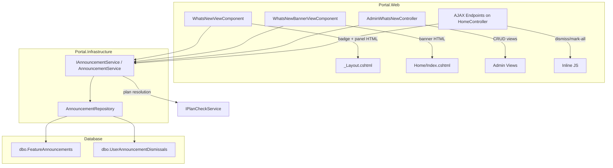

# Design: What's New Announcements

## Overview

The What's New Announcements feature is a platform-level notification system that educates Portal users about newly released features. It consists of four components:

1. **Topbar Badge** — A sparkle icon with unread count badge rendered on every authenticated page via `_Layout.cshtml`
2. **Announcement Panel** — A slide-out panel listing all visible announcements with expand/dismiss functionality
3. **Dashboard Banner** — A dismissible card on the Dashboard highlighting the most recent unread announcement
4. **Admin Management** — A SuperAdmin-only CRUD interface for creating, editing, and managing announcements

The feature is plan-aware: announcements can target specific subscription tiers so users only see content relevant to their plan. Filtering, expiry, and dismissal logic are all computed at query time with no background jobs.

### Key Design Decisions

| Decision | Rationale |
|----------|-----------|
| Schema: `[dbo]` | System-level utility, not a business module — no dedicated schema needed |
| ViewComponents (not partial views) | Self-contained server-side rendering with DI, computed server-side to avoid layout shift |
| Inline JS in ViewComponent partials | Minimal JS (panel toggle + dismiss AJAX) doesn't warrant a separate file |
| Query-time filtering | No background expiry job — simpler operations, no scheduler dependency |
| `IPlanCheckService.GetCurrentPlanNameAsync()` for tier resolution | Reuses existing subscription infrastructure |
| Single dismiss endpoint shared by panel and banner | DRY — same dismissal record regardless of UI origin |

## Architecture



### Request Flow

1. **Page Load** → `_Layout.cshtml` invokes `@await Component.InvokeAsync("WhatsNew")` → `WhatsNewViewComponent` calls `IAnnouncementService.GetVisibleForUserAsync(userId)` → renders badge + panel HTML server-side
2. **Dashboard Load** → `Home/Index.cshtml` invokes `@await Component.InvokeAsync("WhatsNewBanner")` → `WhatsNewBannerViewComponent` calls `IAnnouncementService.GetBannerAnnouncementAsync(userId)` → renders banner or empty
3. **Dismiss (AJAX)** → JS calls `POST /Home/AxPostDismissAnnouncement` → `IAnnouncementService.DismissAsync(userId, announcementId)` → returns updated unread count
4. **Admin CRUD** → `AdminWhatsNewController` actions call `IAnnouncementService` for create/update/list/preview

## Components and Interfaces

### 1. AnnouncementRepository

**Location:** `Portal.Infrastructure/Repositories/AnnouncementRepository.cs`

```csharp
namespace Portal.Infrastructure.Repositories;

public class AnnouncementRepository : GenericStoredProcedureRepository<FeatureAnnouncement>
{
    public AnnouncementRepository(DbContext context) : base(context) { }

    // Returns all active, published, non-expired announcements filtered by plan tier
    public async Task<List<FeatureAnnouncement>> GetVisibleAsync(DateTime utcNow, string? userPlanTier);

    // Returns all announcements (for admin list — includes inactive/expired)
    public async Task<List<FeatureAnnouncement>> GetAllAsync();

    // Returns a single announcement by Id
    public async Task<FeatureAnnouncement?> GetByIdAsync(int id);

    // Inserts a new announcement, returns generated Id
    public async Task<int> InsertAsync(FeatureAnnouncement entity);

    // Updates an existing announcement
    public async Task UpdateAsync(FeatureAnnouncement entity);

    // Returns all dismissal records for a user
    public async Task<List<UserAnnouncementDismissal>> GetDismissalsForUserAsync(string userId);

    // Inserts a dismissal record (idempotent — uses MERGE or IF NOT EXISTS)
    public async Task DismissAsync(string userId, int announcementId);

    // Bulk inserts dismissal records for multiple announcements
    public async Task DismissAllAsync(string userId, List<int> announcementIds);
}
```

### 2. IAnnouncementService / AnnouncementService

**Location:** `Portal.Infrastructure/Services/IAnnouncementService.cs` and `AnnouncementService.cs`

```csharp
namespace Portal.Infrastructure.Services;

public interface IAnnouncementService
{
    /// Returns all visible announcements for the user (filtered by active, published, not expired, plan tier).
    /// Each item includes an IsDismissed flag for the given user.
    Task<List<AnnouncementDto>> GetVisibleForUserAsync(string userId);

    /// Returns the unread count for the user (visible minus dismissed).
    Task<int> GetUnreadCountAsync(string userId);

    /// Returns the most recent visible undismissed announcement for the dashboard banner.
    /// Returns null if all announcements are dismissed.
    Task<AnnouncementDto?> GetBannerAnnouncementAsync(string userId);

    /// Dismisses a single announcement for the user (idempotent).
    /// Returns the updated unread count.
    Task<int> DismissAsync(string userId, int announcementId);

    /// Dismisses all visible undismissed announcements for the user.
    /// Returns the updated unread count (should be 0).
    Task<int> DismissAllAsync(string userId);

    /// Returns all announcements for admin management (includes inactive/expired).
    Task<List<AdminAnnouncementDto>> GetAllForAdminAsync();

    /// Returns a single announcement by Id for editing.
    Task<AdminAnnouncementDto?> GetByIdForAdminAsync(int id);

    /// Creates a new announcement. Returns the generated Id.
    Task<ServiceResult<int>> CreateAsync(CreateAnnouncementRequest request);

    /// Updates an existing announcement.
    Task<ServiceResult> UpdateAsync(UpdateAnnouncementRequest request);

    /// Toggles the IsActive flag for an announcement.
    Task<ServiceResult> ToggleActiveAsync(int id, bool isActive);
}
```

**Implementation Notes:**
- `GetVisibleForUserAsync` resolves the user's plan tier via `IPlanCheckService.GetCurrentPlanNameAsync()`, then calls `AnnouncementRepository.GetVisibleAsync()` with tier filtering, then joins with dismissals to set `IsDismissed`
- Plan tier hierarchy: `Starter < Professional < Enterprise`. If `TargetPlanTier` is "Professional", users on Professional or Enterprise can see it. If null, all can see it.
- If `GetCurrentPlanNameAsync()` returns null, treat user as "Starter" (lowest tier)

### 3. WhatsNewViewComponent

**Location:** `Portal.Web/ViewComponents/WhatsNewViewComponent.cs`

```csharp
namespace Portal.Web.ViewComponents;

public class WhatsNewViewComponent : ViewComponent
{
    private readonly IAnnouncementService _announcementService;

    public WhatsNewViewComponent(IAnnouncementService announcementService)
    {
        _announcementService = announcementService;
    }

    public async Task<IViewComponentResult> InvokeAsync()
    {
        // If not authenticated, return empty
        if (UserClaimsPrincipal?.Identity?.IsAuthenticated != true)
            return Content(string.Empty);

        var userId = UserClaimsPrincipal.FindFirstValue(ClaimTypes.NameIdentifier);
        var announcements = await _announcementService.GetVisibleForUserAsync(userId);
        var unreadCount = announcements.Count(a => !a.IsDismissed);

        var model = new WhatsNewViewModel
        {
            Announcements = announcements,
            UnreadCount = unreadCount,
            BadgeText = unreadCount > 9 ? "9+" : unreadCount.ToString()
        };

        return View(model);
    }
}
```

**View:** `Views/Shared/Components/WhatsNew/Default.cshtml` — renders the sparkle icon, badge, and panel HTML (hidden by default, toggled via JS).

### 4. WhatsNewBannerViewComponent

**Location:** `Portal.Web/ViewComponents/WhatsNewBannerViewComponent.cs`

```csharp
namespace Portal.Web.ViewComponents;

public class WhatsNewBannerViewComponent : ViewComponent
{
    private readonly IAnnouncementService _announcementService;

    public WhatsNewBannerViewComponent(IAnnouncementService announcementService)
    {
        _announcementService = announcementService;
    }

    public async Task<IViewComponentResult> InvokeAsync()
    {
        if (UserClaimsPrincipal?.Identity?.IsAuthenticated != true)
            return Content(string.Empty);

        var userId = UserClaimsPrincipal.FindFirstValue(ClaimTypes.NameIdentifier);
        var banner = await _announcementService.GetBannerAnnouncementAsync(userId);

        if (banner == null)
            return Content(string.Empty);

        return View(banner);
    }
}
```

**View:** `Views/Shared/Components/WhatsNewBanner/Default.cshtml` — renders the dismissible banner card or nothing.

### 5. AdminWhatsNewController

**Location:** `Portal.Web/Controllers/AdminWhatsNewController.cs`

```csharp
namespace Portal.Web.Controllers;

[Authorize(Roles = "SuperAdmin")]
public class AdminWhatsNewController : Controller
{
    private readonly IAnnouncementService _announcementService;

    public AdminWhatsNewController(IAnnouncementService announcementService)
    {
        _announcementService = announcementService;
    }

    // GET: /AdminWhatsNew — List all announcements
    public async Task<IActionResult> Index();

    // GET: /AdminWhatsNew/Create — Show create form
    public IActionResult Create();

    // POST: /AdminWhatsNew/Create — Save new announcement
    [HttpPost]
    [ValidateAntiForgeryToken]
    public async Task<IActionResult> Create(CreateAnnouncementRequest model);

    // GET: /AdminWhatsNew/Edit/5 — Show edit form
    public async Task<IActionResult> Edit(int id);

    // POST: /AdminWhatsNew/Edit — Save edited announcement
    [HttpPost]
    [ValidateAntiForgeryToken]
    public async Task<IActionResult> Edit(UpdateAnnouncementRequest model);

    // POST: /AdminWhatsNew/AxPostToggleActive — Toggle IsActive (AJAX)
    [HttpPost]
    public async Task<IActionResult> AxPostToggleActive(int id, bool isActive);

    // POST: /AdminWhatsNew/AxPostPreview — Return rendered HTML preview (AJAX)
    [HttpPost]
    public IActionResult AxPostPreview(string html);
}
```

### 6. Dismiss AJAX Endpoints (on HomeController)

The dismiss endpoints live on `HomeController` (already the Dashboard controller) since they are user-facing and not admin-restricted:

```csharp
// POST: /Home/AxPostDismissAnnouncement
[HttpPost]
[Authorize]
public async Task<IActionResult> AxPostDismissAnnouncement(int announcementId)
{
    try
    {
        var userId = User.FindFirstValue(ClaimTypes.NameIdentifier);
        var updatedCount = await _announcementService.DismissAsync(userId, announcementId);
        return Json(new { success = true, unreadCount = updatedCount });
    }
    catch (Exception ex)
    {
        return Json(new { success = false, message = "Failed to dismiss announcement." });
    }
}

// POST: /Home/AxPostDismissAllAnnouncements
[HttpPost]
[Authorize]
public async Task<IActionResult> AxPostDismissAllAnnouncements()
{
    try
    {
        var userId = User.FindFirstValue(ClaimTypes.NameIdentifier);
        var updatedCount = await _announcementService.DismissAllAsync(userId);
        return Json(new { success = true, unreadCount = updatedCount });
    }
    catch (Exception ex)
    {
        return Json(new { success = false, message = "Failed to dismiss announcements." });
    }
}
```

### 7. Integration Points

| Integration Point | How |
|-------------------|-----|
| `_Layout.cshtml` | Add `@await Component.InvokeAsync("WhatsNew")` in topbar right section |
| `Home/Index.cshtml` | Add `@await Component.InvokeAsync("WhatsNewBanner")` above existing briefing card |
| `Program.cs` / DI | Register `AnnouncementRepository`, `IAnnouncementService`/`AnnouncementService` |
| `PortalDbContext` | Add `DbSet<FeatureAnnouncement>` and `DbSet<UserAnnouncementDismissal>` with entity config |
| Navigation (Admin) | Add link to `/AdminWhatsNew` in admin sidebar/menu for SuperAdmin users |

## Data Models

### SQL DDL

```sql
-- ============================================================
-- What's New Announcements — Schema Migration
-- ============================================================

USE [Guardian]
GO

-- Table 1: Feature Announcements
CREATE TABLE [dbo].[FeatureAnnouncements] (
    [Id]                INT             IDENTITY(1,1) NOT NULL,
    [Title]             NVARCHAR(200)   NOT NULL,
    [Summary]           NVARCHAR(500)   NOT NULL,
    [DetailHtml]        NVARCHAR(MAX)   NOT NULL,
    [ModuleKey]         NVARCHAR(100)   NULL,
    [CtaLabel]          NVARCHAR(100)   NULL,
    [CtaUrl]            NVARCHAR(500)   NULL,
    [TargetPlanTier]    NVARCHAR(50)    NULL,
    [IsActive]          BIT             NOT NULL DEFAULT 1,
    [PublishedAtUtc]    DATETIME        NOT NULL,
    [ExpiresAtUtc]      DATETIME        NULL,
    [CreatedAtUtc]      DATETIME        NOT NULL DEFAULT GETUTCDATE(),
    CONSTRAINT [PK_FeatureAnnouncements] PRIMARY KEY CLUSTERED ([Id] ASC)
);
GO

-- Table 2: User Announcement Dismissals
CREATE TABLE [dbo].[UserAnnouncementDismissals] (
    [Id]                        INT             IDENTITY(1,1) NOT NULL,
    [UserId]                    NVARCHAR(450)   NOT NULL,
    [FeatureAnnouncementId]     INT             NOT NULL,
    [DismissedAtUtc]            DATETIME        NOT NULL DEFAULT GETUTCDATE(),
    [CreatedAtUtc]              DATETIME        NOT NULL DEFAULT GETUTCDATE(),
    CONSTRAINT [PK_UserAnnouncementDismissals] PRIMARY KEY CLUSTERED ([Id] ASC),
    CONSTRAINT [FK_UserAnnouncementDismissals_FeatureAnnouncements]
        FOREIGN KEY ([FeatureAnnouncementId]) REFERENCES [dbo].[FeatureAnnouncements]([Id]),
    CONSTRAINT [UQ_UserAnnouncementDismissals_UserAnnouncement]
        UNIQUE ([UserId], [FeatureAnnouncementId])
);
GO

-- Index for fast lookup of dismissals by user
CREATE NONCLUSTERED INDEX [IX_UserAnnouncementDismissals_UserId]
    ON [dbo].[UserAnnouncementDismissals] ([UserId])
    INCLUDE ([FeatureAnnouncementId], [DismissedAtUtc]);
GO

-- Index for visible announcements query (filtering by active + dates)
CREATE NONCLUSTERED INDEX [IX_FeatureAnnouncements_Visibility]
    ON [dbo].[FeatureAnnouncements] ([IsActive], [PublishedAtUtc], [ExpiresAtUtc])
    INCLUDE ([TargetPlanTier]);
GO
```

### Entity Classes

```csharp
namespace Portal.Infrastructure.Entities;

/// <summary>
/// Represents a feature announcement record in [dbo].[FeatureAnnouncements].
/// </summary>
public class FeatureAnnouncement
{
    public int Id { get; set; }
    public string Title { get; set; } = string.Empty;
    public string Summary { get; set; } = string.Empty;
    public string DetailHtml { get; set; } = string.Empty;
    public string? ModuleKey { get; set; }
    public string? CtaLabel { get; set; }
    public string? CtaUrl { get; set; }
    public string? TargetPlanTier { get; set; }
    public bool IsActive { get; set; }
    public DateTime PublishedAtUtc { get; set; }
    public DateTime? ExpiresAtUtc { get; set; }
    public DateTime CreatedAtUtc { get; set; }
}

/// <summary>
/// Represents a user's dismissal of an announcement in [dbo].[UserAnnouncementDismissals].
/// </summary>
public class UserAnnouncementDismissal
{
    public int Id { get; set; }
    public string UserId { get; set; } = string.Empty;
    public int FeatureAnnouncementId { get; set; }
    public DateTime DismissedAtUtc { get; set; }
    public DateTime CreatedAtUtc { get; set; }
}
```

### DTO Models

```csharp
namespace Portal.Infrastructure.Models;

/// <summary>
/// DTO returned to user-facing components (panel + banner).
/// </summary>
public class AnnouncementDto
{
    public int Id { get; set; }
    public string Title { get; set; } = string.Empty;
    public string Summary { get; set; } = string.Empty;
    public string DetailHtml { get; set; } = string.Empty;
    public string? ModuleKey { get; set; }
    public string? CtaLabel { get; set; }
    public string? CtaUrl { get; set; }
    public string? TargetPlanTier { get; set; }
    public DateTime PublishedAtUtc { get; set; }
    public bool IsDismissed { get; set; }

    /// <summary>
    /// True if both CtaLabel and CtaUrl are non-empty.
    /// </summary>
    public bool HasCta => !string.IsNullOrEmpty(CtaLabel) && !string.IsNullOrEmpty(CtaUrl);
}

/// <summary>
/// DTO for the admin management list.
/// </summary>
public class AdminAnnouncementDto
{
    public int Id { get; set; }
    public string Title { get; set; } = string.Empty;
    public string Summary { get; set; } = string.Empty;
    public string DetailHtml { get; set; } = string.Empty;
    public string? ModuleKey { get; set; }
    public string? CtaLabel { get; set; }
    public string? CtaUrl { get; set; }
    public string? TargetPlanTier { get; set; }
    public bool IsActive { get; set; }
    public DateTime PublishedAtUtc { get; set; }
    public DateTime? ExpiresAtUtc { get; set; }
    public DateTime CreatedAtUtc { get; set; }

    /// <summary>
    /// Computed status: "Active", "Expired", "Scheduled", "Inactive"
    /// </summary>
    public string Status
    {
        get
        {
            if (!IsActive) return "Inactive";
            if (ExpiresAtUtc.HasValue && ExpiresAtUtc.Value < DateTime.UtcNow) return "Expired";
            if (PublishedAtUtc > DateTime.UtcNow) return "Scheduled";
            return "Active";
        }
    }
}
```

### Request Models

```csharp
namespace Portal.Infrastructure.Models;

public class CreateAnnouncementRequest
{
    public string Title { get; set; } = string.Empty;
    public string Summary { get; set; } = string.Empty;
    public string DetailHtml { get; set; } = string.Empty;
    public string? ModuleKey { get; set; }
    public string? CtaLabel { get; set; }
    public string? CtaUrl { get; set; }
    public string? TargetPlanTier { get; set; }
    public bool IsActive { get; set; } = true;
    public DateTime PublishedAtUtc { get; set; }
    public DateTime? ExpiresAtUtc { get; set; }
}

public class UpdateAnnouncementRequest
{
    public int Id { get; set; }
    public string Title { get; set; } = string.Empty;
    public string Summary { get; set; } = string.Empty;
    public string DetailHtml { get; set; } = string.Empty;
    public string? ModuleKey { get; set; }
    public string? CtaLabel { get; set; }
    public string? CtaUrl { get; set; }
    public string? TargetPlanTier { get; set; }
    public bool IsActive { get; set; }
    public DateTime PublishedAtUtc { get; set; }
    public DateTime? ExpiresAtUtc { get; set; }
}
```

### ViewModels

```csharp
namespace Portal.Web.Models.ViewComponents;

public class WhatsNewViewModel
{
    public List<AnnouncementDto> Announcements { get; set; } = new();
    public int UnreadCount { get; set; }
    public string BadgeText { get; set; } = string.Empty;
}
```

### Plan Tier Hierarchy

The tier hierarchy is defined as a static utility within `AnnouncementService`:

```csharp
private static readonly Dictionary<string, int> TierRank = new(StringComparer.OrdinalIgnoreCase)
{
    ["Starter"] = 1,
    ["Foundation"] = 1,   // Foundation = Starter equivalent
    ["Professional"] = 2,
    ["Enterprise"] = 3
};

private static bool IsTierVisible(string? targetTier, string userTier)
{
    // NULL target = visible to all
    if (string.IsNullOrEmpty(targetTier) || targetTier.Equals("All", StringComparison.OrdinalIgnoreCase))
        return true;

    var targetRank = TierRank.GetValueOrDefault(targetTier, 0);
    var userRank = TierRank.GetValueOrDefault(userTier, 1); // default to Starter

    return userRank >= targetRank;
}
```

## Correctness Properties

*A property is a characteristic or behavior that should hold true across all valid executions of a system — essentially, a formal statement about what the system should do. Properties serve as the bridge between human-readable specifications and machine-verifiable correctness guarantees.*

### Property 1: Visibility Filtering Completeness

*For any* set of announcements and any query time, the service SHALL return only announcements where `IsActive == true` AND `PublishedAtUtc <= now` AND (`ExpiresAtUtc` is null OR `ExpiresAtUtc > now`). No announcement violating any of these three conditions shall appear in user-facing results.

**Validates: Requirements 2.1, 2.2, 1.5, 6.3, 6.4, 8.1, 8.3**

### Property 2: Plan Tier Hierarchy Filtering

*For any* announcement with a non-null `TargetPlanTier` and any user with a known plan tier, the announcement SHALL be visible if and only if the user's tier rank is greater than or equal to the announcement's target tier rank (where Starter=1, Professional=2, Enterprise=3).

**Validates: Requirements 2.3, 9.1, 9.2**

### Property 3: NULL Tier Universality

*For any* announcement with `TargetPlanTier` of NULL or "All", and any user on any plan tier, the announcement SHALL be included in the visible results (assuming it passes the visibility filter from Property 1).

**Validates: Requirements 1.4, 2.4, 9.3**

### Property 4: Sort Order Invariant

*For any* list of announcements returned by `GetVisibleForUserAsync`, each announcement's `PublishedAtUtc` SHALL be greater than or equal to the `PublishedAtUtc` of the next announcement in the list (descending order).

**Validates: Requirements 2.5**

### Property 5: Unread Count Accuracy

*For any* user with N visible announcements and M dismissal records (where M ≤ N), the unread count SHALL equal N - M. When the count exceeds 9, the badge text SHALL be "9+". When the count equals 0, the badge SHALL not be rendered.

**Validates: Requirements 3.2, 3.3, 3.4**

### Property 6: Dismissal Idempotence

*For any* user-announcement pair, calling dismiss once or multiple times SHALL result in exactly one dismissal record in the database. The operation `dismiss(dismiss(state)) == dismiss(state)`.

**Validates: Requirements 5.3**

### Property 7: Mark All Creates Complete Coverage

*For any* user with K visible undismissed announcements, calling "mark all as read" SHALL create exactly K new dismissal records (one per undismissed announcement), and the resulting unread count SHALL be 0.

**Validates: Requirements 5.2**

### Property 8: Panel Open Has No Side Effects

*For any* user, calling `GetVisibleForUserAsync` (which powers the panel display) SHALL NOT create, modify, or delete any dismissal records. The count of dismissal records before and after the call SHALL be identical.

**Validates: Requirements 4.6**

### Property 9: Banner Shows Most Recent or Nothing

*For any* user, `GetBannerAnnouncementAsync` SHALL return either null (when all visible announcements are dismissed) OR the announcement with the maximum `PublishedAtUtc` among visible undismissed announcements.

**Validates: Requirements 7.1, 7.4**

### Property 10: CTA Rendering Biconditional

*For any* announcement, `HasCta` SHALL be true if and only if both `CtaLabel` is non-empty and `CtaUrl` is non-empty. When either field is null or empty, `HasCta` SHALL be false.

**Validates: Requirements 10.1, 10.3**

### Property 11: Admin Validation Rejects Invalid Input

*For any* `CreateAnnouncementRequest` where `Title` is null/whitespace OR `Summary` is null/whitespace OR `PublishedAtUtc` is `default(DateTime)`, the service SHALL return a failure result without persisting any data.

**Validates: Requirements 6.6**

### Property 12: Admin Status Label Computation

*For any* announcement, the computed status SHALL be: "Inactive" if `IsActive == false`; "Expired" if `IsActive == true` AND `ExpiresAtUtc < now`; "Scheduled" if `IsActive == true` AND `PublishedAtUtc > now`; "Active" otherwise. These four states are mutually exclusive and exhaustive.

**Validates: Requirements 8.2**

### Property 13: Plan Tier Fallback

*For any* user whose plan tier cannot be resolved (null/empty from `GetCurrentPlanNameAsync`), the system SHALL treat the user as "Starter" for filtering purposes — meaning they can see only announcements with NULL/All tier or Starter tier.

**Validates: Requirements 9.5**

### Property 14: Dismiss Endpoint User Isolation

*For any* dismiss request, the system SHALL create a dismissal record using the authenticated user's ID from the claims principal, never from user-supplied input. A user cannot create dismissals for another user's account.

**Validates: Requirements 11.4**

## Error Handling

| Scenario | Handling |
|----------|----------|
| `IPlanCheckService.GetCurrentPlanNameAsync()` returns null | Default to "Starter" tier — show only null/All/Starter announcements |
| Duplicate dismissal attempt (unique constraint violation) | Catch `DbUpdateException`, return success (idempotent) |
| Admin saves invalid announcement (missing required fields) | Return `ServiceResult.Fail(...)` with specific validation message |
| ViewComponent throws exception | Catch at ViewComponent level, log warning, return `Content(string.Empty)` — never break page layout |
| AJAX dismiss endpoint fails | Return `{ success: false, message: "..." }` → JS shows SweetAlert2 error → unblock UI |
| Announcement not found on edit | Return 404 from admin controller |
| User not authenticated in ViewComponent | Return `Content(string.Empty)` — topbar renders without the badge |
| Database timeout on announcement queries | Exception propagates to controller, returns 500 (standard error handling) |

### Repository Exception Pattern

All repository methods follow the standard pattern:

```csharp
try
{
    // data access logic
}
catch (Exception ex)
{
    throw;
}
```

### Service Validation Pattern

```csharp
public async Task<ServiceResult<int>> CreateAsync(CreateAnnouncementRequest request)
{
    try
    {
        if (string.IsNullOrWhiteSpace(request.Title))
            return ServiceResult<int>.Fail("Title is required.");
        if (string.IsNullOrWhiteSpace(request.Summary))
            return ServiceResult<int>.Fail("Summary is required.");
        if (request.PublishedAtUtc == default)
            return ServiceResult<int>.Fail("Publish date is required.");

        var entity = new FeatureAnnouncement { /* map from request */ };
        var id = await _repository.InsertAsync(entity);
        return ServiceResult<int>.Ok(id);
    }
    catch (Exception ex)
    {
        throw;
    }
}
```

## Testing Strategy

### Property-Based Testing (FsCheck + xUnit)

The feature's core logic — visibility filtering, tier comparison, unread counting, dismissal idempotence, and status computation — is well-suited to property-based testing because:
- The functions are largely pure (input → output with no side effects beyond DB writes)
- The input space is large (many combinations of dates, tiers, active flags, dismissal states)
- Universal properties hold across all valid inputs

**Library:** FsCheck (already in the project — see `Portal.Tests` references)

**Configuration:** Minimum 100 iterations per property test.

**Tag format:** `Feature: whats-new-announcements, Property {number}: {property_text}`

Each correctness property (1–14 above) maps to a single property-based test. The tests will:
1. Generate random `FeatureAnnouncement` instances with varying dates, tiers, and active flags
2. Generate random user contexts with varying plan tiers and dismissal histories
3. Assert the universal property holds across all generated inputs

### Unit Tests (xUnit)

Unit tests complement property tests for specific examples and integration verification:

| Test Area | Examples |
|-----------|----------|
| `AnnouncementService.CreateAsync` | Verify specific validation messages for empty Title, empty Summary, default date |
| `WhatsNewViewComponent.InvokeAsync` | Verify returns empty for unauthenticated user |
| `WhatsNewBannerViewComponent.InvokeAsync` | Verify returns empty when no banner announcement exists |
| `AdminAnnouncementDto.Status` | Verify specific known dates produce correct status labels |
| `AnnouncementDto.HasCta` | Verify edge cases: null CtaLabel, empty CtaUrl, both null, both populated |
| `AdminWhatsNewController` | Verify `[Authorize(Roles = "SuperAdmin")]` enforcement |
| AJAX endpoints | Verify dismiss returns updated count, uses authenticated userId |

### Integration Tests

| Test Area | Strategy |
|-----------|----------|
| SQL migration | Run DDL against test DB, verify table and constraint creation |
| Unique constraint | Insert duplicate dismissal, verify graceful handling |
| End-to-end dismiss flow | Create announcement → fetch visible → dismiss → verify count decrements |
| ViewComponent rendering | Use `TestServer` to verify ViewComponent produces expected HTML structure |

### Test File Locations

- `Portal.Tests/PropertyBased/AnnouncementVisibilityPropertyTests.cs`
- `Portal.Tests/PropertyBased/AnnouncementDismissalPropertyTests.cs`
- `Portal.Tests/Unit/Services/AnnouncementServiceTests.cs`
- `Portal.Tests/Unit/ViewComponents/WhatsNewViewComponentTests.cs`
- `Portal.Tests/Unit/ViewComponents/WhatsNewBannerViewComponentTests.cs`
